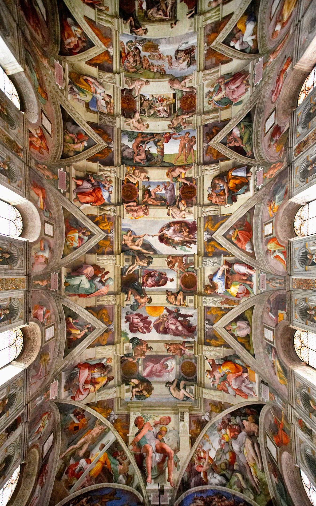

# The 15 Most Beautiful Ceiling Frescoes on Earth

https://twitter.com/Culture_Crit/status/1686510589776961536

> 🪄Smart summary:
This thread showcases 15 of the most beautiful ceiling frescoes from around the world, including the Sistine Chapel ceiling in the Vatican, the Apotheosis of Hercules in the Palace of Versailles, and the Painted Hall Ceiling in the Old Royal Naval College in London. These works of art were created to elevate the soul.
-------

The purpose of art was once to elevate the soul.
These are the 15 most beautiful ceiling frescoes on earth 🧵  

## 1. The Sistine Chapel ceiling, the Vatican - Michelangelo (1512) 🇻🇦

## 2. The Apotheosis of Hercules, Palace of Versailles - François Lemoyne (1736) 🇫🇷

## 3. Triumph of the Name of Jesus, Church of the Gesù, Rome - Giovanni Battista Gaulli (1679) 🇮🇹

4. The Chamber of the Giants, Palazzo del Tè, Mantua, Italy - Giulio Romano's (1535) 🇮🇹

5. Allegory of Glory, Borghese Gallery, Rome - Mariano Rossi (1775) 🇮🇹

6. The Apocalyptic Vision of St. John, Altenburg Abbey Church, Austria - Paul Troger (1733) 🇦🇹

7. The Triumph of St. Ignatius, Church of St. Ignatius, Rome - Andrea Pozzo (1694) 🇮🇹

8. The Assumption of the Virgin, Cathedral of Parma - Antonio da Correggio (1530) 🇮🇹

9. The Assumption, Church of Saint-Roch, Paris - Jean-Baptiste Pierre (1789) 🇫🇷

10. The Gallery of Maps, the Vatican - Ignazio Danti (1583) 🇻🇦

11. The Last Judgment, Florence Cathedral - Giorgio Vasari / Federico Zuccari (1579) 🇮🇹

12. The Oculus, Camera degli Sposi, Ducal Palace, Mantua – Andrea Mantegna (1474) 🇮🇹

13. The Cupola Fresco in the State Hall, The Austrian National Library, Vienna - Daniel Gran (1730) 🇦🇹

14. The Chapel of San Brizio, Orvieto Cathedral - Luca Signorelli (1502) 🇮🇹

15. The Painted Hall Ceiling, the Old Royal Naval College, London - Sir James Thornhill (1726) 🏴󠁧󠁢󠁥󠁮󠁧󠁿

