# 4岁被卖进海洋馆，半个世纪后，她终于可以回家见妈妈了

https://mp.weixin.qq.com/s/5G0dpQ2_1m_YMnAq6g-bUQ

1970年8月，在太平洋海域，超过70头虎鲸被船队重重围住。在这场血腥的围猎中，7头虎鲸被捕，它们被卖给海洋馆，开始了漫长的囚禁与表演生活。

其中一头4岁的虎鲸被起名为Tokitae（Toki），她至今仍然活着，是圈养虎鲸中最长寿的个体之一。在逼仄的水池里，她已经进行过3万多场表演。  
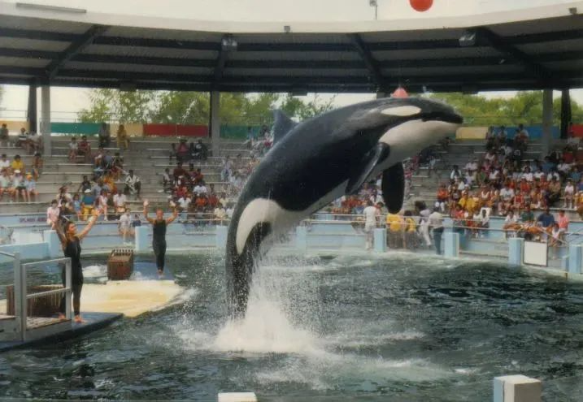

> Tokitae被卖给迈阿密海洋馆，被改名为Lolita，她在这里进行了36000场表演｜Wikimedia Commons

今年3月，苦熬53年的Tokitae终于等来了重返家园的希望——如果一切顺利，她将于两年后重新回到自己的出生地；她的妈妈还活着，如果足够幸运，这对阔别半个多世纪的母女将在大海里重逢。
## 血腥的野捕，和被偷走的自由
Toki被捕的过程相当血腥。1970年8月8日，在华盛顿州普吉特湾的Penn Cove海域，西雅图海洋馆的老板、最臭名昭著的虎鲸贩子Edward “Ted” Griffin带领船队，对超过70头南定居型虎鲸进行围猎。

这次野捕不仅带走了Toki和另外6头虎鲸，还造成了1头成年雌性虎鲸和4头虎鲸幼仔的死亡。而且，这头雌性成体是在试图营救自己的宝宝时被渔网缠住，无法上浮换气而溺毙的。为了掩人耳目，Griffin和同伙将这5头鲸尸的肚子剖开，塞入石头，并在尾鳍系上重物，将它们陈尸海中。

3个月后，这些尸体被冲上了Whidbey岛，虎鲸野捕的残酷真相才第一次曝光在公众面前。  
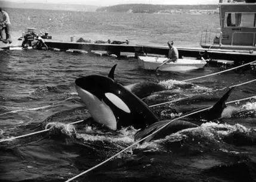

> 这次围捕不仅捕获了7头虎鲸，而且导致5头虎鲸的死亡｜Wallie Funk / Western Washington University

这次围捕，仅仅是鲸豚野捕的一个缩影。上世纪60、70年代，圈养鲸豚产业在北美发展得如火如荼。当时，北美西海岸的捕鲸活动完全不受管控，而虎鲸作为标志性的动物，更是成了捕鲸活动的目标。

1965～1977年间，北到英属哥伦比亚海域，南到加州湾，在东北太平洋海域就有超过260头虎鲸被围猎，波及南定居型虎鲸J、K、L三个族群；其中有50头被海洋馆选中，从族群里被掳走。到1976年时，该海域的南定居型虎鲸仅剩80头个体。  

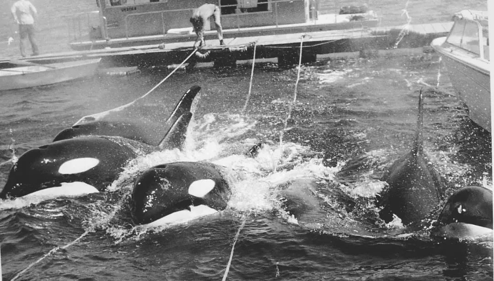
> 没有完善的法规，只要有利可图，海洋馆就不会放过这些动物｜Wallie Funk / Western Washington University

残忍的鲸豚野捕，一定程度上推动了美国国会的立法。在1972年和1973年，美国国会分别通过了《海洋哺乳动物保护法》和《濒危物种法案》。根据这两部法规，南定居型虎鲸为濒危物种，面临灭绝的风险；任何对濒危物种的“侵扰，伤害，追逐，猎捕，枪击，伤害，致死，设陷阱，野捕，收集，或者上述企图”都是违法的。自此，北美的野捕虎鲸活动终于得到了有效的管控。

然而，只要有利可图，海洋馆并不会放过这些生灵。在北美捕鲸被禁止后，冰岛海域的虎鲸被盯上。被圈养期间杀死了3位驯养员的虎鲸Tilikum、因为出演电影《虎鲸闯天关》而获得关注的虎鲸Keiko、没能等来自由的“世界上最孤独的虎鲸”Kiska，都是年幼时被野捕于冰岛海域而后被卖给海洋馆的虎鲸。

> 拓展阅读  
野外的虎鲸从未有过伤人的记录，但被圈养的虎鲸提里库姆（Tilikum），却在被囚禁的34年间，杀死了3个人......
关注下方公众号，向果壳自然回复【提里库姆】，了解更多故事。  

## 53年圈养，36000场表演
说回Toki。

虽然美国国会通过了法案，但这却无法保护当时早已被捕的Toki和其他虎鲸。1970年9月，Toki被卖到了迈阿密海洋馆，被改名为“洛丽塔”（Lolita），一个被投注了无数人类凝视和物化的名字。

它被关在在一个长24米、宽11米、深6米的名为“鲸鱼碗”的圈养池中，开始了日复一日的表演——每天两场，全年无休，截止2021年，Toki已经做了超过36000次表演。  
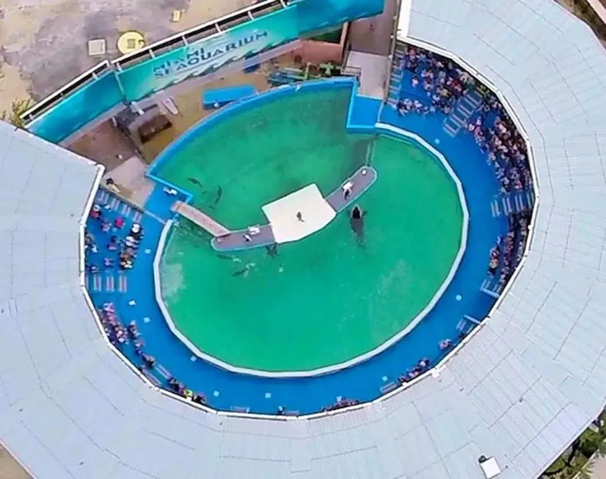

> Tokitae生活的“鲸鱼碗”，长24米，宽11米，被平台围起来的部分水域她无法自由出入｜Drones for Animal Defense

2021年，迈阿密海洋馆被The Dolphin Company的子公司MS Leisure收购。美国农业部发放新的营业许可时，提出的条件之一是让Toki和同一个池子里的太平洋白边海豚Li’i停止表演，Toki才终于结束了长达51年的被迫表演的生涯。

当时被野捕的南定居型虎鲸中，如今只有Toki还在世。作为被圈养的虎鲸中最长寿的个体之一，Toki的坚韧和坚强愈发反衬出她的悲惨和孤独。

在长达53年的圈养生活中，她的所有世界都局限在迈阿密海洋馆的“鲸鱼碗”里。这个圈养池建筑的深度是6米，但水位常常不足4米，甚至有3米水深的记录；池中还包含一个表演平台，平台后面的区域Toki也不能自由进出。因此，对Toki来说，她的实际生活区域是一个面积不到200平方米、水深仅4米左右的空间——而它自身的体长就超过了6米，体重超过3吨。  
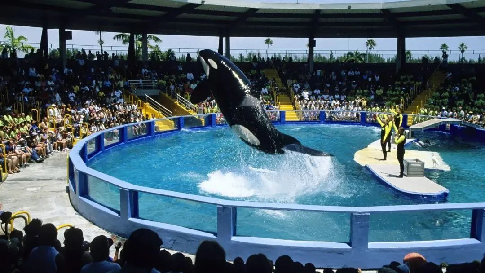

> 正在表演的Toki，可以清晰看到“鲸鱼碗”对体型庞大的虎鲸来说是多么的逼仄｜AP

## 水泥池子里的孤独和痛苦
除了表演，迈阿密海洋馆购买Toki，还想让她参与繁殖。

1968年，迈阿密海洋馆购买了一头只有3岁的雄性南定居型虎鲸Hugo，圈养现在的海牛池——这个池子的水浅到它一旦仰头吃鱼，尾鳍就不得不撇在池底。Toki到来后，工作人员常常在夜晚听到他俩互相呼喊，确认它们能融洽相处后，海洋馆将Hugo也放到Toki生活的“鲸鱼碗”里，希望它们能繁殖后代。  

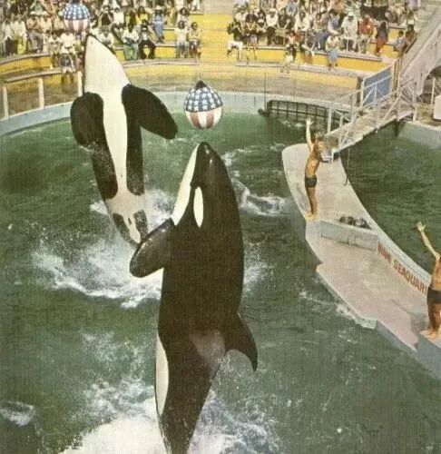
> Tokitae和Hugo一起挤在本就狭窄的“鲸鱼碗”里，一起进行表演｜Miami Seaquarium

但是，过分狭小的生活环境和每天高压又毫无自主性的圈养表演，令每一头虎鲸都备受折磨。Toki和Hugo都需要服用大量抗生素、抗真菌药、止痛药（包括麻醉药）、类固醇、激素和抗酸剂，来治疗溃疡等由囚禁引起的疾病。即便有记录表明Toki曾经受孕，她也没有诞下任何存活的幼仔。 

> 虎鲸Hugo的名字来自一位叫做Hugo Vihlen的水手。  
1968年，这位水手创造了独自横渡大西洋最小帆船的记录，他用了85天穿越大西洋；同年，一头3岁的雄性虎鲸从华盛顿州海域被野捕，放到海滨围栏被迫学习吃饵料，最后被送进5500公里外的迈阿密海洋馆的水泥池子，这个过程也花了85天。讽刺的是，人们决定用这位在广阔大海航行的水手，为一头失去自由、再也无法回到大海的虎鲸命名。

Toki和Hugo挤在“鲸鱼碗”里，共同生活了10年，直到1980年3月4日Hugo死亡。即便“鲸鱼碗”在当年是新修的池子，离虎鲸的真正需求也差了十万八千里，困于其中的大型动物身心饱受折磨。

早在1971年，Hugo就被观察到常有撞击池壁的行为。它甚至撞碎过一个观察窗，塑料碎片差点刮掉它吻部的一大块皮肉，不得不进行手术缝合。Hugo也表现出了很强的攻击性行为。70年代的虎鲸表演尤其强调人类能够控制这些猛兽，很爱上演驯养员把头放进虎鲸嘴里的戏码，有驯养员就曾被Hugo咬伤脖子和头。它还曾用头撞伤过水中的驯养员，也曾咬伤人类的手臂。  
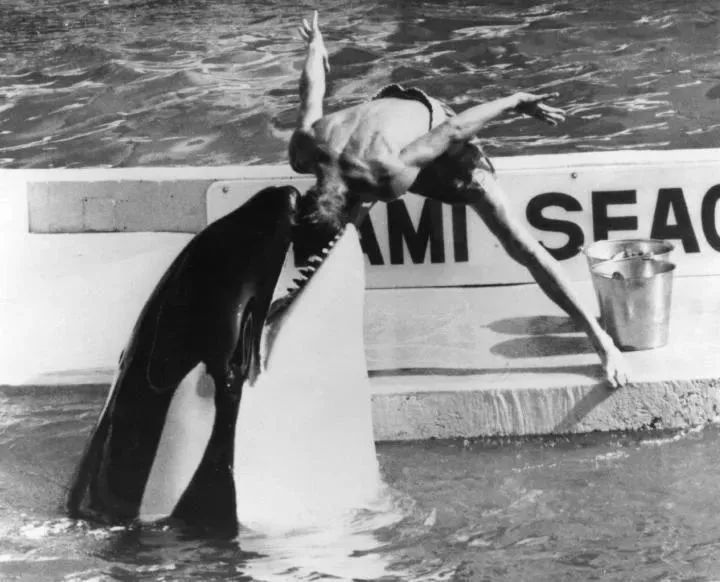
> 驯养员把头放进Hugo嘴里｜Miami Seaquarium

持续不断地撞击，特别是头部对池壁和围栏的撞击，很可能令Hugo颅内充血，发展出外伤性脑动脉瘤——这也是Hugo死后尸检的结果。Hugo只活了15岁，寿命不到野外同伴的1/4。尽管生前给迈阿密海洋馆卖命了12年，Hugo死后只是草草被起重机吊起来，扔进了填埋场。  

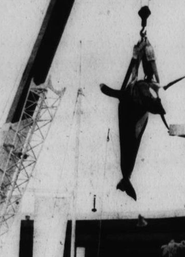
> 起重机把死去的Hugo吊起移出海洋馆｜Miami Seaquarium

在Hugo之后，Toki还先后和一头领航鲸、一头里氏海豚、一头短吻真海豚和几头太平洋白边海豚一起在这个池子里生活。这看似给了Toki一些程度的“社交”，但同时也人为制造了动物间的更多的摩擦和攻击性行为。

共处一池不是任何动物自主的选择，而完全是人类的安排。在圈养条件下，动物本身就承受着较大的压力，加上极度贫乏的生活空间被进一步压缩，没有任何余地可以互相躲开，动物之间很容易爆发矛盾。Toki体表常常出现被海豚啃咬的痕迹，甚至有学者记录到它一年新增50多处咬痕。攻击性行为也是双向的，一头于2018～2021年圈养在“鲸鱼碗”的太平洋白边海豚，被推测死于Toki的攻击。  

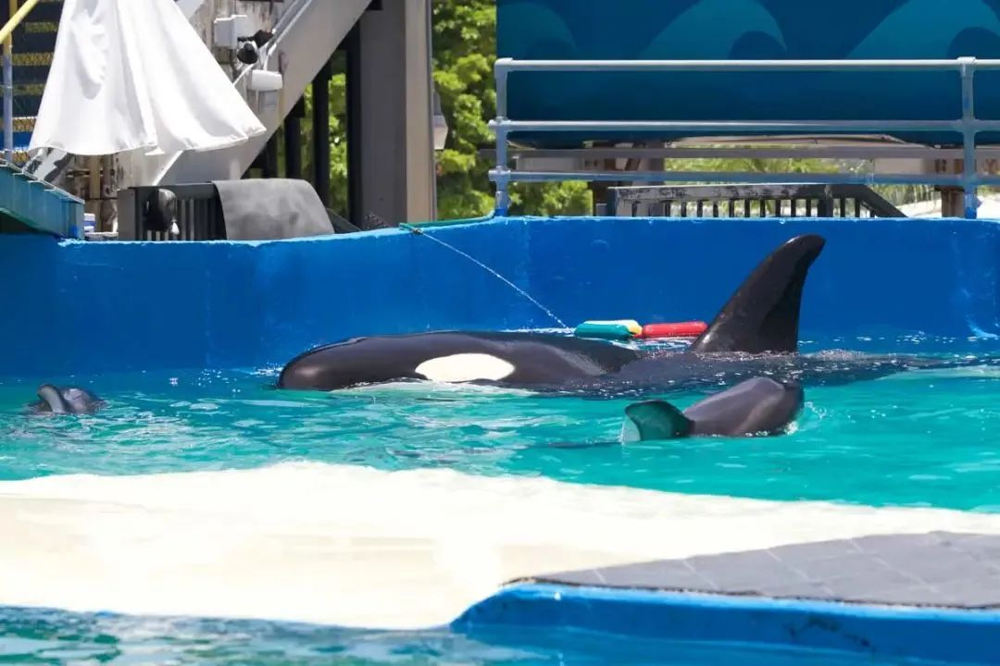
> “鲸鱼碗”中除了Tokitae还有其他鲸豚｜Ingrid N. Visser

## 反对鲸豚圈养的浪潮
近些年，随着公众关于动物福利意识的提高和学界对鲸豚研究的深入，人们对鲸豚野捕、圈养、繁殖和表演的负面影响达成为共识。

2003年，纪录片《洛丽塔：动物表演娱乐的奴隶（Lolita: Slave to Entertainment）》，让很多人看到了虎鲸Toki绝望的圈养生活；2009年的纪录片《海豚湾》，更是将全球鲸豚野捕圈养贸易血淋淋的现实摆在了大家面前。无论是线上还是线下，呼吁停止鲸豚圈养的声音渐渐燎原，关于濒危物种保护的法案也逐渐被完善。  

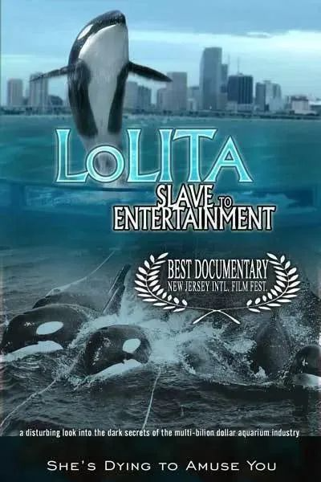
> 纪录片《洛丽塔：动物表演娱乐的奴隶》

2017年，Toki绝望的圈养生活终于迎来了转机。美国农业部对Toki的圈养池进行了审核，认为其各项标准都不符合联邦法律的最低要求；随后还对Toki和迈阿密海洋馆里的其他鲸豚进行了彻底的调查。

2021年9月，美国农业部出具了详细的调查报告，记录了Toki的健康问题，包括：被饲喂变质饵料，被要求进行高强度、爆发式表演而过度劳累和受伤，由于缺少隐蔽而被太阳晒伤，眼睛因池水含氯量过高以及有异物而受伤。到了2022年2月，Toki还患上了严重的肺炎，这是圈养鲸豚最常见的死因之一。

随着关注的升温，去年，人们为Toki成立了非盈利机构“Toki之友（Friends of Toki, Inc）”。作为独立合作方，“Toki之友”与迈阿密海洋馆和其所在地政府一起，制定和执行Toki的福利提高计划，并着手准备它的退休和野放。 
## Toki重获自由之路 与我们重新认识自己的过程
终于，Toki和所有关心它的人，迎来了本文开头的好消息——2023年3月30日，迈阿密海洋馆的母公司The Dolohin Company与“Toki之友”达成协议，将在接下来18～24个月里分步骤，将Toki送回它的出生地：萨利什海。

能顺利回到出生海域，甚至与分开多年的族群汇合，是所有人对Toki的祝愿。90年代末，人们曾经对虎鲸Keiko进行了野化放归，但很可惜，短短几年后，Keiko就死于急性肺炎。这一次，有了Keiko的经验，大家都非常清楚，放归的结果取决于Toki对过渡期的海滨围栏的适应度，以及它的野外生存能力的恢复程度。53年的圈养严重摧残了Toki的身心，现阶段，在独立兽医和营养师们的照料下，它的状态正在慢慢稳定，但长途运输和适应新环境依然充满着挑战。

> 拓展阅读
虎鲸Keiko因为演出《虎鲸闯天关》而备受关注，它得以回归大海，但最后还是死于急性肺炎。  

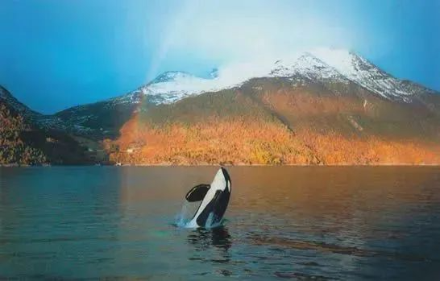
> 2002年，人们在挪威拍到了野放的Keiko｜Mark Berman / earthisland.org

关注下方公众号，向果壳自然回复【虎鲸闯天关】，了解中华鳖的更多故事。

眼下，兽医还需要诊治Toki在圈养生活中感染的各种病原物。毕竟萨利什海域的南定居型虎鲸仅剩72头，是一个非常脆弱的群体，一旦Toki带去了新的病原物，都有可能对虎鲸群体造成难以预计的伤害。

好消息是，Toki所在的L家族近几年状态不错，2021年初还新添了一头雌性小仔。Toki的妈妈、L族群的首领L25“Ocean Sun”也还健在，去年7月还出现在温哥华岛附近的Haro海峡。大家都在期待，2年后，这位1928年出生的老母亲，能有机会与阔别半个多世纪的女儿重逢。  

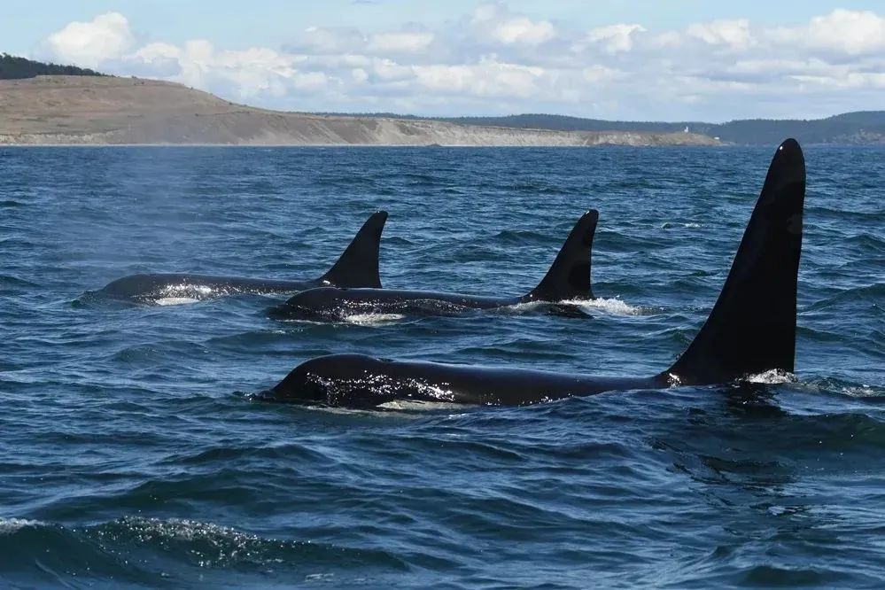
> 去年7月，人们还在温哥华岛附近的Haro海峡附近拍到了Toki的妈妈L25和同家族的L22和L85｜Center for Whale Research

与出生在冰岛的Keiko相比，Toki回家的路途短了不少。这一次，人类伙伴也有了更多经验和资源来帮助Toki。曾参与Keiko放归的项目经理、研究鲸豚认知交流的学者，以及当地的原住民Lummi部落都参与其中。 

如《阿凡达：水之道》中描绘的岛礁部族与海中巨兽“图鲲”的关系，Lummi部落也视虎鲸为海中的家人。在Lummi部落的语言里，虎鲸被称为“qwe’lhol’mechen”，意思是“海浪之下的人”。在Lummi部落的文化里，他们与当地的南定居型虎鲸一样，都是萨利什海哺育的孩子，大家共享海域，共享食物，在各自的历史上也有悲伤的互文——虎鲸在海洋馆被囚禁和剥削，失去生命；原住民则不得不面对外来的统治者，被剥夺文化和身份认同。当原住民为放归Toki而努力时，我们彷佛也能从中看到人类与其他物种的更紧密的连结。  

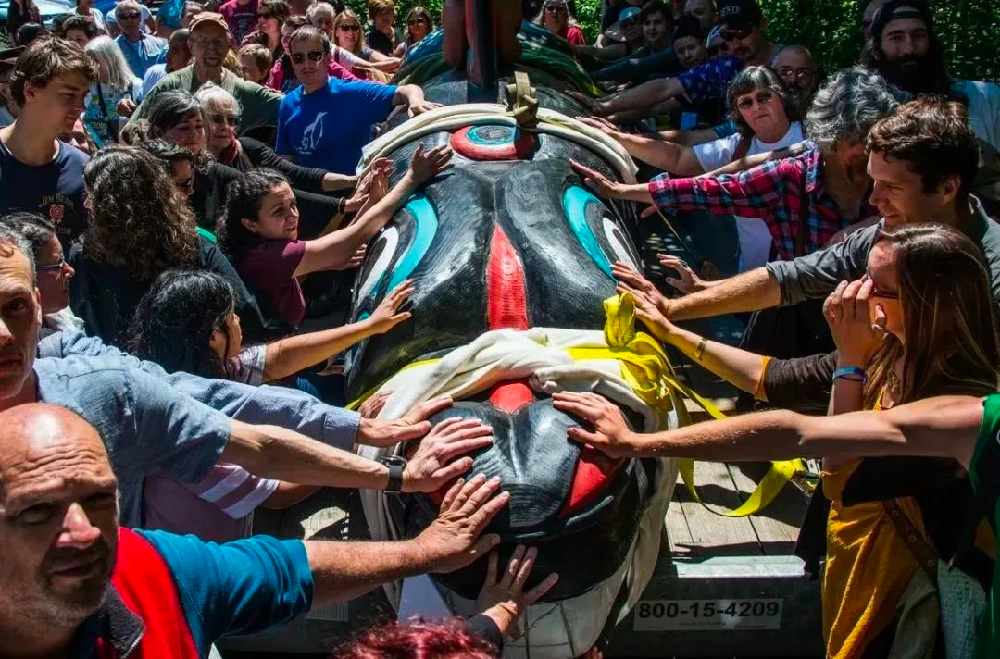
> 2018年，Lummi部落的雕刻师雕刻了这根图腾柱，表达对虎鲸的致敬｜House of Tears

Tokitae的名字也来自原住民的语言，意为“好天气，好光景”。如今，Toki长达53年的圈养生涯即将结束，人们为它发声、创造条件送它回归自由家园的过程，也是我们人类纠正过往错误、为圈养鲸豚和我们自己争取自由的过程。希望Toki今后的每一天，都如它的名字一样，是“好天气，好光景”。 

请大家支持以栖息地保护为基础的动物保育，通过书籍、纪录片和负责任的野外观察来了解真正的野生动物和它们的生活史，而非“拟人化”“物化”后的它们。  

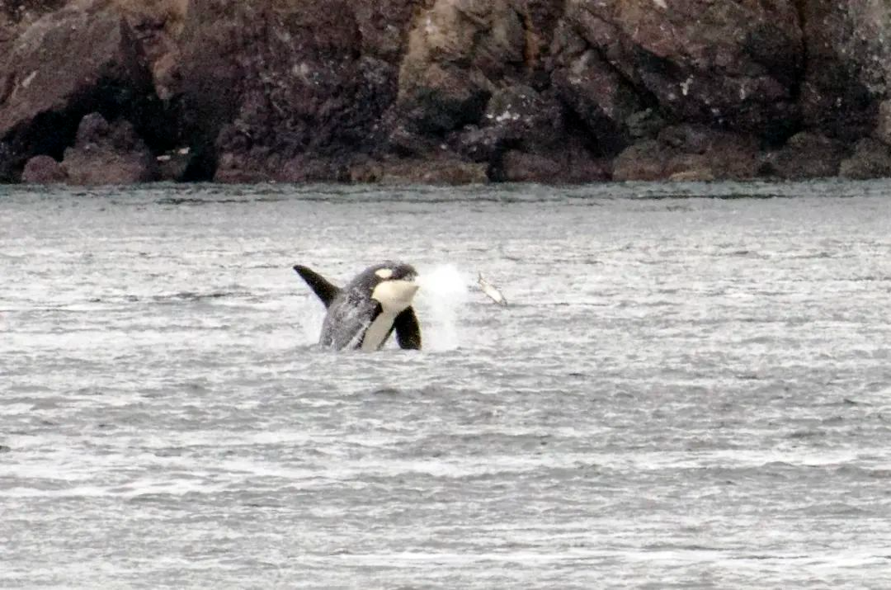
> 这是一头来自L族群的虎鲸正在捕食鲑鱼｜Kevin Nichols / Wikimedia Commons

1996年，曾有人录制了L族群虎鲸的叫声并且播放给Tokitae听，而她似乎认出了这些声音。Tokitae努力地熬过了半个世纪的海洋馆生活，希望她最终能顺利回到野外，回到家人的身边，自由自在地捕食和游玩。

> 拓展阅读  
Tokitae等来了回归大海的机会，但“世界上最孤独的鲸”基斯卡（Kiska）却没有这么幸运。因为放归计划被搁置，她还没来得及回家，就在今年3月10日去世了。
关注下方公众号，向果壳自然回复【最孤独的虎鲸】，了解更多故事。  

作者：23 CCA  
编辑：麦麦  
题图来源：AP  

