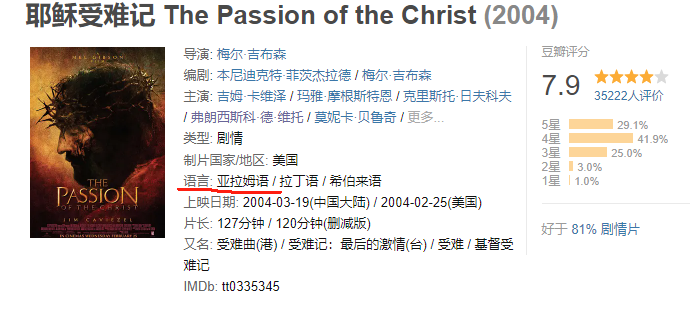
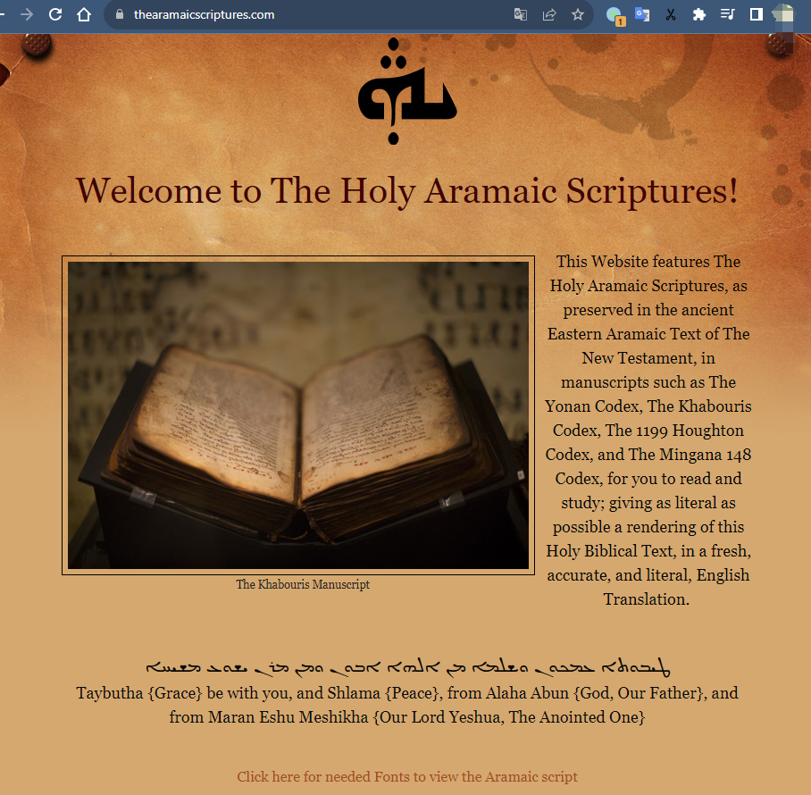
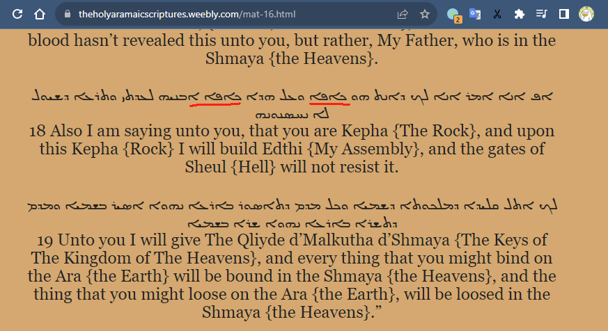
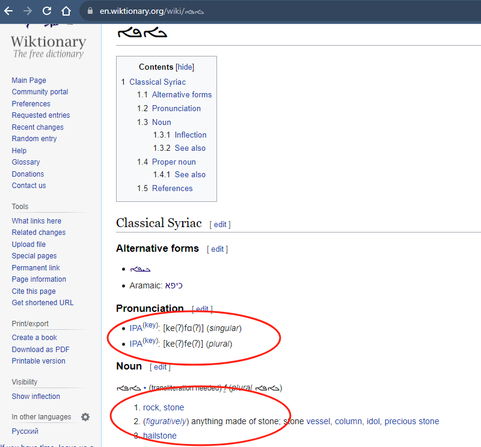
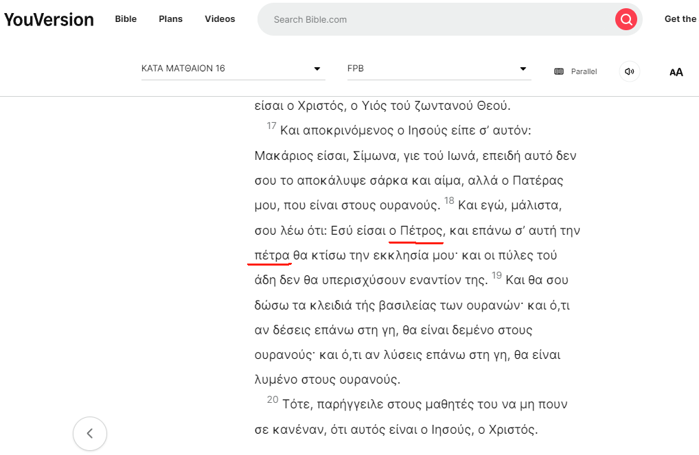
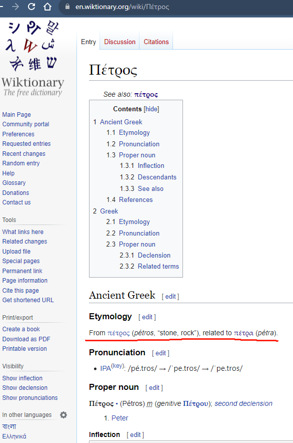
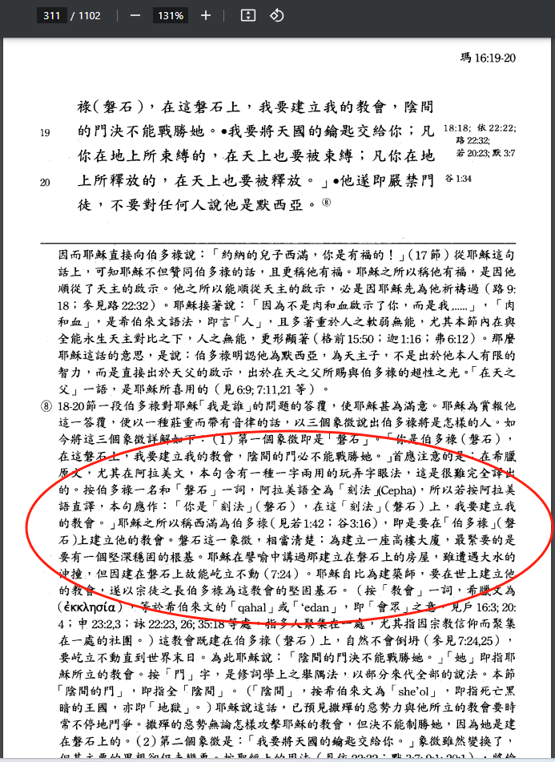
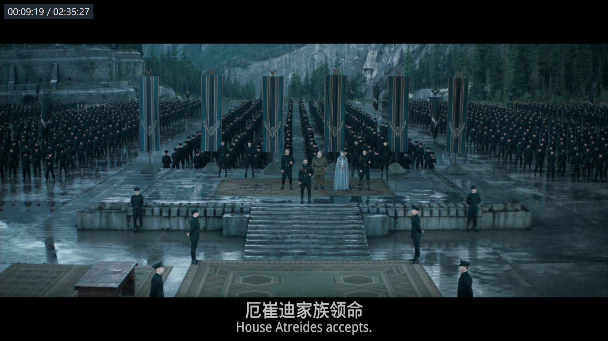
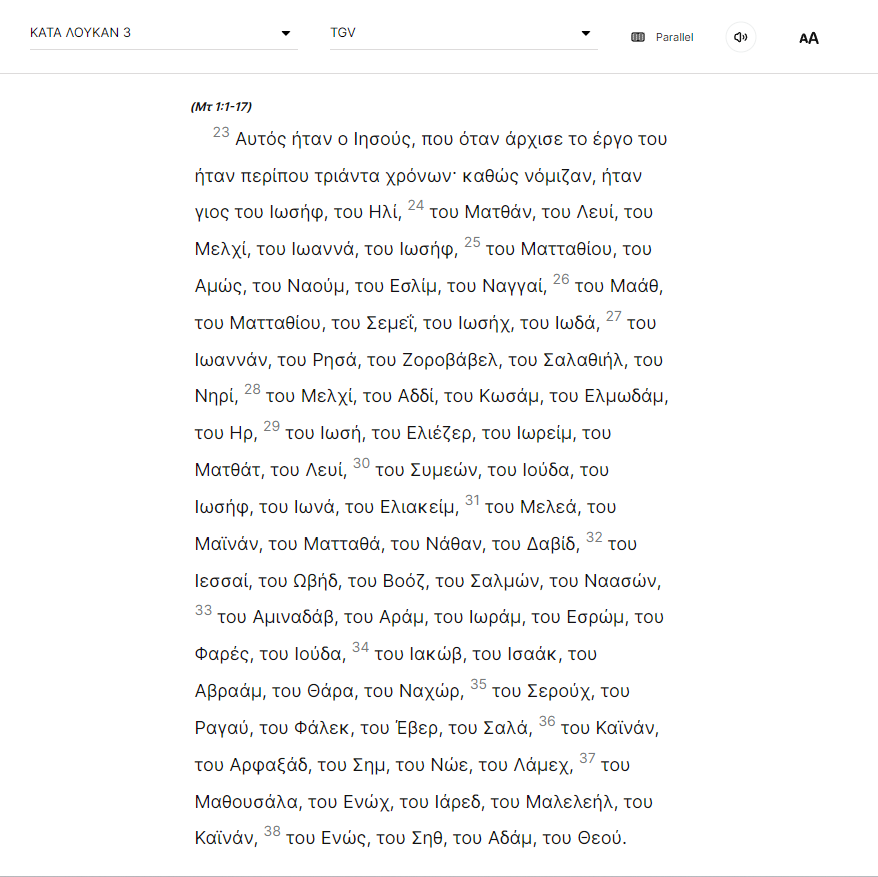

# 我的草稿箱

## Twitter Tags

#Sally老师金句  
#影视剧中的天主教元素  
#有意思的简体中文  
#圣人传  

## 初识宗教信仰

借最近的巴以冲突，让我有机会学习和梳理一下对中国人来说最陌生最缺失的知识 —— 神学，这里仅仅分享一些小知识和我的粗浅理解，聊作谈资，以飨大家。

- 犹太教、基督教（天主教，东正教和新教）和伊斯兰教，这三大宗教的神，是同一位神，是创世神。最初的希伯来语写作יְהֹוָה‎，闪族人语言只有辅音没有元音，字母写作YHWH，我们人为地补上元音，译作雅威或耶和华，此为神之尊名。而“神”这个职分的尊称，英语是God，到了中国因为翻译的分野，天主教译作“天主”，新教译作“神”或者“上帝”。而阿拉伯语的“神”，就是Allah，即安拉。因为伊斯兰教试图隐隐地指出犹太教基督教所揭示的神并不完整，穆斯林的神才是真的神完整的神，所以全称为“真主安拉”；
- 佛教脱胎于印度教，印度教的至高神是“梵”，下设三大主神，即梵天（创世），毗湿奴（生命）和湿婆（毁灭）。印度的不同种姓，即因为被认为是从梵天的不同部位创造出的，用口创造出了婆罗门，用手创造出刹帝利，用大腿创造了吠舍，用脚创造出首陀罗。种姓在今生无法跃升，但存在轮回，下个轮回可以成为不同的种姓；
- 佛教，我感觉最为抽象、深邃、神秘、超脱，很是精微深奥。（我自察我的了解很是浅薄，若有不对，请大家帮忙指出。）佛教是没有神的，是的，我理解佛教的核心甚至可以说是无神论的。其发乎“缘”，起自“空”，也有轮回，为了“跳出轮回”，佛教徒的修行是去“悟”。佛教中的“众神”，和犹太基督伊斯兰的“神”，是中文含义的混淆。前者其实指代“悟了的人，有了[神]奇能力的人”，而后者是指“唯一的创世[神]”；
- 道教，唯一的中国本土宗教，起源于四川地区吧。典籍是老子的《道德经》和庄子的《南华经》。所谓“道”，可简单理解为有一超然的存在，超然存在的特征是有“德”，德是什么？德是“生而不有，长而不宰”，即“我创造之，但我不拥有；我兴盛之，但我不支配”，即“道德”的由来。道教的“道”和上帝天主的最大区别在于，道教的“道”是没有位格的，是无自我意志的，是不行使主权的。天地万有，随之任之，并没有受命于一个至高无上的意志主宰。即，天地不仁，以万物为刍狗。而人是“无为”的，离弃了“道”，人不会得到快乐，这点和基督教教义有相通之处。

所以其实可以看出，道教和佛教在中国容易兴盛，当然因为在思想、哲学、文化层面有其适应的土壤，土壤中水面下，更有统治者为了治国考量而隐隐的选用，点到为止，我们下回再聊。

“怕什么真理无穷，进一寸有一寸的欢喜。” —— 胡适

## 《林肯律师》的Attorney-client privilege

关于法庭辩论、审判流程的电影，我个人比较喜欢的有《芝加哥七君子》、日本的《即使这样也不是我做的》，然后就是这部《林肯律师》了。电影主角律师大壮接了一个富二代小帅的案子，小帅被指控性侵及谋杀。小帅表示对大壮慕名已久，特地舍了自家的律所，一定要找大壮来辩护。大壮在调查过程中发现，小帅就是罪犯，而且之前大壮辩护过的被告小马居然是被小帅用类似手法陷害了，要冤坐牢狱15年。于是大壮手里的证据可以将小帅绳之于法，帮小马沉冤得雪，但是因为律师和委托人的attorney-client privilege，大壮不能这么干，这么干了大壮的律师生涯就完了。这个privilege保证委托人可以全权信任自己的律师，可以把隐秘的实情和想法都告诉律师让其相应从权行事而不用担心律师会泄密告发。因为哪怕再十恶不赦再证据确凿，律师也不能利用受委托的便利去反水。我没有找到这条古老的privilege和历史上罗马公教的关系，但我感觉是有关系的。因为天主教的告解圣事，聆听告解的神父也需要遵守类似的Priest-Penitent Privilege，神父必须对告解内容保密，整个社会司法体系无权要求神父因告解内容出庭或做出任何供词。言论自由的边界，是契约。

## 无语

### 只要对美国有坏处

中午在公司食堂吃饭，隔壁桌的一位码农侃侃而谈，情绪有些激动，语气也激昂，谈到俄乌，谈到巴以，谈到台海。盎克鲁撒克逊、代理人战争，犹太人复国，民主笑话，LGBTQ末世 等等……最后振聋发聩的总结性发言，“中国做什么不管对中国有没有好处，只要对美国有坏处，中国就应该做。”
闻者无不热血沸腾。

### 落后就要挨打

“落后就要挨打”是一句从小听到大的标语，是中国穷兵黩武，放弃福利的正义化合法化的理论基础。塑造了一个“因为中国积贫积弱而对中国蠢蠢欲动，时刻准备凌辱中国的”外部敌人，使国民在恐惧中，心甘情愿地放弃自身眼前的权力和权利，将其让渡给政府，使其集中权力改变“落后”的现状，达到国家安全，不被欺负的目的。

这句话本身设立的画面只适用于丛林社会，与现代文明的人类社会是格格不入的、是自相矛盾的。一个孱弱的人，遭受了霸凌忍受了屈辱，可能和施暴者强壮的体格有关联，但将这个“强壮”的定义，直接从人体格的强壮，转变为国家军事力量的强大、经济体的庞大，是偷换了概念。

## 万圣夜，诸圣节

西方的节日，大多和基督耶稣有关系，万圣节也不例外。“万圣节”严格上来说等于“万圣夜”和“诸圣节”。万圣夜与诸圣节不同，诸圣节是基督教的节日，万圣夜则是世俗的节日。

万圣夜：每年的10月31日，英语：Halloween或Hallowe'en，为“Hallows' Eve”或“Hallows' Evening”的缩写，意为“诸圣节的昏夜前时”。Hallow，有“使...神圣；把…视为神圣”的意思和“圣徒、圣器”的意思，比如《Harry Potter and the Deathly Hallows》（哈利·波特与死亡圣器）。我们只要读过主祷文中的那一句响彻云霄的“Hallowed be Thy name. (愿祢的名受显扬)”，即能明白这个节日名的含义。

诸圣节：每年的11月1日，英语：All Saints' Day，即“纪念所有殉道者和圣人的节日”。教会在这个诸圣日中纪念所有圣徒，表彰他们的圣德，并使教徒视他们为效法的楷模。一年之中我们在不同时期用各种方式纪念了各位圣人，请他们代祷，但仍有很多的圣人殉道者被忽略或者遗忘了，于是教会把所有的圣人圣女，列品的未被列品的都聚在一起来一个总的庆祝，激励我们以他们为榜样，克服脆弱，愈显主荣。

望周知。

"按照我所热切期待希望的，我在任何事上必不会蒙羞，所以现在和从前一样，我反而放心大胆，我或生或死，总要叫基督在我身上受颂扬。" (斐理伯书 1:20)

## 伯恩斯大使望弥撒

伯恩斯大使的这条推特，寥寥数语，言简意赅，用词专业精确，面面俱到，有好几个点可以扩展学习和分享：

1. Mass：即弥撒，拉丁语Missa，天主教拉丁礼仪的祭祀仪式。我们熟知的圣诞节Christmas，其实就是Christ Mass，即基督的弥撒。可以写作Xmas，因为X是“基督”一词希腊语Χριστός的首字母，不写作X'mas
2. Jesuit：即耶稣会，罗马天主教下的一大男子修会，依纳爵·罗耀拉与方济·沙勿略、伯铎·法伯尔等人共同于巴黎成立，出于对抗同时代马丁路德领导的宗教改革的需要，大力兴办神学教育。法国哲学家思想家勒内·笛卡尔接受的就是耶稣会的教育（皇家大亨利学院），现任教宗方济各即为耶稣会会士，为首位耶稣会出身的教宗。加入耶稣会极不容易，许多耶稣会会士拥有博士学位、甚至在大学执教，会中更有许多不同领域的专精人才。值得一提的是，震旦学院、复旦公学的创始人，爱国老人马相伯先生，1862年加入耶稣会，1876年8月15日退出耶稣会还俗，1897年，通过补赎，获得耶稣会的赦免
3. 圣伊纳爵：Saint Ignatius of Loyola，神学家，耶稣会会组，天主教圣人之一
4. 主教座堂：Cathedral，来自拉丁文cathedra，即“座位”。教区的主教的宝座所在，即权威所在地，一个教区只有一个。教区主教的座位在哪里，哪里就是Cathedral。而Church是教堂，或者是以教堂为核心的教区parish概念
5. 圣依纳爵主教座堂：就是徐家汇图书馆旁边那个哥特式的大教堂，上海居民都熟悉的那个“徐家汇教堂”，始建于清光绪二十二年1896年，宣统二年1910年正式建成，是中国境内第一座完全按照西方建筑风格建造的教堂，是为“远东第一大教堂”。教堂的建造，是由徐光启后人和一户姓陆的人家捐赠地皮，由法国耶稣会筹集资金，由英国建筑师道达设计，由法商上海建筑公司建造完成的。

## 教会的磐石

天主教和新教关于“教会的磐石”素有争议，玛窦福音（简称“玛”，天主教思高本的四福音分别是玛窦、马尔谷、路加、若望）16:18写道，“我再给你说：你是伯多禄（磐石），在这磐石上，我要建立我的教会，阴间的门决不能战胜她”，马太福音写的是“我还告诉你、你是彼得、我要把我的教会建造在这磐石上．阴间的权柄、不能胜过他。〔权柄原文作门〕”。
那这磐石究竟是指伯多禄(即Peter，彼得)还是指伯多禄对耶稣的宣告呢(玛16:16)，借助今日的互联网，让我尝试找找线索。让我们从电影《耶稣受难记》开始，电影中耶稣呼唤伯多禄(12分51秒时)，听起来叫的是“凯发”。豆瓣上显示电影中的语言是亚拉姆语(Aramaic)，我们都知道圣经新约原文是希腊语的，目前有部分史学家认为玛窦福音原文是亚拉姆语，之后被翻译为希腊语。不管Matthew下笔时写的是哪一种文字，至少能确定，那一刻耶稣给伯多禄改名时，耶稣嘴上说的是亚拉姆语，“凯发”就是耶稣给伯多禄改的那个名字。

在这个网站，我们找到Aramaic的圣经，找到Matthew 16:18 (https://theholyaramaicscriptures.weebly.com/mat-16.html)，按照中文的句子，“磐石”出现了两次，那Aramaic原文中，应该也有某个组合出现两次，果然这个“ܟܐܦܐ”出现了两次。万能的互联网，让我们瞬间知道这天书般的文字的意思和读音，这才是科技的恩惠。ܟܐܦܐ读音是ke(ʔ)fɑ(ʔ)，和电影中的一致，问号代表重音或者长音我猜测，然后意思就只有rock，岩石。我们再用Aramaic alphabet进行下验证(https://en.wikipedia.org/wiki/Aramaic_alphabet)，也是同样的结果。  
ܟ = /k/  
ܦ = /f/  
ܐ = /aː/

我们看一下翻译后的希腊语，当时的译者对于上下文的语气语境，以及耶稣的真实意图，体会得一定是更为明确的。在YouVersion上找到希腊语的版本(https://www.bible.com/bible/921/MAT.16.FPB)，找到两个相似的词语，Πέτρος和πέτρα，经过查阅得知，Πέτρος也是rock的意思，πέτρα是当时更通用更普遍的对于rock的表述，但πέτρα词性是阴性的，所以给西满命名时，要改用同义的阳性的词Πέτρος，这个词读起来是/ˈpe.tros/，类似“佩特罗斯”，于是思高本音译为“伯多禄”，而和合本从英语版本译成“Peter彼得”。之后，我在《思高圣经原著译释版》中也读到了类似的译释。

至此，我觉得我可以相信，耶稣当时就是想称呼西满为 —— 磐石！

  
  
  
  
  
  

## The Talents 塔冷通

For the kingdom of heaven is as a man traveling into a far country, who called his own servants, and delivered unto them his goods. And unto one he gave five talents, to another two, and to another one; to every man according to his several ability; and straightway took his journey. Then he that had received the five talents went and traded with the same, and made them other five talents. And likewise he that had received two, he also gained other two. But he that had received one went and digged in the earth, and hid his lord's money. (Matthew 25:14-18 KJV)

five talents，思高本这里忠实保留了原音原意，翻译为“五个塔冷通”，读起来颇为奇怪，需要参考译释方能读懂，和合本则直接译为更明了的“五千银子”，意思一样，阅读体验更为顺畅。这里我个人觉得保留“塔冷通”的直译更为合适，因为这个词的解读，关系到这一段经文的探索。
塔冷通，即Talent，就是“天赋”的那个词。一开始是古罗马时期的重量单位（拉丁语Talentum），据说是希伯来人最大的重量单位，约几十公斤，所以耶稣说的五个塔冷通，是很大的一笔财富了，RSV版本圣经标注“This talent was more than fifteen years' wages of a laborer”，一个塔冷通约为十五年的工钱了。所以这个词比“五千银子”更能引导我们在这里略停一下，去探寻耶稣所要陈述的这个恩典的分量。更为重要的是，talent之后逐渐从“重量”，演变到“权重”，再演变到“天赋”，何为天赋，a natural ability to be good at something, especially without being taught，重点落在“natural”和“without being taught”，就是说是神给的，是不是又回到了这段经文了？
主给了我们五分天赋，两分天赋还是只有一分，都不重要，重要的是祂希望我们去好好用这个天赋，呈现更多的精彩，来荣耀神赐的恩典，而不是把天赋埋在土里，让宝石蒙尘、暴殄天物。

## 若苏厄的家族

和合本的《约书亚记》24:15中写道，“至于我、和我家、我们必定事奉耶和华”，而对应的思高本《若苏厄书》中的这一句是“至于我和我的家族，我们一定要事奉上主”。和合本读起来舒服，因为“家”和“华”有押韵，语调上扬，态度明确和热烈。但是从意思上来说，这里用“家族”更为准确。我们来看看英语：

but as for me and my house, we will serve the LORD. (KJV)
but I and my household will serve the LORD. (The Jewish Study Bible)
As for me and my household, we will serve Adonai! (CJB)

(The Jewish Study Bible是NJPS的新版，是现代说英语的犹太人直接从希伯来圣经，即Hebrew Masoretic Text翻译的旧约英语版本；Adonai是犹太教使用的神的一个名字，CJB是Complete Jewish Bible，这一版英语翻译旨在从当时犹太人的社会文化语境来复原圣经场景。)

从以上以忠于原意著称的英语版本看出，作者表达当时约书亚想代表并作出宣告的主体是house、household，即家族。结合约书亚的身份，摩西传人，“刚强壮胆”的继任者，勇猛坚毅，整整七年南征北战，开疆拓土，征服了三十一个王，使十二支派都有了自己的分地，并且自己最后一个分地，带领全民族初步完成了神对亚伯拉罕的应许。约书亚是领袖，是以法莲(厄弗辣因)支派的首领，是大家长，所以，他可以当之无愧，言之凿凿地，代表“家族”发出宣告。

我们可以从2021年的电影《沙丘》中感受一下，当时帝国星变官问厄崔迪家族首领雷托公爵是否接受皇帝的命令，接管厄拉科斯。雷托公爵昂首挺胸，回，“House Atreides accepts!”，身后兵丁众军，旌旗招展，刀剑如林。

这当是约书亚说这一句话时的样子。

## 亚当是天主的儿子？

> 刻南是厄诺士的儿子，厄诺士是舍特的儿子，舍特是亚当的儿子，亚当是天主的儿子。 (路 3:38)

嗯？亚当是天主的儿子？这讲法不对吧。再读一遍，猜测应该是为了符合上下文的“A是B的儿子”的pattern这么翻译的，虽有理由，但是有歧义。虽然one could argue《创世纪》(6:2)写过“天主的儿子见人的女儿美丽，就随意选取，作为妻子”，但毕竟那时还未有耶稣，这个表述在成文的当时是没有歧义的。而且路加福音第三章前几节(3:22)刚有提到“我的爱子”。

> 圣神藉着一个形像，如同鸽子，降在他上边；并有声音从天上说：“你是我的爱子，我因你而喜悦。” (路 3:22)

在同一章里按道理不会用类似的父子关系的表述而使读者混淆。和合本用的是同样的表述，于是我循着思高本再往前查看《天主教萧静山神父译本》，38节是这么写的，

> 該南是厄奧斯的；厄奧斯是塞德的，塞德是亞當的；亞當是天主造的。

意思对了，读起来感觉又没了。难道是中文翻译的缘故？看英语，大为不同，KJV整个23~38节，用从句递归的方式，语法是“A，which was the son of B, which was the son of C...”，反复调用自己，从耶稣追溯到耶和华。但38节是：

> which was the son of Enos, which was the son of Seth, which was the son of Adam, which was the son of God. (KJV)

问题仍然没有解决，还是有一个son of God。带着疑问，继续参考其他版本，RSV也是和KJV类似结构，但语法略有不同，RSV是“A, the son of B, the son of C...”, 还是带个son，38节是：

> the son of Enos, the son of Seth, the son of Adam, the son of God. (RSV)

翻到了CJB (Complete Jewish Bible)，疑问似乎得到了解答，CJB的翻译是，“A, of B, of C...”，从23到38节：

> Yeshua was about thirty years old when he began his public ministry. It was supposed that he was a son of Yosef who was of Eli, of Mattat, of Levi, of Malki, of Yannai, of Yosef, of Mattityahu, of Amotz, of Nachum, of Hesli, of Naggai 
> ...
> of Enosh, of Shet, of Adam, of God. (CJB)

这个翻译并不阐明父子关系，只是从节点寻找节点的出处，单纯地在生命之树一步一步往上攀爬，与其说是“父子”，更像是“来自于”的意思表达，亚当，来自于神，由神所造。CJB的翻译应该是更符合原意的，查阅了几个希腊语圣经的主流版本，即使不懂希腊语，也能识别出这个句子的结构。

我个人觉得这样翻译更简约，因为语句的短小凝练，更有力量，兼具了语言的准确性、历史的穿透性和美的传播性。

季羡林 我就是我

圣神的几个意象

耶稣鱼

## 长乐惟君子 - 吴经熊

吴经熊，中华民国法学家，原为基督新教循道宗教友，在小德兰故事的感召下，皈依了天主教。应蒋中正总统之约，潜心用文言翻译了《新约》和《圣咏集》，文风古雅，文思俊逸，文笔雅致，合辙押韵，起承转合皆生花。

《长乐惟君子，为善百祥集——追寻吴经熊的精神之旅》
https://mp.weixin.qq.com/s/6Xyhsr4U-583sNAxukYvRw

《聖詠譯義 - 吳經熊翻譯》
http://archive.hsscol.org.hk/Archive/reference/pslam/

我之前发过的，我觉得思高本胜过和合本的一篇，圣咏集（诗篇）第二篇。

思高本：

第二篇 默西亚必胜

1万邦为什么嚣张，
众民为什么妄想？

2世上列王群集一堂，
诸侯毕至聚首相商，反抗上主，反抗他的受傅者：

3“来！我们挣断他们的捆绑，
我们摆脱他们的绳缰！” 

4坐于天上者在冷笑，
我主对他们在热嘲。

5在震怒中对他们发言，
在气焰中对他们喝道：

6“我已祝圣我的君王，
在熙雍我的圣山上。” 

7我要传报上主的圣旨：
上主对我说：“你是我的儿子，
我今日生了你。”

8你向我请求，
我必将万民赐你作产业，
我必将八极赐你作领地。

9你必以铁杖将他们粉碎，
就如同打破陶匠的瓦器。

10众王！你们现在应当自觉，
大地掌权者！你们应受教：

11应以敬畏之情事奉上主，
战战兢兢向他跪拜叩首；

12以免他发怒将你们灭于中途，
因为他的怒火发作非常快速。
凡一切投奔他的人真是有福。

现在让我们深吸口气，读一下吴经熊先生的翻译，感受一下舌尖上再进一步的愉悦：

第二首 順與逆 

1何列邦之擾攘兮？何萬民之猖狂？

2世酋蜂起兮，跋扈飛揚。
共圖背叛天主兮，反抗受命之王，

3曰：「吾儕豈長甘羈絆兮，
盍解其縛而脫其韁？」
  	  
4在天者必大笑兮，笑蜉蝣之不知自量。

5終必勃然而怒兮，以懲當車之螳螂。

6主曰：「吾已立君於熙雍聖山之上兮」。
  	
7君曰：「吾將宣聖旨於萬方：
『主曰：爾乃吾子兮，誕於今日。

8予必應爾所求兮，以萬民作爾之基業。
普天率土兮，莫非吾兒之宇域。

9爾當執鐵杖以治之兮，痛擊群逆。
群逆粉碎兮，如瓦缶之毀裂。』」

10嗚呼！世之侯王兮，盍不及早省悟？
嗚呼！世之法吏兮，盍不自守法度？

11小心翼翼以事主兮，寓歡樂於敬懼。

12心悅誠服以順命兮，免天帝之震怒。
何苦自取滅亡兮，自絕於康莊之大路？
須知惟有委順兮，能邀無窮之福祚。

## 发推的好处

在推特上事无巨细记录自己想法和学习心得的好处：
- 有地方可以保存细碎的想法，有相对安全稳定的存储，相对宽松的内容审查，不用打无意义的空格和莫名其妙的通假字，勉强够用的搜索功能，比如，网页版用“from:@elichbachman [关键字]”就能搜到我自己的推文（搜索似乎对东亚文字token切分有一点问题，搜不到就减少一下关键字再试试）；
- 忠实记录想法，不被删减篡改，这一点很重要。真理本身是有绝对的“对”和“错”的，但人只能无限接近“对”，只有神才可能完全“对”。在探寻的路上，只有当能够明确审视自己“纠错”的历程时，才能知道自己是否走在正确的方向上，才能知道自己是否走在了莫比乌斯带上；
- 匿名，带来了言论自由。因为我不认识你，让很多朋友可以表达自己的真实想法毫无顾忌，因为你不认识我，你就不用考虑我的感受而可以直接反对我批评我，这是我所喜悦的。“赠予在你，收取在我”，这个模式是客观上对我有益的，于是我喜悦；
- 这些之外甚至还能收获有品位的推友的点赞和认同，收获满足感和成就感，简直是意外之喜。

“话，我本来就要讲的，现在能讲出来，还能有人听到，真好。”