# 基督教艺术符号学

## 卷轴（图1、2）：  
在耶稣以前的圣人，即各位先知，如果要表示书本、著作、知识等等，拿的是卷轴型的书，如图1、2。
不是必然如此，只是说通常如此。在某些年代，注重格式标准，就比较按章法来。在别的年代，崇尚艺术自由，就比较随意了。此外，如果单独出现，很多时候不严格，会混着表现；可是在先知、圣徒同时出现在一处的艺术上，就多半比较严格用这个方法表达人物的不同年代了。  
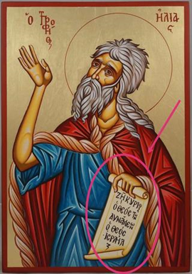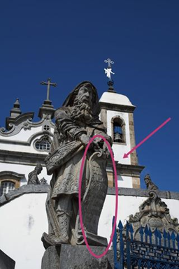

## 钉装书（图3、4）：  
看那本书，是现代型钉装，代表这是耶稣门徒或耶稣以后的人；注意他拿笔，是指他在世时有著作留下；狮子表明这人物是《四福音》的记录者、耶稣的门徒马可（翅膀人=马太；牛=路加；老鹰=约翰）。  
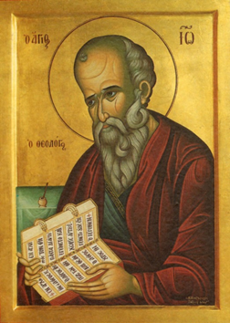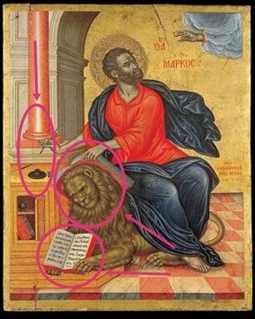

## 殉道者：
手拿棕榈叶的一定是殉道者，他们手拿的物品通常是被杀的凶器、殉道的方式。
这样也只是通式，未必一定如此。
简单说，殉道者艺术表现未必必然手拿棕榈叶，可是手拿棕榈叶的一定是殉道者像，而他们手拿的东西多半是凶器，或和他的蒙难遭遇相关的物品。
图2是圣人罗伦斯，他是被绑在铁架上烧死的（所以，厨师、烧烤业、烤肉店、烟肉工厂奉他为本尊）。  
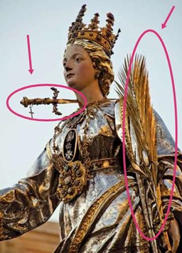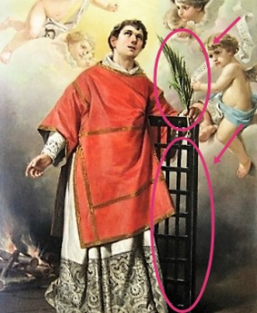  
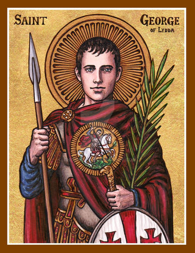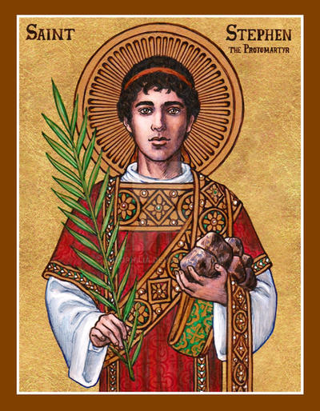  

## 教皇：
拿两把钥匙的，一定是天主教教皇。  
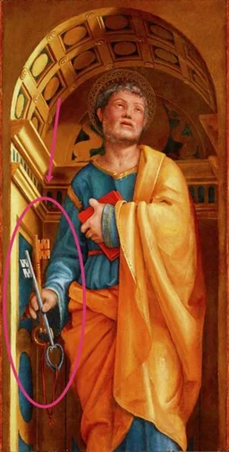

## 主教：
拿牧羊人手杖。  
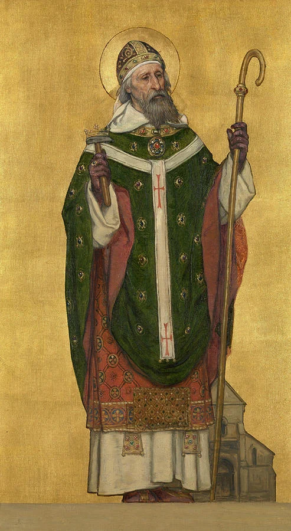

## 隐士：
在欧洲现实中，和艺术表达里，隐士的标志就是沙漏。这和佛教徒使用人骨法器的原理一样，提醒生死无常。
有些艺术不用沙漏表达隐士，而是直接放个骷髅头在书桌上。  
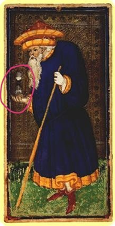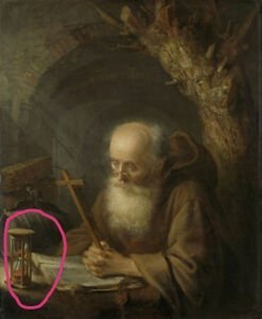  
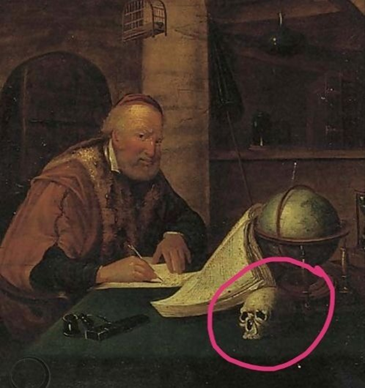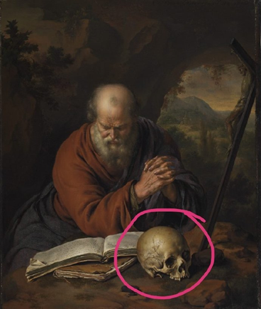  

## 天主教光环
这个只能理解大概。不同国家、不同年代、不同宗派的表达都不同。理解个大概就好了，反正我也不是专家。
圆光里有十字架的，一定是圣三而不能是其他对象；通常是耶稣，如图1；但也可能是圣灵，如图2。  
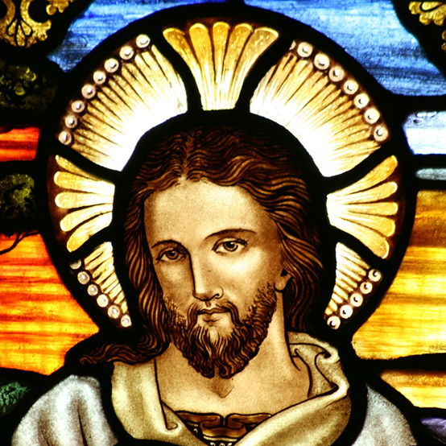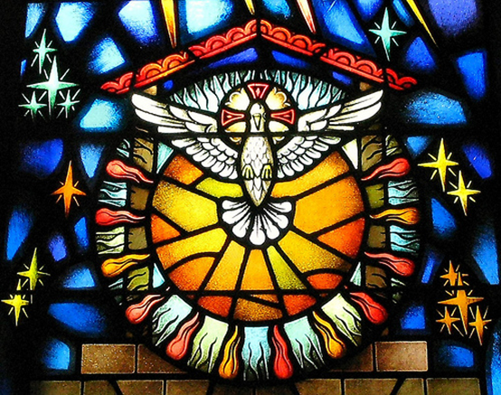  

三角形，必然是圣三里面的天父：  
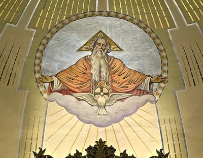  

有12颗星星的光，必然是圣母，而且是某种版本的圣母（我觉得应该没例外）：  
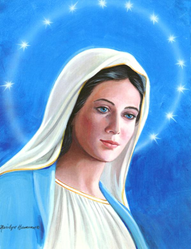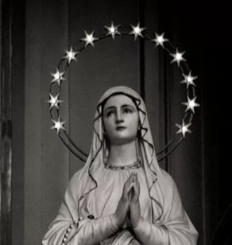  

圣人、圣母、先知、天使用普通圆形光：  
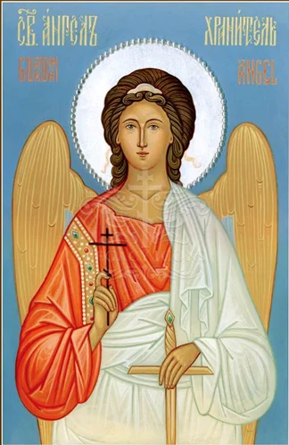  

全身光的叫aureole，或者glory，或者mandorla，通常是杏仁形状那样:  
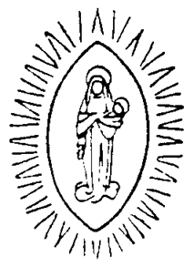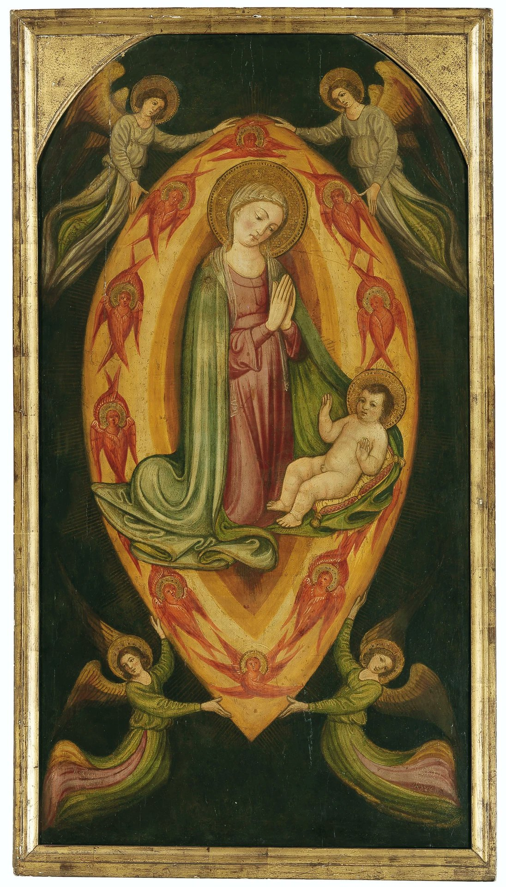  

画画时已经宣福但还没封圣的，只有一坨光但没有圆圈：  
圆形指“天上的”，正方是“地上的”（中国人说，“天圆地方”.....有趣吧？我也不记得“天圆地方”出自哪里了，但起码我记得一个写符的咒......天圆地方，律令九章，吾今下笔，万鬼伏藏，急急如律令.....）；所以，正方形的光是指画画时那个人物还在世：  
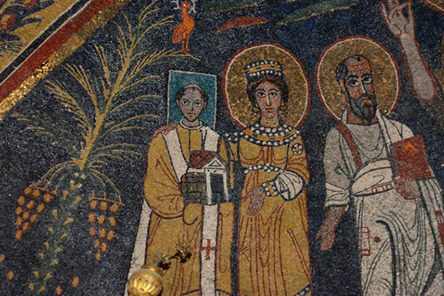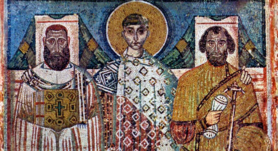  
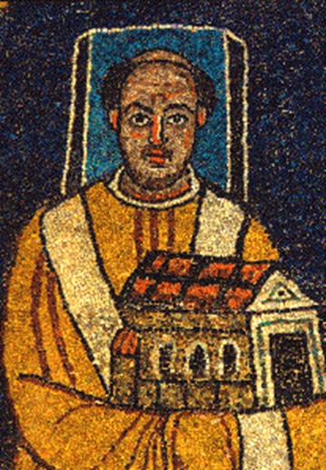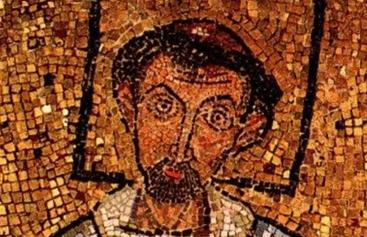  

这是最后晚餐。哪个是犹大呢？看谁没有光好可怜的？对....前排中间那个没有光，而且不只没有光，他动作也有点古古怪怪的，有没有？然后，他又拿了一包钱了。这也太明显了吧？这是个很失败的二五仔啊！  
  

犹大有时画成：  
1. 大家都有光就他没有  
1. 他也有光但黑色  
1. 有时也有一样的光  

这里有一个人的光是黑色的，看到没？看他拿着钱包就知道这个人物是指犹大。  
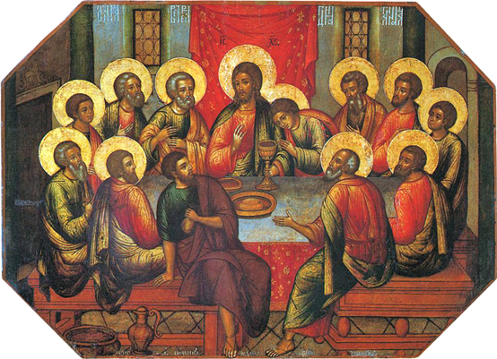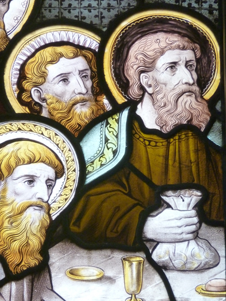  

## 耶稣鱼

代表了耶稣。至于为什么鱼代表耶稣，有很多原因，譬如五饼二鱼、很多门徒是渔夫、“来跟从我，我要你们的人如鱼那样”等等。

这是基督教最初符号。当时罗马逼害基督教，和地下党、反清复明情况差不多，得用暗号，就会画这个符号，而且就是图这样的超级简单象形的两条弧线版本，或者，一个人遇到另一个可能是教友的陌生人，就会不经意描一条弧线，相当于反清复明帮会人士试探地说“足踏红船是我家，五湖四海有盘查；仁兄问我到何处？小弟原来到洪家。”，如果对方相认，就会把另外那条弧线描上，拼成图那样的两条弧线组成的象形鱼，这相当于黑社会回答“若问印头头二四，排成三角订佳期；结义金兰为表记，同心合力主登基。”；这里不是说基督教是黑社会，而是指当时他们面临反清复明义士的情况。

后来公元313年以后，基督教变成合法，但这个符号延续了下来。现在在西方，有些人爱在车的窗口、屁股贴这样的标志，就是为了宣传自己是基督徒。

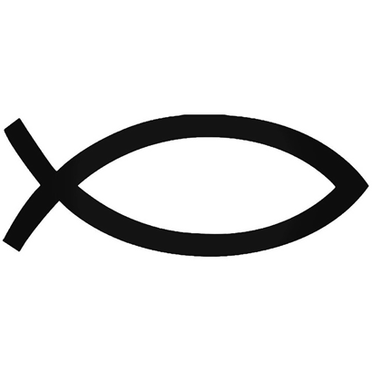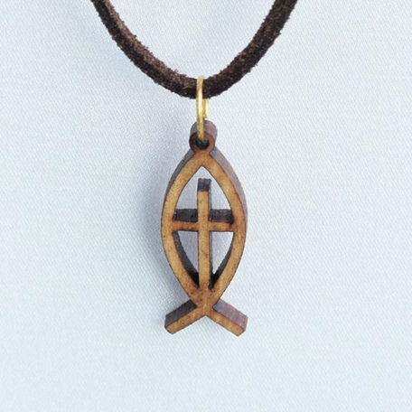  
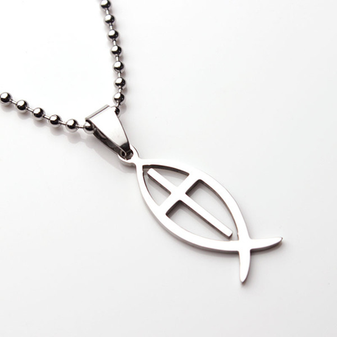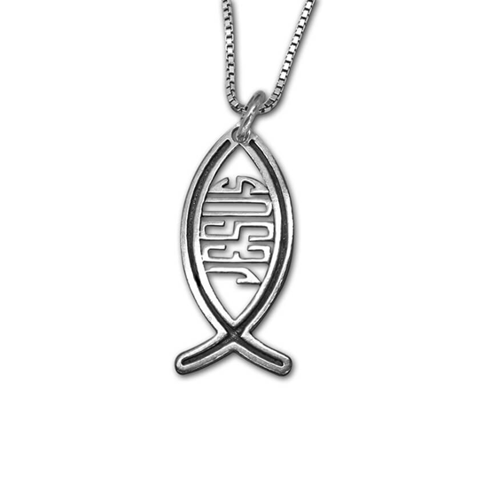  

后来，基督教不是很不爽《达尔文进化论》吗？他们常常互怼，无神论、进化论者就发明了自己的符号，是一条有脚的鱼，故意用来气基督徒的。

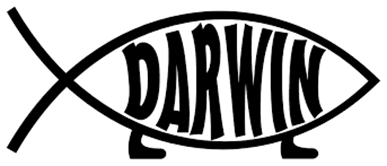

