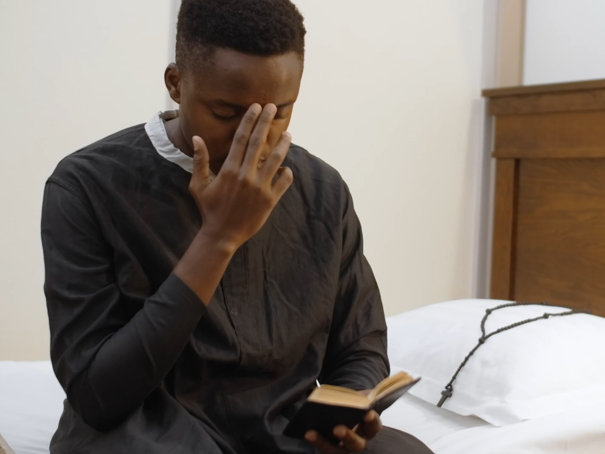
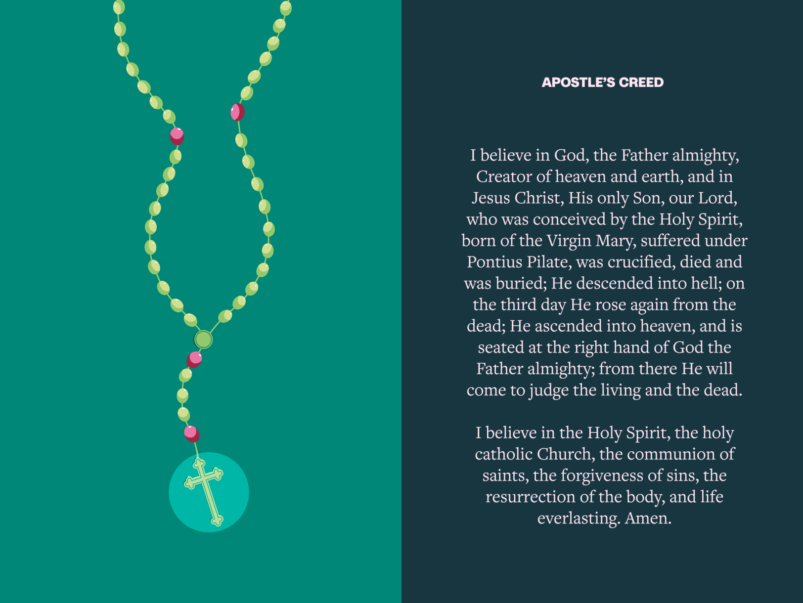
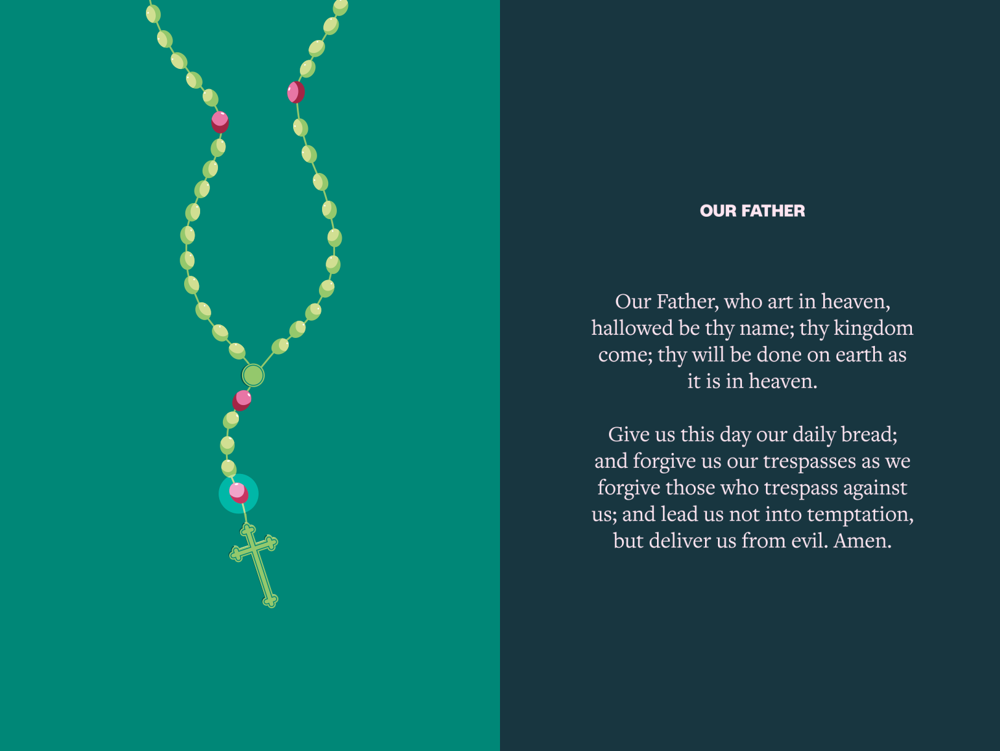
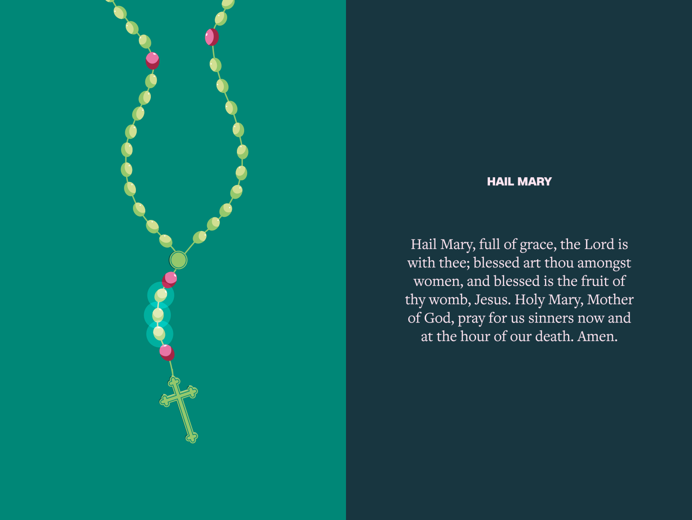
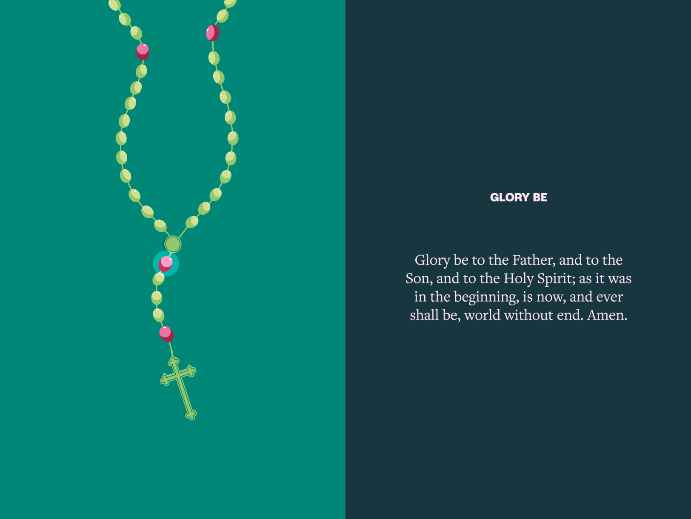
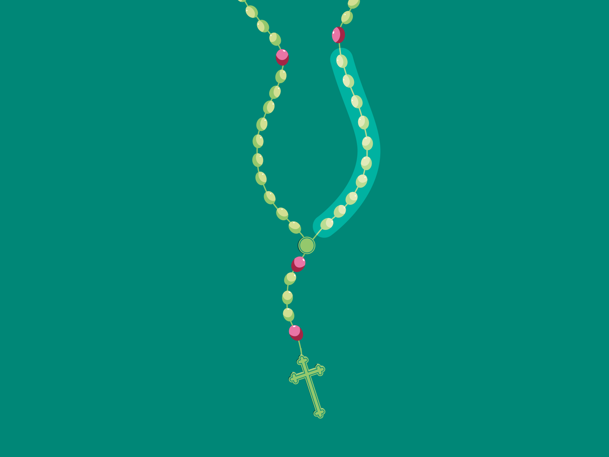
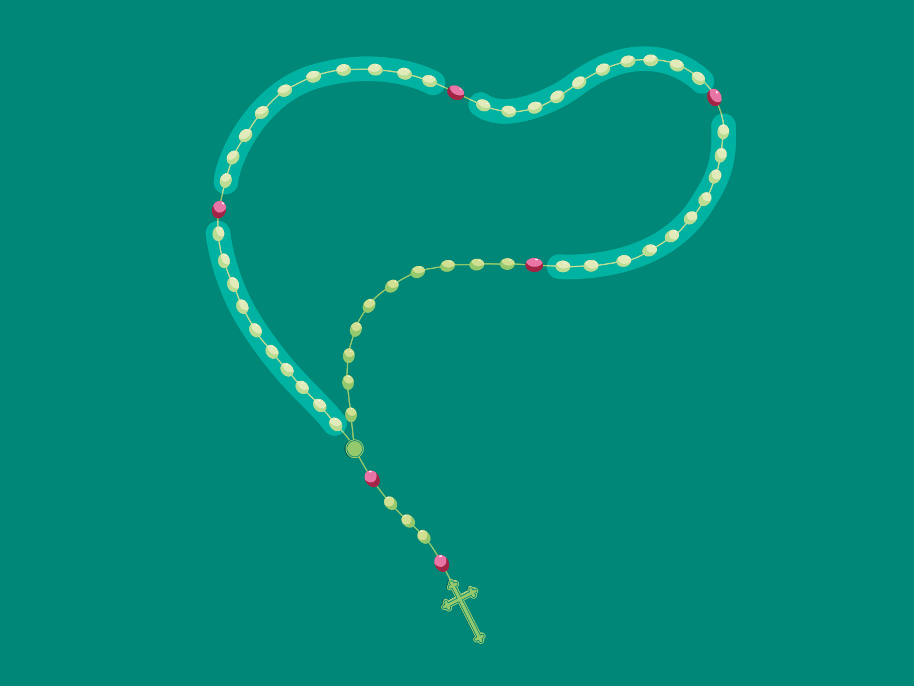
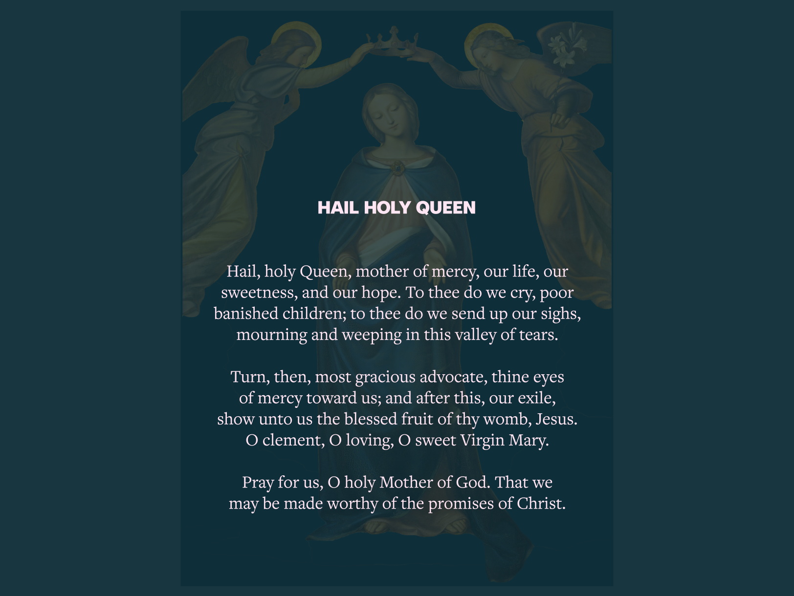
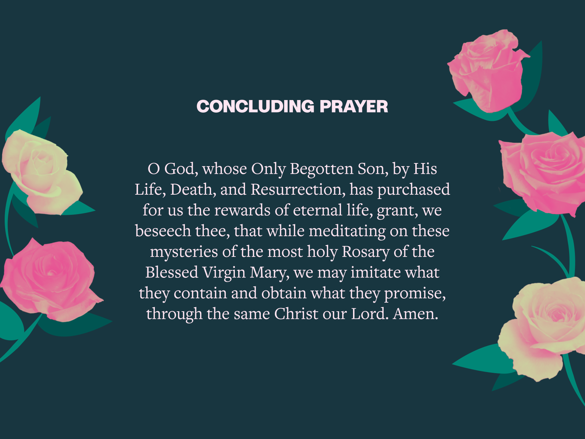

# How to Pray The Rosary [Guide for Catholics] - 2023 | Hallow
**How to Say the Rosary Guide for 2023: Table of Contents**

1.  [Introduction](#introduction)
2.  [How to Pray the Rosary Step by Step](#step-by-step-guide)
3.  [Rosary Prayer Overview](#overview)
4.  [Prayers Said in the Rosary](#rosary-prayers)
    *   [Apostles’ Creed](#apostles-creed)
    *   [Our Father](#our-father)
    *   [Hail Mary](#hail-mary)
    *   [Glory Be](#glory-be)
    *   [Fatima Prayer](#fatima-prayer)
    *   [Hail, Holy Queen](#hail-holy-queen)
5.  [The Mysteries of the Rosary](#mysteries)
    *   [Joyful Mysteries](#mysteries-joyful)
    *   [Sorrowful Mysteries](#mysteries-sorrowful)
    *   [Luminous Mysteries](#mysteries-luminous)
    *   [Glorious Mysteries](#mysteries-glorious)
6.  [Why Do We Pray the Rosary?](#why)
7.  [Praying the Rosary Every Day](#every-day)
8.  [How to Pray the Rosary PDF](#pdf)

The Rosary is a meditative prayer based on Scripture. When we pray the Rosary, we ask Mary to pray for us as we seek to grow closer to her son Jesus by contemplating His life, death, and Resurrection. 

In his 2002 apostolic letter [_Rosarium Virginis Mariae_](https://www.vatican.va/content/john-paul-ii/en/apost_letters/2002/documents/hf_jp-ii_apl_20021016_rosarium-virginis-mariae.html), Pope John Paul II wrote that with the Rosary, “the Christian people sits at the school of Mary and is led to contemplate the beauty on the face of Christ and to experience the depths of his love.”

The Rosary remains an important prayer today. In May 2022, Pope Francis [called on Christians](https://www.vaticannews.va/en/pope/news/2022-05/pope-francis-rosary-peace-ukraine-wars-virgin-mary.html) to pray “the Holy Rosary for peace” in response to the war in Ukraine. In November 2022, Archbishop Cordileone of San Francisco [invited](https://www.catholicnewsagency.com/news/252750/archbishop-cordileone-to-hold-rosary-for-peace-on-election-day) the faithful to pray a “Rosary for Peace” on Election Day.

> The Rosary is a prayer that always accompanies me; it is also the prayer of the ordinary people and the saints … it is a prayer from my heart.
> 
> Pope Francis

How to Pray the Rosary: Step by Step Guide
------------------------------------------

Time needed: 20 minutes

**How to Pray the Rosary**

1.  ****Begin with the Sign of the Cross**.**
    
    _In the name of the Father, and of the Son, and of the Holy Spirit. Amen._ 
    
2.  ****Holding the crucifix, pray the Apostles’ Creed**.**
    
    _I believe in God, the Father almighty, Creator of heaven and earth, and in Jesus Christ, His only Son, our Lord, who was conceived by the Holy Spirit, born of the Virgin Mary, suffered under Pontius Pilate, was crucified, died and was buried; He descended into hell; on the third day He rose again from the dead; He ascended into heaven, and is seated at the right hand of God the Father almighty; from there He will come to judge the living and the dead. I believe in the Holy Spirit, the holy catholic Church, the communion of saints, the forgiveness of sins, the resurrection of the body, and life everlasting. Amen._ 
    
3.  ****On the first bead, pray an Our Father**.**
    
    _Our Father, who art in heaven, hallowed be thy name; thy kingdom come; thy will be done on earth as it is in heaven. Give us this day our daily bread; and forgive us our trespasses as we forgive those who trespass against us; and lead us not into temptation, but deliver us from evil. Amen._ 
    
4.  ****On each of the next three beads, pray a Hail Mary**.**
    
    _Hail Mary, full of grace, the Lord is with you; blessed are you among women, and blessed is the fruit of your womb, Jesus. Holy Mary, Mother of God, pray for us sinners now and at the hour of our death. Amen._ 
    
5.  **On the next bead, pray a Glory Be.**
    
    __Glory be to the Father, the Son, and the Holy Spirit; as it was in the beginning, is now, and ever shall be, world without end. Amen.__
    
6.  ****Pray** the first decade.**
    
    On the large bead, announce the mystery and then say an Our Father.
    
    On each of the 10 small beads, say a Hail Mary while continuing to meditate on the mystery.
    
    At the end of the decade,  say the Glory Be.
    
    Then say the [Fatima Prayer](https://hallow.com/blog/our-lady-of-fatima/):  
    _O my Jesus, forgive us our sins, save us from the fires of hell; lead all souls to Heaven, especially those who have most need of your mercy._  _Amen_
    
7.  **Repeat this pattern for the remaining decades.**
    
    _Our Father -> 10 Hail Marys -> Glory Be -> O my Jesus_ (Fatima Prayer)
    
8.  ****After the 5 decades, conclude with the Hail Holy Queen**.**
    
    _Hail, holy Queen, mother of mercy, our life, our sweetness, and our hope. To you we cry, poor banished children of Eve; to you we send up our sighs, mourning and weeping in this valley of tears._
    
    _Turn, then, most gracious advocate, your eyes of mercy toward us; and after this, our exile, show unto us the blessed fruit of your womb, Jesus. O clement, O loving, O sweet Virgin Mary._
    
    _Pray for us, O holy Mother of God._  
    _That we may be made worthy of the promises of Christ_
    
9.  **Close with the concluding prayer.**
    
    _Let us pray:_
    
    _O God, whose Only Begotten Son, by His Life, Death, and Resurrection, has purchased for us the rewards of eternal life, grant, we beseech thee, that while meditating on these mysteries of the most holy Rosary of the Blessed Virgin Mary, we may imitate what they contain and obtain what they promise, through the same Christ our Lord. Amen._ 
    
10.  **End with the Sign of the Cross.**

    _In the name of the Father, and of the Son, and of the Holy Spirit. Amen._  
    

What is the Rosary?
-------------------

### Origin

In the early 13th century, [St. Dominic](https://www.franciscanmedia.org/saint-of-the-day/saint-dominic) preached the Gospel to combat various heresies, and he founded the Order of the Dominicans to carry out this work of spreading the [Good News](https://hallow.com/blog/how-to-pray-the-gospels/). Despite their efforts, the heresy continued to reappear, however, so he called on the Blessed Virgin Mary to guide him. Tradition holds that Mary appeared to him in 1221 and gave him the devotion of the Rosary, encouraging him to share the prayer with others. Many also believe that the [historical origin](https://www.preces-latinae.org/thesaurus/BVM/Rosarium.html) of the Rosary lies in the monastic practice of reciting 150 Psalms each week, a practice which additionally expanded into the repetition of Hail Mary’s.

In 2023, the Rosary remains as powerful as ever. It continues to be a beautiful means for [conversion](https://denvercatholic.org/deathbed-conversions-reveal-rosarys-power-and-give-hope-for-fallen-away-catholics/) and helped [unite the global population of Catholics](https://www.vaticannews.va/en/africa/news/2023-01/rosary-prayers-across-africa-for-pope-benedict-xvi.html) in prayer in the wake of the death of [Pope Benedict XVI](https://hallow.com/blog/pope-benedicts-passing/).

Rosary Prayers
--------------

The Rosary devotion is comprised of several prayers, which are all rooted in Scripture. Under “How to Pray: The Rosary” below, you can read about the traditional order of these prayers in the Rosary. People often pray with rosary beads to guide their time in prayer, though they are not necessary for praying the devotion. If you don’t have a rosary, consider praying with the [Bishop Sheen X Hallow Rosary](https://hallow.com/merch/bishop-sheen-x-hallow/).

### Apostle’s Creed

“_I believe in God, the Father almighty_ …”

We begin the Rosary with the Apostle’s Creed. It is a fitting way to begin this prayer, affirming our core beliefs as Catholics. Each [line](https://www.acatholic.org/catholic-the-apostles-creed/) comes from different books of Scripture, including the [Gospels](https://hallow.com/blog/how-to-pray-the-gospels/), 1 Peter, 1 Corinthians, Acts, and more.

### Our Father

_“Our Father in heaven, hallowed be your name …”_

Also known as the [Lord’s Prayer](https://hallow.com/blog/how-to-pray-our-father/), this prayer comes directly from Jesus in [Matthew 6](https://www.biblegateway.com/passage/?search=Matthew+6&version=NRSVCE), when he teaches his disciples how to pray.

### Hail Mary

_“Hail Mary, full of grace …”_

> Although the repeated [Hail Mary prayer](https://hallow.com/blog/how-to-pray-the-hail-mary/) is addressed directly to Mary, it is to Jesus that the act of love is ultimately directed, with her and through her.
> 
> St. John Paul II

The Hail Mary prayer is the heart of the Rosary. We pray 10 Hail Mary’s within each of the five decades – totaling 50 Hail Mary prayers at the end of your devotion. This prayer, in which we ask Mary for her intercession, is also [rooted](https://media.ascensionpress.com/podcast/the-biblical-roots-of-the-hail-mary/) in Scripture. The first two lines come from the first chapter of Luke, when the Angel Gabriel announces Christ’s coming at the Annunciation and when Mary’s cousin, Elizabeth, greets Mary at the Visitation.

### Glory Be

_“Glory Be to the Father …”_

The Glory Be is often referred to as the [doxology](https://www.merriam-webster.com/dictionary/doxology), a word that comes from Greek, meaning “an expression of praise or glory.” This prayer is quite [common](https://www.catholic.com/tract/glory-be-doxology) and straightforward — we pray for the Holy Trinity to be glorified at all times.

### **Fatima Prayer**

“_O my Jesus, forgive us our sins_ …”

The Fatima Prayer was given directly by Mary to three shepherd children on July 13, 1917 during her appearances in Fatima, Portugal. In this prayer, which is said at the end of each decade, we ask Jesus for mercy upon us and upon all souls.

### **Hail, Holy Queen**

“_Hail, Holy Queen, Mother of Mercy_ …”

The Rosary ends with this powerful prayer, which comes from the ancient tradition of monks concluding their communal prayer with the Salve Regina (a Latin chant of the Hail, Holy Queen). Reminded that Jesus is given to us through his Mother Mary, we give thanks to God for Mary’s participation in all of the saving events of Jesus’ life, death, and Resurrection.

Mysteries of the Rosary
-----------------------

Each of the five decades of the Rosary highlights a unique moment within the Paschal Mystery. There are four sets of mysteries — Joyful, Sorrowful, Luminous, and Glorious — and each contains five pivotal events from the life of Jesus. When praying the Rosary, we enter into one set of these mysteries at a time, meditating on them through the eyes of Mary, the disciple who was closest to Jesus and knew him best. The Church traditionally prays certain mysteries on specific days of the week, as follows:

*   Monday: Joyful Mystery
*   Tuesday: Sorrowful Mystery
*   Wednesday: Glorious Mystery
*   Thursday: Luminous Mystery
*   Friday: Sorrowful Mystery
*   Saturday: Joyful Mystery
*   Sunday: Glorious Mystery

### Joyful Mysteries (Monday, Saturday)

The Joyful Mysteries invite us to contemplate the Incarnation, and we enter into the wonder of Jesus coming to earth as a baby. We see the incredible story unfold through Mary’s eyes – the angel appear _(The Annunciation)_, her cousin Elizabeth’s greeting _(The Visitation)_, the birth of her son _(The Nativity)_, and the significant events that point to who this child is and what he will do _(The Presentation and Finding in the Temple)_. We are invited to do as Mary did and “reflect on them in \[our\] heart\[s\]” ([Luke 2:19](https://www.biblegateway.com/passage/?search=luke+2%3A19&version=NABRE)).

### Sorrowful Mysteries (Tuesday, Friday)

The Sorrowful Mysteries help us relive the passion and death of Jesus. We not only remember it, but we also enter in – we keep watch with Jesus in his distress before his arrest _(The Agony in the Garden)_. We enter into his suffering with _The Scourging at the Pillar, The Crowning of Thorns,_ and _The Carrying of the Cross_ … and then we stand at the foot of that cross beside Mary as we witness his _Crucifixion and Death_. We attempt to understand the depths of God’s love for us as we reflect on the cost of our salvation and redemption. We feel this sorrow and contrition even more deeply as we imagine it through the eyes of his mother.

### Luminous Mysteries (Thursday)

Through the Luminous Mysteries, we meditate on the events of Jesus’ public ministry: his revelation as the Beloved Son of the Father at the _Baptism in the Jordan_, his first public miracle at the _Wedding at Cana_, his _Proclamation of the Kingdom of God, Jesus’ Transfiguration_, and the _Institution of the Eucharist_ at the Last Supper. Pope St. John Paul II wrote, “In the Luminous mysteries, apart from the miracle at Cana, the presence of Mary remains in the background … Yet the role she assumed at Cana accompanies Christ throughout his ministry. The revelation made directly by the Father at the Baptism in the Jordan, also echoed by John the Baptist, is placed upon Mary’s lips at Cana, and it becomes the great maternal counsel that Mary addresses to the Church of every age: ‘Do whatever he tells you.'”

### Glorious Mysteries (Wednesday, Sunday)

In the Glorious Mysteries, we meditate on the awe-inspiring miracles that take place after Jesus’ death. These events show how Jesus is who he says he is – the Son of God. We experience the joy of the risen Christ and imagine ourselves as Mary or the first disciples _(The Resurrection)_. As we pray, we see Jesus’ _Ascension_ into heaven and the _Descent of the [Holy Spirit](https://hallow.com/2022/09/14/prayer-to-the-holy-spirit-and-other-holy-spirit-prayers/)_ at [Pentecost](https://hallow.com/blog/pentecost/). The last two mysteries, though not explicitly mentioned in Scripture, come from hundreds of years of tradition based on passages from Revelation and the Song of Songs. We celebrate the grace and the role Jesus has bestowed upon his mother _(The Assumption and Coronation of Mary)_, and we pray that where Mary goes, we will one day as well.

Why do we pray the Rosary?
--------------------------

> Think of the Rosary as being like the ocean: There’s something in it for everyone, whether you consider yourself a veteran mystic longing to go deeper in prayer with our Lord, a novice struggling to learn how to pray, or someone seeking the Lord’s help, right now, with something going on in your life. The deep-sea explorer and the child making sand castles on the beach can fully enjoy the same ocean while playing at different levels. And this is true with the Rosary.
> 
> Edward Sri, “Why Pray the Rosary?”

Just as Dr. Sri [explains](https://www.franciscanmedia.org/franciscan-spirit-blog/why-pray-the-rosary), the Rosary is a prayer for people of all ages, undergoing different life experiences, and who might have different levels of familiarity with the devotion. The reason behind the Rosary is fairly simple — Mary was present for the joyful, sorrowful, luminous, and glorious moments of Christ’s life. So, by meditating on Jesus’ life with Mary’s help, we seek to grow closer and closer to Christ. We might pray with Mary for a special intention, or we might need a moment of solace with the Blessed Mother and her Son. Any reason to pray the Rosary is a beautiful reason.

Praying the Rosary Every Day
----------------------------

We can pray the Rosary at any time of the day or night. While some people prefer to pray with beads, they aren’t necessary for our time spent with Jesus and Mary. Praying the full Rosary step by step usually takes about 15 – 25 minutes, but remember, you can always simply pray one decade (an Our Father, 10 Hail Mary’s, a Glory Be) if that’s all the time you have.

If you’re looking to add the Rosary to your everyday [prayer routine](https://hallow.com/blog/how-to-pray/) intentionally, consider the following times for prayer:

*   If you take daily walks, consider adding the Rosary to your routine. You can say the prayers with Hallow, or carry your rosary beads as you walk.
*   Pray the Rosary on your commute; listen and pray along as you start or end your day at work.
*   Pray as you prepare dinner.
*   Set aside quiet time and pray as you get ready for the day or prepare to [fall asleep](https://hallow.com/blog/falling-asleep-with-god/).

* * *

You can pray the traditional daily Rosaries, the Scriptural Rosary, and the Chant Rosary on Hallow. You can also pray the Rosary with Dr. Scott Hahn or Bishop Robert Barron. Bishop Barron’s introduction and tutorial to this devotion are also included on the app.

We look forward to praying the Rosary with you step by step on Hallow. If you’re looking for a PDF guide for praying the Rosary, save or download the illustrated guide below:

How to Pray the Rosary – Hallow App

Related Prayers
---------------

*   [Lectio Divina](https://hallow.com/blog/how-to-pray-lectio-divina/)
*   [How to Pray the Seven Sorrows Rosary](https://hallow.com/blog/7-sorrows/)
*   [Lent Prayers](https://hallow.com/blog/lent-prayers/)
*   [How to Pray the Lord’s Prayer](https://hallow.com/blog/how-to-pray-our-father/)
*   [How to Pray the Mary, Undoer of Knots Novena](https://hallow.com/blog/how-to-pray-mary-undoer-of-knots-novena/)
*   [How to Pray the Divine Mercy Novena](https://hallow.com/blog/how-to-pray-divine-mercy-chaplet/)
*   [Feast of Our Lady of Guadalupe](https://hallow.com/blog/feast-of-our-lady-of-guadalupe-prayers-celebrations/)
*   [Mother’s Day Prayers](https://hallow.com/blog/mothers-day-prayers/)

***_Article Last Updated: July 28, 2023_**

You have successfully subscribed!
---------------------------------
