# （主日学） 圣经 旧约纵览
## （主日学)01 旧约纵览 概论 神创论视角
https://www.youtube.com/watch?v=9I8ACQVB42U&list=PLfChJ-aSv3VA9dN4YOF9JNxQRxmPJP2lL&index=1&t=1175s

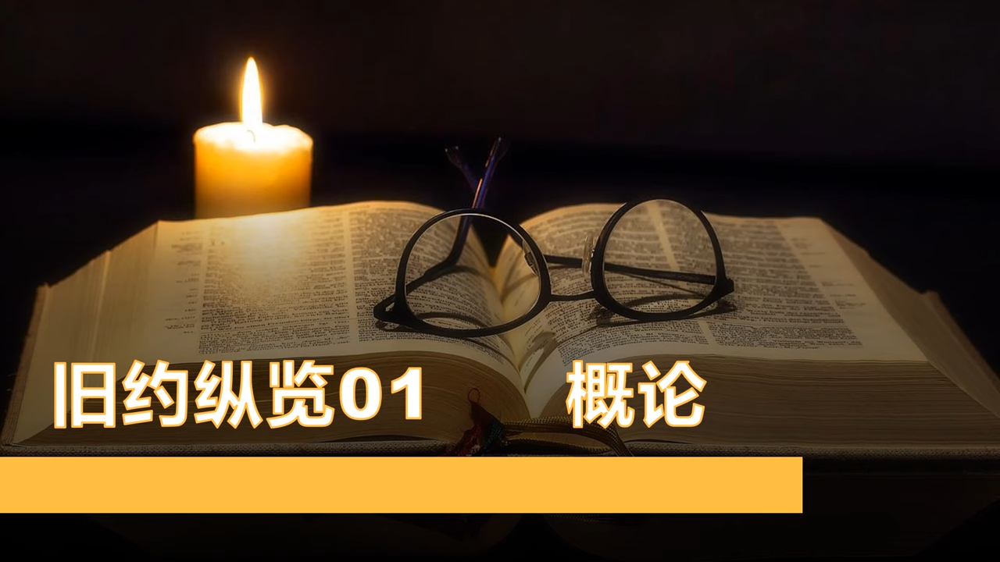  
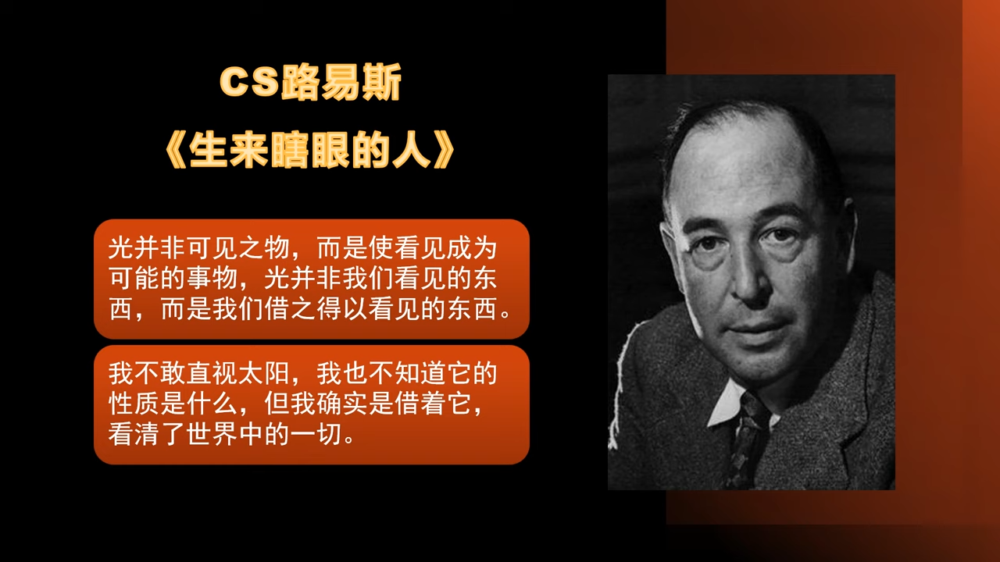

在树林中捡到拐杖知道是人丢下的，自然界如此精妙绝伦又如何相信是没有创造者的呢。

属灵的启示，从光开始。有了光，其实也看不见光，光有可见的部分也有不可见的部分。借助光，能看见万物。不能直视光。世界有黑暗，是因为有罪人抵挡光。

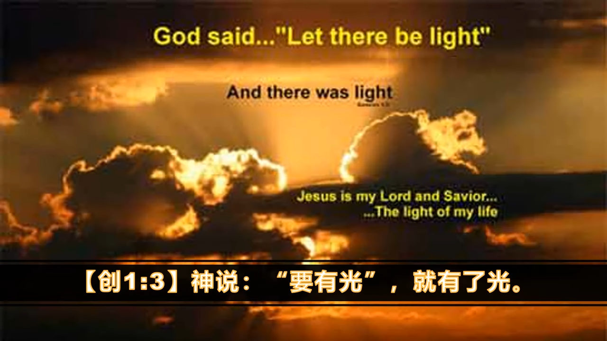  
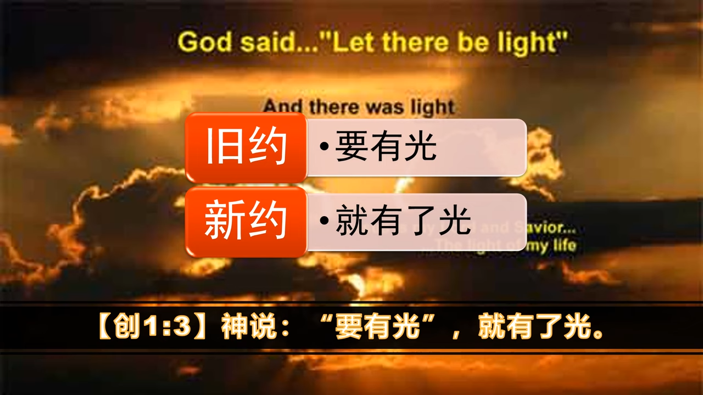

新约使不可见的光变为可见，使不能见到的神，可以看到，可以摸到。旧约就是“你们太黑暗了，我要给你们光”，但愚蠢的人类没有意识到自己生活在黑暗中，所以上帝用了一个民族的历史来看一看人类是不是黑暗，是不是瞎了眼。新约，真光降临，道成肉身，“我是世界的光”，通过荣耀的名——耶稣基督，来看到光。

圣经，通过“信基督”来领受。大部分人看圣经，是“越看越抵触”的。逻辑学的一个问题，“循环论证”。

时间，是人类对光的周期性变化的观察而产生的感觉。依赖于人的感觉，又超越感觉。不依赖个人感觉，而是人类整体的感觉，因为个体会死亡。“记录”是人类在时间中的轨迹。时间不可能从进化中产生。圣经告诉我们，神将“永生”放进人的心里，“时间”是“永生”的派生物。对永生有向往，才会对时间有感觉。“必然有死亡”的世界中出现“永生”的想法，是对进化论的讽刺。

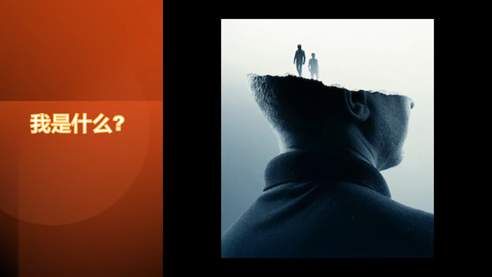

借着光，可以让人审视“我是什么”。“我是一切”，世界上的一切，若对我没有用，那它就不存在。被神的强光照耀，让人清醒看清自己是什么。在黑暗中，人觉得自己是神；在真光中，人才能看清自己是罪人。

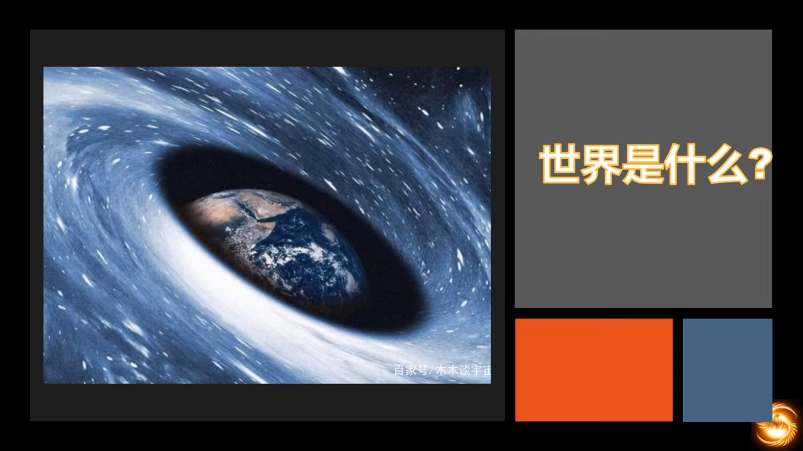

科学能告诉我们世界是怎样的，但无法告诉我们世界为何是这样的。“上帝粒子”，所罗门在900多年前就说过，“虚空的虚空，一切都是虚空”。没有终极的目的，这个世界就没有存在的意义。人的存在也就没有意义，死亡的存在，让人的每一天都没有了意义。圣经告诉我们，世界是有意义的，是神为了祂的孩子而设立的。

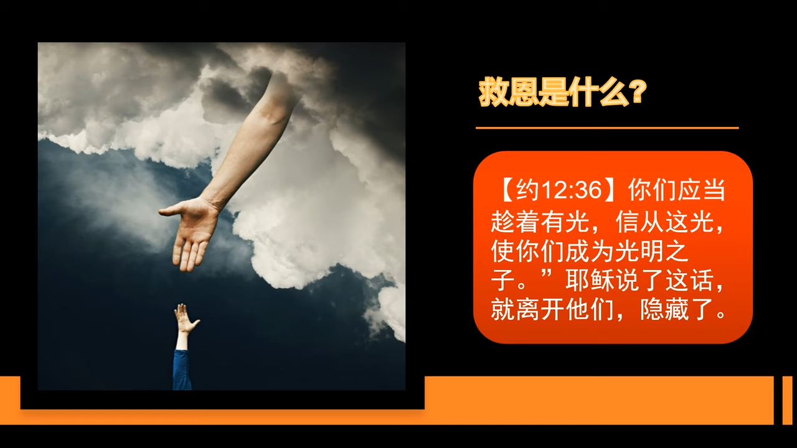

> [!CAUTION]  
> 不是哲学书，所以不要用圣经和上帝辩论；  
> 也不是科学书，所以也不要拿来考古；  
> 不是哲学书，但是世界上一切的哲学思辨都是围绕它；  
> 也不是科学书，但现代科学起源于它。

本质上，圣经是宣告上帝对这个罪恶世界展开拯救的书。

明白了救恩的含义，才会变得虚己。

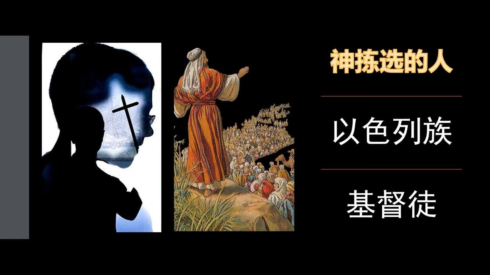

神拣选的人，旧约中是以色列人，新约中是基督徒。四大文明古国，神都没有拣选。救恩出自于上帝。

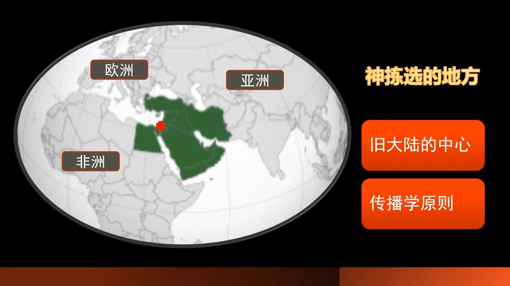

耶路撒冷，地中海东岸，三大洲的交界。新大陆发现前，已知大陆就是亚欧非。神拣选以色列，神选的位置，是交通枢纽，是八卦集散地。

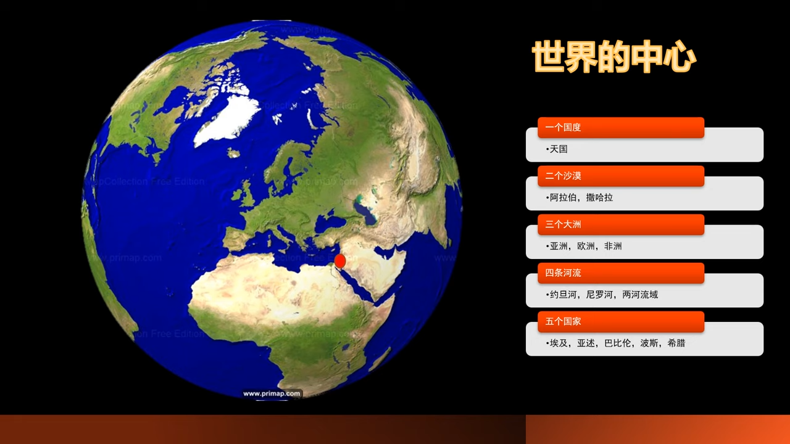

一个天国，两个沙漠，三个大洲，四条河流，五个国家。

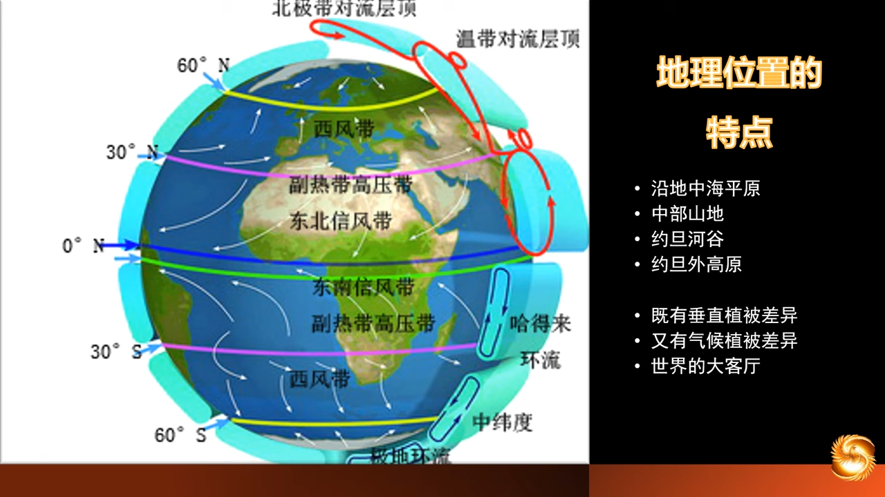

气候条件不稳定，使生活在这片土地的人民高度依赖上帝。末世，其后极端化是常态（启示录）。气候问题，靠人想办法去解决是不可能的，唯一的道路是悔改。一切的气候议题，都是转移人对神的注意力，增加人的焦虑感，提升人的虚妄的道德感。

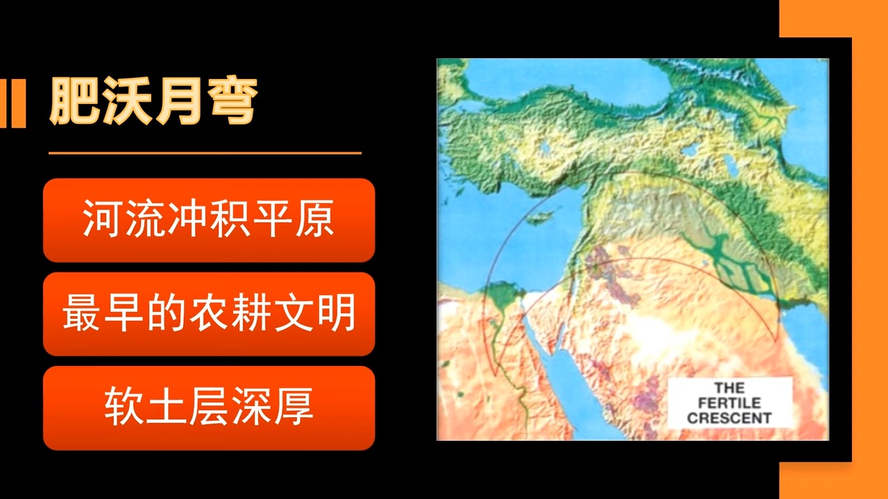

农耕文明，谁有粮食谁就富裕。加勒比和埃及都是富裕的地方。

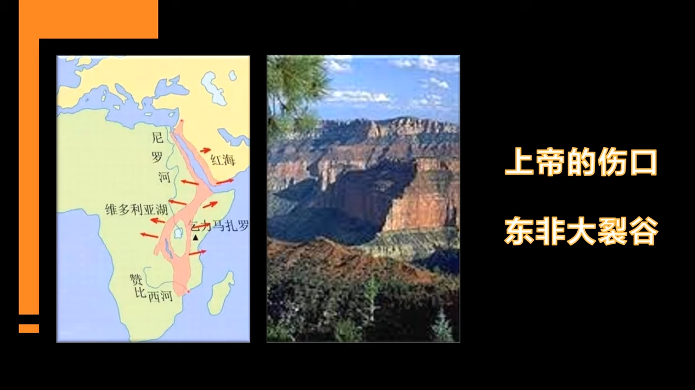

有一股强大的力量，将这块土地，从应许之地开始，深深地撕扯开。上帝的伤口，扯开大地的力量，也是让耶稣复活的力量。

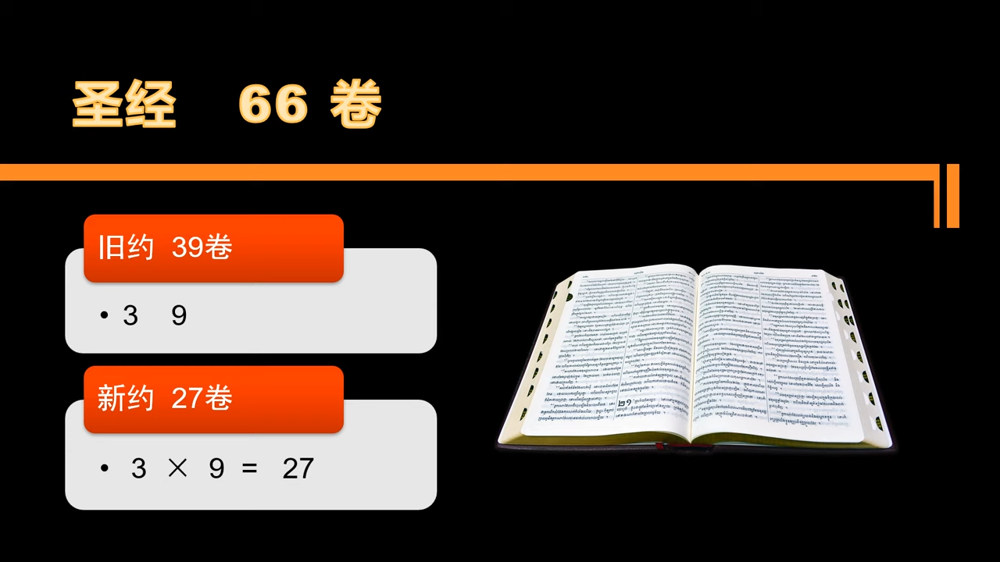

四十多位作者，在不同地点不同时代，前后贯穿一千六百年。

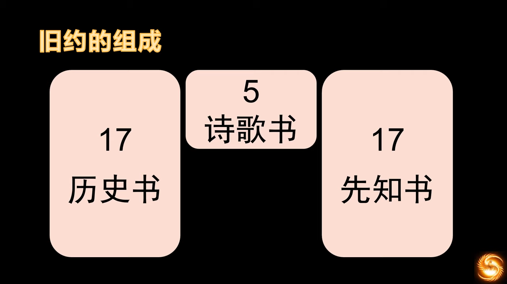  
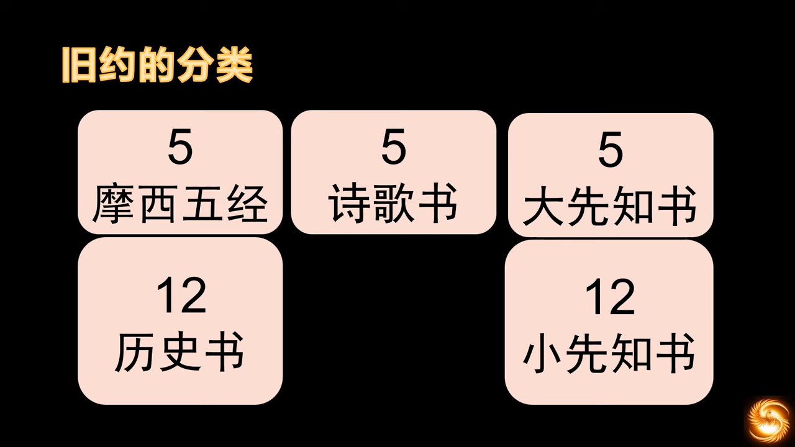

大小先知书，只是讲篇幅的大小。

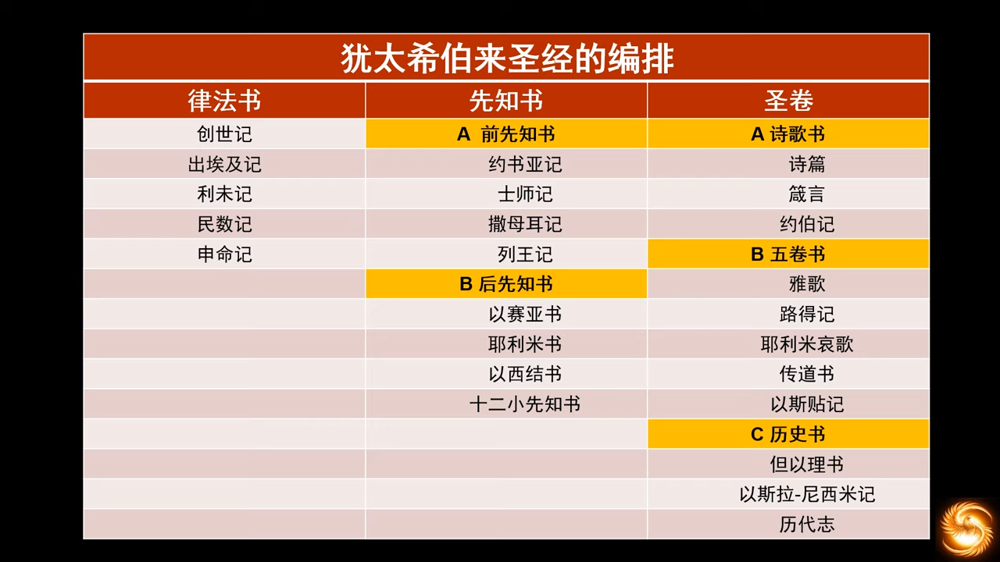

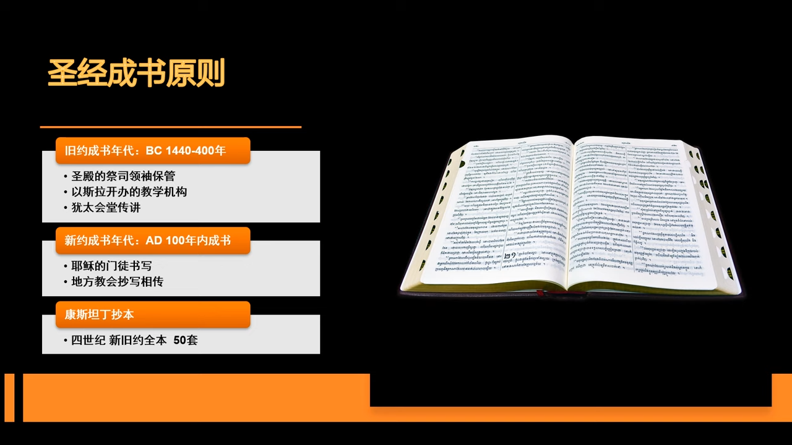

死海古卷，抄本的准确性非常高。在耶稣降临前，旧约圣经的汇集大约用了一千年。  
三个标准：
1. 作者必须是上帝的先知
1. 书中的预言必须是准确的
1. 是否和其他经书一致，尤其是和《梅瑟五经》

AD 397，新约集结成册了，教会的圣经收录标准：  
1. 作者是否为使徒，或使徒的直接受训的门徒，这就要求书卷在公元一世纪成书的
1. 书卷是否有上帝改变人心的能力，由初代教父和殉道教父们得到验证
1. 是否能为上帝的子民广泛接受，在当时的教会广泛使用

跨越一千六百年的时间，不同的人自行记录不同的事情，然后像串珠一样被串了起来，展现了救恩的画面，这本身是人类历史上的奇迹。

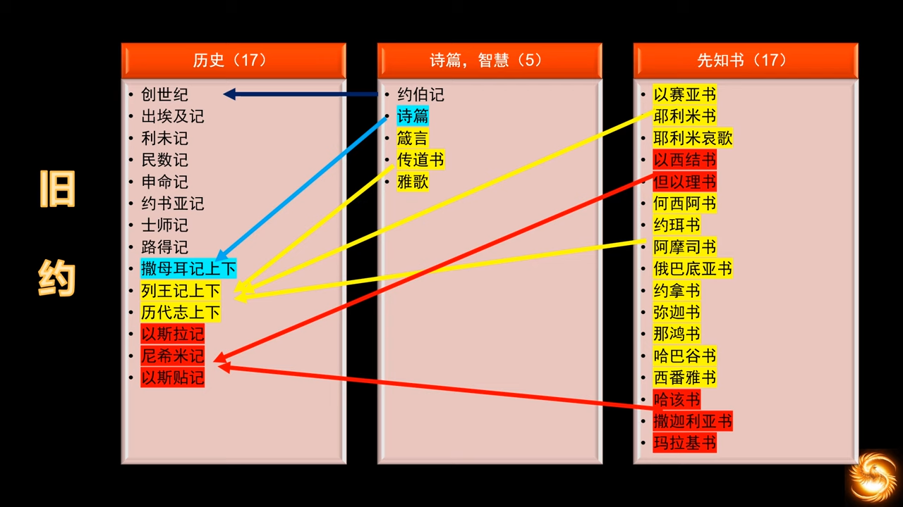  
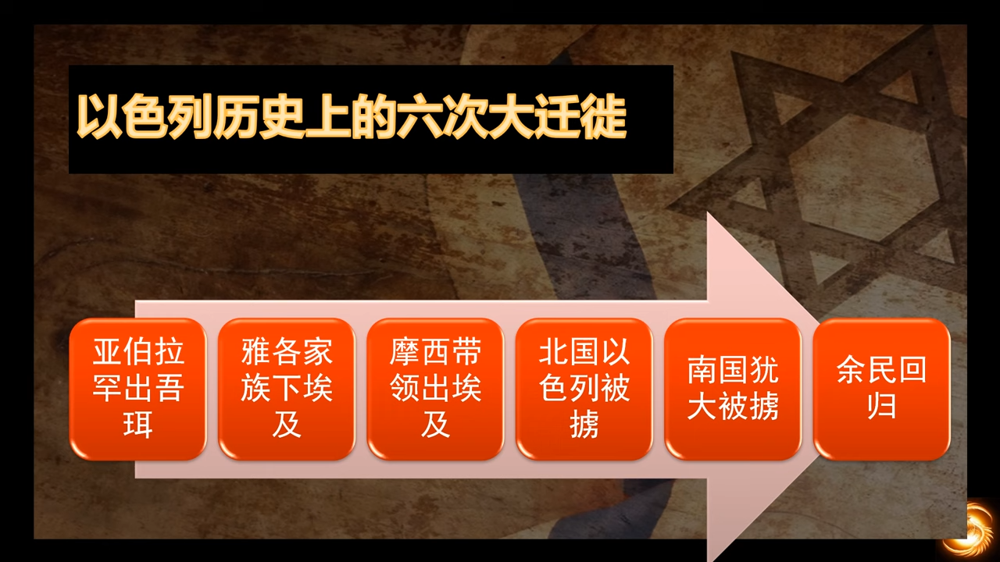

旧约，就是描述以色列民族的历史。流散各地的以色列人很硬核，“无祖国，无偶像，无君王”。

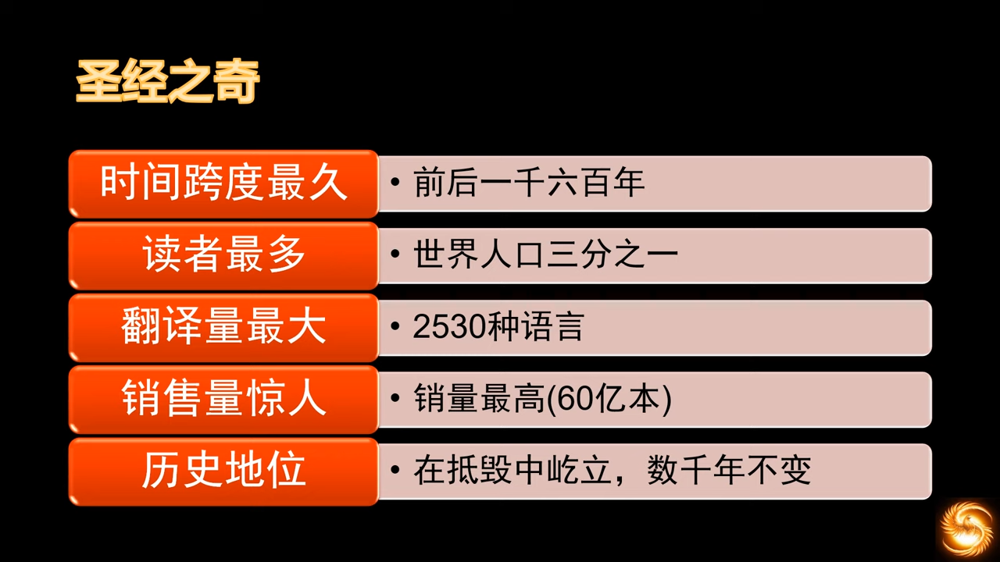

法国的反神斗士伏尔泰，高举理性和科学的旗帜，贬低宗教，曾宣称自他之后的一百年，世界将不再需要圣经。神很有幽默感，他的家，现在是法国圣经协会的所在地，每天印刷成千上万的圣经。一切抵抗过圣经的王朝，都在历史的长河中烟消云散，神的话语永存。

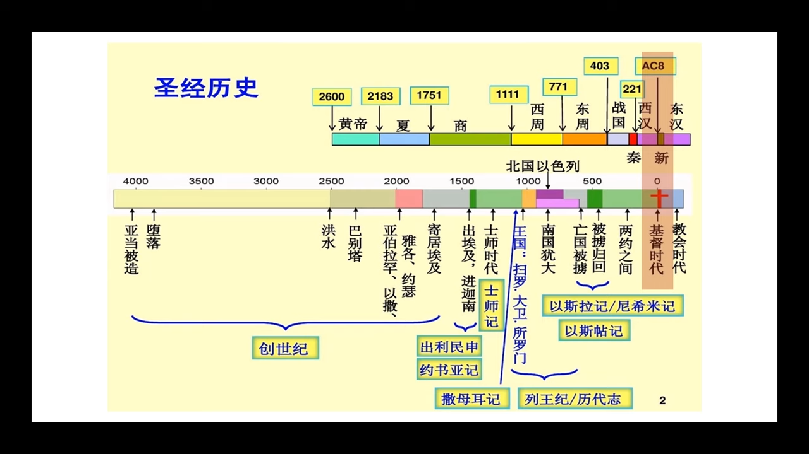

孔子：“子不语怪力乱神”。东方，造神运动，把所谓的“天子”视作神。而应许之地，正在静默中，等待真神。更有意思的是，当基督来到这个世界的时候，同时期的中国发生了王莽篡位，王莽在AD 1接受了“安汉公”的称号，登上了权力的巅峰。“安汉公”即为在汉朝的平安王，AD 8年底王莽正式称帝，改国号为“新”。同时期在上帝拣选的地方，一个全新的纪元正在开始，大幕已经拉开，写天国宪章的上帝已经在人间出现了，真正的“平安王”已经降临，之后跟随祂的使徒们也已全部出生。序幕已拉开，角色已就位，在神荣耀的剧场中，他们将用自己的人生，书写神的篇章，这才是人类的新纪元。东方的“平安王”的王朝连头带尾才十四年，人的努力是徒劳的。

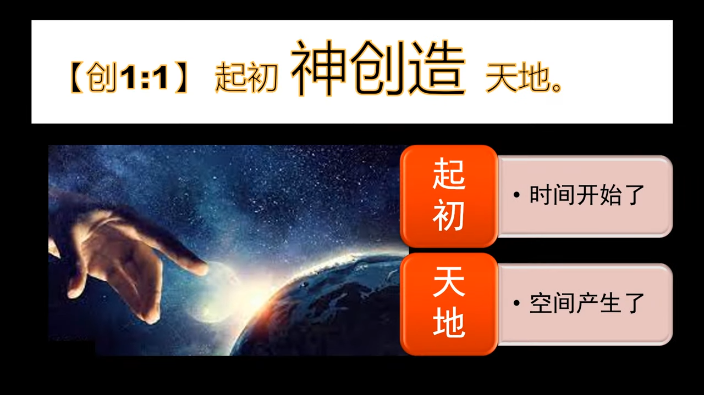

神的创造包括了时间和空间，神位于“起初”之外、在“空间”之外，上帝是绝对的、超然的、永恒的。否定了任何“肉身成道”的可能性。局部地区，面对局部人群，可能有区域性的积极意义，但和永恒并无关系。

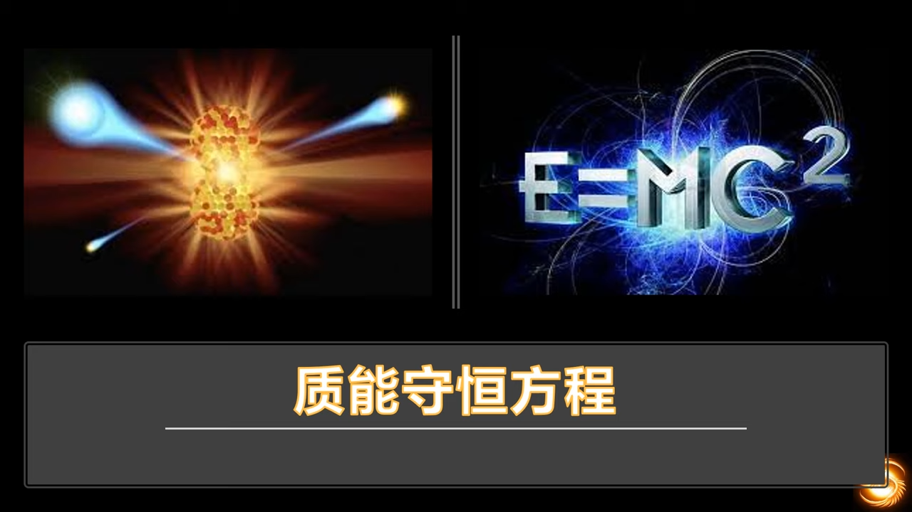

可观察的物质和不可观察的能量的相互转换，比如植物的光合作用。于是我们不再用“是否可见”来作为判断世界的标准。肉体的腐烂，会转变为另一种形式存在于这个世界上，更毋用论我们的灵魂，灵魂脱离了肉体的捆绑之后，是一定有去处的。

圣经并不解释，而是宣告真理。真理就是，我们的世界在神学上是固定的，在科学上也是封闭的。应验了圣经，“神的话语安定在天，直到永远。” 

> :latin_cross:  
> 上主，你的圣言，存留永远，  
> 它坚固而不移，好似 苍天。 (圣咏集 119:89)

> :latin_cross:  
> Your word, Lord, is eternal;  
> it stands firm in the heavens. (PSALMS 119:89)
