# （主日学） 圣经 旧约纵览
## (主日学) 02 创世记 1-3 创造 审判 拯救
https://www.youtube.com/watch?v=UpmTtaI2wnk&lc=UgyaN0Df6Qd5L87f7vd4AaABAg

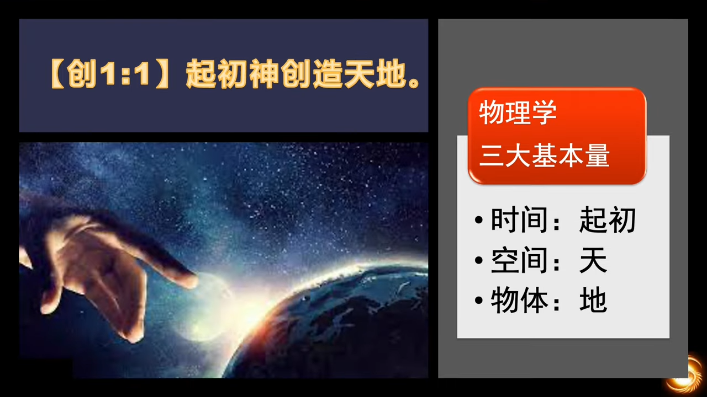

这个世界有神，三维世界加上时间，构成了世界的所有元素，时间的起点，宇宙万物的起点。

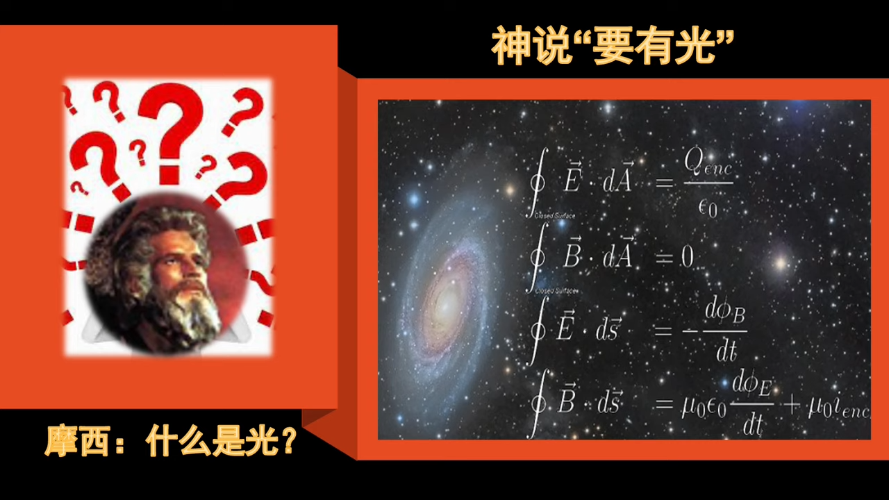

如果你是神，你要如何告诉摩西上帝创世的目的呢？
- 神：要有光。
- 摩西：什么是光？
- 神：我来造个太阳，太阳目前是黄矮星，当它的能量耗尽时，再使用氢或者氦继续进行核反应，维系能源，（十万字），然后变成红巨星，（十万字）……
- 摩西：……

圣经是神的书，不是神用来取悦人类的，只是用来传扬真理的。只有人会对真理以外的事情有好奇心，但又愚蠢得什么都不知道。若没有圣经，人类不会发展出科学。对于普通人，宇宙的科学就是宇宙运行的规律；对于基督徒，我们理解的宇宙奥秘，是宇宙运行的使命，也就是宇宙存在的目的。

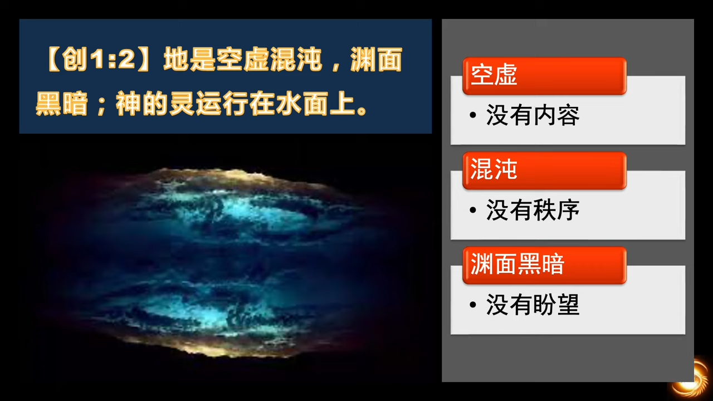

这是有神的世界，有审判、有拯救的世界。人的错误就是对这三点的否定：
- 无神论，否定神的存在；
- 自以为是者，否定审判的存在；
- 不可知论者，怀疑论者，否定拯救的存在。

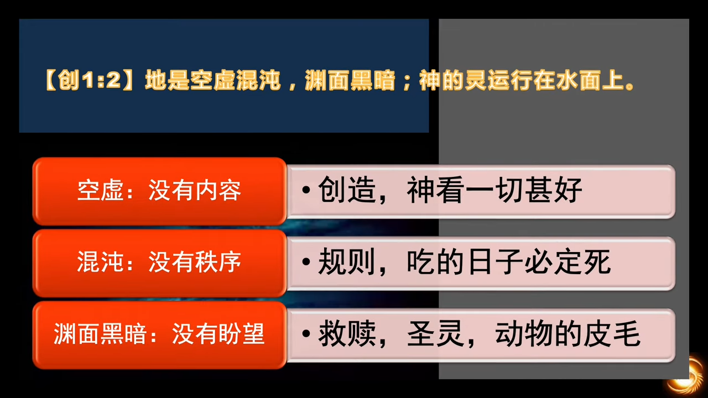

摆脱混沌，必须要建立秩序。《创世纪》是浓缩版的圣经，第一章的每一句话都是整本圣经的微缩版。

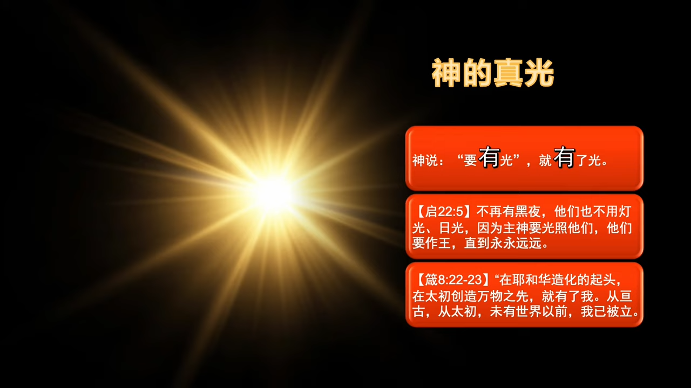

神关于时空世界的最大的宣告。这里的光是“真光”，第一天，没有用动词“创造”，直接说了“有”。这里的光，指向了“耶稣基督”。说明耶稣绝不是受造的，而是受生的。由此可见圣经在逻辑上之缜密和自洽。

> There will be no more night. They will not need the light of a lamp or the light of the sun, for the Lord God will give them light. And they will reign for ever and ever. (REVELATION 22:5)

> The Lord brought me forth as the first of his works,before his deeds of old; I was formed long ages ago, at the very beginning, when the world came to be. (PROVERBS 8:22)

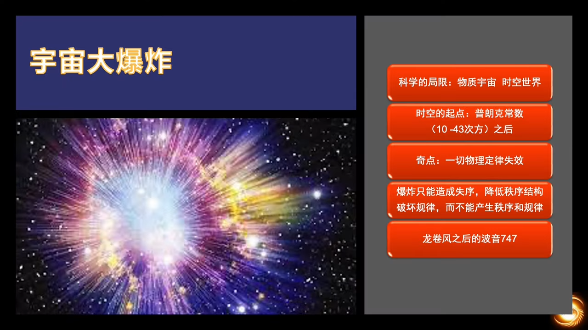

无神论的大爆炸理论存在硬伤，奇点之前的物理定律是失效的。这就否定了大爆炸的随机可能性。按照常识，爆炸只能造成失序，不可能产生秩序和规律。有一本书《龙卷风后的波音747》。神创造了理性，启示了真理。理性的回归，就是信仰。

有些人会将知识科学和信仰对立起来，这个想法来自撒旦。我们若这样想的话，就不能将知识领域的荣耀归于神。基督徒应将理性带到真理的面前，圣灵引导我们的理性来理解神的启示。

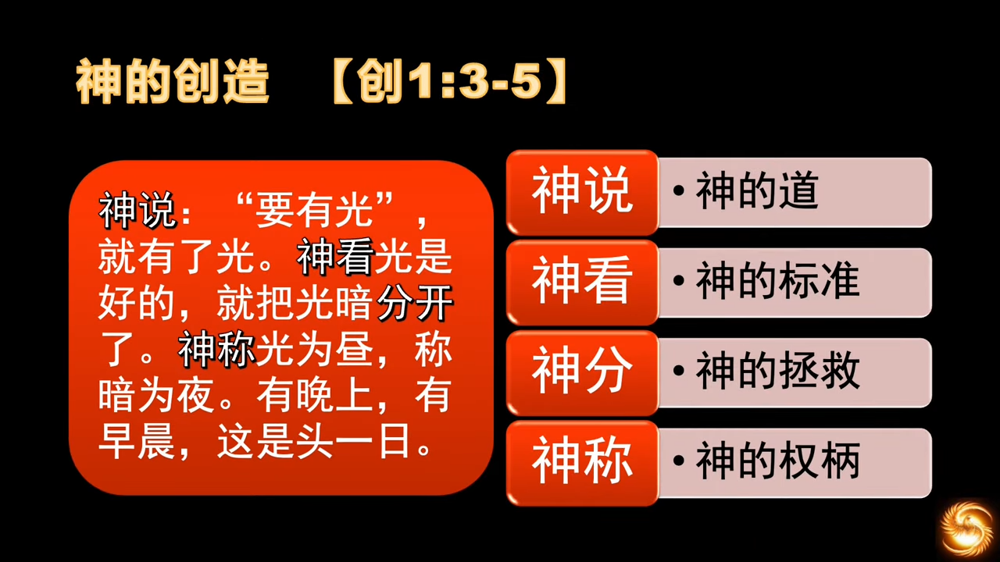

“暗”不是神创造的，“暗”不是一种“存在”，“暗”是对光的抵挡。“暗”也可以视作是神对自己能力的限制，即为“虚己”。命名权，即主权，对某件东西有命名的权力，即彰显了对该物的拥有权。

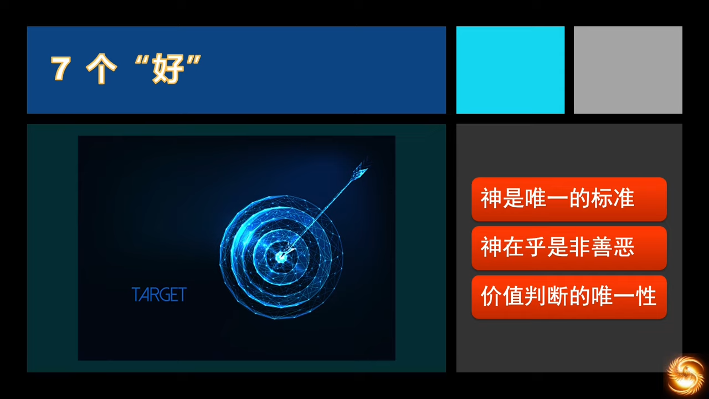

末世的典型特征，就是改变神的标准。相对主义、多元主义等。因为善恶标准若多元的话，即是没有善恶。

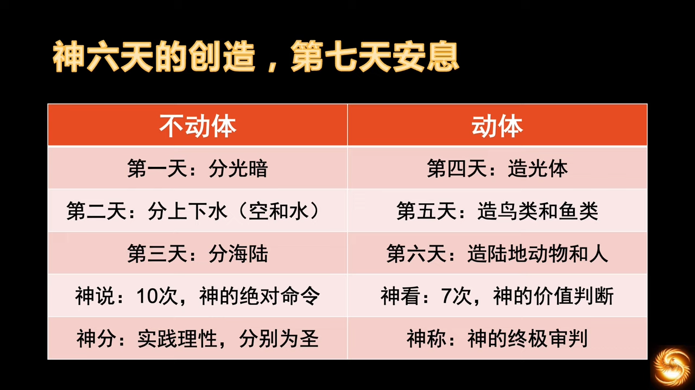

在人出现之前，神要为祂的孩子预备生存的环境。前三天的工作是“分别”，是解决“混沌和黑暗”，后三天是“充满”，是“填充内容”，是解决“空虚”的问题。“神要用光照亮世界”的这个概念，在第四天填充了。一个有意思的细节，太阳是第四天被造的，有了太阳才有时间的概念，所以前三个“创造日”的时长就不能简单等同于三个“太阳日”，就为后来的[神导进化论](https://zh.wikipedia.org/wiki/%E7%A5%9E%E5%AF%BC%E6%BC%94%E5%8C%96%E8%AE%BA)留下了空间。神导进化论，或多或少向进化论妥协了。神创造亚当之时亚当即为成年人，创造的一次性、超自然性、不可重复性，使一切的考古毫无意义了，逻辑起点本身就不同。上帝创造是循序渐进，不厌其烦的过程，前一天是后一天的预备。

> 关于事实判断的，以科学为准，以经验为准；关于价值判断的，以圣经为准。

人是不可能进化出“尊严”这些价值观的，这个世界阻挡神的一个方式，就是模糊神设立的边界，比如“巴别塔”，比如“设立国教”，比如“政教合一”。“神称……”宣告了神的权柄，这个权柄从《创世纪》贯穿到《启示录》。

第七天，是神创造的最高峰，神用第七天“创造”神的教会，整本圣经都在启示神在第七天的“创造”，即“安息日 - 永恒的安息”，新约告诉我们，只有在基督内的安息才是永恒的，这就是完整的创造。神将安息日分别为圣，由此可见，“时间”是圣经里最早被神分别为圣的，然后是“人”（亚巴郎和后裔），最后是“圣殿”（即今天的教会）。

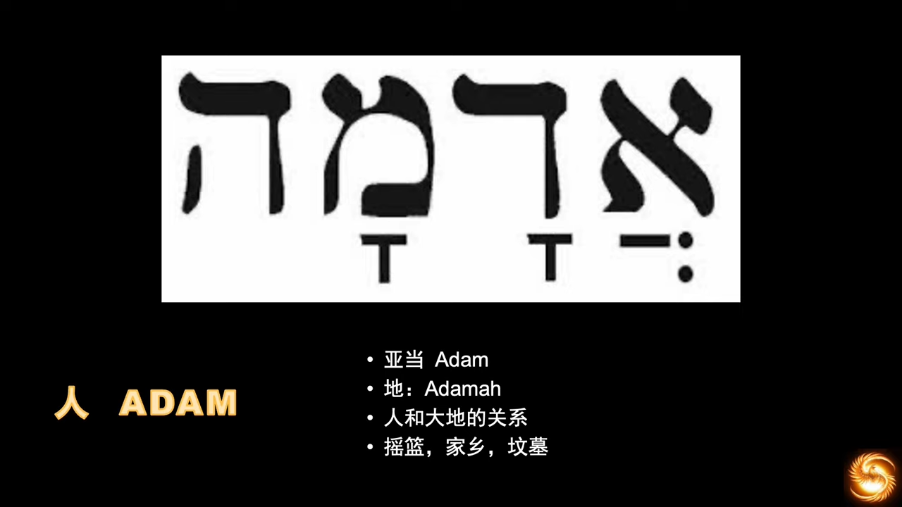

土地是人的摇篮，也是人的坟墓。人是最后造的人，所以人对自然的认知有局限，严重地依赖上帝的启示，因为神造万物时亚当并不在场。科学的使命，是认识神，认识神的创造，并将荣耀归于神。

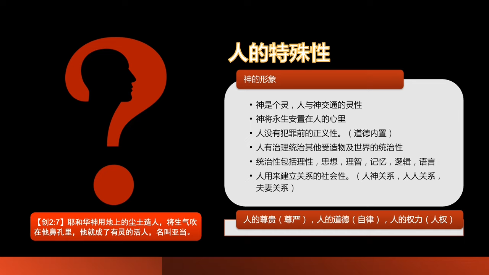

人的独特，人的内心有天然的宗教情感，有寻找神的冲动。人内心有道德秩序，内置了神的标准，人人觉得有道德是高尚的，这本身是进化论的障碍，在进化过程中，道德是阻碍。任何的人间宗教，都是人向道德属性的诉求。魔鬼利用人的“道德感”作恶。管理，是人的天然属性。建立关系的社会性。伊甸园里三种关系，人神关系、人人关系、夫妻关系，所有的人际关系皆派生自这三个。

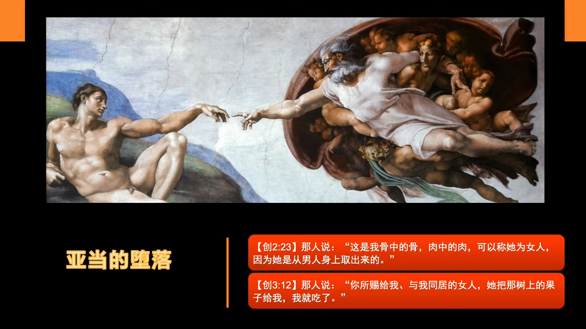

亚当，历史上第一个人，犯罪前后的区别。第一个发出婚约誓言的人，亚当知道夏娃和自己是一体的，对夏娃完全接纳，但又甩锅给妻子，面对神的质问时试图躲在妻子后面。教会作为神的家庭，若要兴旺，男人首先要归正，弟兄需要挑起大梁，家庭若要蒙神的喜悦，男人要起来做头。

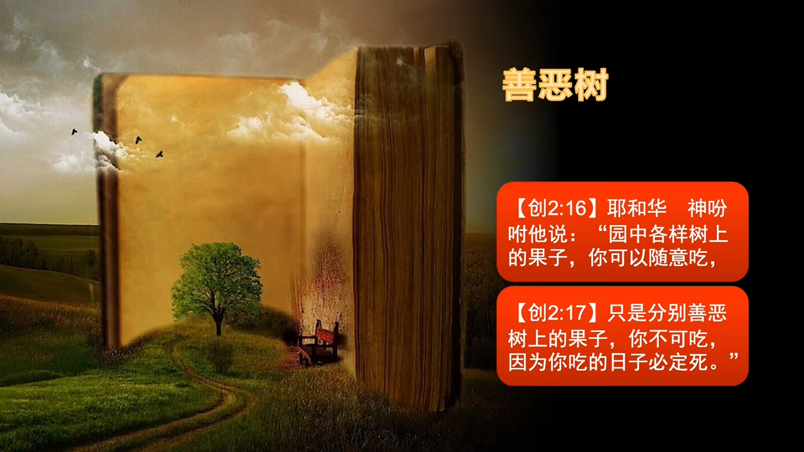

建立秩序、规则、法律。善恶树的果实不能作为食物，宗教不能变成谋求食物的工具，不能把上帝的真理，公义和爱作为谋取利益的工具，若这样的话，就会演变为利用真理、公义、爱去践踏别人。就像耶稣批评法利赛人。

> 他们把沉重而难以负荷的担子捆好，放在人的肩上，自己却不肯用一个指头动一下。 (玛 23:4)

夏娃看智慧果“好做食物”，从那一刻始，对真理的追求出现了偏差，以食物为标准，以情欲为目标，然后炫耀自己的权柄和智慧。有了钱和权就特别想让曾经看不起自己的人们知道，“衣锦还乡”。

> So when the woman asaw that the tree was good for ***food***. (GENESIS 3:6)

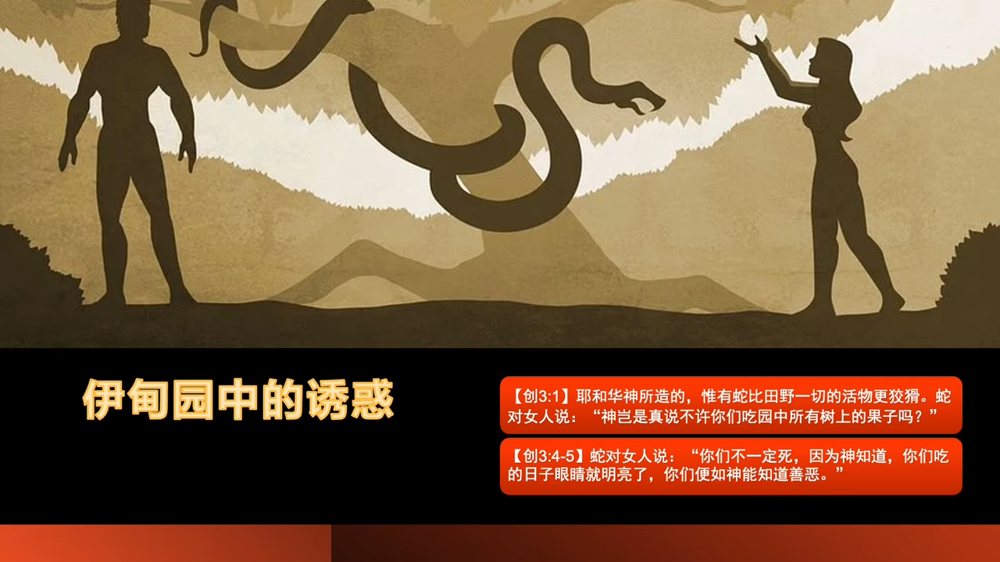

“如果这个世界有神，那为何神会允许那么多灾难的存在呢？”，撒旦开启了“怀疑主义”，引导人怀疑神的善意，并无视“神是创造者”的这一事实。堕落了的人，在“认识神”这件事上就不可能再有肯定的判断，都成为了怀疑主义者，除非被神光照。

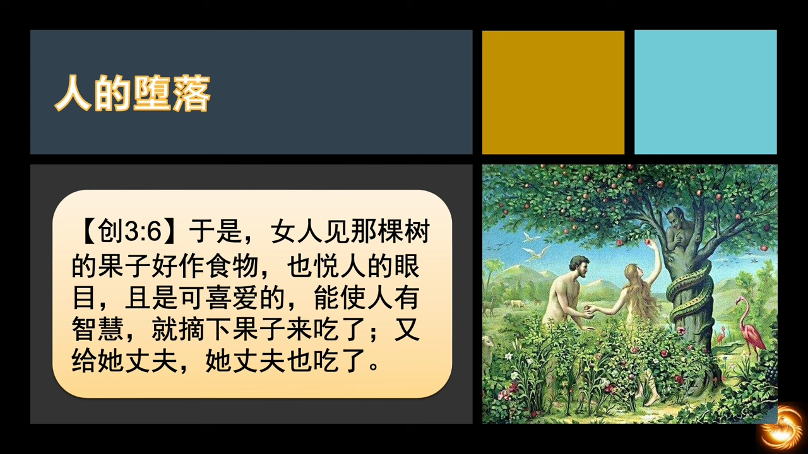

魔鬼是“善意的、温柔的，人本的，让人自行思考自行决定的”，而上帝是“决断的、扎心的，是完全的宣告”。于是在“人本主义”的选择中，人永远是选择魔鬼弃绝上帝的，这句话包含了所有的“xx主义”的思想。

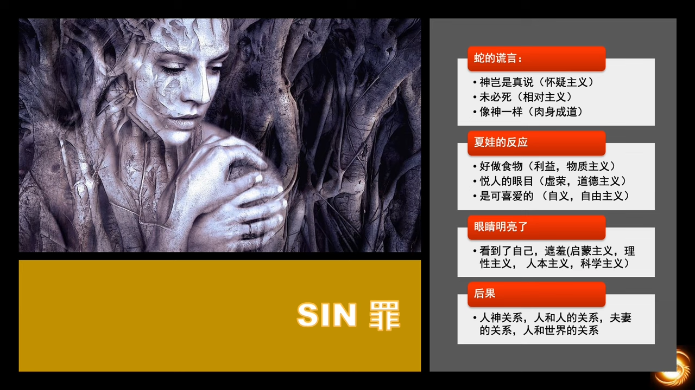

现代社会的两大主义
- 怀疑主义：“神岂是真的这么说”；
- 相对主义：“吃了善恶果未必会死”，把神的命令相对化，我们现在就身处这样主义的时代；
- 肉身可成道：立地成神，无神论。

夏娃的反应也是人类历史反对神的三大动机。“眼睛明亮了，看到了自己”，启蒙主义。“人本主义，以人为本”，吸毒可以合法化，甚至立法保护吸毒要吸得安全。“用无花果叶子遮住身体”，即科学主义。

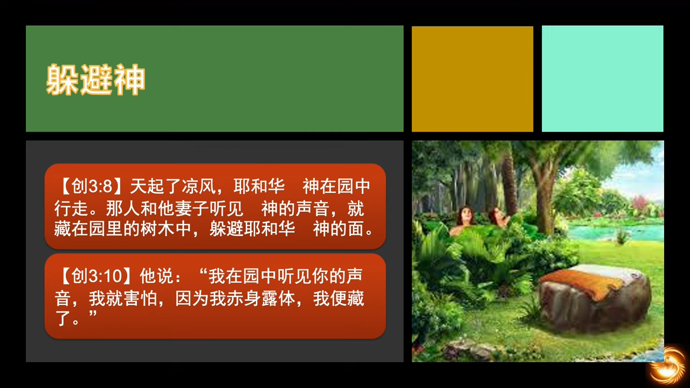

“即使用了无花果叶遮体，仍然要躲避神”，人在理性主义上的沉沦，始终只靠自己的理性，而不愿意面对神。比如有病人，你告诉他某贴中药有效，他会立即去买来尝试服用，但你若告诉他信耶稣也有效，他要和你辩论半天，甚至嘲笑你远离你。

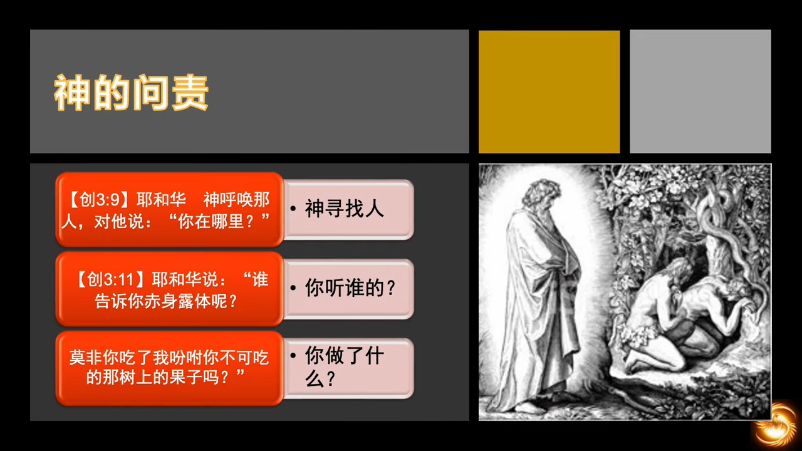

信仰，也是神寻找人的信仰，启示的信仰。人必须要正视自己的罪。

- 你是谁？
- 你听谁？
- 你为谁？

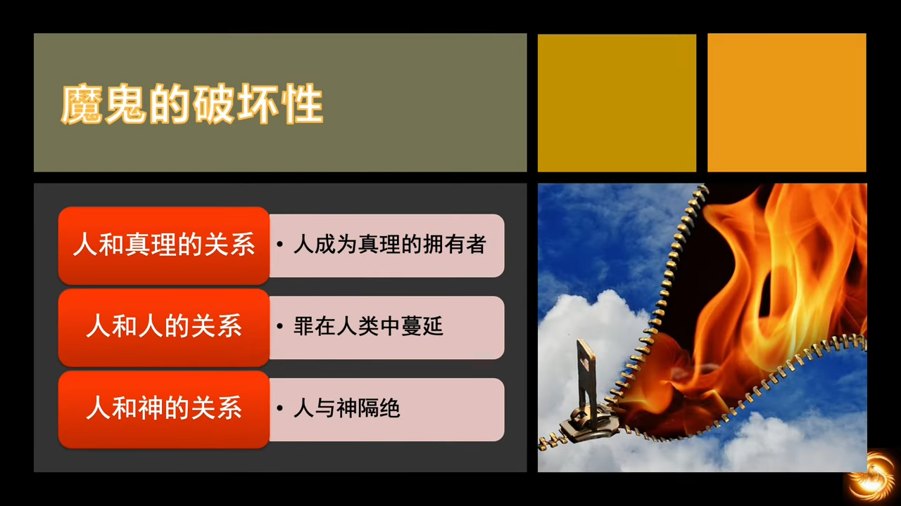

最大的破坏，人不再顺从于真理，人成了真理的拥有者，人成了真理判断的主体，试图替代神的位置。无花果叶子遮体，预示了人和神开始隔绝了。

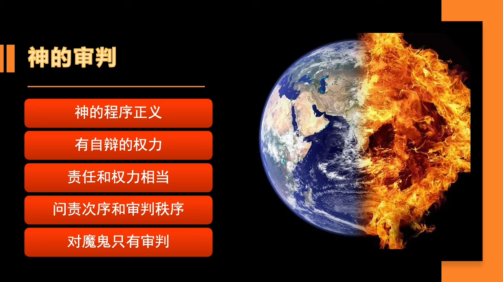

上帝若没有公义，则不会有慈爱。

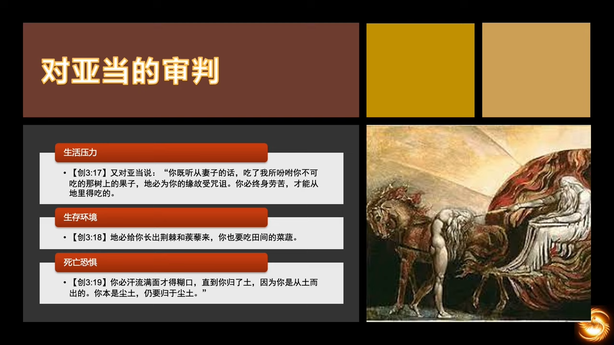

“归于土中”，宣判了人类的死亡，伊甸园中本不会死亡。

> 你必须汗流满面，才有饭吃，直到你归于土中，因为你是由土来的；你既是灰土，你还要归于灰土。(创 3:19)

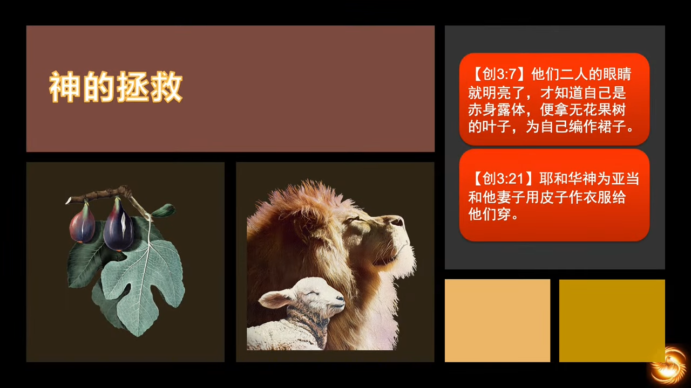

“无花果叶遮体”，人开始用受造物来解决问题。有的人选择赤身露体上街，宣告自己拜托了罪恶感的捆绑。有的人选择在神面前悔改，披上了羔羊的皮，用重生的生命，替代罪恶的老我，在世界上过一个得胜的生活，这就是“光和暗”的分别。

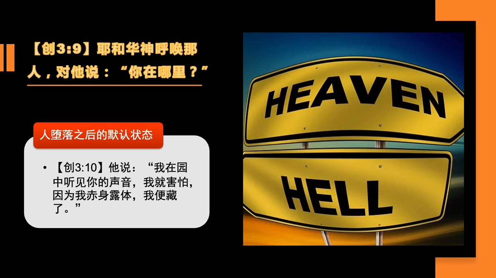

上帝不可能不知道人在哪里，但人躲避神是默认状态，否定了“人寻找神”的宗教流派。

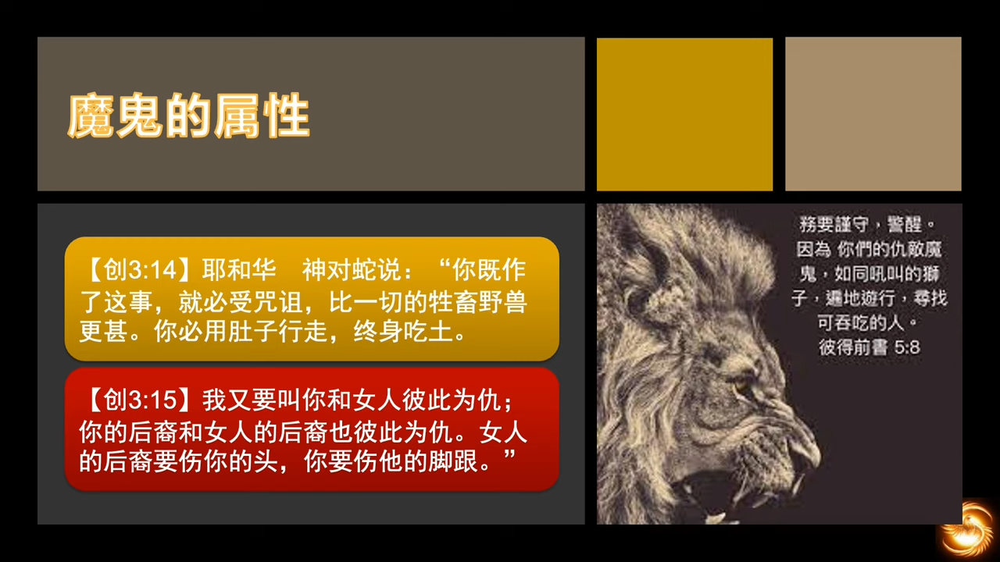

魔鬼不可能被救赎，上帝只救赎罪人，所以神不给蛇任何辩解的机会，直接审判。所有人类，只有耶稣基督是女人的后裔，其他所有人都是男人和女人的后裔，所以魔鬼被耶稣基督践踏和审判。

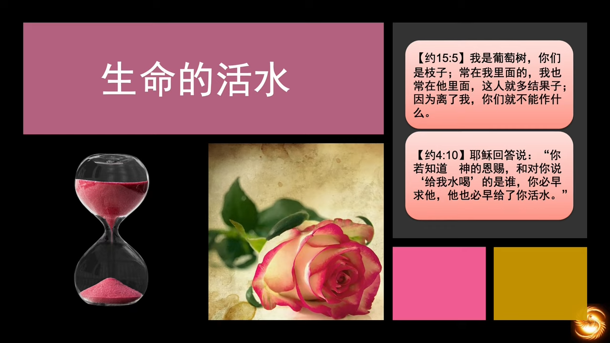

只有耶稣是生命的活水、信仰的根基、世界的来源、终极的盼望，所以让我们赞美祂。