# （主日学） 圣经 旧约纵览
## (主日学) 03 旧约纵览 大洪水审判世界
https://www.youtube.com/watch?v=6XJpHenbAMk&list=PLfChJ-aSv3VAinEkn7v-SM0gFk_a2iMDL&index=23

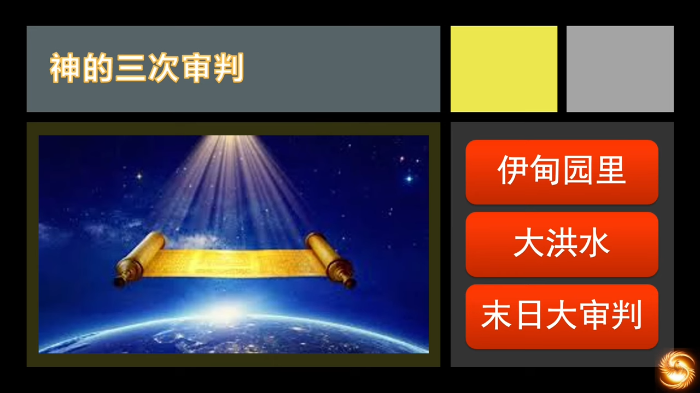

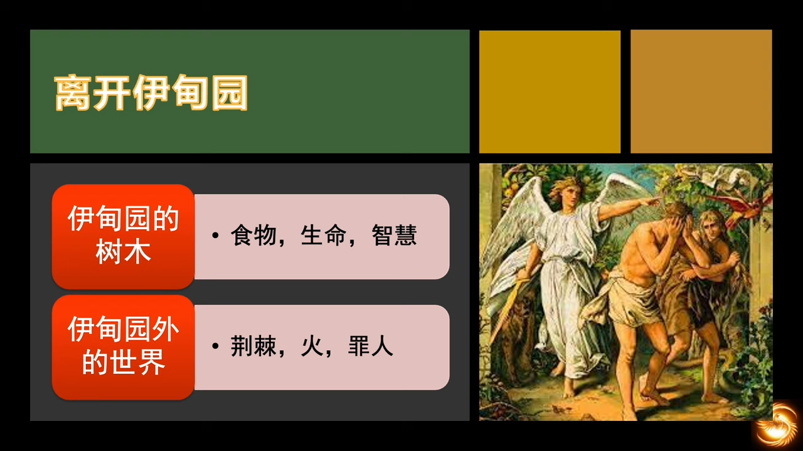

智慧，以神的禁令的形式出现，遵循神的原则，才是善恶的核心原则。人将智慧和食物混为一谈，对真理的判断出现扭曲，会出现纷争。启示录中，上帝的审判也是通过火。

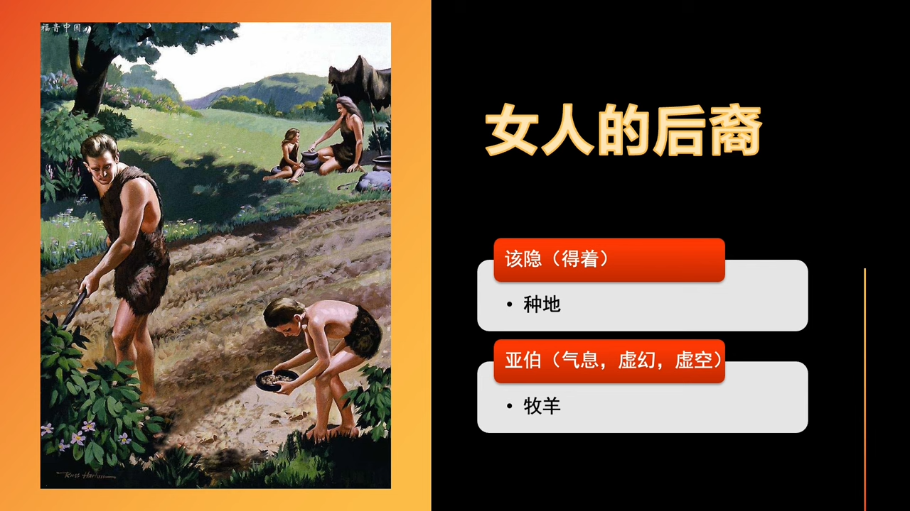

“人通过献祭可以亲近神”。

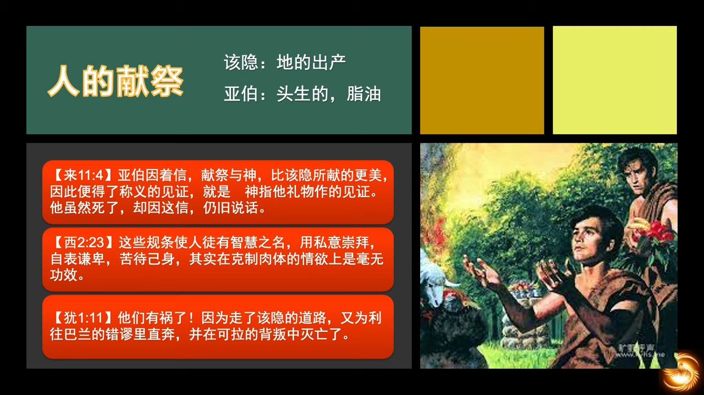

神并不悦纳该隐的献祭，该隐无视了他的父母从神那里得到的启示，用自己理解的方式来敬拜神，人类第一场自由主义的献祭。人在饱食之余，会考虑到对神的敬拜，会盼望和神来往，该隐的献祭象征了人本主义的宗教。

旧约，按照神的指示去献祭；新约，按照基督的教导去做事。新旧约的信息是一贯的，所以一定要“信”。

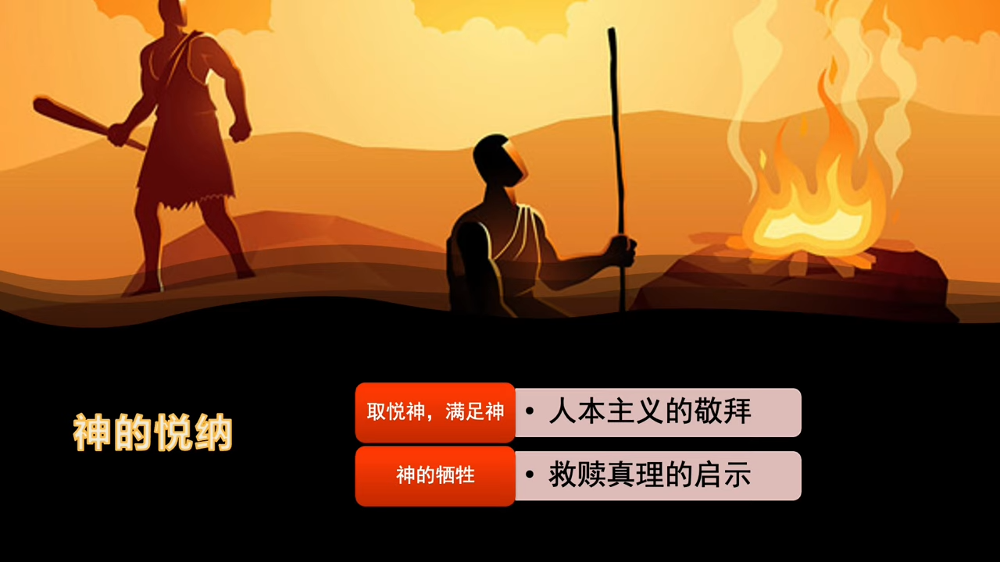

神一无所缺，神说：“听命，胜于献祭”。神为全人类的救恩，是弥赛亚的死，使被拣选的人，得着救赎。新约告诉我们，福音的真理，在世人眼里是愚拙的，是不被人理解的。

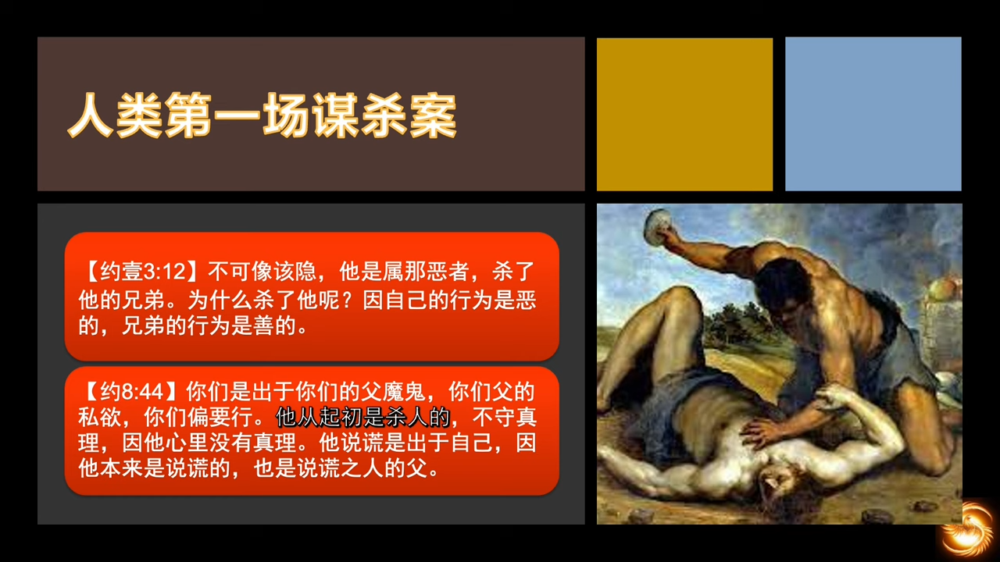

罪人的嫉妒心，所有的罪人都痛恨上帝拣选的人，所以上帝的选民会觉得不合群，会觉得孤独，以利亚就曾向上帝抱怨。属灵的和属血气的。人的罪的第一次的外在表现，隐含了人类的悲剧，罪人用无穷无尽的“得着”去杀死内心的“虚空感”，每个人都过着“该隐杀死亚伯”的人生，所以需要很多无意义的使命感、道德感、成就感、幸福感来行着欺骗。本质上都是用“得着”去赶走“虚空”。

该隐在杀人后面对上帝的质问，充满攻击性的回答。以攻为守，例如，“你们的上帝若是无所不能的，那你叫祂让我信主啊？”

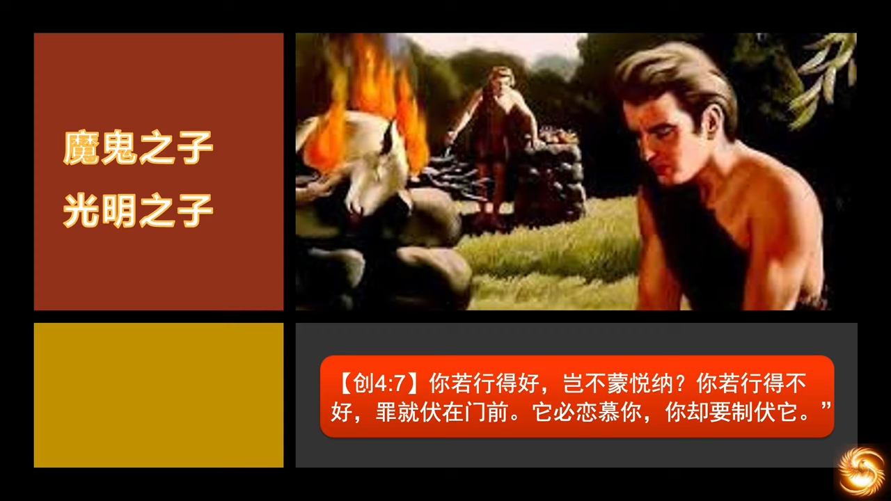

人是有责任控制自己的罪的，如果嫉妒不被约束，就会发展为大罪。人如何回应神？

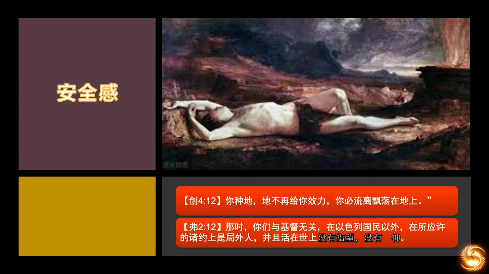

该隐说刑罚太重，并不是认罪，只是出于自怜的哀怨，表示了人类不肯悔改是常态。忧伤只是因为审判的结果对自己造成了困扰。该隐被神弃绝，因为神的原则是人要为自己的行为负责。

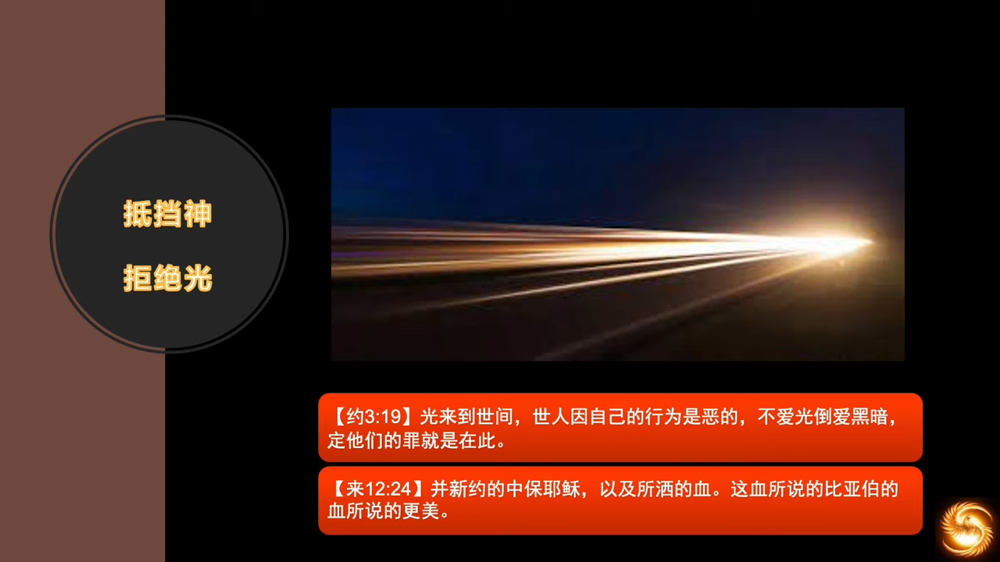

这个世界真正追随的基督的人，永远都会受到逼迫。要警惕成为人见人爱的人。

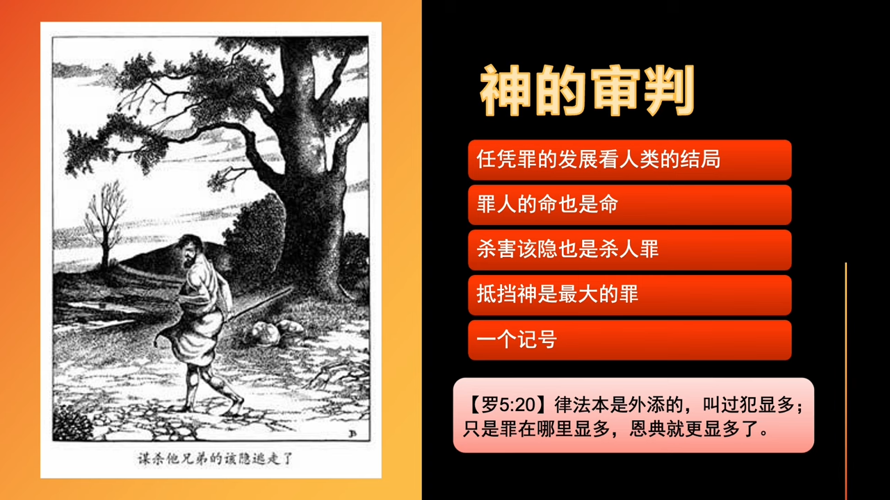

人类历史的第一次死亡，并无律法规定“不能杀人”，人在没有律法时是看不到自己的罪的，人日益残暴，引来了大洪水。“杀人偿命”在大洪水之后才有。

该隐是人类自然繁衍的第一个孩子，也是第一个属于撒旦的人，第一个被神弃绝的人，第一个杀人犯，第一个被神宣告灭亡的人。

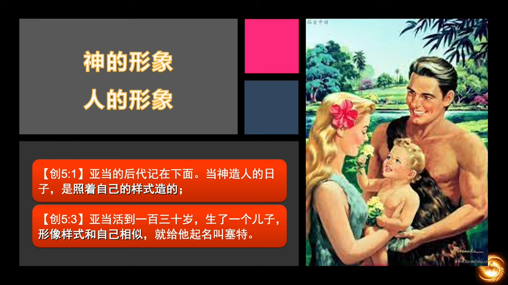

行善是“重生”的结果，而不是“重生”的条件，被圣灵重生的人，即恢复被神造的形象。

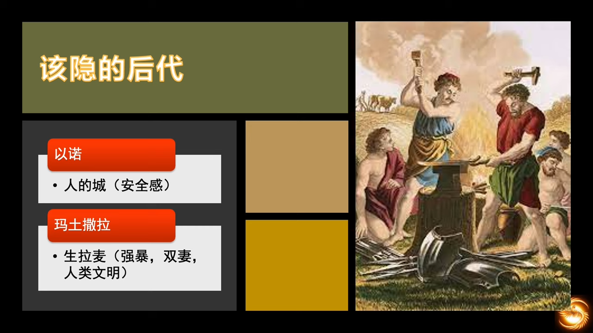

生死问题不是该隐家族的主要问题。人类文明的开端。

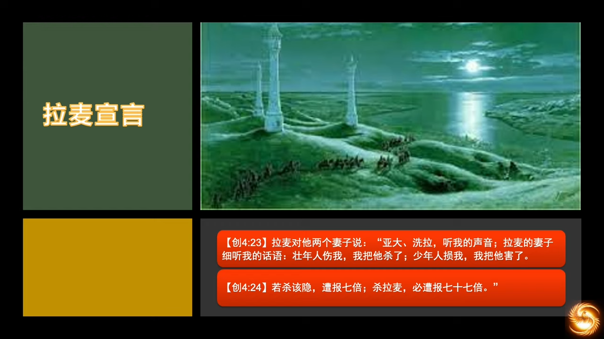

拉麦用自己的咒诅取代了神的咒诅，并进一步夸大。神的怜悯到了罪人手里被拉麦亵渎为放纵的理由。神赐给人自由，人用自由来堕落。拉麦加倍了神的咒诅，人靠自身不可能出现饶恕和怜悯。权力恶性膨胀，无信仰，对女性的控制沦为“拉麦们”的信仰和荣耀。

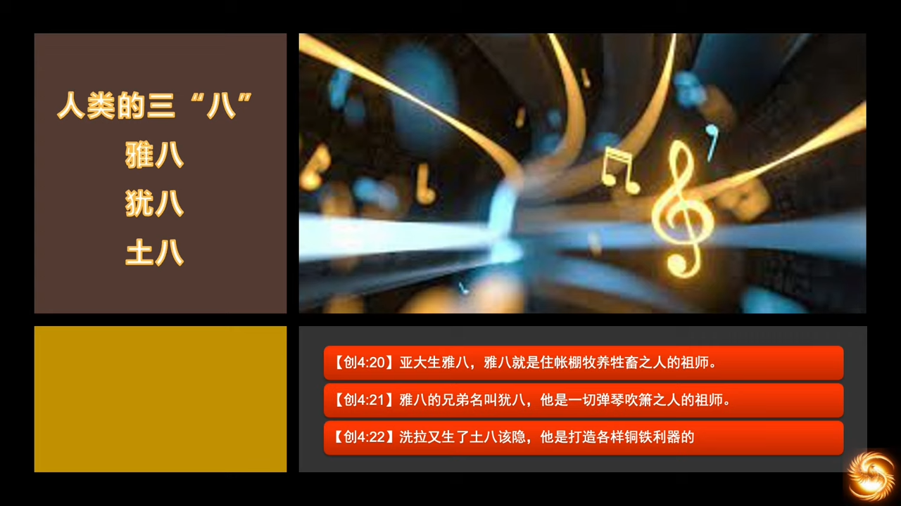

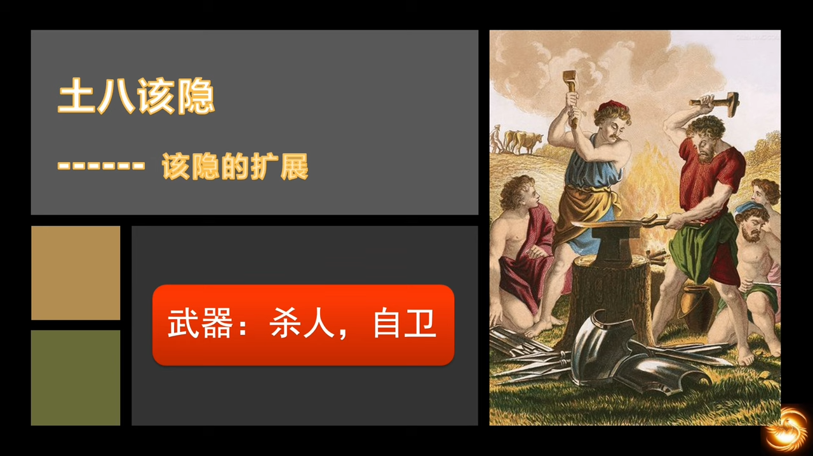

人的发明为了取悦自己，失去神的供应，就会自己发展出无神文化，来自我防卫自我陶醉，每个人都以自己的需要为中心。虽然该隐家族创造了光辉灿烂的物质文明和世俗文化，但伟大的人类文明并未导向爱和和平的社会，也未导向永生。人类历史证明了，没有信仰的社会群体中，不可能自发走进现代文明。原发性的文明，均出自基督教国家，非基督教国家的文明，均为输入型文明。中国文化中的“仓廪实而知礼节，衣食足而知荣辱”是人类自己的想象，是不可能实现的。

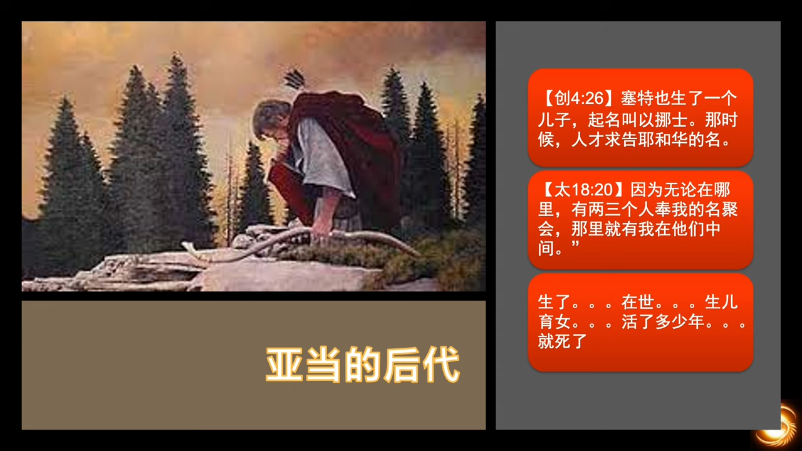

救恩从塞特一支开始，该隐的后代被神弃绝了，也说明“全民得救”理论是荒诞的。

> 生了……在世……生儿育女……活了多少年……就死了。

这就是我们人类的总结，在这描述之外的是人靠自己的心意所行的事，无论有多辉煌，对神无意义，所以神不做记载。换一个角度，选民在人类文明文化上，并不会比外邦人更强；在德行上，也不会比外邦人更有益。所以得救靠的都是神的恩典，而不是自己的行为。

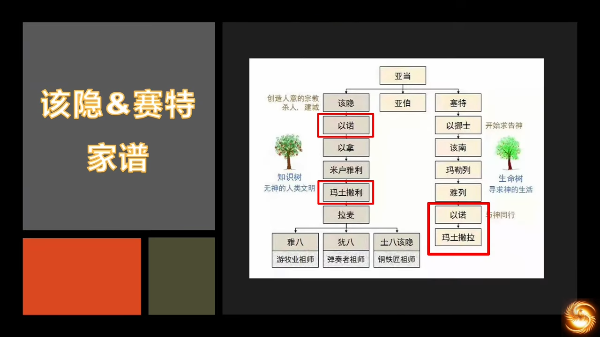

该隐后裔和塞特后裔中都有*以诺*和*玛土撒拉*，记载着人类两条脉络的发展，恶人和义人，魔鬼的儿女和神的儿女。世界上一直有两种人，“信的”和“不信的”，教会里也有“麦子”和“莠子 (稗子)”。圣经中有大量人名和地名的重复，提醒我们仅仅通过人名和地名去确立时间和空间是靠不住的，考古学是靠不住的。

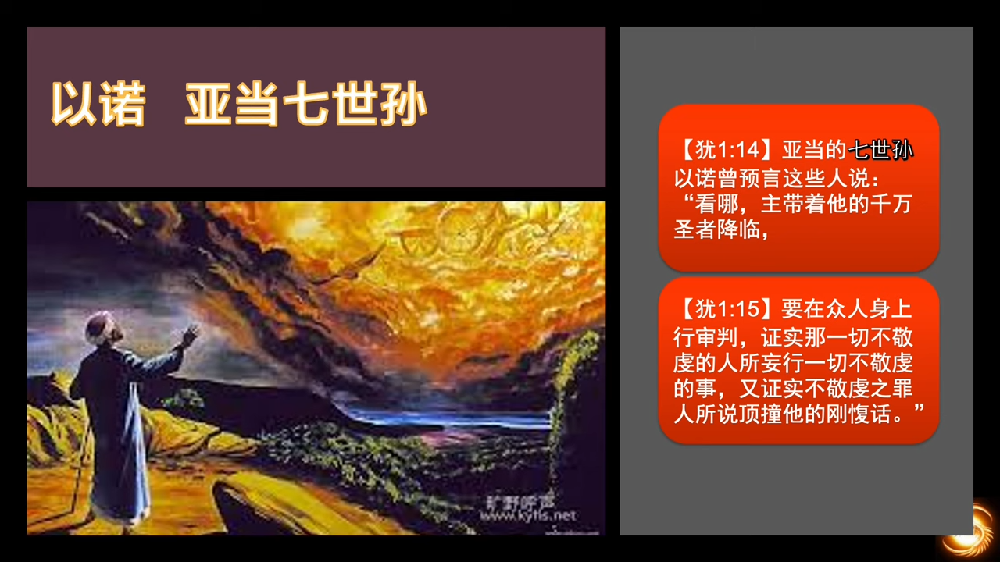

“与神同行”在旧约中出现四次，有两次是用在*以诺*身上，一次用在*诺亚*身上，还有一次用在利未的祭祀身上。

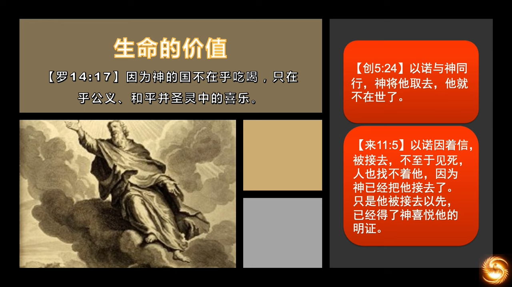

不管寿命长短，最重要是一生都为主而活。玛窦福音告诉说，“不要去求外邦人所求的”，主耶稣说，“你们不可效法他们，因为你们没有乞求以先你们所需用的，你们父早已知道”。所以要为自己所拥有的一切感恩。

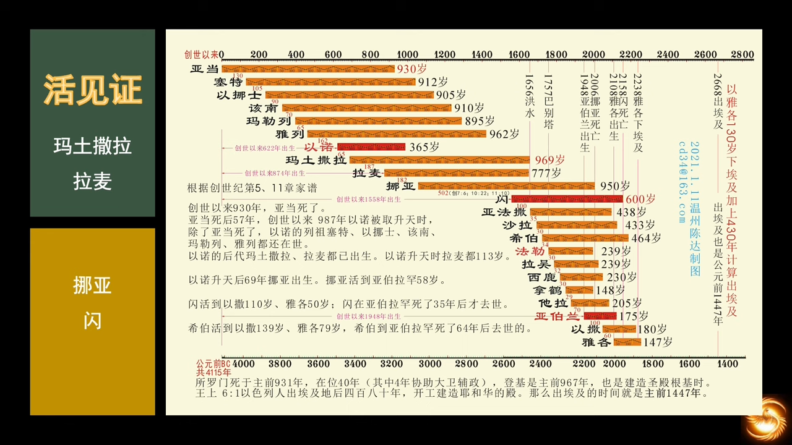

玛土撒拉和拉麦是直接从亚当那里听到关于伊甸园的故事。诺亚和闪不仅是大洪水之前的时代的见证人，他们还从玛土撒拉和拉麦那里直接听到过亚当的见证，消息只经过两次传递。雅各五十岁时，闪才去世。诺亚和闪活得足够久，使创世以来的历史，可以告诉足够多的后代。“幸存者偏差”，有影响力的多为长寿者，反例是耶稣基督。每一次的口传，圣经都安排了两位见证人，旧约的见证人是需要两个人，犹太人审判耶稣时，找不到两位见证人，急坏了。基督本人也说，“有两三个人奉我的名祷告，我就在你们中间”。启示录中也是两个见证人。第一场自然死亡是亚当，第二个是以诺（没有死亡），离开世界有两种方法。被圣经仔细记录下的年龄，藏着神的奥秘。

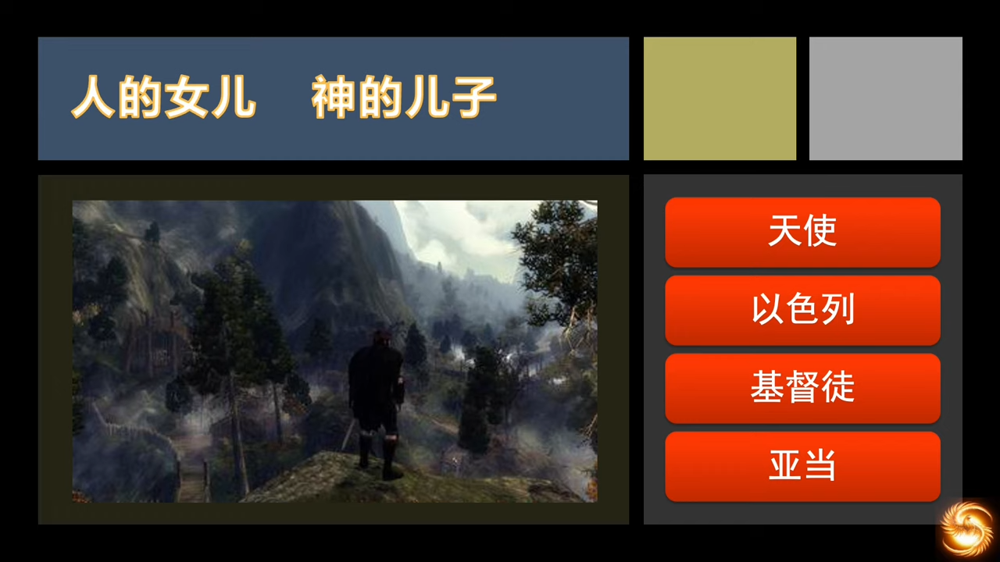

塞特的后裔，信靠神的人，和该隐的后裔通婚了。塞特的后裔出现了严重的宗教退步，开启了罪恶泛滥的过程，招来了洪水审判。

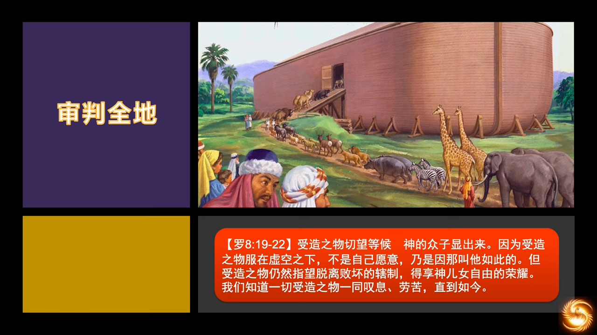

诺亚传道120年，建方舟也是120年，无人信他。所有受造物都是因人的缘故而造的，人在神面前失去了活着的意义，连带着因人而被创造的万物也失去了存在着的意义。为了动物和气候去限制人的权力，是为伪善。基督徒因为爱主的缘故去爱护动物保护自然珍惜资源，是出于管理世界的责任。目的不同，过程不同，管理伦理也自然不同。

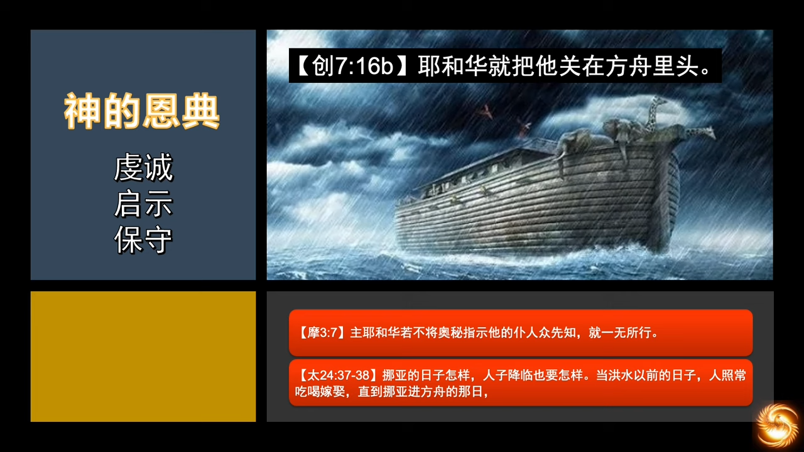

世界从此划分了两种人，一种是被神关在方舟里的人，一种是被洪水淹没的人。

诺亚之前，只有献祭，并未出现过祭坛。诺亚传道没有人听，可能是因为当时没人见过雨。

> 地上还没有灌木，田间也没有生出蔬菜，因为上主天主还没有使雨降在地上，也没有人耕种土地， (创 2:5)

> 因为还有七天，我要在地上降雨四十天四十夜，消灭我在地面上所造的一切生物。" (创 7:4)

大洪水之前，人不知道雨为何物，且洪水前人的寿命长，成熟期很长，生殖期也很长，人口的繁殖非常迅速，指数级增长，大地的出产最多只能线性增长，于是出现了资源掠夺。

彩虹，来自于阳光和水。水象征着审判，光是神的应许。在水的审判和光的应许之间，我们和神的约定就此展开了，两者之间的广阔空间，即为我们的一生。

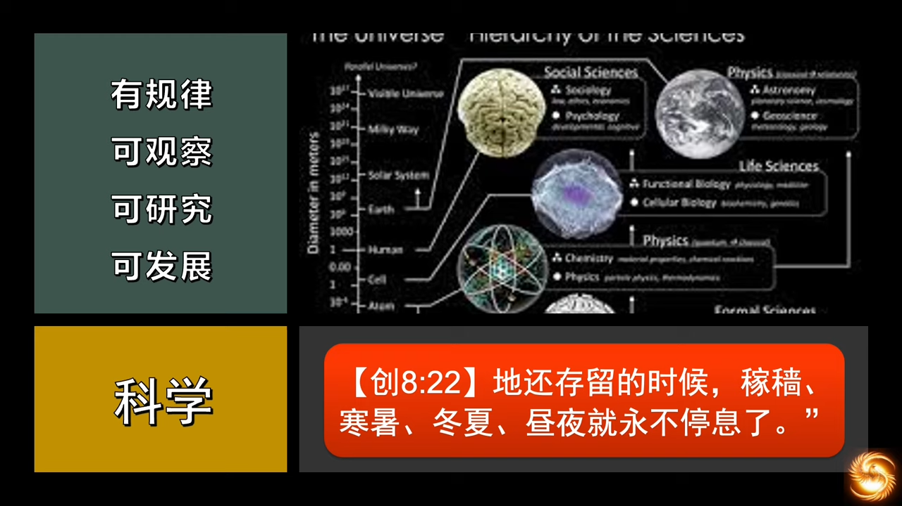

这句话激励了世界上无数的科学家，去发现去探索神的规律。若宇宙是随机产生的，何来规律需要研究？

科学之所以可以发展，是以神为前提的。宇宙的奥秘是神，神的奥秘是基督，基督的奥秘是教会。圣经将宇宙的精华启示给我们，但人留恋宇宙的外表，留恋宇宙运转的精妙，留恋人的理性探索带来的世俗满足感，这是罪人普遍的表现。被罪人掌握的科学，就一直被拿来挑战圣经。而圣经，是宣告的，圣经的态度是“你爱信不信”。

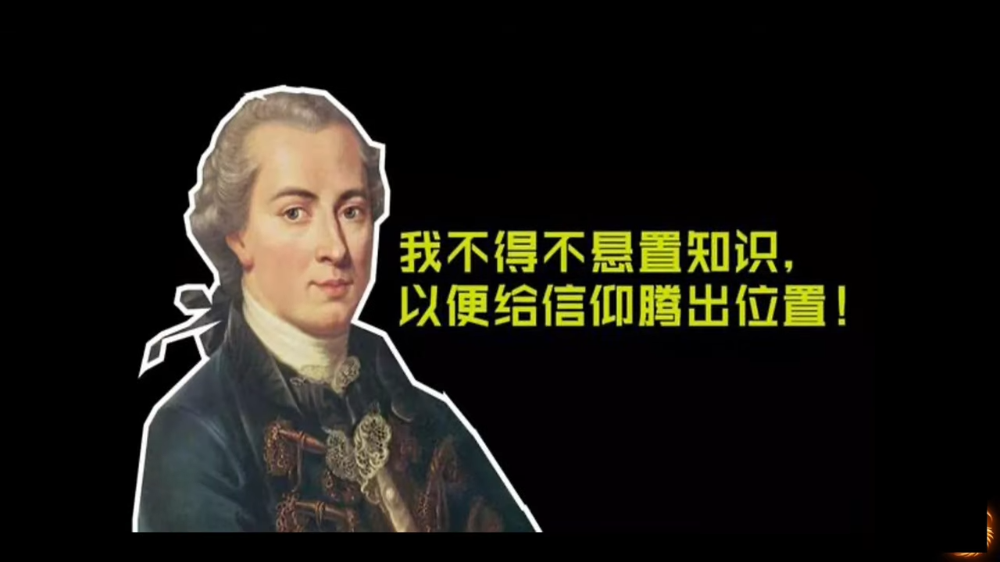

虽然康德的信仰状况复杂，但这句话道出了信仰的本质，信仰是心里之需，和物质世界无法对立，因为本就处于不同维度。让我们简单相信，一生追随。