# （主日学） 圣经 旧约纵览
## (主日学) 04 创世记3 -- 神的拣选和再创造
https://www.youtube.com/watch?v=yFeMVY9XUBY&t=3005s

神从罪恶中进行再创造。

关于生命的拣选，通过食物的命令，新约和旧约形成完美的闭合。

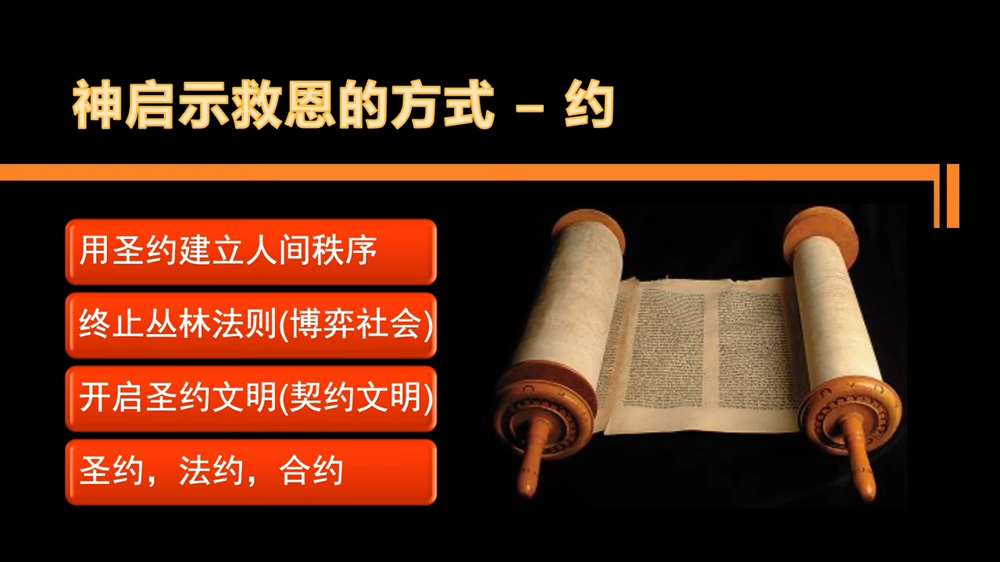

“约”，每一个人的理性，在时空维度上平等的。所以一个人无法真的说服另一个人，只有从更高维度的圣约才能帮助建立人间秩序，只有神的圣约，可以让人臣服。在圣约的社会中，才会演变出法律，法律本质上就是“约”，达成共识的“约”。没有圣约的社会，会陷入囚徒困境的恶性循环。道德的来源是上帝。佛教不能建立秩序，因为佛教没有“约”的概念，佛教认为一切人间皆为虚幻，消灭欲望消灭自己，无我。佛教认为这个世界是从无到有，所以我们要回归到无。这个思想和进化论是符合的，无神论容易接受佛教思想。基督教是自有永有的神创造了万物，是一个从有到有的过程。

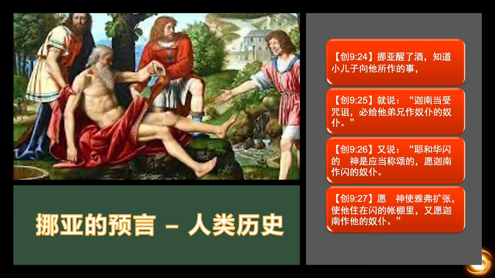

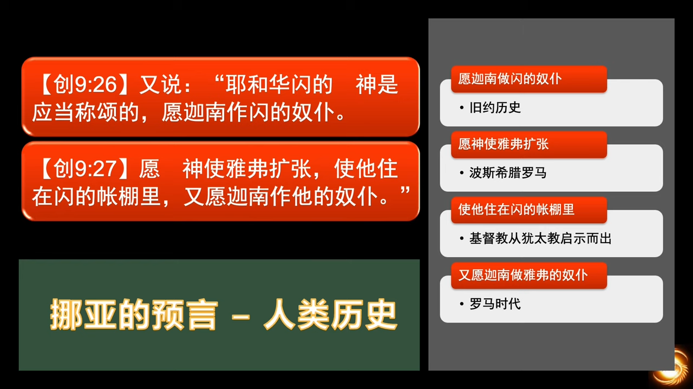

- 迦南做闪的奴仆：在旧约所罗门时代已实现；
- 雅弗扩张：波斯希腊罗马统治时期，发生在两约之间，目的是“大小山岗全部磨平”，因为神的儿子要来临；
- 雅弗住在闪的帐篷里：基督教从犹太教的启示而出，基督教没有成为犹太教的支派，没有延续希腊教的宗教传统，而是合二为一；
- 迦南做雅弗的奴仆：罗马帝国时代，囊括了整个地中海地区。

神通过诺亚宣告了世界的走向，在新约中圣灵阻止保罗去小亚细亚传教，而是往马其顿去，证明是同一位圣灵在领导我们。

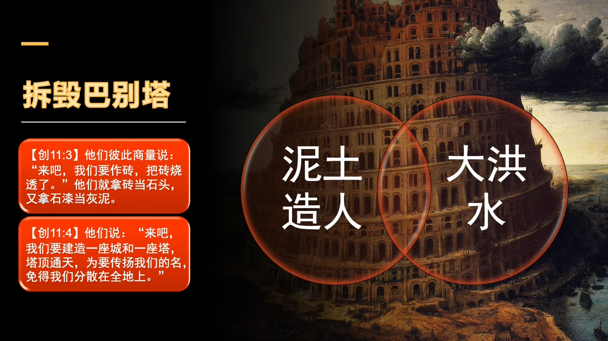

巴别塔，用自己的材料，建立自己的救赎方式，和亚当用无花果叶子遮体是一回事，目的是为了传扬“人”的名。这违背了神的意愿。人希望靠自己努力，但若没有神，人如何得知自己努力在正确的方向上。

> 天主祝福他们说："你们要生育繁殖，**充满大地**，治理大地，管理海中的鱼、天空的飞鸟、各种在地上爬行的生物！" (创 1:28)

> 然后彼此说："来，让我们建造一城一塔，塔顶摩天，好给我们作记念，免得我们**在全地面上分散了**！" (创 11:4)

神喜悦的是分散秩序，人的目标是塔顶通天。大一统，人多力量大，集中力量办大事，挑战神的权威。神让人的语言不同，从此人作恶的能力就减慢了。板块漂移学说可能发生于这个时期，这也解释了为何不同地区的人类创世神话中都有“泥土造人”和“大洪水”，这是人类对这段历史的集体记忆。

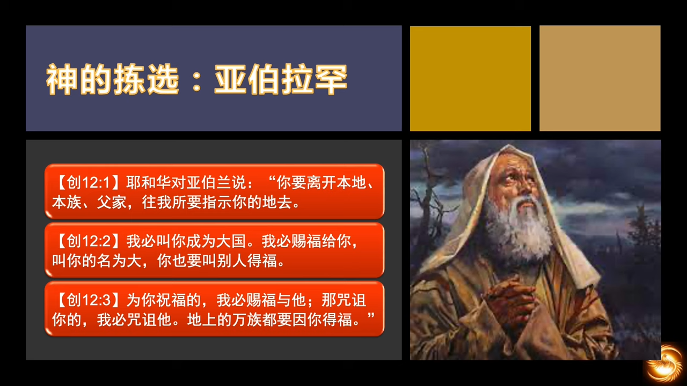

凡是接受了基督教信仰的国家，都是被神祝福的国家，就连现世的生命，也更文明和富足。拒绝了神的那些国家的命运就比较艰难。

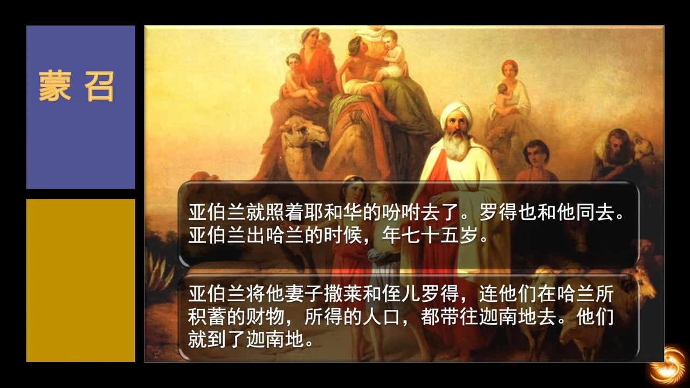

离开本地，亚伯拉罕做到了；离开本族，亚伯拉罕没有做到。听神的话听一半，是因为亚伯拉罕有私心，他没有子嗣，将罗得视为继承人，但罗得的后代给以色列人带来非常大的困扰。

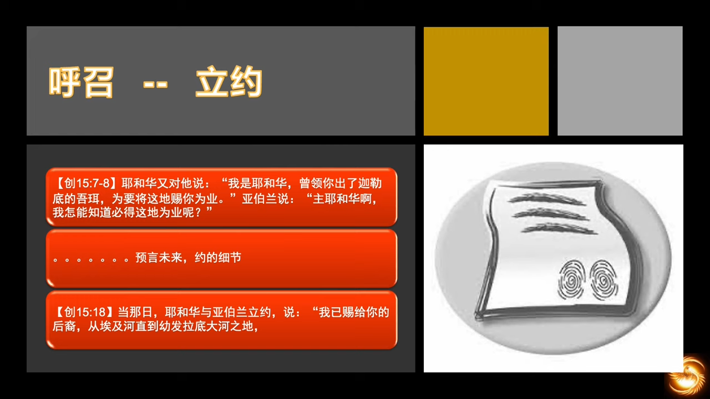

神是立约的神，建立秩序，在秩序中完成救赎。

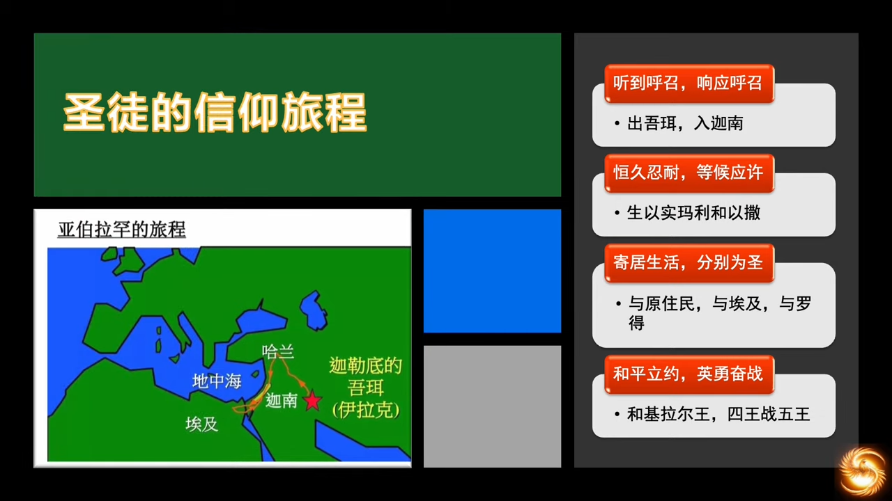

人有软弱的时候，人的信仰和神的旨意之间有巨大落差。只有神所赐的才是真正的后裔。当人有了财富，人和人的纷争就开始了。人都会和自己的父家告别，放下携带的牢笼，重新面对应许地的旅程。

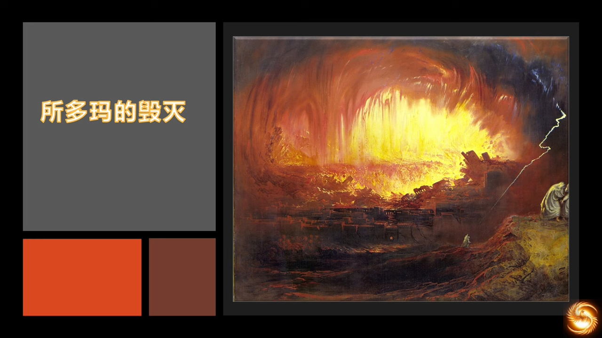

通过对这个世界的索多玛现象的观察，来判断末日到来的脚步，已经很近了。我们的得救，被天使从世界中救出，不要以为是因为自己的善举，是因为那些为我们祷告的人，神垂听了他们的祷告，是神的怜悯让我们得救。不要学罗得，得救了仍不进应许地，最后成为神子民的仇敌。

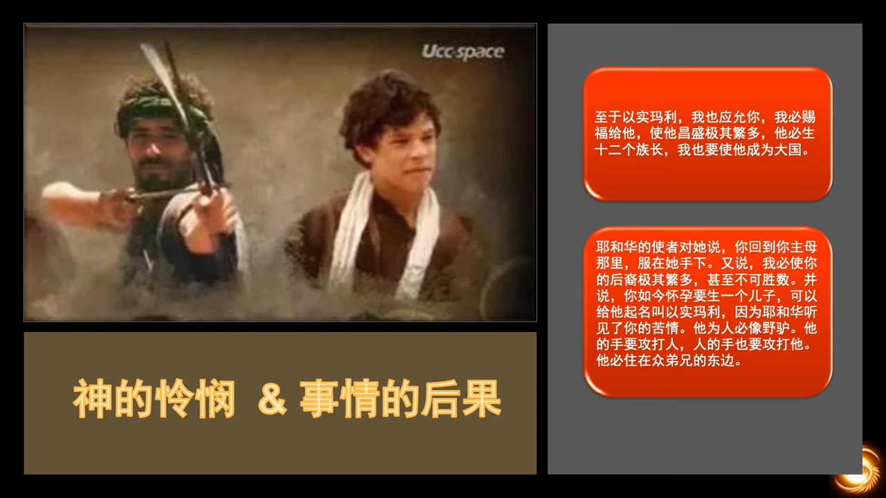

以实玛利，是亚伯拉罕靠自己人的办法解决问题，属血气的，很勇猛，神还是有祝福的，大民族。穆斯林群体和以色列争“选民”的身份是一个矛盾，若依据圣经，圣经中写明了以实玛利不是神应许的后裔，神拣选的是以撒；若不依据圣经，又如何能强调自己“亚伯拉罕长子”的身份。

任何人，若不相信耶稣基督这真神，又生活在神创的世界中，就一定是矛盾的，且自己无法意识到这矛盾。从以实玛利的事情说明，人的罪，神会赦免，但因人的罪出现的后果，神仍会任其发生。例如罗得的后裔、以实玛利的后裔。

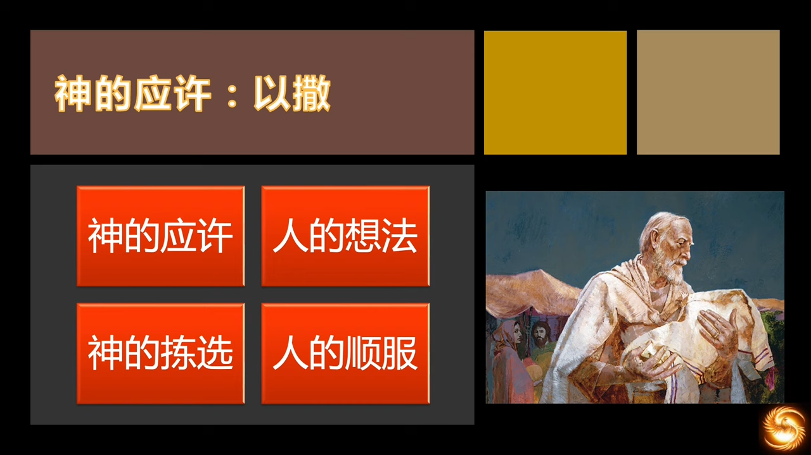

> 在方向上听从神，在方法上顺服神，

才会得到应许的救恩。

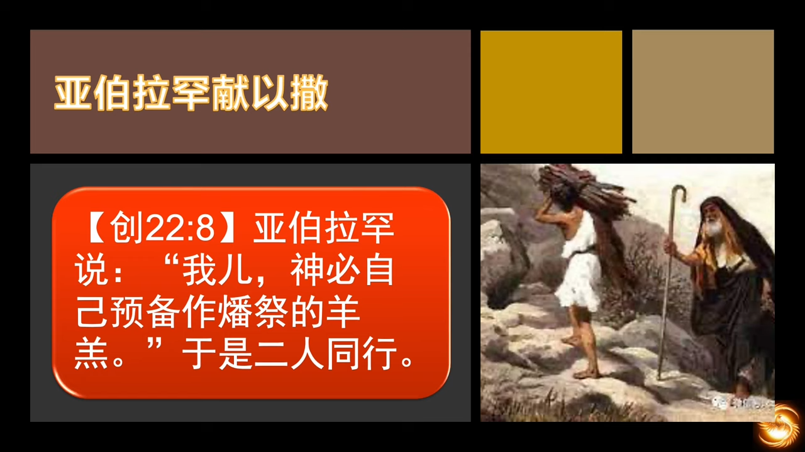

亚伯拉罕和以撒的对话，在神学意义上有神奇的奥妙启示。然后神的羔羊替代了以撒，新约中神的羔羊替代了我们 —— 即神拣选的罪人。

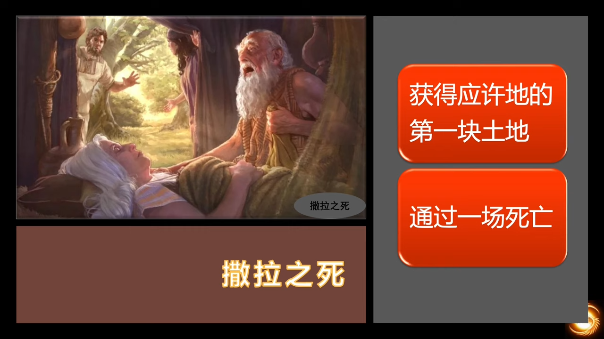

人进入应许，是通过死亡，死亡有了特别的意义。对旧约中神的不理解，来源于人对死亡的恐惧。

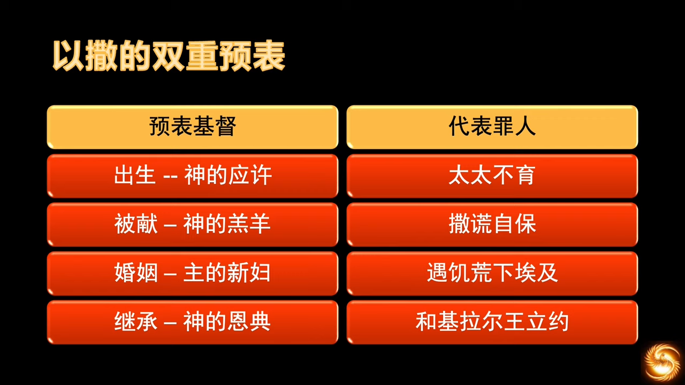

以撒的神学意义，他和父亲亚伯拉罕的相似性，预表了人类身处无法完全自救的罪之中，父辈的错误我们仍然会再犯，以撒的错被神阻止。

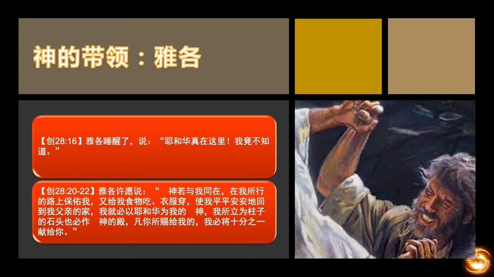

信仰初期都会出现的，有条件的祷告，“如果神能……，我就……”。信仰的起点。

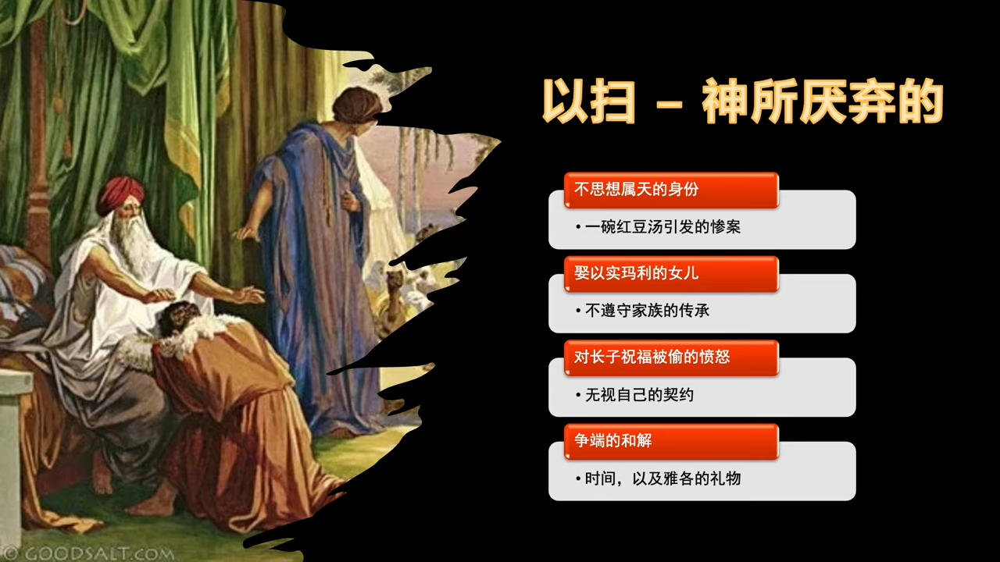

神赐的长子的身份，神的秩序需要被尊敬。对红豆汤的渴慕，对长子名分的淡漠，可见以扫对属世祝福看得很重。从人的角度看，以扫无甚大错，但以扫被神弃绝，雅各被神拣选，彰显了神绝对的主权，由此可见，“全民得救论、普救论”是不符合圣经的。

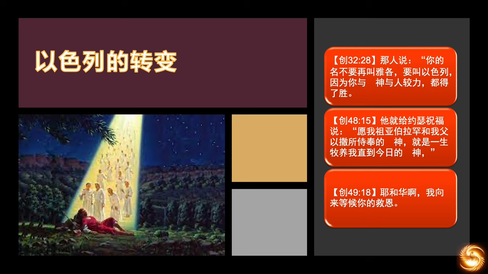

雅各从小骗子到以色列的转变，证明了救恩是从“梯子”到“人子”的过程。我们容易对老板客气，对政客谦卑，对权力和利益低头，但是在信仰上对神很傲慢。神的爱，让雅各觉得摔跤能赢，神摸了一下，雅各就残缺了，感知到了自己的无力，才会真正认识到需要神的祝福。

“清除外邦的偶像，人人自洁”，放弃自己的“老我”，彻底清除自己的旧传统旧思维，倒空自己，进入神的殿。创35章以后，以色列不再行使诡诈，在结尾48章，以色列的祷告：

> 15遂祝福若瑟说："愿我的祖先亚巴郎和依撒格一生与之往来的天主，自我出生直到今日牧育我的天主，16救我脱离一切祸患的使者，祝福这两个孩童！愿我的名及我祖先亚巴郎和依撒格的名，赖他们流传！愿他们在地上生育繁昌！" (创世纪 48)

这是非常大的信仰转变，这个转变过程就是每个人的信仰旅程，也是圣灵的工作，也是我们的使命。我们的使命就是“生命必须改变”，这是神恩典的记号。

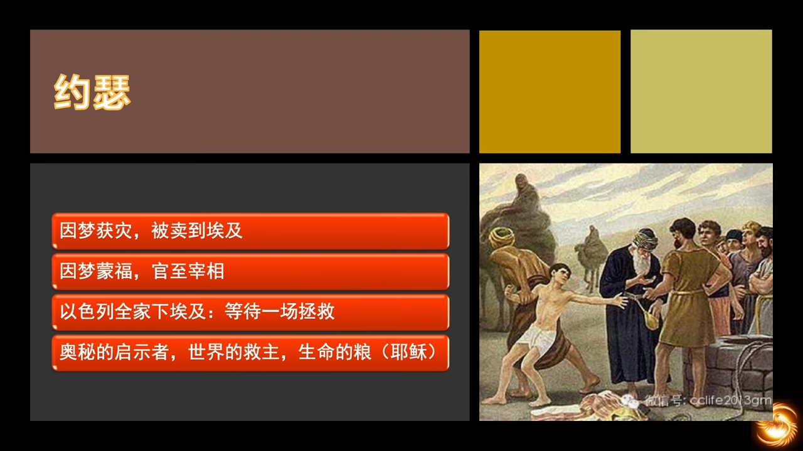

> 亚伯拉罕是神的拣选，以撒是神的应许，雅各是神的带领。

雅各的十二个儿子是旧约历史中的主要角色，后裔成为整个旧约历史的主角。其中有十个在拉班家长大的，耳濡目染了拉班的狡诈和雅各的应对。

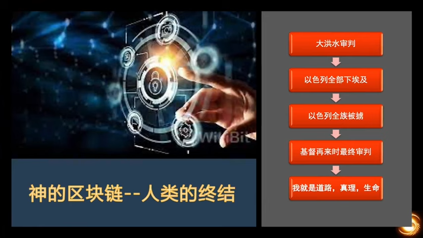

神在每一个角落都留下了重要的信息，“去中心化的区块链”的鼻祖，拆巴别塔就是去中心化。因为罪人无法成为信仰启示中的个人中心，任何由人创建的宗教，或由人的话以人的教导为中心的宗教，都不可能避开人的罪性。所以神的去中心化圣经启示，就是在每一卷书中都有神的记录和启示奥秘。类似于“分形结构”的去中心化的记录，实现了任何人都不可能去篡改神的话语，不能垄断神的话，才使真理在历史中不断传承，任何选民都能在圣灵带领下从圣经中看见这些分散的记录和信息，从而构建自己的信仰体系。

靠自己只能等来大洪水，靠族长带领会被饥荒带回到埃及，靠君王带领会被掳到外邦，只能靠神、靠十字架带领，才能得着生命和盼望。去中心化的多个中心，都指向同一个神、十字架上的神。

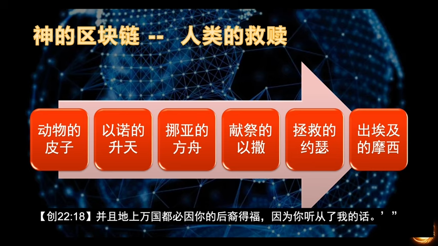

所有信息启示完整之后，摩西带领以色列开启了信仰征程，“听话”很关键。

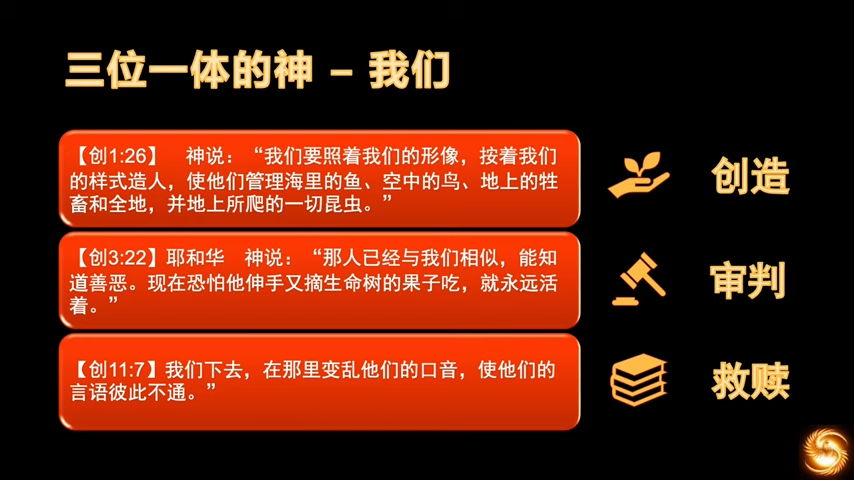

困扰我们的两个字 —— “我们”。三次自称“我们”，在关于人类命运重大事件发生之时，神都用“我们”来自称，创造审判和救赎。

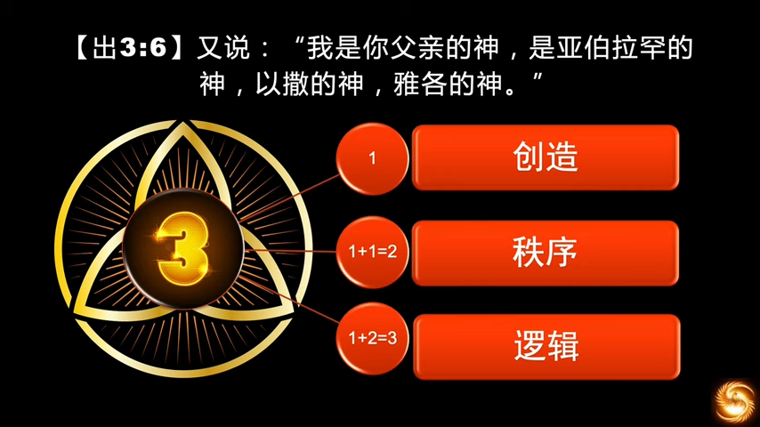

只有0和1的世界，不是完整的世界，神三位一体，我们的世界就必须要有3，科学才能开始，世界才能开始被数学描述，人类的伦理才能被展开，逻辑才能被应用。

- 1是神的创造，从混沌中产生物质
- 1+1=2是神创立秩序
- 1+2=3是神建立推理和逻辑 (皮亚诺公理)

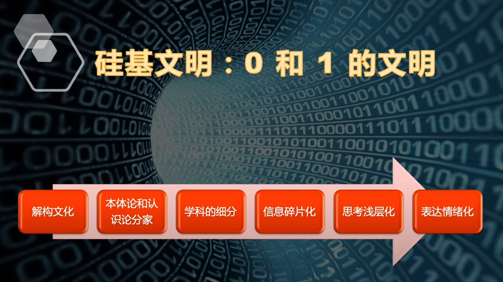

后现代以前的文明是1-2-3，后现代文明是0-1，计算机语言，二进制，形成了今天的解构文化，从本体论和认识论分家开始。对世界的认知变得局部，社交媒体进一步使信息碎片化，阅读浅层化，失去逻辑，不辨是非，情绪主导理智。网络上的交流是没有位格的交流，无法合适合理地表达情感，没有位格，人就没有顾虑，人的恶意就会被放大，所以网络暴力肆无忌惮。这一切都是从不认识三位一体的神开始的。

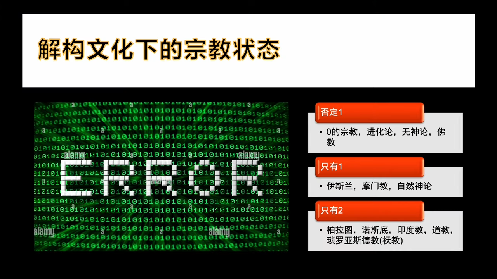

三位一体的视角，观察解构文化下的众生相。“只有1”，在基督论上出问题的宗教，伊斯兰出现的政教合一，自然神论里出现的大政府理念的自由主义。凡是基督论上出问题的宗教，都会出现对“人”的不正确认识，没有罪的概念，于是人就可以代理上帝。“只有2”，容易出现善恶二元对立，成为信仰的张力，比如道教，阴和阳。恰恰是这类宗教，成为现在计算机时代的主流，十九世纪后这三大类宗教的兴起，和计算机语言的发展时间上有同步。

- 只有0的宗教，不解释来源，无法解决世界的本源性问题；
- 只有1的宗教，不能建立秩序，不能解决认识论和方法论的问题；
- 只有2的宗教，世界是二元对立，不能建立合一的、友爱的社会。

所以，3是数学的奥秘，三位一体是神的奥秘，三位一体的基督教文明才能产生现代的自由市场和宪政文明。要警醒，用信仰引导科学，从而将荣耀，归于我们至高的神。