# （主日学） 圣经 旧约纵览
## (主日学) 05 出埃及记
https://www.youtube.com/watch?v=9hNGjLyOiqs&list=PLfChJ-aSv3VA9dN4YOF9JNxQRxmPJP2lL&index=5

很多神学意义从《出埃及记》开始清晰起来，在伊甸园里神表现的是救赎的计划，创世纪是救赎的过程简介，包括拣选、应许和带领。在出埃及记中，神开始在人类历史中，展开救赎。

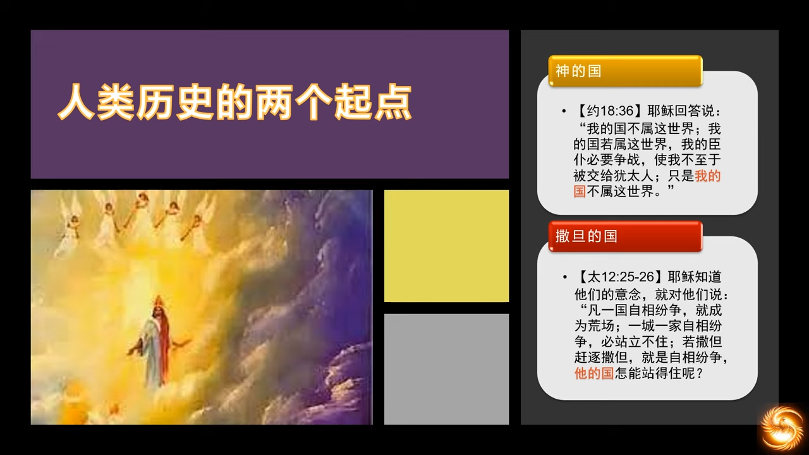

两个起点，人类的起点和选民的起点。

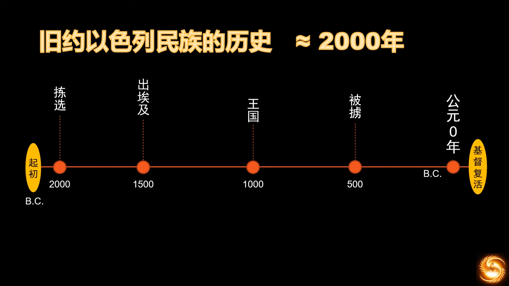

从(列王纪 6:1)推断出，往前480年，是出埃及记发生的时间。

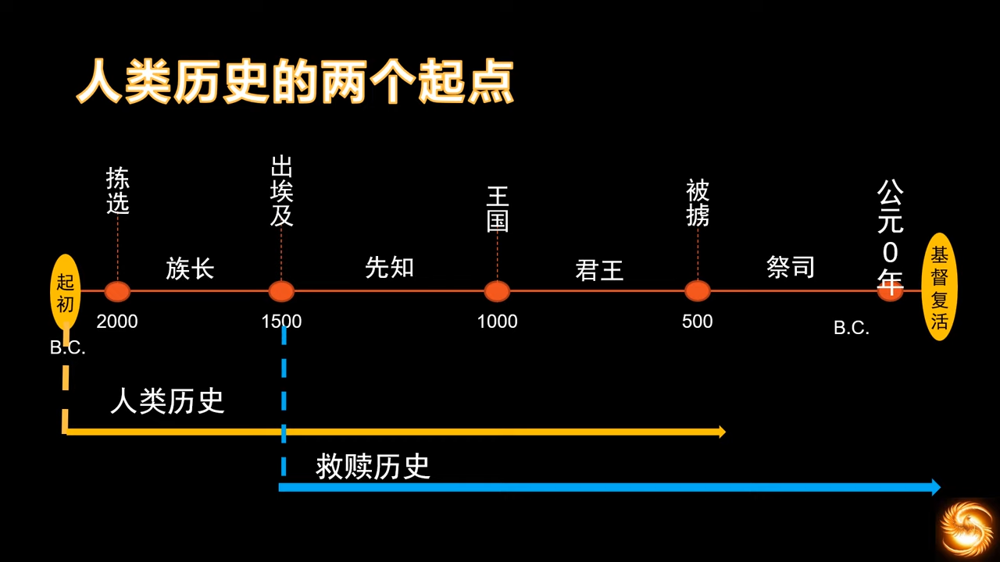

四个不同时期，有不同的领袖角色来带领以色列。神用沉默来引起人的注意，在一个不断等待神旨意的民族里，当神的话语临到时，全民族奔走相告的热情空前高涨。在第一个四百年中，神让以色列人在埃及吃足了法老的苦头，第二个四百年神让以色列人在不同政权下被统治，前后经历六个王朝，饱受蹂躏。所以他们殷切等待弥赛亚的心，在新约中比比皆是。

神不说话，人可没闲着，第一个四百年，埃及和两河流域的农耕文明飞速发展，第二个四百年，希腊的哲学思想蓬勃发展，包括印度的佛陀，中国的孔子，都是思想层面上的尝试，人类思想试图主宰人的意识形态的尝试。第一个四百年，世上的王，用体力和劳苦来控制选民；后四百年，用思想和意识形态来灌输给选民，要带偏选民。纵观整个人类历史也是类似情况，中世纪之前，人伏在劳苦之下；宗教改革之后，人被思想引入歧途。但神的计划是无法被阻挡的。

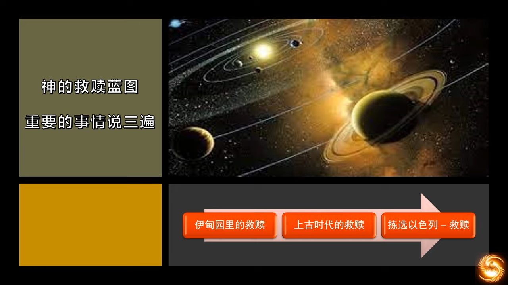

1. 伊甸园：动物的皮子，女人的后裔；
1. 人类的自然繁衍和发展进行实景演出，结果是大洪水和方舟；
1. 神为救赎故事加上了主角，加上了四要素(who, where, when, why)。

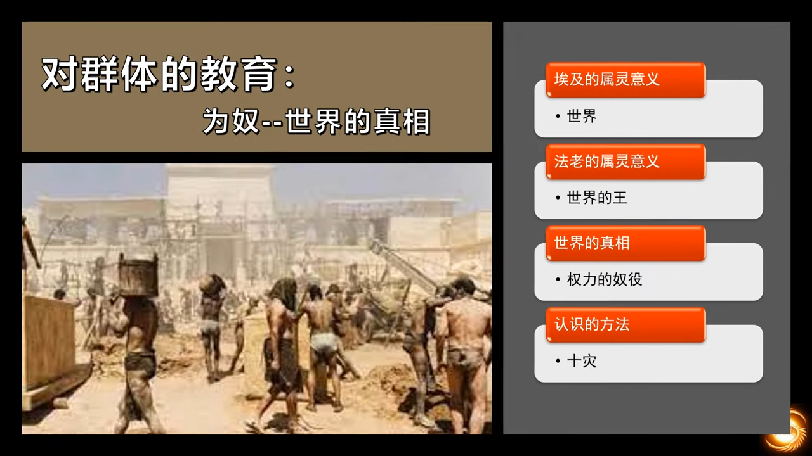

团体的属灵经历，以色列对世界、对自己、对神要有正确的认识。埃及在当时是富裕的国家，农耕高度文明。从约瑟之后，以色列人在埃及逐渐沦落为奴，四百年的时间才让以色列人看清，世界的权柄是靠不住的。“为奴”是我们在这个世界的真相，我们都是世界的奴隶，在政治的权柄下，在经济的重压下，在“法老”的管理下，没有空隙让我们思考神国的事情。周末要去补课的孩子们，没有时间参加主日敬拜。

十灾，让以色列人知道，有一位比法老更为厉害的王，主宰宇宙的神，不经受这个“教育”，以色列人不可能走出埃及。十灾是学前教育，真正的教育是在旷野。
- 埃及：物质享受的世界
- 巴比伦：拜偶像的世界
- 尼尼微：极权的世界
- 索多玛：颠覆神秩序的罪恶世界

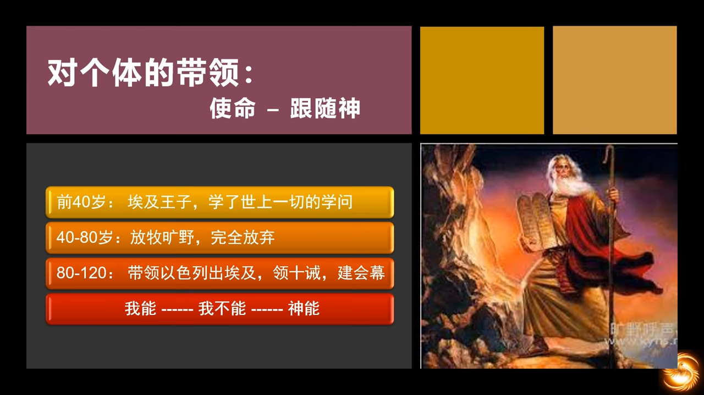

摩西来自一场杀婴事件，圣经有两次杀婴事件，一次是阻止摩西的出生，一次是阻止耶稣的出生，世界的王想阻止救赎。“男人的生命是为神造的，女人的生命是为男人造的”，上帝的顶层设计，所以魔鬼也只向男婴下手。这并不说明女人的生命不重要，“通过女人的后裔来完成救赎”，是对女人最大的尊敬，不要纠结所谓的圣经的性别歧视。

> 他被抛弃后，法郎的女儿却将他拾去，当自己的儿子养育。梅瑟学习了埃及人的各种智慧；他讲话办事，都有才干。 (宗 7:21~22)

摩西，埃及的王子 -> 旷野的牧羊人 -> 神的仆人。

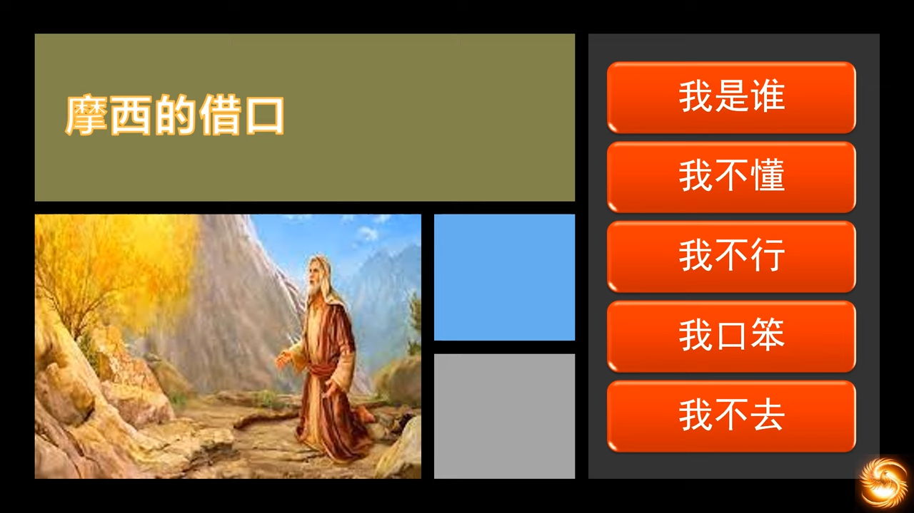  
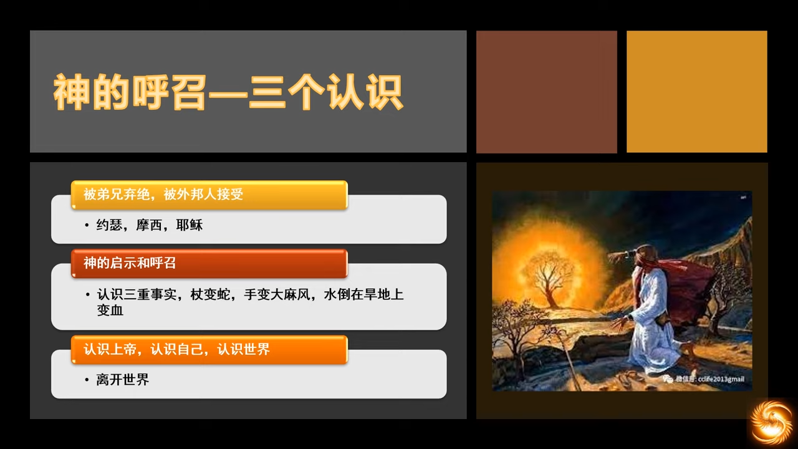  
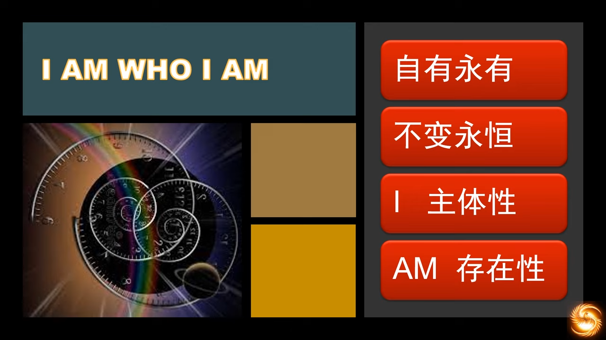

人类能够理解的，都是物质层面的，而神超越物质，神是永恒的。神不属于这个世界，所以其本质不可能被我们完全认识，神自有永有，从“自有”到“万有”，从“有”到“有”，否定了一切从“无”到“有”的宗教，包括佛教、进化论。神是永有的，所以可以通过圣灵被认识，通过基督被看见。世界沧海桑田，唯有神是不变。

现代的文化相对主义，就是离弃了神这个不变的参照物，用相对性来模糊神的绝对性。“相对性”似乎缓和了人与人之间的冲突，大家在“相对性”中妥协，貌似尊重对方。但在具体利益的落实处，这些表面尊重就会卸下面纱，露出真面目。

- *I* ，表示了神的主体性；
- *am* ，表示了神的存在性；
- 主体性和存在性的完美统一，而且这个句型预告了“祂会成为祂自己”，预告了“永恒会进入到时间里”，即“道成肉身”；
- 神会变成神，神会成为神，神就是神；
- 耶稣说：“I am.”

这一刻起，万有的创造主就成了一部分人的救赎主，创造万物的主，并不救赎万有。现在的世界，就是从滥用 *I am who I am* 这句话开始的，把神的话当人的座右铭。这个终极递归模式，只能用于神，人类用的话一定会产生矛盾。

人以为的认识自己，多是为了突出自己，表现自己，想让别人爱自己，其实自己并不认识自己。神为了帮助我们认识自己，祂赐下了荣耀的名。

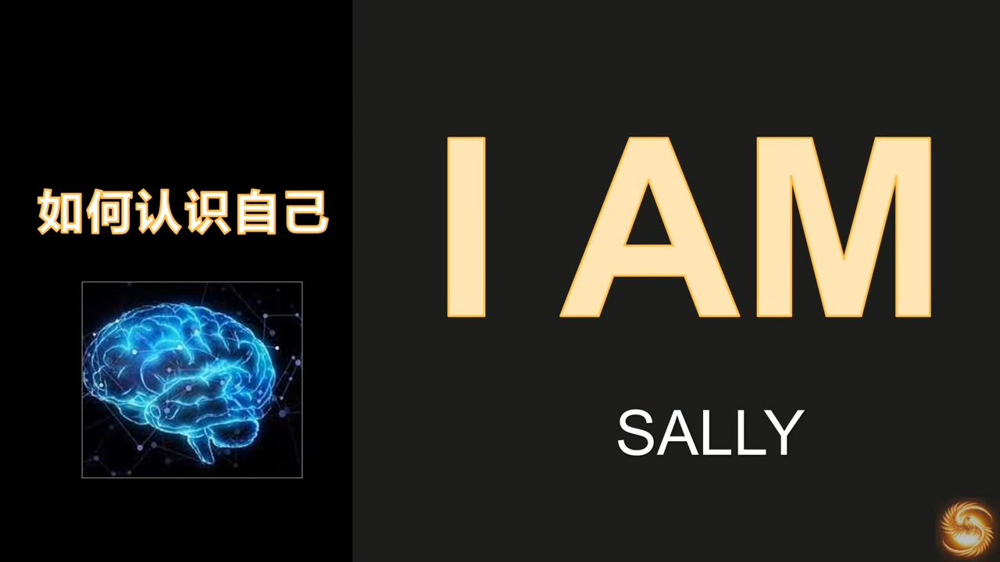

认识 *I am* ,是句子主语，是定义自己时的主语，是身份认定最重要的一环，是存在的前提，也是最容易被忽视的。存在于一切事务中，被我们无视，当我们在定义自己时，能从中看到神的形象；当犯罪之时，就亏缺了神的荣耀，使祂的名在人身上受魔鬼控告 。所以摩西祷告说，“主啊，为了你的名”。

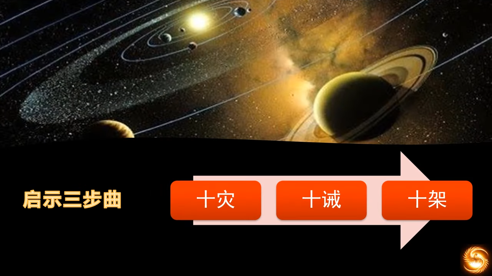

神的启示过程无比严谨，十灾破除了偶像崇拜，十灾对应了当地普遍崇拜的十大假神，“灭长子”破除了最大的假神 —— “我”。世人骄傲，都有“长子情结”。

拜假神、拜偶像、无神论的底层逻辑是一样的，都是把自己当作神，拜假神偶像还存留一些表面上的谦卑。《创世纪》中，神拣选的都不是长子，神恨恶长子心态，长子都是很骄傲的。以色列是神的长子，但后来的救恩临到了外邦人。

神，通过十诫，向我们启示祂是怎么样的神。若没有这些律法映射出我们的内心，我们是麻木的，不知有个永恒的标准是我们永远无法做到的，这就显示了我们的罪。当我们看到以色列的整个救赎历史中全然失败，神向我们启示了十字架。

耶稣告诉我们，是人类出了问题，而不是律法的问题，“我”才是那个问题，解决的办法是耶稣替我们死，即为“代赎”。

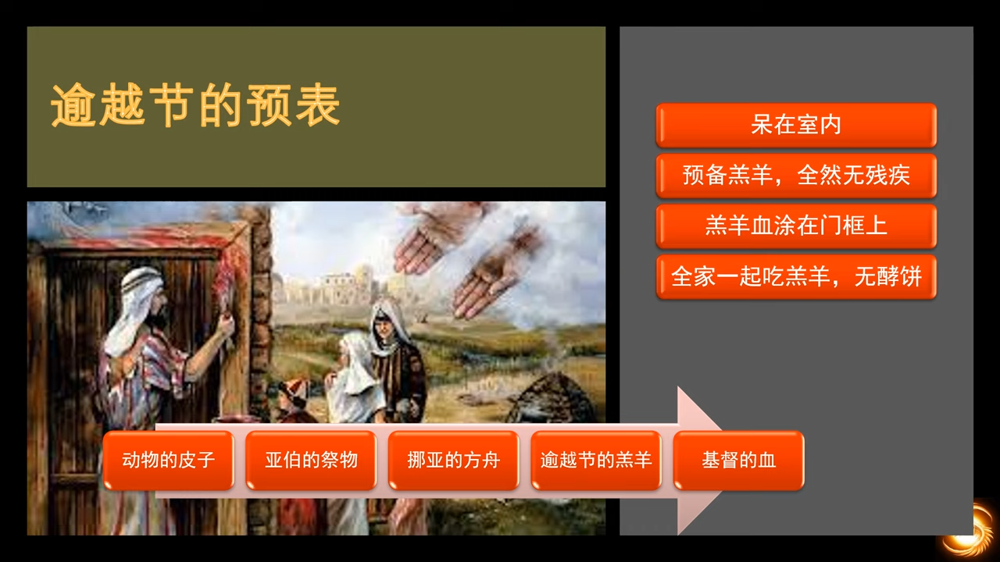

神的救赎到耶稣才完成。

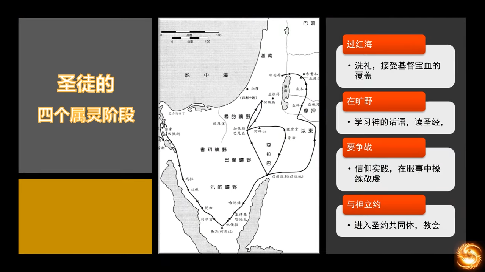

摩西的“旷野一代”是见识神迹最多的一代人，他们反而都倒毙旷野，只有两人进入应许之地。不要等待神迹，不然岂不是和“拜偶像”一样了？把真神拜成了假神。不只要学习圣经，还要在服事中操练敬虔。“能说不能行”的是法利赛人。新约是基督和教会立的，作为信徒必须从属于神的教会。

金牛，拜的还是耶和华，只是将神具象化了。任何人类自己的宗教信仰，都会把神从*无限*拉到*有限*，进行降维式的敬拜。

以色列人在整本旧约圣经中的模式：
1. 犯罪
1. 被神审判
1. 先知为人代求
1. 神原谅

循环往复，直到神彻底无语，沉默了四百年，道成肉身的神彻底解决这循环无解的问题。

“三千个人的失丧”到“三千个人的得救”。

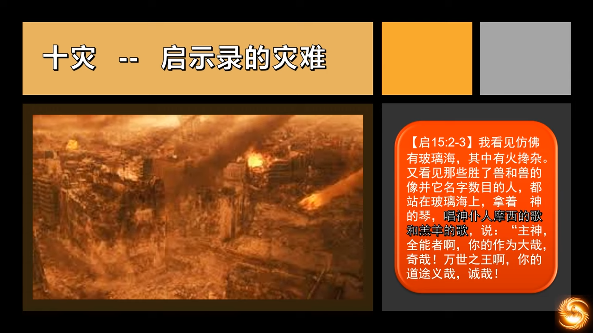

末日的灾祸和法老的灾祸相似

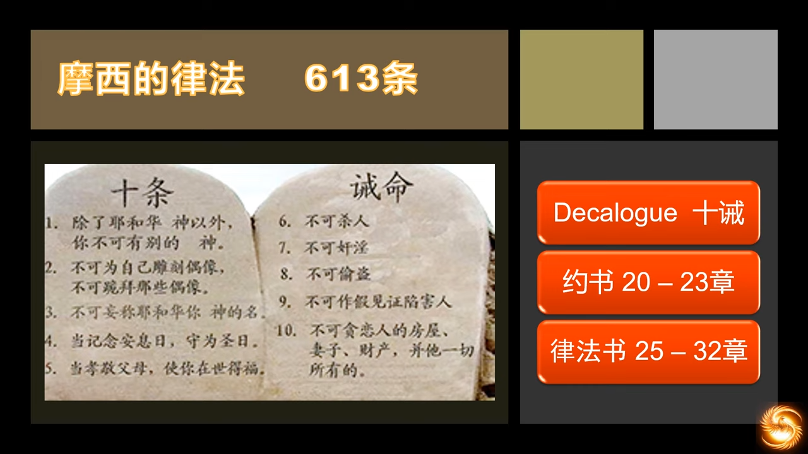

摩西上上帝领受的律法一共有三组，十诫、约书和律法书。十诫是律法的总纲，十诫的基本原则是“爱”，因为“爱”所以要“尊重”，尊重祂的名、祂创造的安息日，尊重祂的规则。因爱神，从而爱人，尊重家庭，孝敬父母，尊重生命，不能杀人，尊重婚姻，就不能犯奸淫，尊重他人的财产，就不能偷窃，尊重他人名誉，就不能做假见证。

表面上看十诫是人行为的下限，但最后一诫将之提升为上限。保罗说自己守了九诫，但守不住第十诫。

> 那么，我们能说法律本身有罪吗？绝对不能！然而藉着法律，我才知道罪是什么。如果不是法律说：“不可贪恋！”我就不知道什么是贪情。 (罗马书 7:7)

神赐的十诫有整体性，违背了一件即违背了全部，一条没做到就等于全都没做到。圣约共同体，一个人没做到就等于全体以色列人没做到。比作一串珍珠项链，无论项链在何处断裂，珍珠都散落一地，项链也就不复存在了。这就给了律法一个无法超越的维度，将所有人圈在了“罪”之中，通过律法告诉我们祂是圣洁的神，也告诉我们什么是罪，看到我们和神，差了一个永恒的距离。

> 罪，是我们看不见的内心。

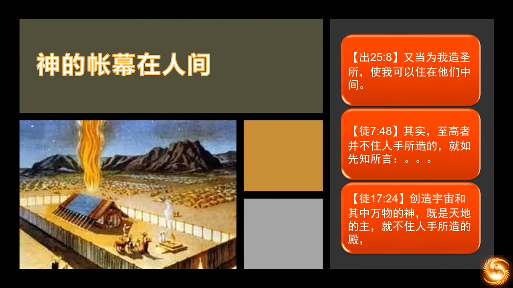

会幕(所罗门时期被圣殿替代)，神是无所不在的，祂本不需要会幕，但为了迁就我们可怜的想象力。

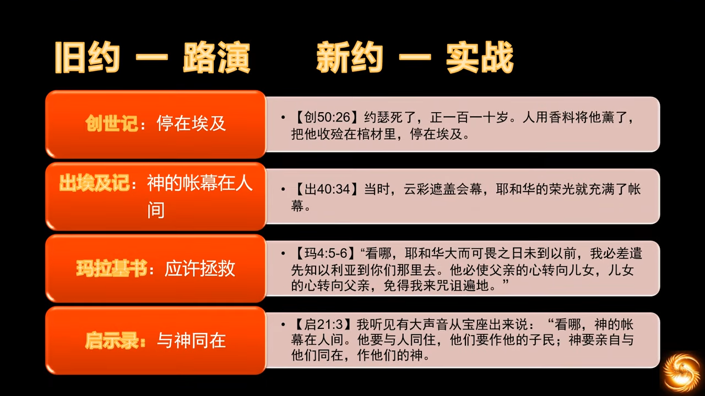  
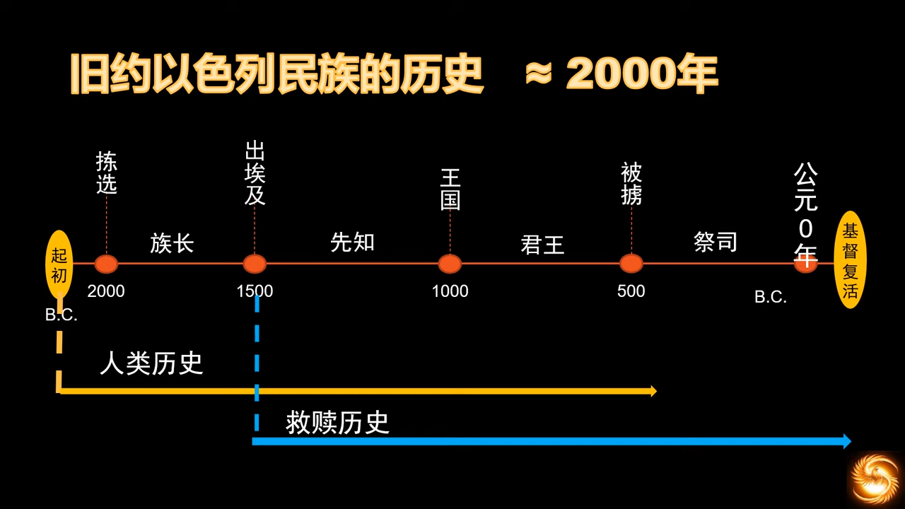  

时间满足了，道成肉身的神，来真正带我们走出埃及。 

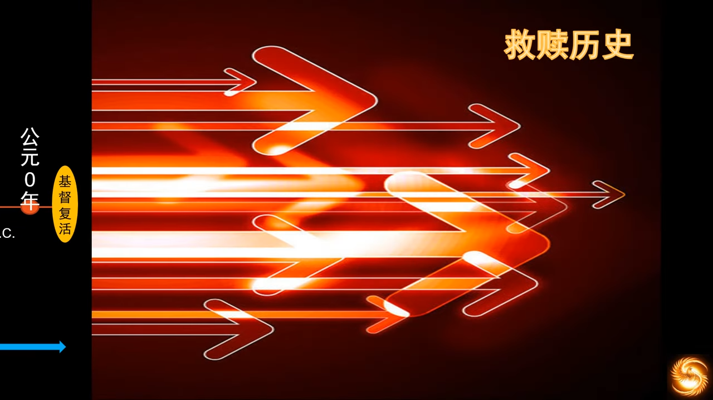  
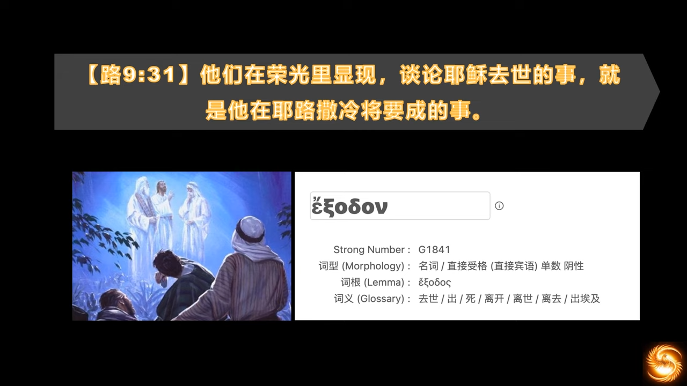

AD 250，旧约圣经在亚历山大城，被翻译为希腊文，改名为EXODUS (希腊语 ΕΞΟΔΟΣ)，这个词第一次出现是在路加福音

> 他们出显在光耀中，谈论耶稣的去世，即他在耶路撒冷必要完成的事。 (路加福音 9:31)  
> They appeared in glorious splendor and spoke of his ***exodus***, which he was soon to accomplish in Yerushalayim. (LUKE 9:31)

在此之前，整本圣经未出现过这个词，但犹太圣经七十贤士译本时，用这个词给出埃及记重新命名。
- 词型为单数：旧约的以色列，作为圣约共同体被拯救，是合一的；新约的基督徒以普世教会的身份被拯救的，也是合一的
- 词性为阴性：教会是基督的新娘
- 词义：去世，离开，出埃及
- 最关键是这个词在圣经中，一点也不普遍

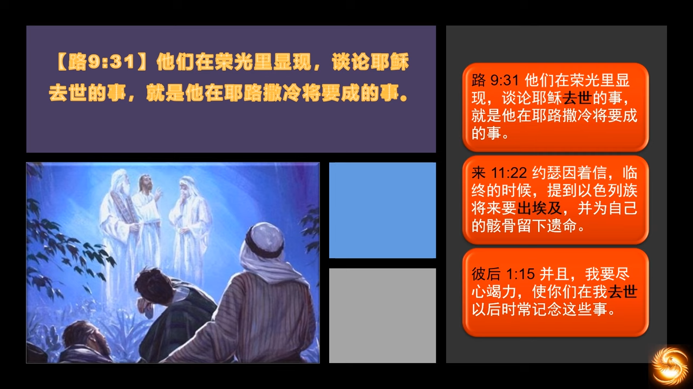

Exodus一共出现过三次。
1. 基督的去世
1. 以色列人的出埃及，预示着教会的离开
1. 彼得自己的去世，预示基督徒个体的“出埃及”

只有基督出了埃及，教会才能出埃及，门徒个体出埃及才会变为可能。

> CJB - Complete Jewish Bible:
>
> They appeared in glorious splendor and spoke of his ***exodus***, which he was soon to accomplish in Yerushalayim. (LUKE 9:31)
>
> By trusting, Yosef, near the end of his life, remembered about the ***Exodus*** of the people of Isra’el and gave instructions about what to do with his bones. (MESSIANIC JEWS `HEB` 11:22)
>
> And I will do my best to see that after my ***exodus***, you will be able to remember these things at all times. (2 Kefa `2 Peter` 1:15)

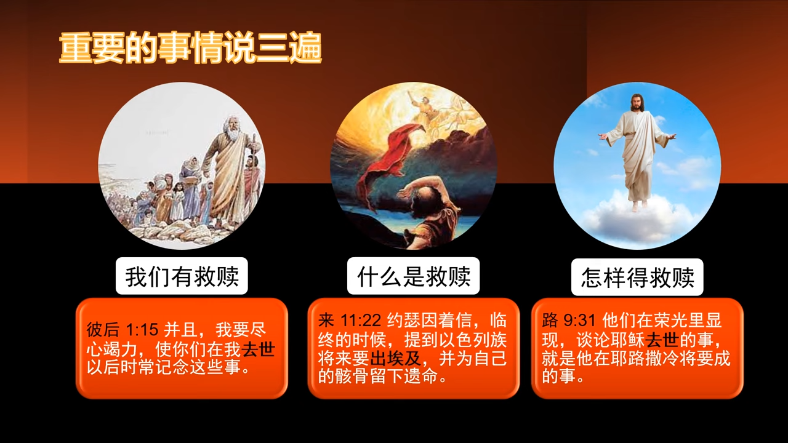

对应人三次对神的背弃：
1. 亚当离弃了神的命令
1. 撒母耳记中，离弃耶和华的带领，要立自己的神
1. 耶稣基督被钉十字架，拒绝神的救赎

但在神的奇妙恩典中，这三次的离弃都成就了神的美妙计划，完成了神救赎的大功，由此可见，人的罪无碍于神的作为。

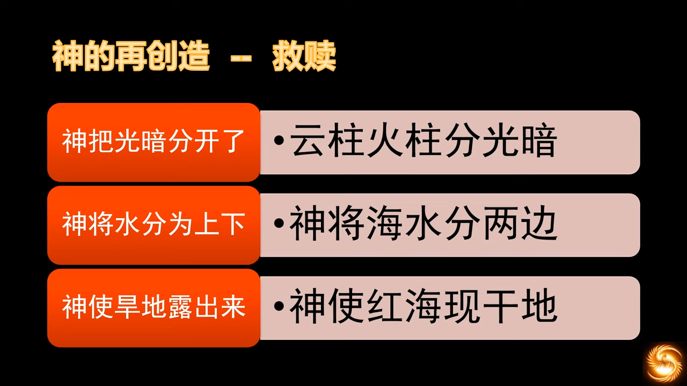

出埃及记，在圣经中的地位，相当于“再写了”创世纪，创世纪2.0版本。

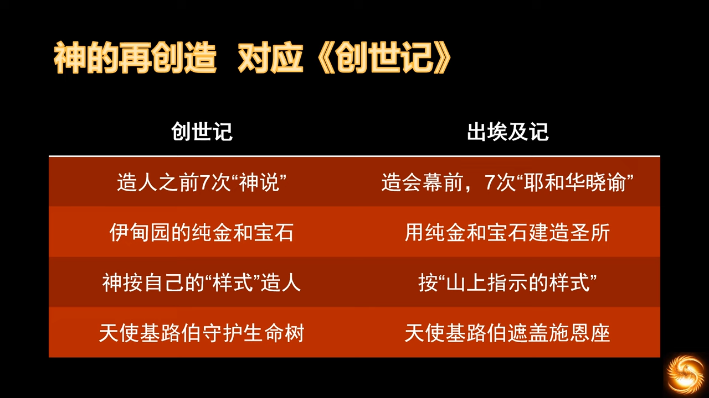  
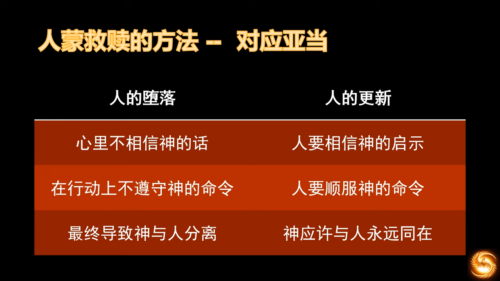

福音书，是创世纪的3.0版本，人类新生命的开端，天国的开端。

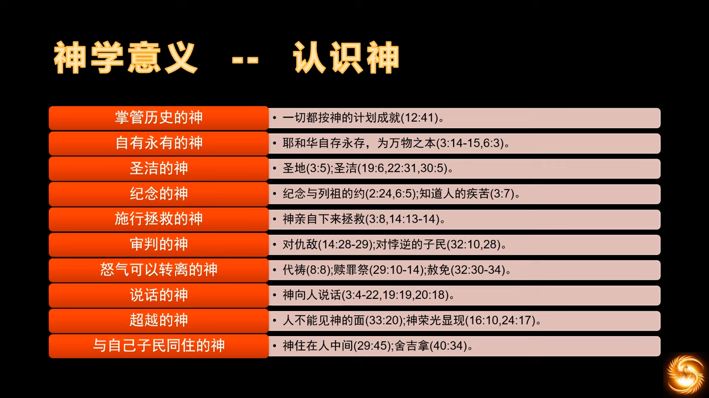

通过设立会幕，告诉我们祂是与我们同在的。超越性和内在性，是神性的两面。祂无所不在，无所不能，无所不知，祂还爱我们。这是需要我们了解的神学真理。

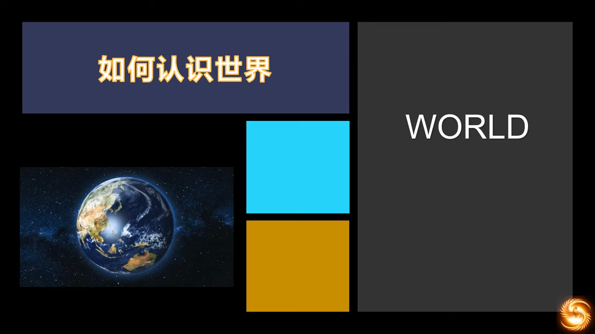  
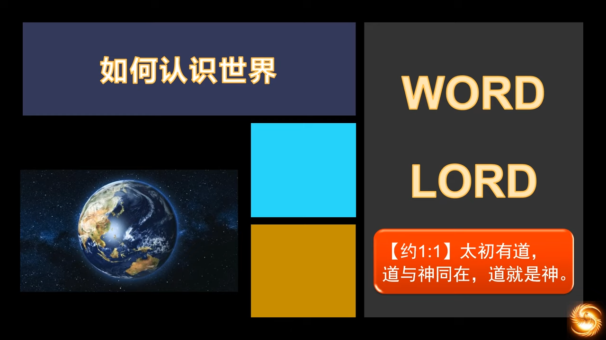

神让我们进入这个世界，如同羔羊进入狼群。“世界”就是“主和圣言”，神就是语言的主人，要我们用语言赞美祂，用语言向祂祷告。所以语言是有力量的，这力量从神而来。

当有一天，神向我们揭开祂的神秘，向我们显明了祂的奥秘，我们应该明白，这就是神呼召我们，出埃及。