# （主日学） 圣经 旧约纵览
## (主日学) 06 利未记
https://www.youtube.com/watch?v=wiWkOmZ4jk8&list=PLfChJ-aSv3VA9dN4YOF9JNxQRxmPJP2lL&index=6

一个从神而来的秘密，即“如何摆脱魔鬼的匣子”，看到创世纪就不相信，看到启示录就看不懂，看到利未记就要睡觉，这都不奇怪。但利未记非常重要，需要我们仔细解读。

> 凡魔鬼不愿意的，就是我们应喜欢的。

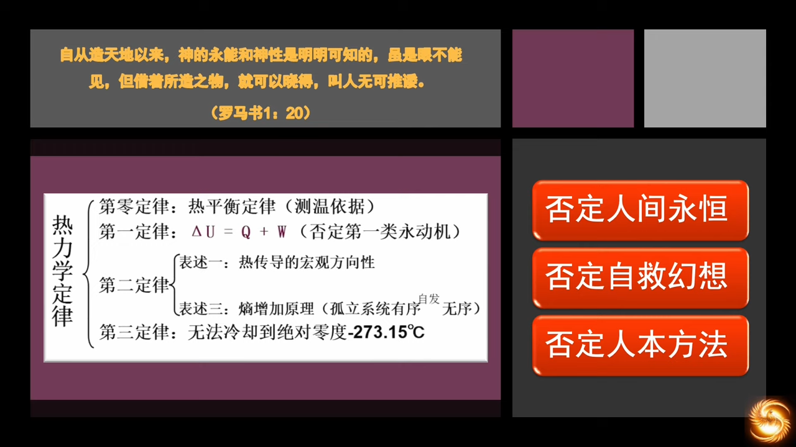

热力学第二定律，热的传导方向，从高温到低温。信仰的启示也是类似，实际上是由上而下的，是从神而来的，这就否定了人有自救的可能。利未记，就是从神而来的直接启示，启示了神的律法。

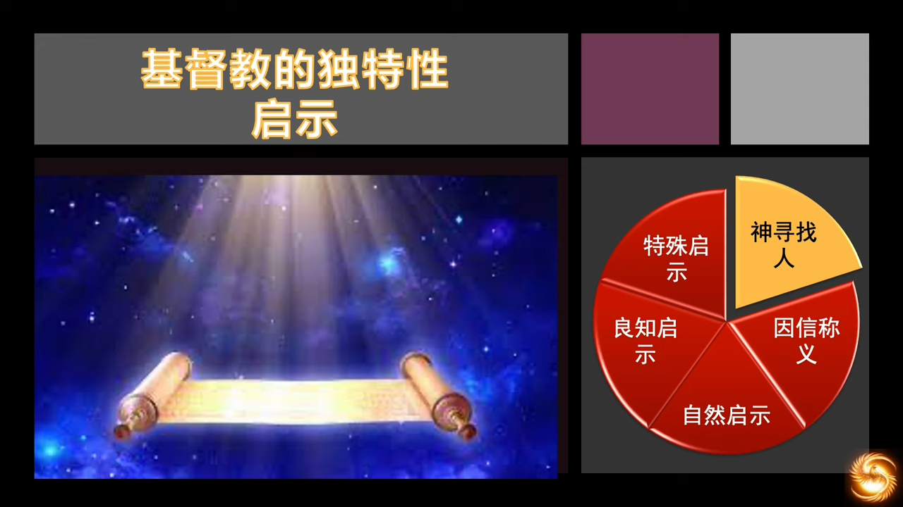

> 若我给你们说地上的事，你们尚且不信；若我给你们说天上的事，你们怎么会信呢？没有人上过天，除了那自天降下而仍在天上的人子。 (若 3:12~13)

我们的信仰和人间宗教的不同，我们是“神来寻找人”，“道成肉身”和“肉身成道”。

神留下许多的启示，祂用祂创造的大自然让我们知道这个世界有一位神，否则无法回答例如，先有鸡还是先有蛋的问题、男人女人的问题；祂也将道德律放在我们的心中，否则无法解释，一个随机产生的生命，为何会有是非观、爱和牺牲、甚至会有永生的欲望。但这两个启示只能让我们获知这世界有神，并不能告诉谁是真神。所以，神又赐下了圣经和圣灵，并将一切都指向了耶稣基督。

利未记就是要启示基督，启示从由神而来的自然法开始。自然法的概念，从古希腊的哲学思考开始的，他们思考观察到，虽然各地法律不同，运作方式不同，但其内在的抽象原则是相似的。比如都尽可能维护公平，都想追求幸福。证明人心中有超越地域差异的共性。于是对这些共性的内核进行总结归纳，定义为“自然法”。最著名的研究学者多属斯多亚学派，圣经中使徒保罗曾与之辩论。

**圣奥古斯丁**认为，自然法即人类祖先堕落前的状态，是符合神超验的标准，人堕落后，虽能感知到自然法的存在，但对其的理解是不健全的，所以需要被神的律法进行更新。到了**圣托马斯阿奎那**，他将自然法的传统融入了基督教的教义，完成了理论到实践的更新，从此该理论就一直在以基督教为基本信仰的欧洲社会成为主流和默认状态。二战后的“纽伦堡大审判”，“枪口抬高一厘米”即神置于人心中的自然法，也即法的最高原则。对人的法律精神，一定要和自然法一致。一部非正义的法律，根本就不能被称为法律，即“恶法非法”。例如英国废除了印度曾经的“妻子需要为亡夫殉葬”的法律。

经验主义哲学家，约翰洛克，《论政府》，对后世英美法系产生重大影响。美国第三任总统托马斯杰弗逊在写《独立宣言》时，描述了一种不可剥夺的权利，不可剥夺无需证明，即为自然法。 

> 我们认为下面这些真理是不证自明的：人人生而平等，造物主赋予他们若干不可剥夺的权利，其中包括生命权、自由权和追求幸福的权利。为了保障这些权利，人们才在他们之间建立政府，而政府之正当权力，则来自被统治者的同意。任何形式的政府，只要破坏上述目的，人民就有权利改变或废除它，并建立新政府；新政府赖以奠基的原则，得以组织权力的方式，都要最大可能地增进民众的安全和幸福。- 《独立宣言》前言

十七世纪，托马斯霍布斯(Thomas Hobbes，社会契约理论的奠基者)，将“public”的概念引入自然法，“众人”的说法耐人寻味，当时的基督教氛围还不错。耶稣回答关于摩西允许离婚，“摩西是因为你们心硬”，这里将上帝的超验的自然法和摩西对传统的妥协梳理得很清楚了。

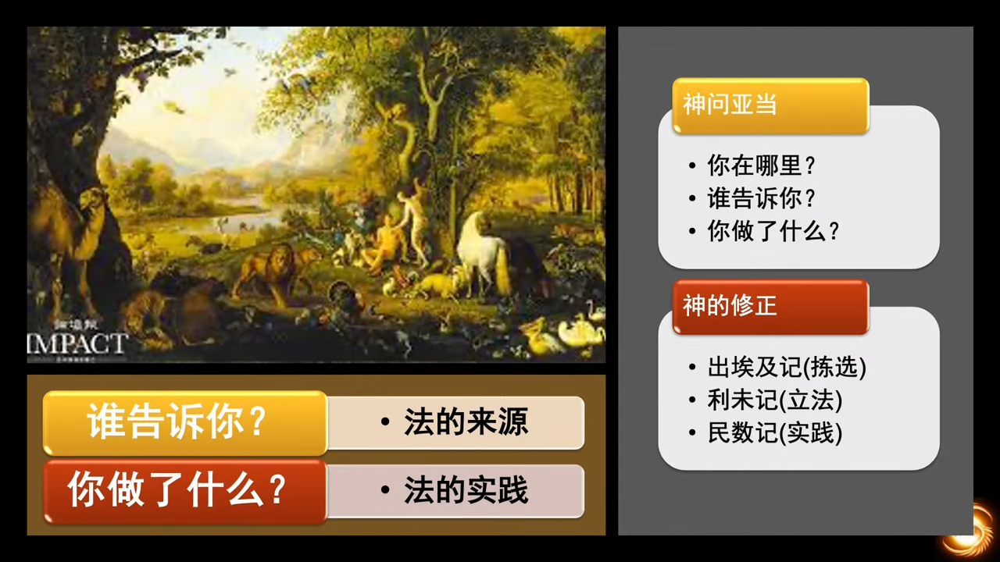

神在解决亚当的问题时，启示的就是自然法。自然法的来源 —— 道统。

若十诫是宪法，则利未记是十诫的司法解释。只有神的十诫，方能指出自然法的来源，那就是我们的内心。世界上的所有人间律法，都不能定罪人的内心，但十诫可以，所以十诫就是自然法的来源。

> 在神的眼里，所有的律法都是一体的，互为因果，同一来源 —— 上帝。

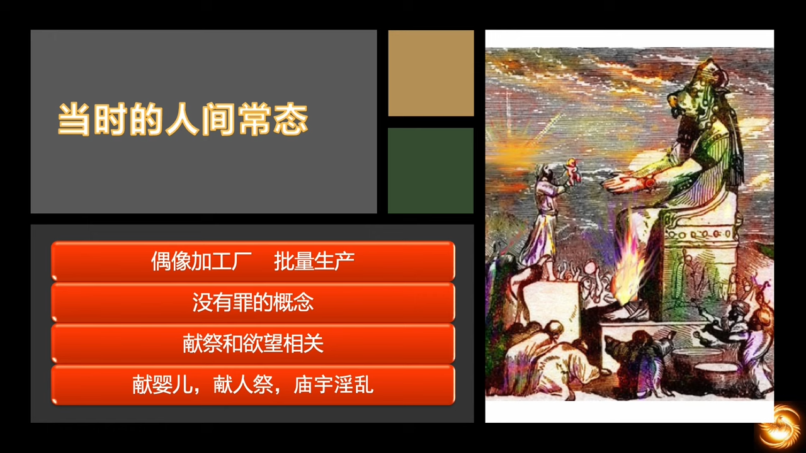

当时的两河流域和埃及都是成熟的农耕文明，依赖天气，所以会拜气候之神 —— 巴利；生产力低下，高度依赖人力，所以会拜亚斯他录(Astarte)，即“多产之神”、“生殖之神”。原始宗教的本质是隐性的自我崇拜，人心就是偶像的加工厂。

神在罪人传统中进行改造，刚从生活了430年的埃及出来的以色列人，无论从精神气质上还是从生活习惯上，都还保有深深的埃及烙印。所以利未记就是神的改造手册，神的子民进行敬拜和圣洁生活的手册。虽然利未记中也有献祭，但和古代近东的献祭有了本质区别。

- 以色列的神是直接和选民对话的神，是独一真神
- 和选民同在的神
- 通过立约的方式，有条件地与选民同在的神
- 以色列的献祭是圣约的一部分，通过律法对选民进行罪的认识和教育
- 启示了神的公义和信实
- 严禁人祭，任何践踏人的尊严的行为都是神所恨恶的，因为人有神的形象，神权即人权，不然人权何来？

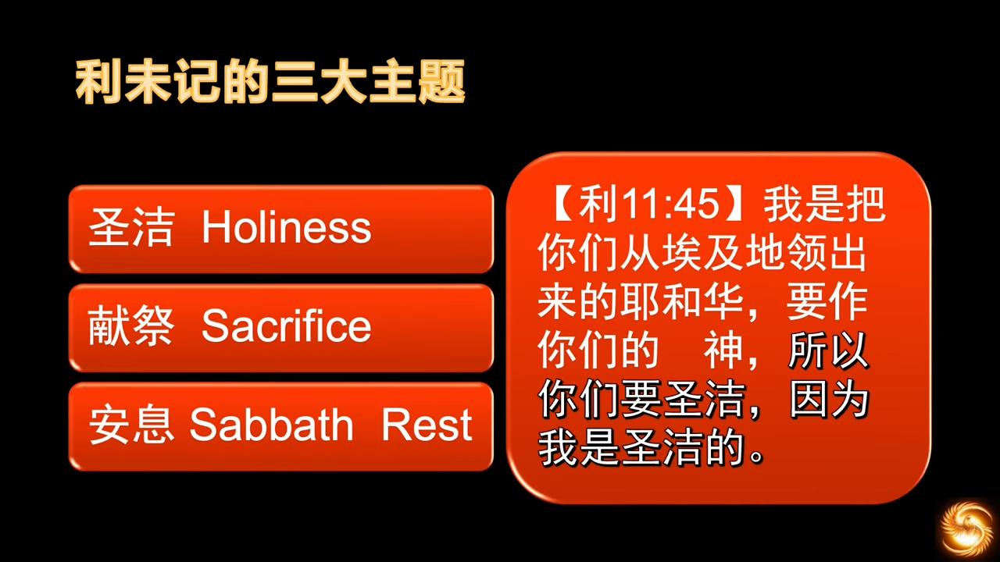

十诫之前，人不知何为圣洁。圣洁，holiness，亲近神，与神相交。 献祭的羔羊，预表了耶稣在十字架上的代赎。安息，让选民思考生命的意义，我们热爱工作热爱加班不知疲倦，所有的时间都想用来换钱，这就是罪人啊。安息日是时间的分别为圣，是最早的分别为圣。

分别为圣：
- 时间：安息日
- 人：亚伯拉罕
- 空间：会幕

生命的意义，就是“与神同在，以祂为乐”。若非神所钟意，在弱肉强食进化论的世界中，人不可能想到“圣洁”。

不同的解经家有不同的分类法，分类不重要，重要的是去阅读利未记。

  
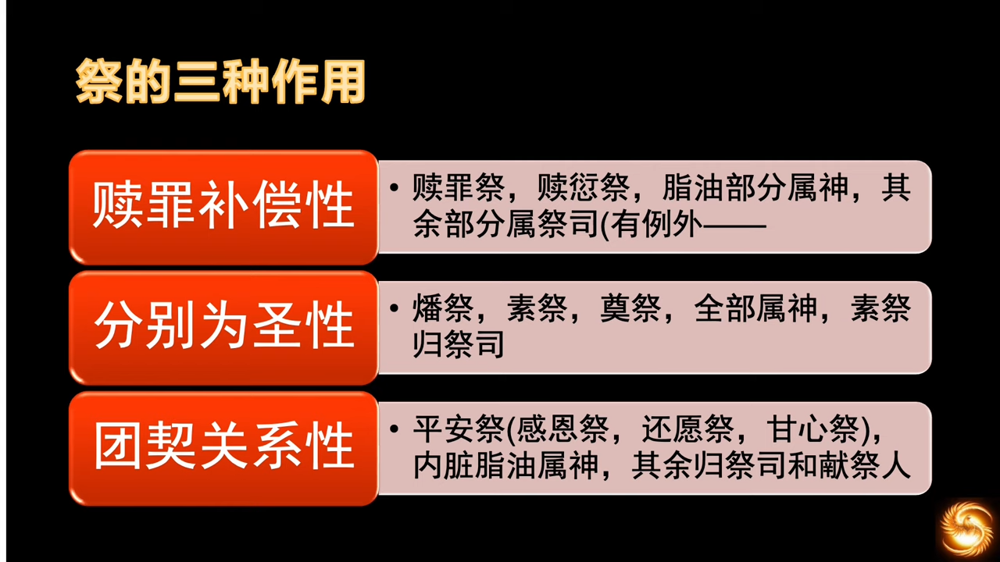

1. 消除神的怒气
1. 提醒选民归属问题，选民是属于神的
1. 为了和神建立更深的关系，也是为了选民彼此相交相爱

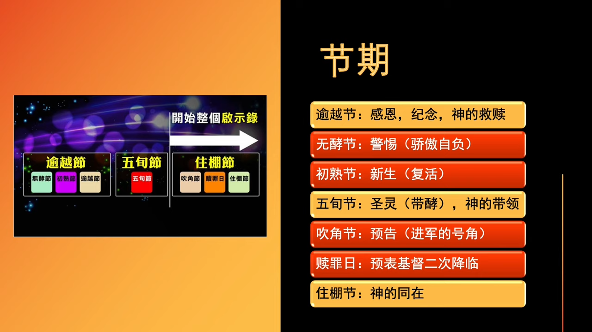

神所设立的节期，一直到今天，宗教以色列人还在坚守其中的三个，世俗以色列人不遵守了。

- 逾越节：预表耶稣基督的救赎，祂的宝血让我们越过死亡，象征祂的献祭和复活
- 五旬节：预表圣灵的降临， 保守我们一生成圣的道路，神的带领
- 住棚节：预表神的帐幕在人间，象征道成肉身的神与我们同在，以马内利 (有解经学者认为耶稣是住棚节出生的)

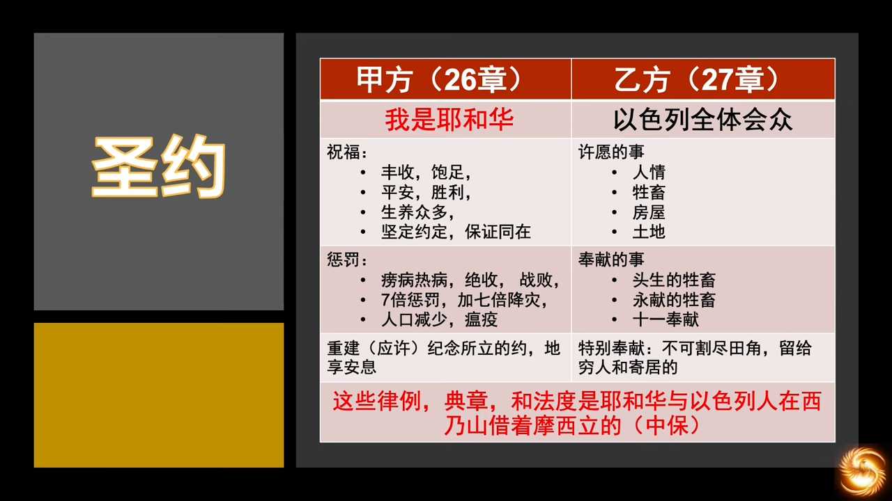

之前的那些人想象的宗教中，并无“神与人立约”，更无“中保”，也没有“罪”。这个约使以色列的律法从此和世俗世界不一样的意义，有了“道统，法统，最后到传统”。

道统，就解决了法的来源问题，使参与立法的所有方，都臣服在上帝之下，使立法者有服从法律的义务，反面例子就是中国的所谓“刑不上大夫”。

  
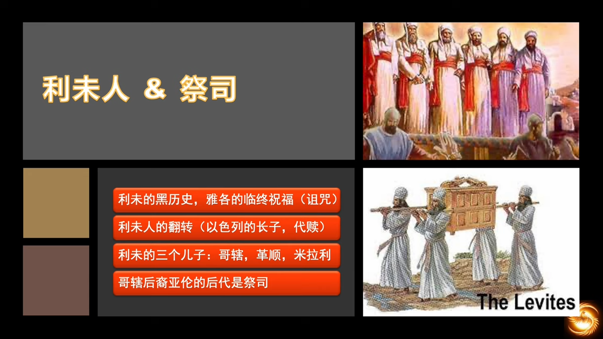

- 祭司：站在神的面前代表人
- 先知：站在人的面前代表神

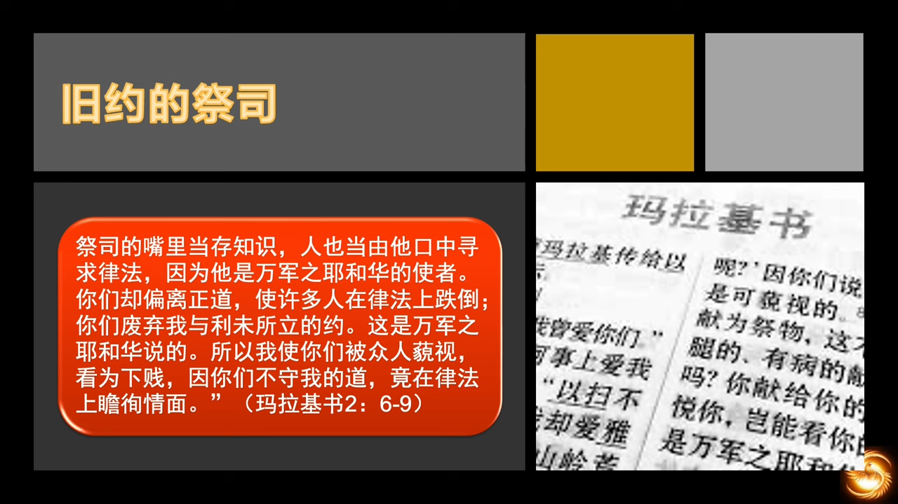

以色列的历史，就是验证利未记的历史。永远的大祭司 —— 耶稣基督。

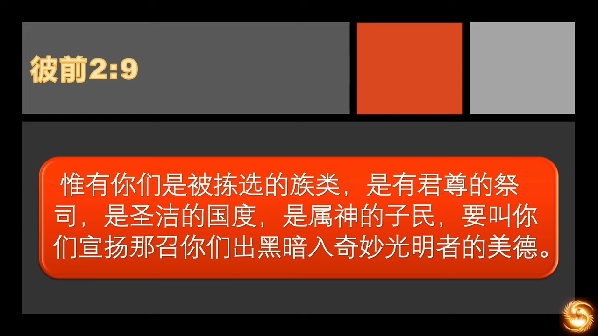

旧约亚伦体系的祭司，是新约祭司国度的预表，都是我们的影子。选民要向上敬拜，和神建立正确的关系，然后才能和人建立正确的关系，在生命中为神做见证，把人带到神的面前。

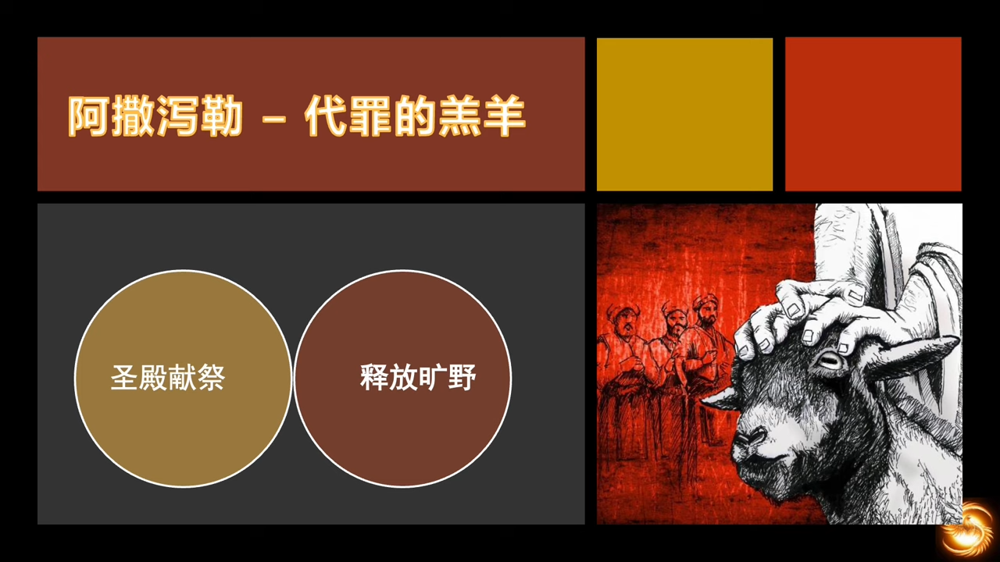

赎罪日的两只羔羊，代罪的羔羊。

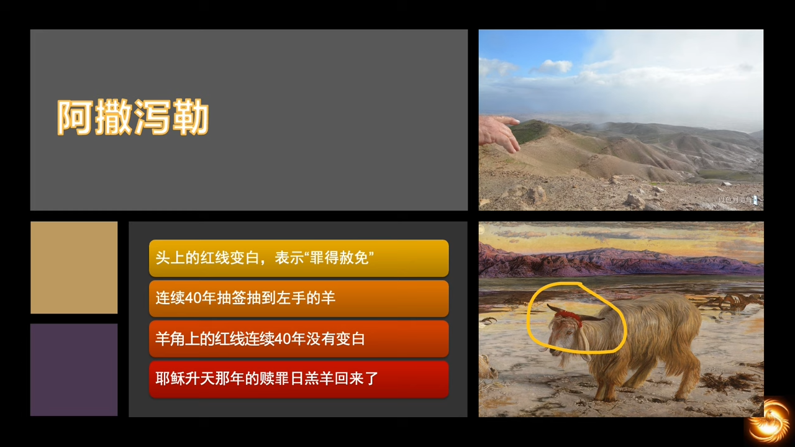  

圣殿不可世俗化，教会不可异教化。自由主义本质上就是挑战神，也是魔鬼的做工。
1. 否定圣经权威
1. 抹黑神的仆人
1. 颠覆神设立的秩序，例如神要“生养众多”，人就同性恋

为的是最终抹去神的救恩，圣经在个人理解上是有多样性的，但是在神的重要原则上有严密的一致性，神的话语是准则，为了确保1500年之后女人的后裔可以踏碎蛇的头颅。

利未记是神的主动启示，是上帝的呼唤。所有的旧约的先知书，都是在解释利未记。

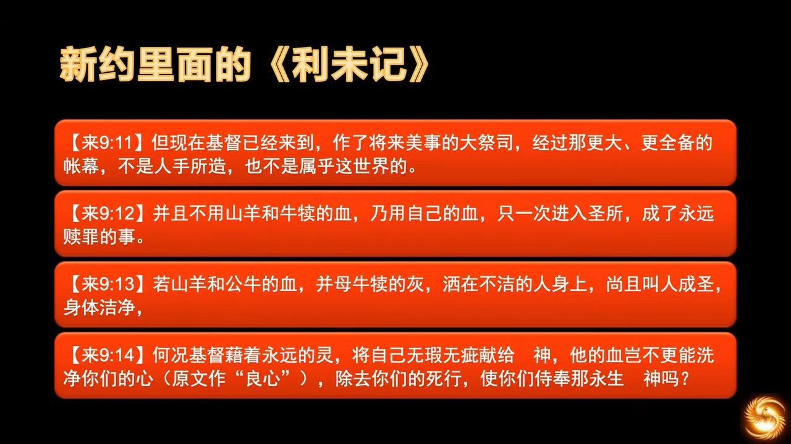

一定要先读了利未记，才能明白希伯来书在说什么，希伯来书可以看作利未记的神学解释，希伯来书将利未记的预表解释得最完全。

阅读利未记，不要被字面含义捆绑，利未记启示给我们的观念，圣洁和赏罚，在新约中都被基督更新了。***新约将圣洁的观念从物质层面提升至道德层面。***

> “不是入于口的，使人污秽；而是出于口的，才使人污秽。” (玛 15:11)

神先用“洁与不洁”的概念建立“圣洁”的概念，然后再打破“洁与不洁”的边界，告诉我们“基督救赎要临到外邦人”的这个神学意义。

从旧约到新约的第二大转变，就是 ***今生的赏罚变为在永恒里的赏罚。*** 旧约是“现世报”，利未记告诉我们，圣洁与快乐是密不可分的，只有圣洁的人才有真正的快乐。但人的理解是堕落的才是快乐的，吃、喝、睡，好工作也无非是钱多事少离家近。于是这个观念也被神更新了，神让我们今生圣洁，在永生里快乐。利未记告诉说，上帝会在今生管教祂所爱的人，去历练所拣选的人，然后在永生里惩罚那些悖逆神的人。

> 我们的苦难是有意义的，不是得到，就是学到。

耶稣基督带来的最大更新，就是完全了律法，使我们可以得到恩典。

> 第二天，若翰见耶稣向他走来，便说：“看，天主的羔羊，除免世罪者！ (若 1:29)

> 爱人如己

利未记就像X光机，用律法将人的罪都照了出来，先知们就好比医生，解读了X光照片，“看看，你们真病得不轻”，但先知们没有药方。最后耶稣基督来了，神的爱在祂身上显灵了，祂甘心上十字架，祂的宝血医治了我们的不治之症，使我们能够永生。利未记是诊断标准，先知书是具体诊断，耶稣才是医治。(耶稣做的最多就是治病和赶鬼)。

出埃及记和利未记之间的关联，“信仰 —— 法律”。

信仰给法律神圣性，若法律缺失了神圣性，就可以被随意破坏，破坏也不会带来后果，最后就等于没有律法，回到丛林法则、博弈社会。世界上的国家，若没有基督信仰，就不会自发地走入现代文明。光有律法没有信仰，是不行的。法律不可能涵盖社会的全部，法律没有覆盖到的地方，就要用道德去填满，而信仰，是道德的来源。

反之，法律给信仰以社会性。**在一个法治社会中，才可以传讲信仰。** 否则信仰就会缺失社会性，变成在一些私人领域的信仰实践，就只能关起门来自己心里相信，口里不能承认，它就不具备社会的张力。

一个没有社会性的信仰，就是一个死亡的信仰，就更不能建立一个法治的社会。两者是相辅相成的，必须是信仰优先，法律不可或缺。后来的人类历史，就是圣灵带领选民在这两种关系上的各种实践探索。这场实践，在公元前花了1500年，在公元后又花了1500年，然后才在宗教改革之后，进入我们今天所熟悉的宪政文明时期。

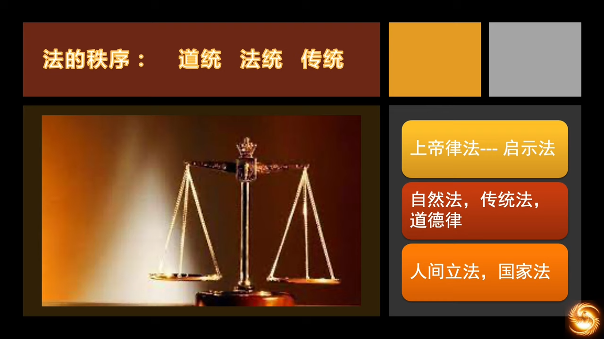

由此可见，神通过圣经给祂的孩子们的启示是全备的，信仰是主线，跟着信仰走，其他所有的都会临到我们。“神启示 —— 自然法 —— 人间律法”，这样才能保证律法的良善，避免恶法的出现。没有信仰，哪怕抄一份好的律法，也不会有良善的结局，因为法律不是天上掉下来的。

> 制度，是在历史中实践信仰的过程中产生的，是有历史传承的，拿来主义是不会管用的。

若在民众心里，没有对法律的敬畏，没有圣约保障法律，法律势必是一个空架子。在文明建造的3000年过程中，少任何一个环节，我们都不可能走到今天。日本是被原子弹改造成功的，是基督教输出的结果，日本的例子只适用于小国，而且还有二战的特殊历史背景。对于一个多民族的超大国来说，是不具备参考性的。而且当前的基督教信仰的国家，已经缺失了当初的正义和热情。

无论是改造一个民族，还是一个政党，都必须从信仰开始。

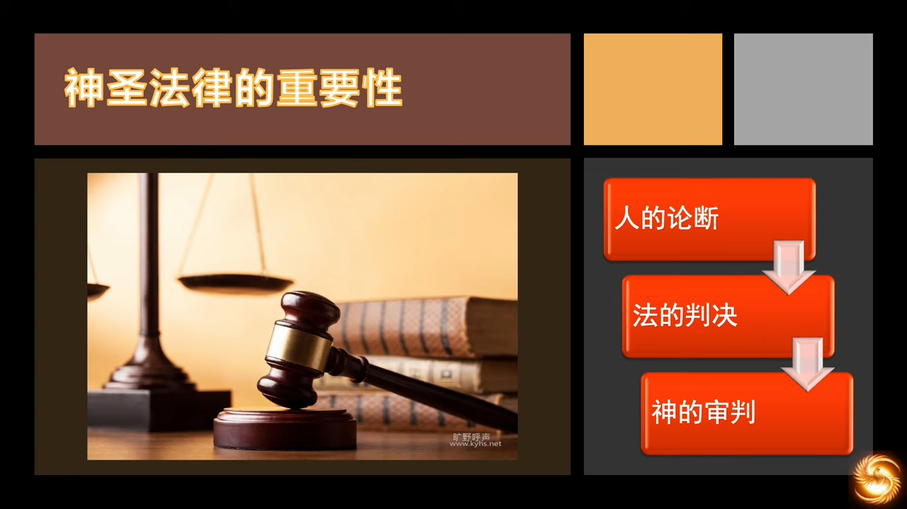

人，喜欢论断是非，论断别人，说明人间是有善恶对错的。动物，从不会论断其他动物。人的喜欢论断，也证明了终极审判的存在。

人的论断，是基于道德标准、利益衡量，是在个体层面上的，是在私域的。法律，是根据人的共同认可的规定，对人的行为进行裁定，是在公共领域的，是为了建立秩序，这是人的公共行为。神的末世审判，是终极性的，不仅对内心道德，也对人的行为，更对人罪的本源 —— 不认识神，来进行审判。

- 如果仅仅害怕人的论断，会使人成为伪君子，为了别人的评价而活
- 如果惧怕法律，至多成为守法的人，但在法律和道德之间，有广袤的空间
- 只有惧怕第三种审判，才能一举解答上面两个问题，伪君子变成了只为神而活的真实的人，也不再仅仅是守法公民，而是超越了人间的律法，去追求内心的神的标准、天国的标准，唯有靠基督、靠圣灵，才得以实现。

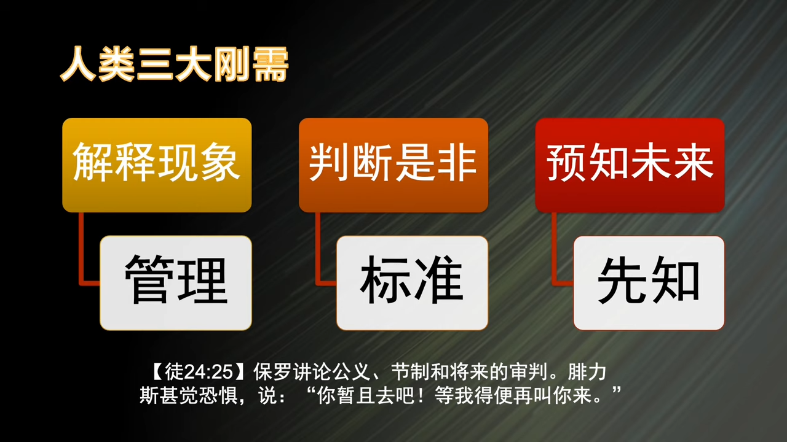

人类和动物最大不同的三大刚需。看到现象都要问一句为什么，这个刚需吸引了历代的科学家去探索，从宏观物理到量子世界，这是神放在人心里的“管理”的职能。判断是非，论断别人，这是神赐的“道德标准”。喜欢预测，说明人人都有先知的职分。基督徒是神的先知，都有能力对人说未来的话。

- 世界要灭亡
- 人人要被审判
- 基督要再来

> And as he reasoned of righteousness, temperance, and judgment to come, Felix trembled, and answered, Go thy way for this time; when I have a convenient season, I will call for thee. (Acts 24:25)

不用试图去解释利未记中的律法，因为年代久远、资料残缺，即使全都搞明白了，对今日的日常生活也意义不大。我们只需要知道，最重要的信息神从来不会让它消失，比如一直存在的以色列民族，比如屹立两千年不倒的十字架，犹太人的存在就是印证基督的话。