# （主日学） 圣经 旧约纵览
## (主日学) 07 民数记
https://www.youtube.com/watch?v=y8BCkcbsqKA&list=PLfChJ-aSv3VA9dN4YOF9JNxQRxmPJP2lL&index=7

民数记，Numbers，律法的实践，在旷野中操练如何成为圣洁，要把圣洁的生活常态化、民族化，成为传统。

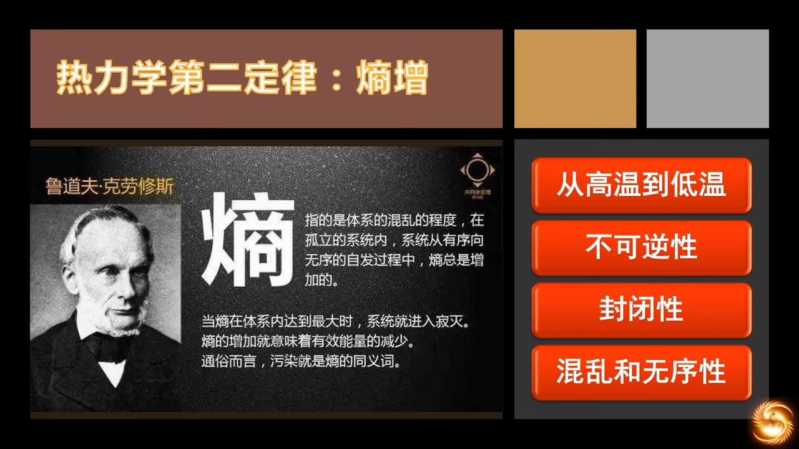  
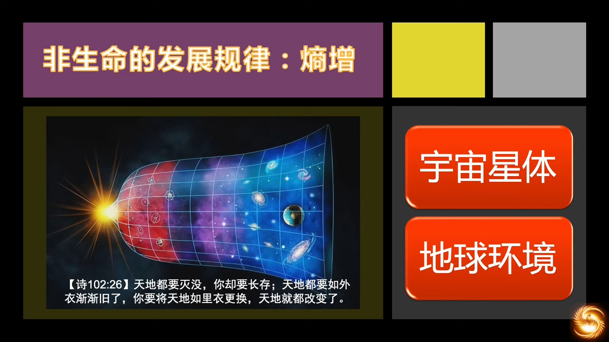

整个宇宙最终走向热寂，热平衡。熵的概念是划时代的，证明了宇宙的起源是有神性的。熵的存在证明了宇宙在衰亡，证明了宇宙有奇点，但不是随机的爆炸引起的，宇宙必然是在某一个特定时间，被设计、被组织起来的。因为按照大爆炸理论，宇宙所有星体应该按照同一规律运转，但事实并非如此。我们每天看到的事物老化和衰退，都在见证熵的事实，所有事物的结构都在逐渐毁坏。可以采取措施对抗熵增，但需要额外能量。

  

在熵增的世界，生命是唯一的例外。机体由细胞组成，组成器官，器官协作分工，来维持生命体的正常运作。这是一个非常有序的状态，是对抗熵增的状态。细胞按照规律组合运行，器官按照模式成长运行，维持熵减，我们要摄入食物。自然界的植物的熵减，要光合作用要有水，这种熵减的生产，发展到顶峰，过了生命的拐点，就开始熵增，衰老、退化、消亡。所以大方向是熵增，只是当中有一段出现了对抗熵增的过程。这也证明了有机物是不可能从无机物中用进化的方式产生的，因为无机物都是熵增的，而生命是熵减的。人类的肉体，不可能永生。

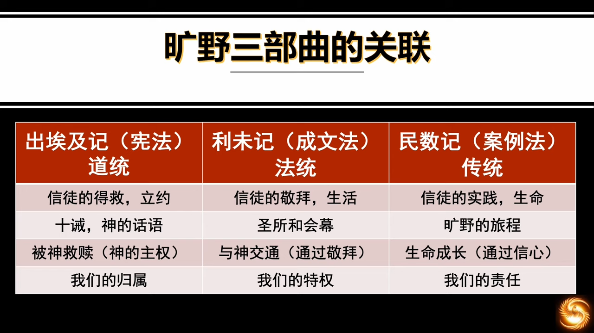  
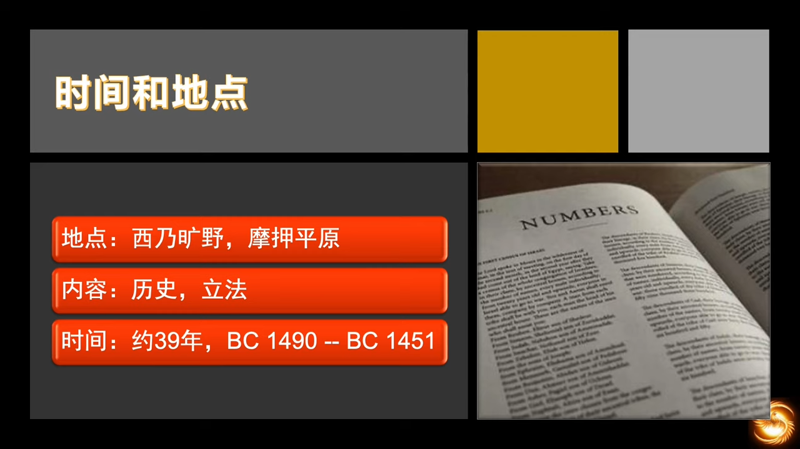

前后两次的人口普查，两次时间跨度39年。在出埃及的第一年，和神在西乃山下立约，建立会幕，遵守利未记的规定，敬拜神。从第二年开始启程，进入旷野，灵力成长，学习与神同行，从神的山出发，去应许地。

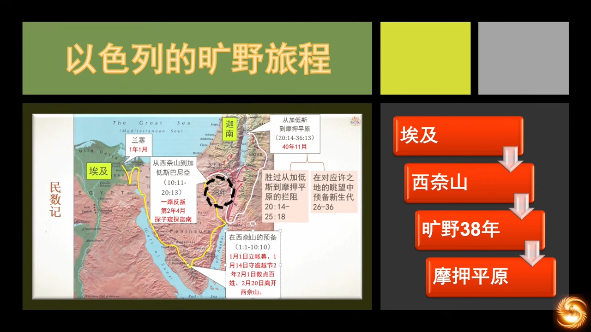

从西乃山徒步走到加低斯（应许地的入口）是11天，但上帝用云柱带他们前行，让他们走了40年。耗死了整一代人，只有两个人走进了应许地，约书亚和迦勒。不研读历史，就注定会重蹈覆辙，民数记告诉我们，以色列人一出发，就跌倒了38年。

> :latin_cross:  
> 1弟兄们，我愿意提醒你们，我们的祖先都曾在云柱下，都从海中走过，2都曾在云中和海中受了洗而归于梅瑟，3都吃过同样的神粮，4都饮过同样的神饮；原来他们所饮的，是来自伴随他们的神磐石：那磐石就是基督。5可是，他们中多数不是天主所喜悦的，因而倒毙在旷野里了。6这些事都是我们的鉴戒，为叫我们不贪恋恶事，就如他们贪恋过一样。 (格林多前书 10)

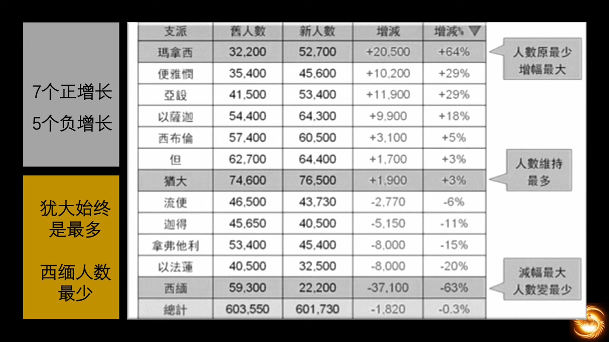

人的跌倒，神解决的办法就是换血。雅各的预言很偏心犹大，这里就看到了神的应许。西缅和利未因为示剑屠城，没有得到雅各的临终祝福，人数下降厉害。之后进入应许地分配产业的时候，不得不住在犹大地，在犹太中间散居。列王纪南北国分裂，就没有单独记载了，应该被犹大同化了。人口普查隔了40年，人口并未大的增长。和在埃及不同，在埃及时70个人400年里达到了200多万。

民数记，重点不是一场关于人数增长的记录，而是关于属灵生命改变的记录。

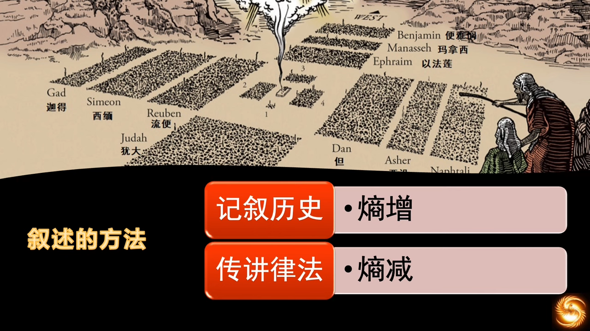

出埃及记前半部都是故事，后半部都是律法。民数记不同，故事和律法是交错出现的。律法都是上帝在以色列人安营扎寨时给的，继续往前走的时候呢，他们就继续违背律法。

传讲神律法的时候，是熵减的过程，因为神在建立秩序，在扶持他们生命的成长。但在他们行动的时候，就熵增了，因为基本上都做错了。

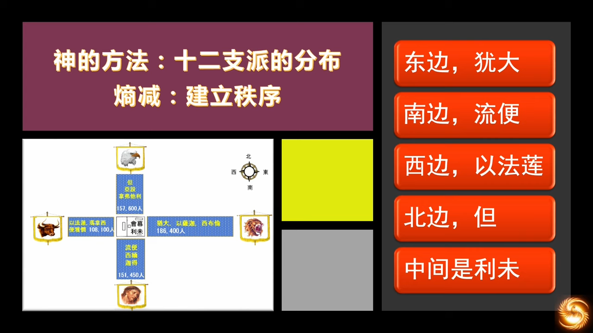

对抗熵增的方式，建立秩序。详细规定了十二支派安营的方式，十字架形态，每一面都是三个支派。徽旗的动物和旧约以西结书中神的宝座四面的动物是一致的，和新约的四福音，描写的主耶稣的四个特征也是一致的。圣经穿越1600年的一致性，本身是奇迹。还介绍了起行、安营的秩序和方式，吹角的方式。犹大最先起行，拿弗他利和但最后走。犹大是“赞美”的意思，但 是“申冤”的意思，这也是对待神应有的方式，用赞美和祷告。将申冤放在最后，神会为我们申冤，我们自己不用忙着为自己申冤。我们只需要坚信神的至善、纯全、美好的旨意，就不用担心其他的。相信神，申冤放到最后。

民数记中，上帝不厌其烦让摩西记录程序，上帝厌恶无序。从创世纪中就能看出，神的世界是非常讲究秩序的。植物、动物、天体、星球，万物都遵守神创造的秩序去运行的。所有创造物中，最不听神的话，最不按照神秩序走的，就是人，人是万物中的奇葩。

神通过设定一系列的规定来体现秩序，百姓要按照宗族家族来数点人数，每个人都记住身份和归属。利未人作为头生的替代品，替代全以色列的长子，建立了代赎的概念。为引出“神的儿子代赎”这个概念而去预备选民的心思意念，当救恩临到的时候，有着圣经根基的犹太人，才可以一眼就认出主耶稣的弥赛亚身份，才能成为第一代使徒和信徒。

神的各种规定，看起来死板，但其实重要。人自由意志的派生物就是自由主义，人天生对重复的规定是仇恨的，因为创新也是人的本能。因神是创造者，我们是按照祂的形象被造的，所以我们也有创新的本能。但是在基本问题上，在神本主义的事情上，在信仰的根基上，任何创新都不是神喜悦的。我们通过尊重神建立的看得见的秩序，来尊重看不见的神。

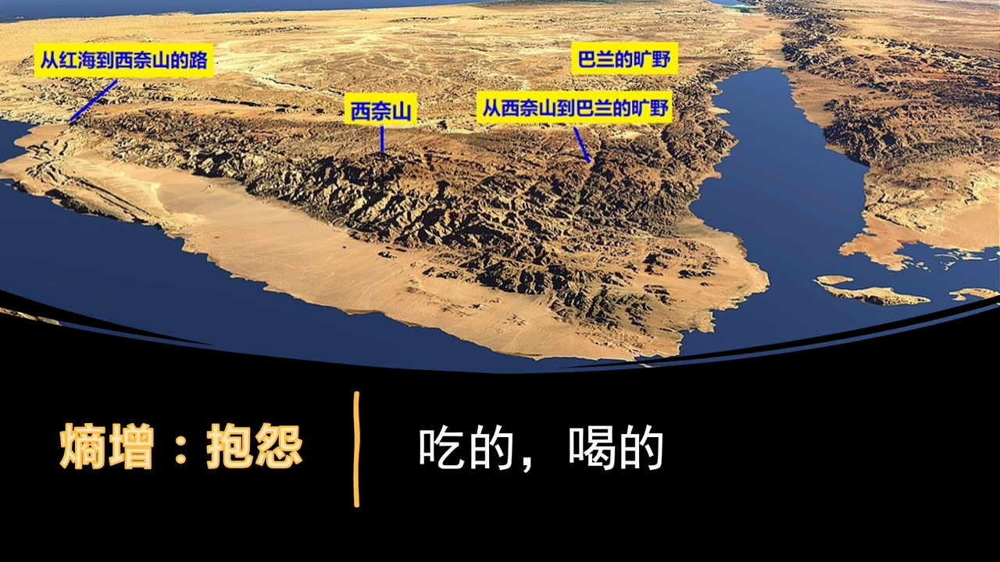

但人的本性又是熵增的，申命记中神说以色列人得罪祂十次，两次记录在出埃及记中，八次记录在民数记中。西乃山颁布律法之后，以色列人再发怨言，就会引来神的惩罚。抱怨不需要用到才干、大脑、品格，也不需要牺牲、不需要代价，所以神不喜欢抱怨。建议是指出错误，并且有论证，有解决方案。

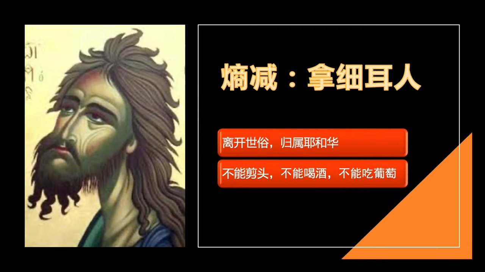  
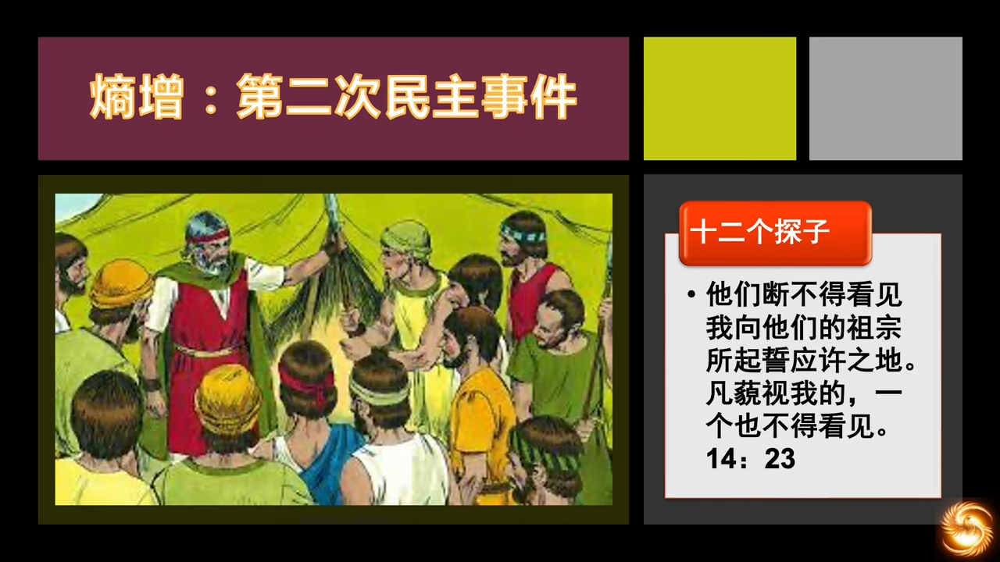

十二名探子进去应许地去考察了40天，回来只有约书亚和迦勒两人信心满满，觉得应许地很好，但其他人有异议的是，地上的人都太凶了，怕打不过。从这里就看出这些人从来都没有信靠神，过红海、行神迹、云柱火柱，这么多的他们都忘记了，所以神迹不能救人。现在没有看过大规模的神迹启示，但神在每个个体身上所做的工，一直是伴随着信徒的成长，这是很多历代的圣徒都能见证的。奥古斯丁听到神对他说话，马丁路德被雷劈过，都像是被神开了外挂。

当时以色列人被迦南人的高大唬住了，就想回埃及，甚至纠结民众要打死主张进军的约书亚和迦勒。这就深深地激怒了神，神第二次要把以色列人除干净，让摩西的后裔成为大族。第一次是在西乃山，金牛犊。

看上去两派都有道理，一派从事实出发，实事求是，的确是打不过；另一派说我们是做不到，但是上帝可以做到。这两派对于事实的判断是一致的，但是问题是选择依靠哪一个，是选择依靠人的能力还是依靠神。价值判断出了问题，导致选择不同。

> [!CAUTION]  
> 当你对上帝说“我还没有准备好”的时候，你可能一辈子都准备不好了。

如果按照民主制度，不进入应许地就是正确的了，多数人的意见。但上帝通常不采用民主制度，因为祂才是主。民主是有前提条件的，民必须要是神的民，这样民主才可能运行，而乌合之众的民主是很可怕的。古希腊的民主杀死了苏格拉底，新约的民主钉死了耶稣，两成的精英是无法对抗八成的大众的。

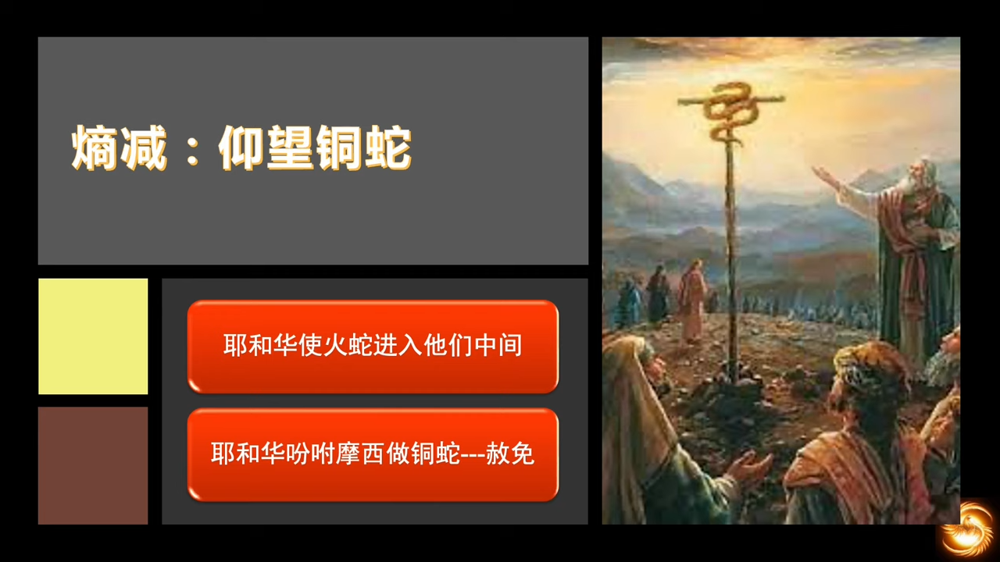

被举起来的铜蛇，预表了十字架上的耶稣。但是之后铜蛇又成了新偶像，一生病就拜铜蛇。一直到希则克雅（希西家王）时，铜蛇才被砸掉。

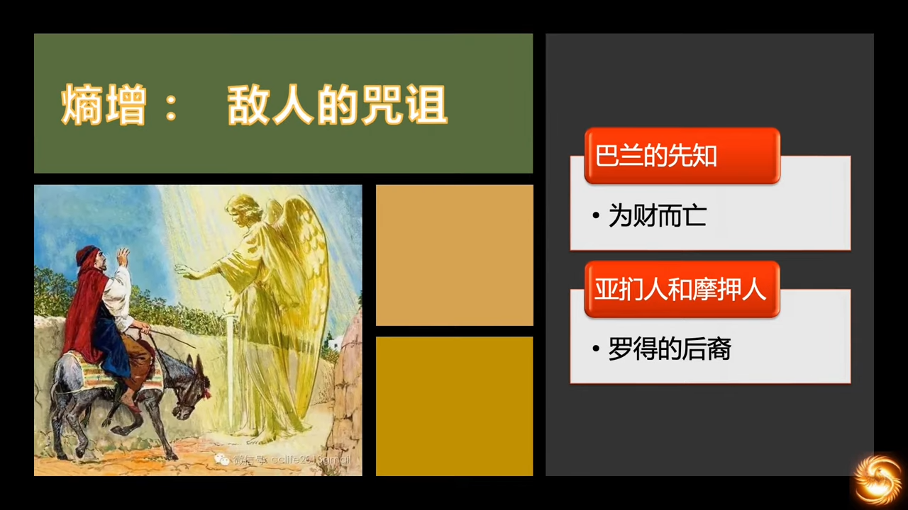

我们如果明明知道神的规则，但是依然为了自己的私利去向神祈求，神不但不会改变自己的规则，反而会惩罚有私欲私利的巴兰先知。

丧钟不是为一个人而敲响的，沉默，就跟着一起灭亡。任何的犯罪，在神的眼中就是团体的犯罪，特别是对圣约共同体而言，对邪恶的沉默，就是罪恶的帮凶。从这个角度，“政治正确”，在信仰层面是不存在的。

  
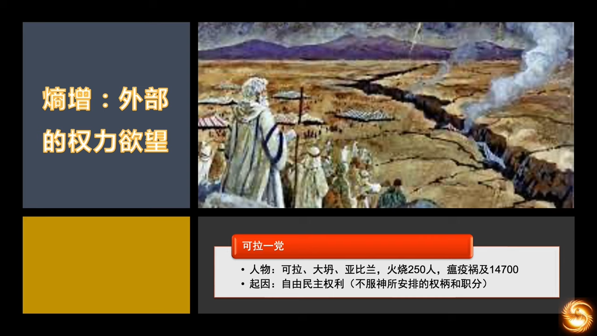

可拉的子孙后来成了圣殿中唱歌的人，基督徒不要挑战上帝的拣选，也不要心存嫉妒。

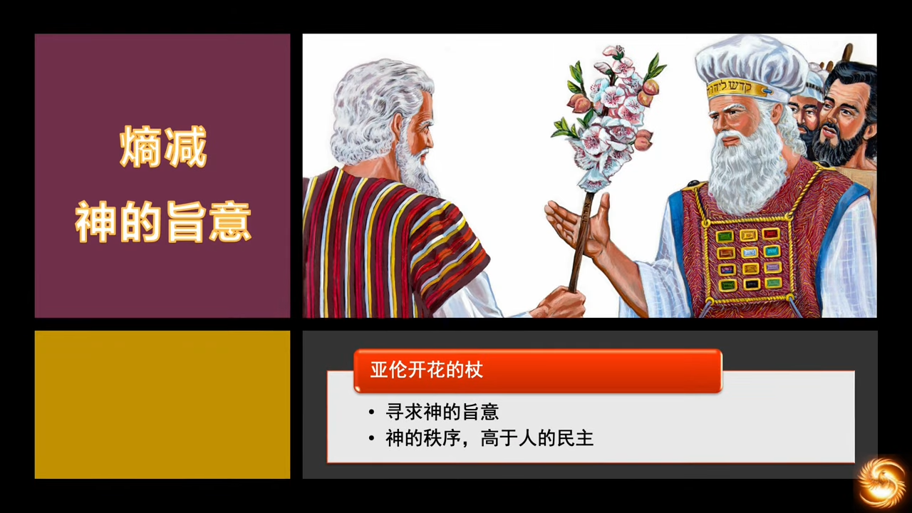

坚定了亚伦的地位，民主是神治社会的大敌。我们身处现代社会自由世界，应该如何理解呢？我们要明白，民主始终不是最优秩序，民主是次优秩序，是最不坏的制度。民主的运行是有前提的，民主体系中的百姓，必须要有普遍的道德共识和信仰共识。没有民众的普遍信仰的基础，民主就无法解决人的罪的问题。

只有当君王的权力和世俗的所有权力，都臣服在神的权柄之下，民主才有运转的可能。民主在方法论层面上，有一定作用，但只能在形而下的范围内使用。在形而上的问题上，神本主义范畴信仰层面上，民主是不适用的。所以信仰必须是自由秩序、自发秩序、神治秩序。

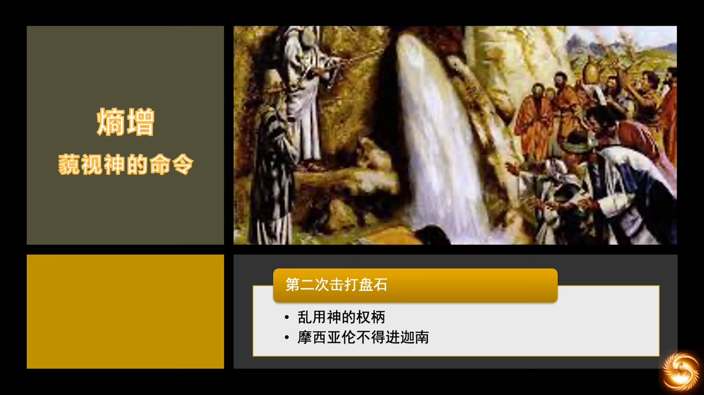  

还是难以说服女权主义，罪的一大特征就是看不见恩典。耶稣死在十字架上他们看不见，耶稣叫玛丽亚“妇人”他们说耶稣不孝顺。罪人就是会以为自己比神更公义、更有爱、更智慧。

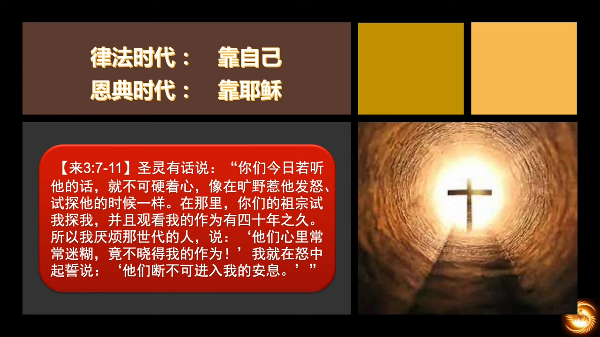

以色列40年的经历也说明，出黑暗，并不等于就入了光明。主耶稣说过的“空房间”的比喻。

> :latin_cross:  
> 43邪魔由人身上出来以后，走遍干旱之地，寻找一个安息之所，却没有寻着；44他于是说：我要回到我出来的那间屋里去。他来到后，见里面空着，打扫干净，装饰整齐，45就去，另外带了七个比他更恶的魔鬼来，进去，住在那里；那人末后的处境就比以前的更坏了。对这邪恶的世代也必是这样。” (玛窦福音 12)

> [!IMPORTANT]  
> 旧我要死于旷野，新我将进入应许。

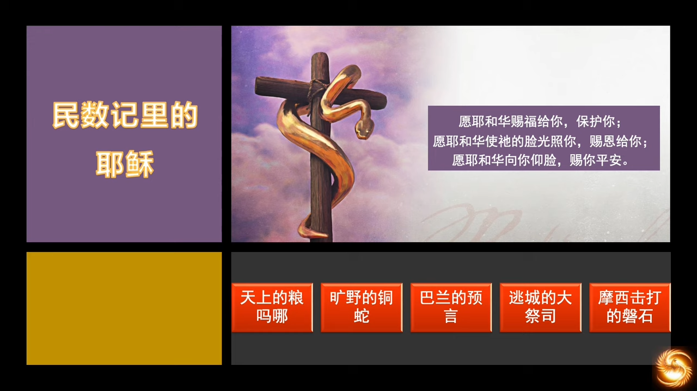

> :latin_cross:  
> 24愿上主祝福你，保护你；25愿上主的慈颜光照你，仁慈待你。26愿上主转面垂顾你，赐你平安。 (户籍纪 6)

这是上帝吩咐亚伦给以色列人的祝福。

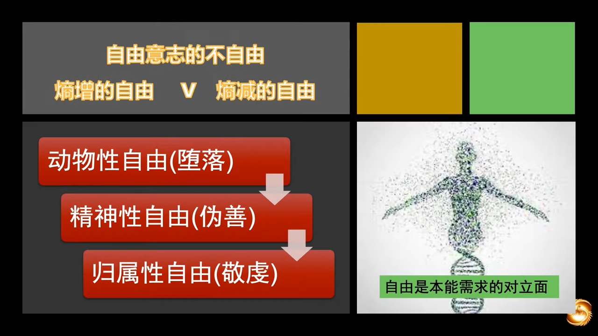

从以色列人在旷野的历史记载中，我们看到一个本质现象 —— 自由意志的不自由。我们熟悉的自由是熵增的自由，是处于本能的自由，是把人拉回到动物层面的自由，换而言之就是堕落的自由。满足动物性的欲望，回避痛苦。现代理想主义思想家康德在《纯粹理性批判》一书中，将理性的自由，从动物性的自由中拔了出来，使理性的人，可以获得精神性的自由，即自律的自由。但最终还是会引向道德表演。只有基督里的自由，是真正的自由，是归属性的自由，是跟随基督的自由，是真正靠着神去对抗本能需求的自由，永恒的自由，熵减的自由。

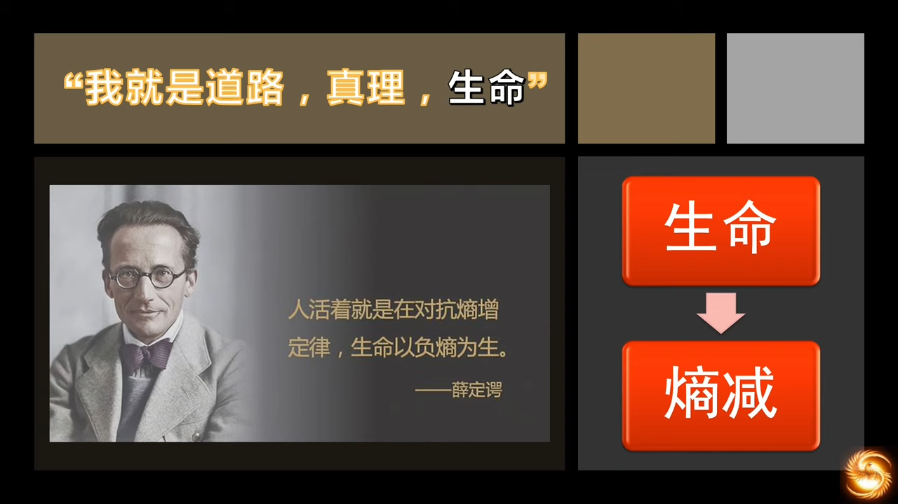

熵增不可抗拒，肉体终将消亡，符合动物本能的状态，就是最舒服的状态。

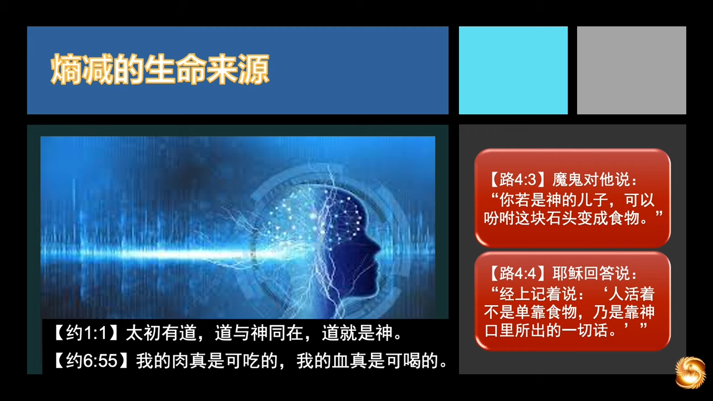

人活着，不是单靠吃食物，还要靠吃“神的话”，约翰福音说基督就是“神的话”，耶稣说“我的肉是可吃的，我的血是可喝的”，熵减的生命来源就是基督的血基督的肉。

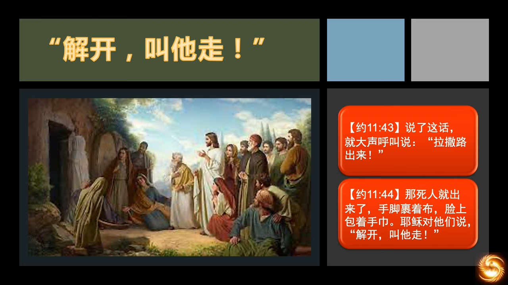

神的奥秘是基督，基督的奥秘是教会。我们要进入教会，如同以色列人进入旷野。

> :latin_cross:  
> 43说完这话，便大声喊说：“拉匝禄！出来罢！”44死者便出来了，脚和手都缠着布条，面上还蒙着汗巾。耶稣向他们说：“解开他，让他行走罢。” (若望福音 11)

神揭开人的捆绑之后，是要人行走的，不是让人在救恩中躺平。耶稣的工作是“复活”，教会的使命是“解开”，我们的使命是“行走”。以色列人走进旷野，拉匝禄复活行走，我们进入教会。

我们不能停止聚会，因为只有在聚会中我们才能操练敬虔，才能在各种各样的矛盾和冲突中去显示我们生命的不完全，靠着圣灵来修炼我们。以色列人一出发就瘫了，瘫了38年，于是新约里耶稣治好了瘫痪了38年的瘫子。