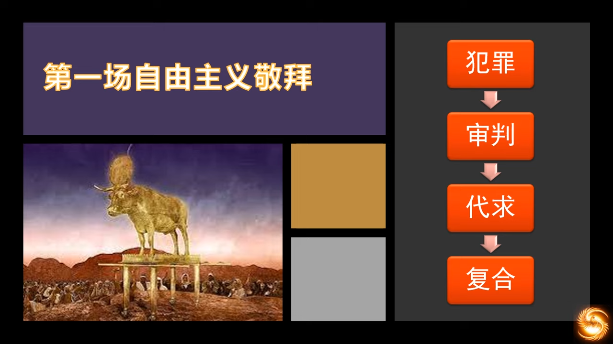
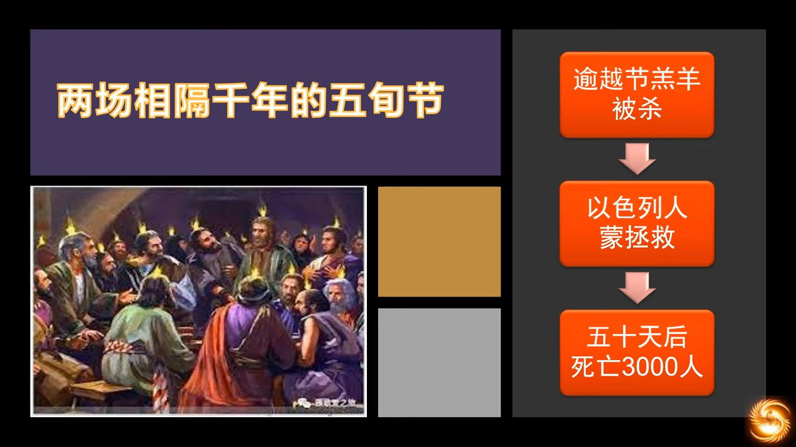
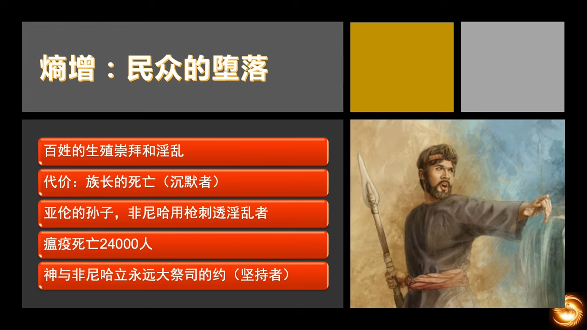
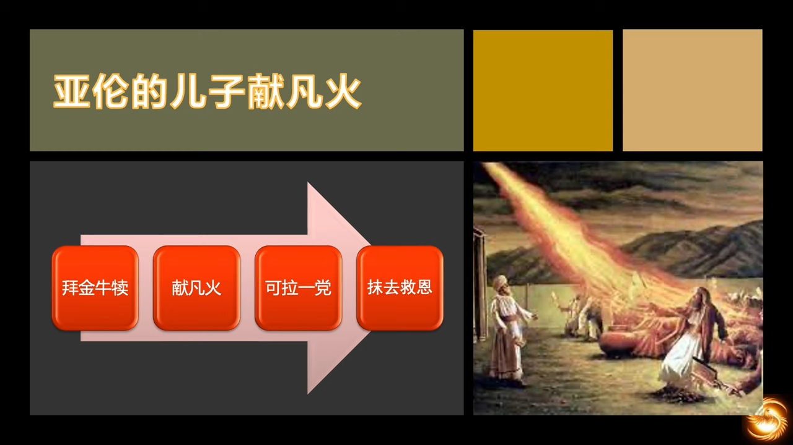
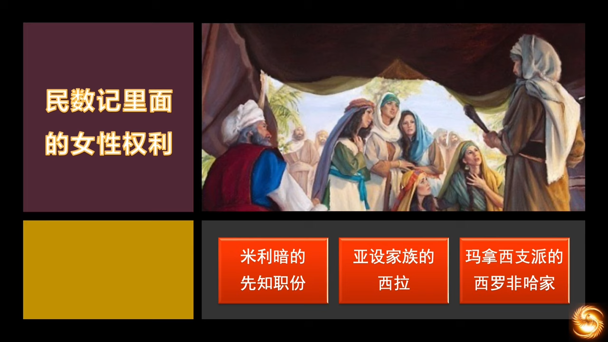
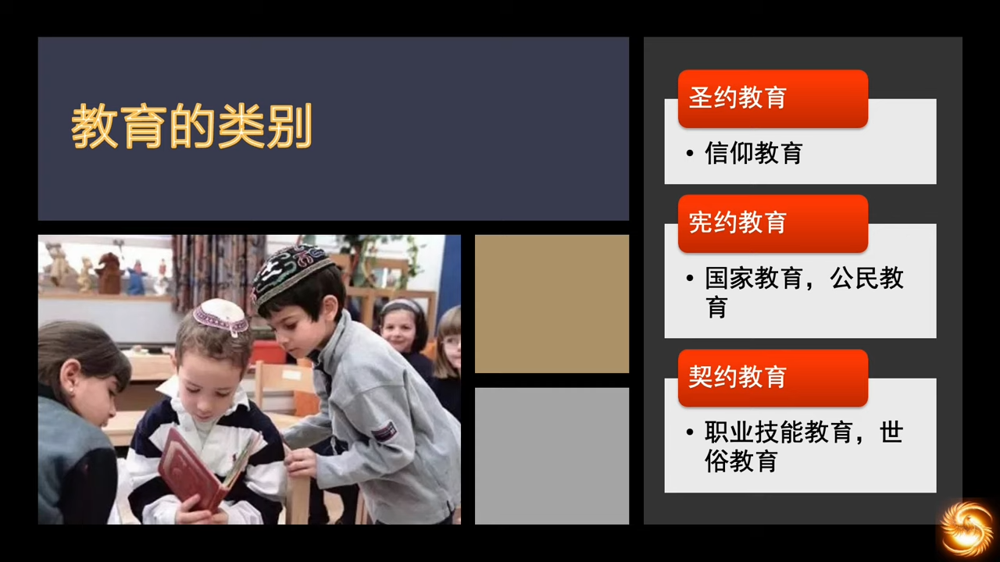
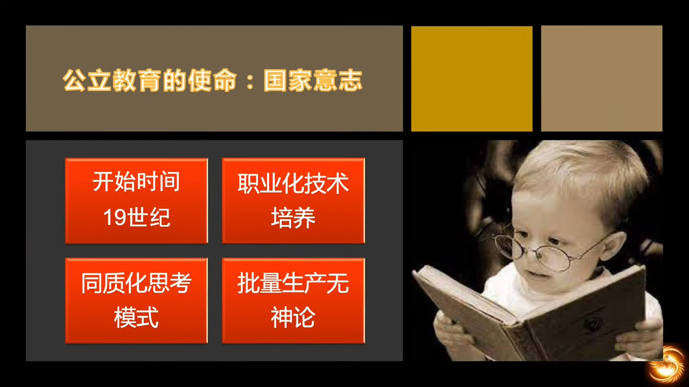

# （主日学） 圣经 旧约纵览
## (主日学) 08 申命记
https://www.youtube.com/watch?v=vlYG0LVbvwg&list=PLfChJ-aSv3VA9dN4YOF9JNxQRxmPJP2lL&index=8

向以色列人重新申明了律法，所以也称《第二律法》，并不是说是另一部律法，只是律法的第二次解读。这卷书在犹太圣经中有非常重要的地位，可以说是塑造了犹太这个民族的灵魂。

  

> 4以色列！你要听：上主我们的天主，是唯一的天主。5你当全心、全灵、全力，爱上主你的天主。 (申命纪 6)

以色列的教育是非常独特的，使其在任何一个民族中，活得都非常独立。他们的民族残存、信仰残存，都应验了圣经里说他们的话。摩西五经对他们来说也是教育的书籍。

- 创世纪：世界观教育，世界的来源，人的归宿，罪的来源，神的心意
- 出埃及记：使命教育，作为神的选民，应活出有使命感的人生，活出荣耀神的生活
- 利未记：法律教育，遵守神的律法，才可以建立秩序。在有序社会中，民族精神才可能传承
- 民数记：生命教育，旷野实践，显出人的本相与使命之间的巨大差距。明白完成使命永远不能离弃神
- 申命记：以上全部

第一代出埃及的除了两个人，其他都死在了旷野。第二代成长起来了，是吃玛纳德一代人，他们对埃及没有印象，需要重新听到神的律法或是对律法的解读，需要重新记住出埃及的那一段历史，需要为进入迦南地作属灵上的预备。这是摩西写这一卷书的动机。

申命记的律法被带到了一个全新的高度，即律法的精意。当律法只是文字的时候，人只会追求律法的下限。当律法进入到精意层面去理解时，就会带领人走向律法的高处。

摩西613条律例。

选王立王，让选民了解政府，明白执政权柄的来源也是神，告诉选民政府是必要的恶，政府的权力必须得到制约。上帝还规定，君王登基时必须要亲手抄录摩西的律法，定期朗诵。说明政府必须要臣服在上帝的律法之下，这是政府合法性的来源。

逃城，是世俗权力不能触及到的地方，也暗含了信仰和政府之间的张力和分界，即政府不能管属灵的事情。

国界禁移，地上的土地价值不值得征战，设立地界的是神。地上一切的纷争，国与国，人与人，都是因为土地在打仗。但是世界上那些通过侵略产生的版图巨大的国家，最后都不能自发性地进入现代文明，比如蒙古。

违约责任，每一代人都有遵守神话语的使命，都有和神立约的责任。上一代人在旷野死去，新一代人继续和神订立圣约。遗传的恩典是不存在的，信仰里每一个人都必须认识神。

> 总的来说，就是以色列人的应许地生存指南

所离开的埃及是农业高度发达的地方，虽然是做奴隶，但还是餐餐有肉，顿顿配酒。埃及的一切都从动物性的角度消磨人的信仰和意志。摩西在旷野和人们的动物性本能抗争了38年，所以在进入应许地之前，还要再提提神。考古学证明，公元前13世纪开始后，埃及的天气发生了彻底的变化，由湿润逐渐干旱，土地也不再肥沃。迦南地也一样，不再是流奶流蜜之地了。

英国伦敦的皇家证券大楼门口有块石头，上刻有“地和其中所充满的，都属乎主”。现在以色列和周边国家争地盘的时候，都是拿着圣经为自己背书的。

- 以色列人：看，神说了，把这个地赐给我
- 阿拉伯人：我们是长子，我们要继承亚伯拉罕的地
- 以色列人：神说从撒拉生的才是后裔
- 阿拉伯人：神说了祂必把你们拔出，因为你们违约了

反正就是举着圣经吵来吵去，但圣经最重要的部分，启示基督的部分，他们双双忽略。

上帝同时带领以色列最大的敌人，进入了同一块地方，即今天的加沙走廊。腓力士人和亚兰人一南一北，就挟制分裂以后的南国和北国。英语Palestine词源来自于古法语，古法语来自于拉丁语，拉丁语来自于希腊语，希腊语来自希伯来语。

上帝吩咐以色列人去消灭，有些人认为上帝太残忍了。那就是本质上都没有认识到死亡的定义，三维空间的生物，是无法看到死亡后的彼岸世界，所以会以肉体的死亡为最大的悲剧。但若灵魂不灭，那肉体的死亡只是开启另一世界的大门。神的创造物堕落了，神就可以放弃，生命在于神。人之所以不能理解神为什么要杀人，本质上是对死亡的无知和恐惧。生活在迦南地的不认识神的人，哪怕活到100岁，结局也是一样的。但他们的存在，会把新进入的以色列人，也带入到上帝的愤怒中。所以上帝关照以色列人，要毁灭那里的人和牲畜。上帝并且借着这个过程，告诉以色列人，“你们如果像他们那样，别人也会这样对待你们”。后来在《士师记》中，果然发生了。

上帝的愤怒临到他们，是不冤枉的。淫乱，是应许地居民的生活写照，性病蔓延，社会不公。偶像崇拜，神庙里行奸淫。亚舍拉神（Asherah、Athirat、Ashirat，又称作阿瑟拉或阿西拉特），即“多产之神”，雕像图腾就是一个生殖器。亚哈王的王后 —— 耶洗别，就有四百个先知是拜亚舍拉的。

摩西再一次强调神的保守，不要再惦记埃及的姜葱蒜了。

在埃及以畜牧业为主，在旷野以玛纳为生，进入应许地后，面临着必须要产业转型，旷野40年不劳而获的生活要停止了。以色列的七大农作物产量是不低的，考古后来发现了很多铜矿遗迹。

> 和圣经抬杠的人，一般都会被考古学打脸，死海古卷那一巴掌，拍得最响。

考古团队，在应许地挖出的铜矿，铜矿上的建筑物可追溯到BC九世纪中期，建筑物下埋放的是超过20英尺的矿渣，是BC十世纪的。这些证明了当时这里是大型的铜生产基地，和圣经记载的大卫所罗马的统治时期是一致的。这些都被没有进入应许地的摩西给预言到了。

欧洲历史中很长时间里，是“长子通吃”的，财产、爵位等都是长子继承的。而在圣约系统中，长子要被献给神的。圣经中记载的长子大多不靠谱。

河东支派，没有约旦河作为天然屏障，很容易和外邦人征战，和平时代又容易和外邦人混杂居住，容易被同化，百姓容易陷入外邦人的信仰习惯。“天堂的门口，还有一条道路是通往地狱的”。

可拉一党，在圣约共同体中身居高位，他们并不敬畏神设立的秩序和权柄，他们自以为自己比神更公义。摩西告诉大家不要成为这三种人。

> 4以色列！你要听：上主我们的天主，是唯一的天主。5你当全心、全灵、全力，爱上主你的天主。6我今天吩咐你的这些话，你应牢记在心，7并将这些话灌输给你的子女。不论你住在家里，或在路上行走，或卧或立，常应讲论这些话；8又该系在你的手上，当作标记；悬在额上，当作徽号；9刻在你住宅的门框上和门扇上。 (申命纪 6)

教育本身就是宗教性的，教育从来不存在价值中立。以色列人的全人教育概念就来自于《示玛篇》，教育是全范围的，充满任何场合，涵盖所有时间，覆盖所有内容。以色列人圣殿没有了，他们散落在世界任何角落，集中敬拜的形式没有了。早年在耶路撒冷，以色列人是没有学校的，孩子的教育，是节期时，在圣殿里完成的。祭司负责教导律法，在家中时，父母负责教育孩子。听从了耶利米先知的信，“巴比伦生存指南”。要坚持自己的民族性，不要被同化，还要教育好自己的子女。信仰的传承绝不能断裂。

所谓的文化，就是宗教的外化，任何文化的核心，都是那个文化的宗教。比如中国人的文化，大年三十要祭祖，这个不是文化，这是祖先崇拜，就是宗教，只不过被称为文化。没有宗教内核的文化是不存在的。

教育的目的，是为了建立基督信仰。

  

这句话成为历代圣徒解读圣经的标准，成为世世代代信徒的做事指南，之所以在看圣经时会有十万个为什么，就是因为没有读懂这一句。

理性和逻辑的训练，最终会产生科学。现代科学的奠基人，基本都从基督教中产生。立约的文明，会产生契约精神。先知传统，让民众和君王保持敬畏之心，做错了先知会谴责，就有了随时被神调整的可能。这就是现代文明必须具备的几大要素。

- 理性，逻辑 => 科学
- 契约精神 => 商业文明和法治文明
- 人人有罪，君王祭司先知体系 => 最早的三权分立，现代政治文明
- 乐于奉献 => 现代福利制度，关怀体系
- 先知传统 => 君王权力受到神意的约束，英国的《大宪章》，实现了“王在法下”的宪政社会

> 现在文明不是我们追求，不是我们创造的，而是神加给我们的。

理性的研究范围仅实现于认识论，本体论的问题必须要靠信心来领受。这给一切的科学探索设定了伦理边界。比如不能给婴儿进行基因编辑，因为这违背神学的规定，也违背了医学伦理。医学伦理的建立，有神学的根基。“尊重神隐秘的旨意”，也催生出法律的程序正义原则，否定结果正义，才可以防止我们为达目的不择手段地去作恶，突破底线，成为“博弈社会”。

以色列民族在人类历史上千百年来不断受到逼迫，但是他们的教育的确是出类拔萃的。我们对孩子的教育，想要达成的目标究竟是什么？

无神论家长表示并不需要信仰，也可将孩子培养进哈佛。但逻辑上，“进哈佛”就是这些家长的信仰，对孩子进行的仍然是信仰教育。

- 圣约教育：两大阵营，上帝之子，魔鬼之子
- 宪约教育：即政府教育，公民教育。敌基督国家的教育结果，肯定是成为国家机器上的一颗小小的敌基督螺丝钉。宪约教育目的不是培养神国的子民，是为了培养国家的工具，这一点做的最好的是希特勒
- 契约教育：和某一团体立约，支付费用。比如舞蹈培训、冰球培训，技能教育，付费然后获得技能上的教育

犹太教育略有不同，犹太家庭有点钱，都会去准备教育基金，他们认为他们世世代代不应去读公立学校。在信仰上坚持的信仰上纯正的犹太人，都由家族基金支持他们的孩子读犹太教会学校。“让神的话语，成为我们的第二本能”，这必须在小时候就建立。

教育的结果，不是爱神，就是反神，没有中间地带。“等孩子十八岁了，让他自己做决定”，这是自欺欺人。在被反神教育了十来年之后，不可能自己做出决定。背后深层次的想法是，“孩子将来要混社会的，不能被信仰捆住了手脚”，本质上是人本主义的信仰。

从身边环境看到西方社会的变化，现在社会两种思潮前所未有地冲突，家长的观念和孩子的观念，从未有如此强烈的对立。在公共领域，只能听到一种声音，即政府兜售给我们的观念。反神文化前所未有地团结，教会文化越来越小众。造成这一现象的原因，就是因为教育出了问题。

公立学校的使命，是向年轻人灌输国家意志。当政府成为意识形态的主导者时，它就一定会为自己培养下一代。当政府理念是无神论理念时，那就等于是：

> 把我们的孩子，交给我们的敌人，花我们的钱，请它们把我们的孩子，培养成我们的敌人。