# （主日学） 圣经 旧约纵览
## (主日学) 09 约书亚记
https://www.youtube.com/watch?v=60Nt06UceoQ&list=PLfChJ-aSv3VA9dN4YOF9JNxQRxmPJP2lL&index=9

当道统法统传统都建立以后，在申命记里，在摩押平原上，神让摩西向以色列的下一代人，把这一切启示的内容，都传承了下去。

神在历史中展开救恩启示，我们必须要对历史有概念。历史之所以能够展开，它的载体是时间，主体是人。有理性的人，必须对时间有概念，才能构成历史观。封闭系统的概念，我们的世界是一个封闭的系统，我们现存的世界就是一切了，不会多出来也不会少。从此对于时间的所有解读，都是在时间的里面。

这里就比较诡异了，在封闭时间里的人是无法了解时间的，创世纪的第一句告诉我们，“时间是世界的边界”。所以，一切人间宗教，都是在时间内产生的，所以宗教本身不能解释时间，更不能解释历史，解释历史的唯有神自己。在两约之间，即神向以色列人沉默的四百年里（轴心时代），在那一时期，人的思想哲学达到了顶峰，无论是中国、希腊、或是印度，哲学思想都非常丰富，但是对于时间的观念，都无法脱离封闭的系统。直到圣经启示下来的时候，道成肉身的神在人间显现的时候，这一切才发生了改变。

时间是永生的派生物。我们对永生有向往，所以对时间有感知。我们如何感觉时间呢？就是历史，历史是时间的表现形式。时间比空间更为抽象，在空间中我们看到的是物质存在的形体，在时间里我们看见物质的运动。而人的运动，就是人的历史。

> 人和神之间的关系，是在时间中展开的，就是历史；人和神之间的关系、人和人之间的张力，在时间中被圣灵记录，这就是圣经启示给我们的历史。

历史的几大要素：
1. 神：没有神，历史没有意义。每一个人都有个体的角度，同一件事，敌对双方的历史记载是完全不同的。一个人的历史对另一个陌生人来说，毫无意义。历史要有意义，一定要有神，要有永恒的不变的视角来解读
1. 人：若记录中没有人，就不是历史而是考古。历史的真实性，必须通过人的行为来体现。

人对时间的概念，是通过感知光的周期性变化来产生的。这个概念的第一印象就是周而复始。人心中又有神放置的“永生”，于是自然而然地产生了“轮回”的想法。不仅是东方，西方的毕达哥拉斯也是这么想的，赞成生命是有轮回的。于是一定要不断修生养性，过圣洁的生活，摈除欲望，清静无为。这套哲学影响了苏格拉底和柏拉图，慢慢向东传递，影响到印度，再以佛教的形式影响整个东方。苏格拉底的死不太严肃，他之所以对死轻率，就是源于错误的轮回观。一个人若没有永恒观，就会怕死；若有了错误的永恒观，对生死就没有严肃的责任感。这一现象直到基督到来才结束，基督给我们的历史观带来了全新的、革命性的观念，即历史是一条直线，这条线的起点是基督，终点也是基督。

> 我是‘阿耳法’和‘敖默加’，最初的和最末的，元始和终末。 (默示录 22:13)

> 1天主在古时，曾多次并以多种方式，藉着先知对我们的祖先说过话。2但在这末期内，他藉着自己的儿子对我们说了话。天主立了他为万有的承继者，并藉着他造成了宇宙。 (希伯来书 1)

> 他是天主光荣的反映，是天主本体的真像，以自己大能的话支撑万有；当他涤除了罪恶之后，便在高天上坐于“尊威”的右边。 (希伯来书 1:3)

由此可见，基督是创造因、存在因、终结因。整个历史是直线的，是连接的，是向前走的。我们只是在历史中的一个点，如何认识这位超越时间的主呢，所以我们需要启示，需要圣灵，这就是圣经要告诉我们的。

基督教是有历史的宗教，从创世到现在，上帝要子民记住上帝的公义、圣洁和信实。历史是上帝待人方式的记录。基督徒的历史观是从圣经对人、对人的本性、对命运的理解开始的。在宇宙被造之处，历史有特殊的开始；在基督再来的时候，会有一个特别的终点。从此，上帝的标准，独立于所有人之外，这是人类客观的标准。

真理是客观的标准，这在当时是颠覆性的概念，基督教的历史观，就是用神的标准来裁判人类或者国家的行为。所以我们评价某位历史学家的著作和结论时，我们必须要考虑这位历史学家的世界观和其所处的时代。同样的历史，可以有不同的历史观，归根结底这是我们的价值观在做判断。圣经中上帝建立了三个机构，即家庭、公民政府、教会。圣经的历史书部分，也主要是按照这三个方面展开的：
1. 从家庭的历史中，带出亚伯拉罕的后裔，大卫的子孙 —— 耶稣基督
1. 从公民社会的角度，告诉我们世上一切政权的短暂性
1. 只有圣约共同体 —— 教会，才有永恒的意义。

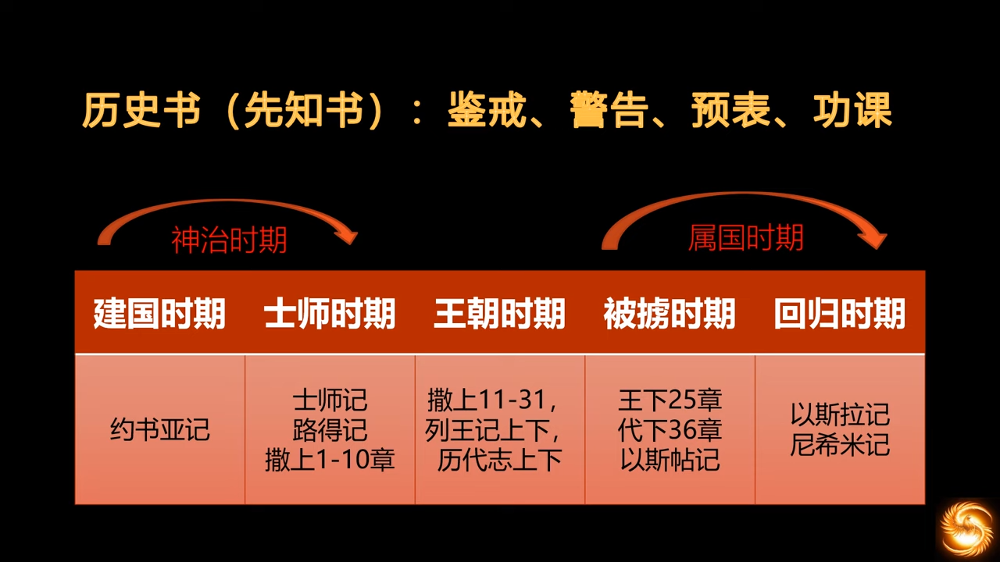

圣经的历史书（先知书）共有十二卷，从以色列建国时期到被掳外邦，在神的怜悯下，少数余民回归故土。大致的时间分割是，建国时期和士师时期，这段时期他们是以神为王，是神治的联合政府，类似于建国初期的美国。但没过多久，就各人按照各人自己的意思去做，行到行不下去，松散的联合王国模式无法维系，他们就像神要一个王，就进入了王国时期。这非常像罗马的历史，罗马原本是共和国的，多民族自治联邦，后期也不可避免地走入了帝国的形态。任何一个多民族的大国，最后走向大一统是必然的命运，只有基督教传统的欧洲是一个例外。王国时期维持了大约五百年，经历了扫罗王、大卫王、所罗门王，之后就是南国北国的分裂，成为两个国家，最后还是双双被掳，王朝覆灭。之后大约190年时间，记录了被掳时期和回归时期的一些事情。历史书神记载了是为了给我们看的，神不止记录历史，还通过各个时期的先知，来解读历史，告诉我们神的心意。

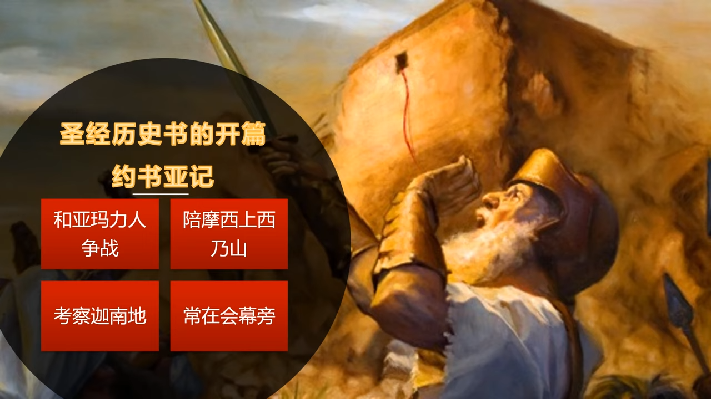

圣经中的第一本历史书《约书亚记》，约书亚是神选的接班人。通过记录他的一生，来记录以色列的历史。开头是他从上帝领受呼召，最后结语是他最后一次讲道，以及死亡和埋葬。约书亚是以色列的第二代领导人，他从摩西这里领受教导，带领一批已经认识律法的百姓，在今后的生活中，要活出律法的要求。

圣经中详细记载的关键人物，包括后来的扫罗王、大卫王、所罗门王，他们的历史是非常重要的历史，神有很多属灵功课，需要通过这些历史去学习。 

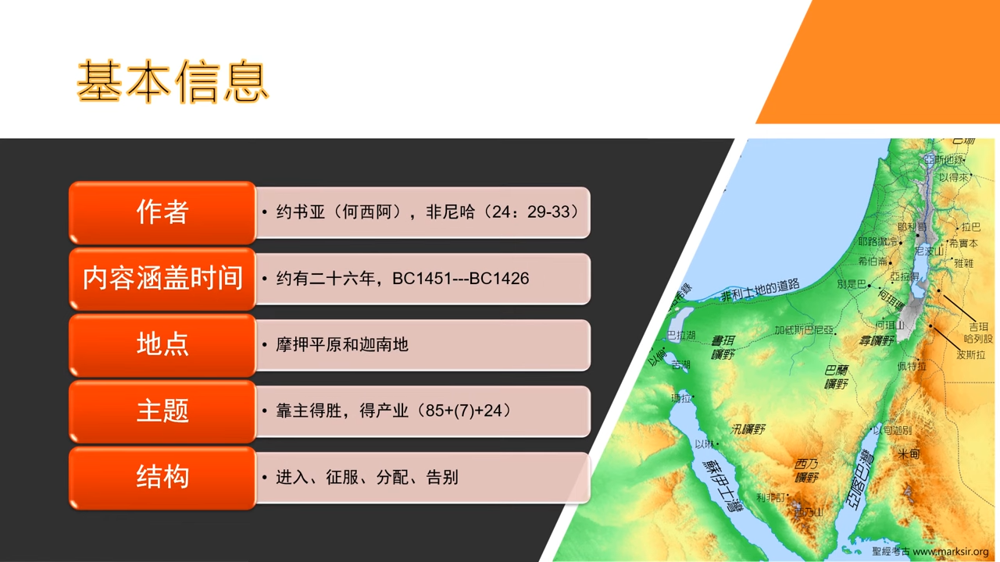

作者约书亚，原名何西阿，希腊语也翻译作ΙΗΣΟΥΣ(即Jesus，耶稣)，就是预表。最后一部分是非尼哈写的，非尼哈就是拿枪刺穿了行淫的人，神应许了非尼哈的后裔做永远的祭司，他的后裔在新约时代就是撒杜塞人。约书亚是耶稣的预表。

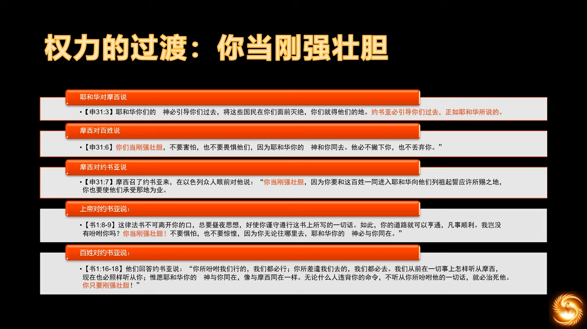

圣约共同体的权力是如何过渡的：神将旨意告诉摩西 -> 摩西告诉百姓，并鼓励百姓和约书亚 -> 摩西在百姓面前特别嘱咐约书亚 -> 神对约书亚嘱咐 -> 最后以色列百姓回应约书亚的教导。神通过四次同样的话，来昭示和验证祂的拣选。

我们如何确定某一个旨意是来自于上帝的呢，这个方法可以参考。
1. 神的旨意不会违背圣经
1. 多来自有神的权柄的系统，比如教会官方、教会长者、教会中受人敬重的长者
1. 有群众基础，比如有家人朋友的支持。

没有记载约书亚的回应，因为不需要，他一直在神的会幕中不离开，是一敬虔爱主的人。

> 时刻在基督里，是领受神旨意的基本条件。

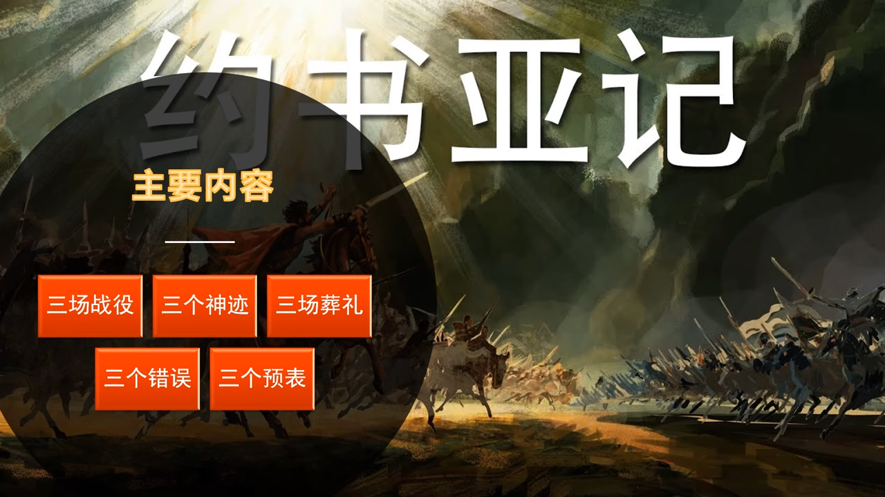  
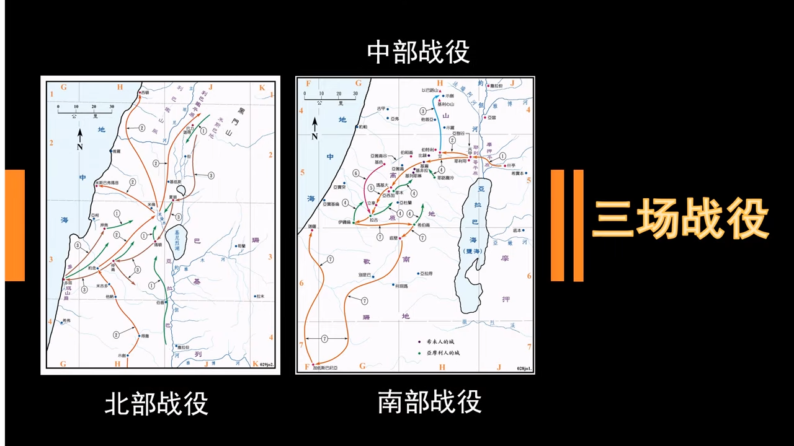

从第二章到二十二章，都在描述如何占领上帝应许的地方，因为那里有其他的族群。约书亚带领他们通过三场战役，占领了迦南地。策略很高明，从约旦河穿入，进入耶利哥平原，先征服了中央部分，就分割了迦南地的族群。先横扫南部，再横扫北部。十二章列出了约书亚打败的那24个王（部落首领），在整个约书亚的战争过程中，总共打败了31个王。

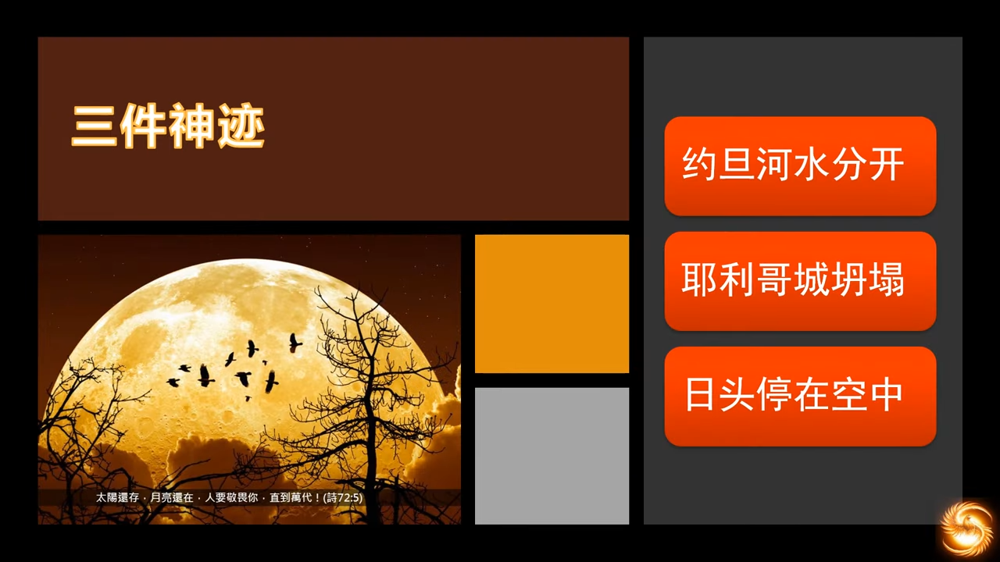

三场战争中，以色列人看到三件神迹，三件都是有属灵意义的。
1. 神的能力分开约旦河水，保守他们的行动
1. 耶利哥城的坍塌，是神的方法，而不是人的聪明和能力
1. 日头停在空中，说明神的旨意究竟如何

过约旦河的那一天，天就不再降下玛纳，他们终于尝到了水果和粮食的滋味。上帝赐的是流奶流蜜之地，这时开始，选民的行为和得到的祝福就有了相关联的关系，是否听神的话就变得很关键。面前就是应许地，眼前一条河，到底是去还是不去呢，“我想去，但是没船，神给我们造船啊”，这是人的思维。神的方案是在人的行动中展开的，人先行动，神再将水断流。神的方法太高明，人太有限了，完全无法了解神的方案。按照神的旨意，行动就行了，剩下的让圣灵带领。

过了约旦河，在吉甲呆了一段时间，从约旦河取了十二块石头，立在吉甲作为标记。让后代纪念当时上帝是如何为他们弄断河水。这是记录历史，在旧约时代中，文字尚未普及，他们就用立石头的方式来纪念，否则一代人之后就遗忘了。他们时常被提醒要纪念上帝为他们所做之事，我们基督徒也一样，领受饼和杯，就是为了纪念耶稣，需要时常被提醒，不然下一代就不会了解历史，就会离开神。另外在吉甲还做了割礼，和神立约的记号。在打仗前先行割礼，耐人寻味。示剑屠城说明行割礼是件风险很大的事情，特别是征战之前，这就是神告诉我们，要先摆正和神的关系，才能征战，不然都不知道是在干什么。

两名探子在妓院落脚，遇到喇合，喇合是耶稣的祖先，耶稣的祖先居然是妓女，说明圣经真的是神写的。喇合对以色列的神非常渴慕，当城里人来搜寻探子时，喇合帮忙藏匿了两名探子。有人疑惑喇合的行为是背叛，难道圣经推崇的价值观是背叛吗？喇合的回答说，“我相信你们的神，祂要把这块地赐给你们，所以我想站在你们这边”。可见，虽然信心和忠诚是优秀的品质，但是信心和忠诚的对象更为重要，否则，对黑帮头子很忠诚，依然逃不过被抓被审判的命运，只有神才有赦免的权柄。新约中有两位作者将喇合视为信心的榜样。

> 13当若苏厄走近耶里哥时，举目一望，看见一个人立在他面前，手持脱鞘的刀。若苏厄走到那人面前问他说：“你是我们的人，还是我们仇敌的人？”14那人回答说：“不，我是上主军旅的元帅，刚来到这里。”若苏厄便俯伏至地，向他下拜说：“我主有什么事要指示自己的仆人呢？” (若苏厄书 5)

作为领袖，约书亚在夜间绕着耶利哥城巡视，遇到一带刀的人，约书亚问带刀人是哪一边的，带刀人说“不是，我来是做耶和华军队的元帅”。人本主义的视角，一切都是关于“我”的，要不就是帮助我，要不就是反对我，不可能是中立的。这里是提醒约书亚，“如果你站在上帝这边，上帝就是你的最高统帅”。

城墙倒塌，唯独喇合房子的那一段没有塌。上帝吩咐将城中所有的东西都消灭，包括牛羊，人不许收取战利品，因为这场战争，是上帝亲自打的。

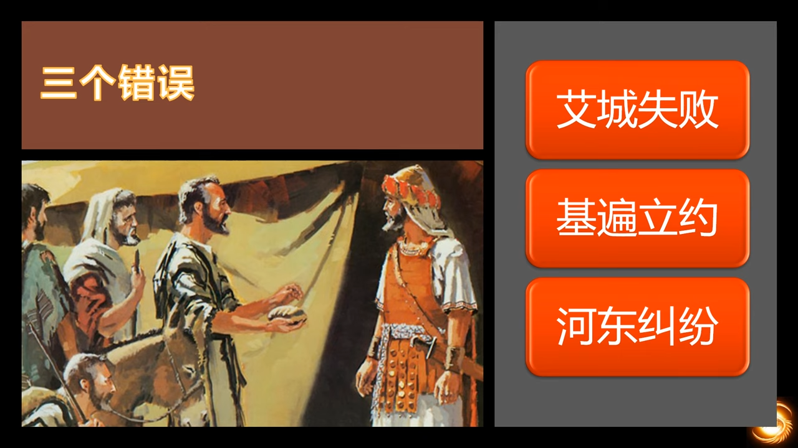

神的选民犯的错误，圣经是诚实的，作者是圣灵，在圣灵的眼中，没有人需要护短，因为在神面前，每一个人都是赤裸敞开的。三个错误，1是因为坏，2是因为蠢，3是因为太自信。

当以色列人发现光凭吼叫就可以胜利的时候，他们充满了自信，觉得神与他们同在，艾城似乎是唾手可得的。聚集了十二支派，通过抽签的方式，找出了偷拿了耶利哥城东西的亚干的家族。亚干虽然是一人犯罪，却害惨了上帝所有的百姓。借着这事，神告诉百姓，作为圣约共同体，是一个整体，互相负有监督和劝勉的责任。与“合一”相比，“圣洁”更为重要，神要的是“在圣洁中的合一”，“合在一起圣洁”。而绝不是“合在一起犯罪”。

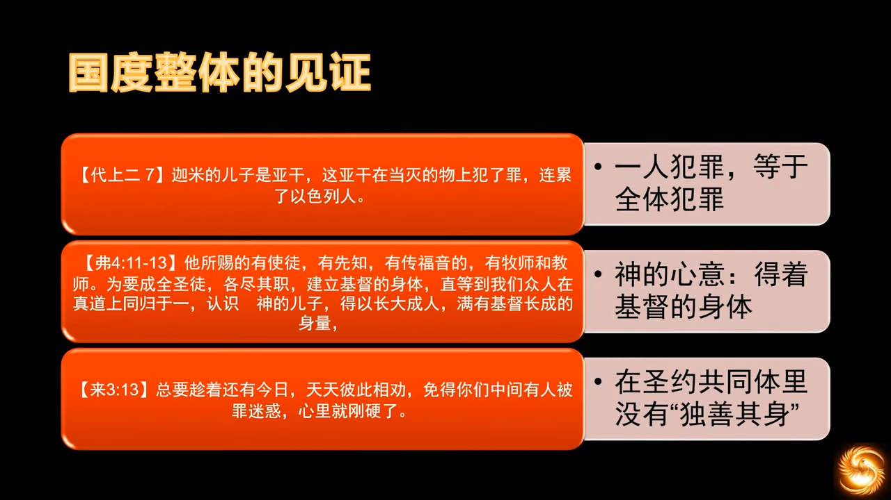

今天神的心意是要得着基督的身体，在教会中要得着荣耀。所以，没有一个肢体是可以清高自益，独善其身的。圣约共同体有互相监督和帮助的责任。

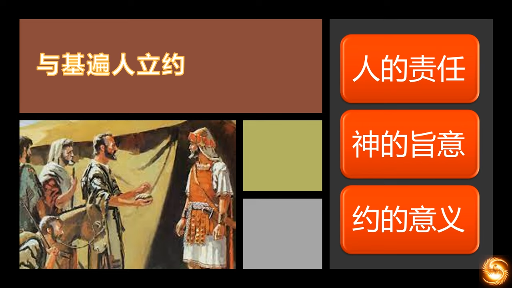

第二个错误是上当受骗，基遍人装作远道而来和约书亚立约，而神的命令是要消灭迦南人。这件事情选民没有求问上帝，导致小小的疏忽之后不断被放大，其他民族得知基遍人和以色列人立约后，联盟攻打基遍。以色列作为立约的盟约，要帮忙打仗，神允许以色列帮助盟友，并施行神迹，证实了神的同在。

神用神迹来坚固以色列人因愚蠢而立下的约。被由耶路撒冷王带领的五个王攻击，约书亚作为盟友，有出战的责任。神告诉约书亚要上去征战，并且应许了与他同在。约书亚祷告请求太阳月亮在天上停住，达一日之久。说明神不仅是守约的神，更是时间的主人。

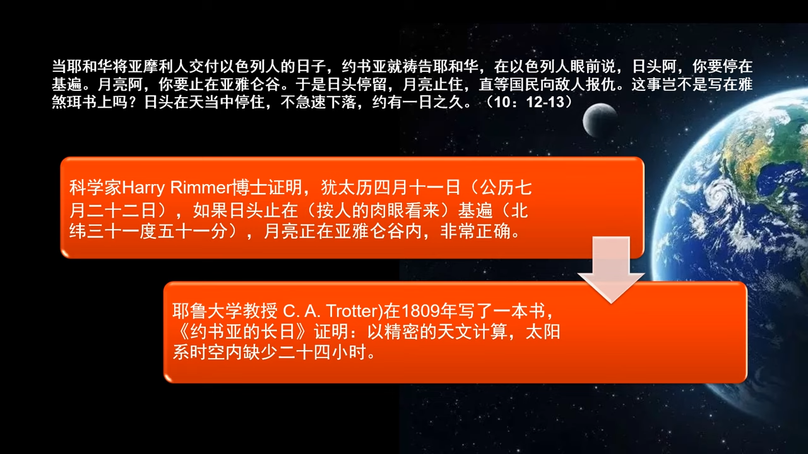

圣经的描述是完全正确的，当天文的误差只能在圣经中寻找答案时，科学的有限性也就体现出来了。

虽然是被骗立约的，但是被骗的约也是约，含着泪也要履行。立约前的尽职调查没有做，是选民的责任，不是上帝的责任。神是立约的神，也看重我们的约，任何违约的行为都是不被神所悦纳的。神还是坚固了这个约，这是程序正义的一部分。若讲结果正义，以色列人分分钟翻脸，但神没有允许他们这样做。

所谓的不平等条约，是荒谬的，觉得不平等可以不签，签了就是约，约就是约。

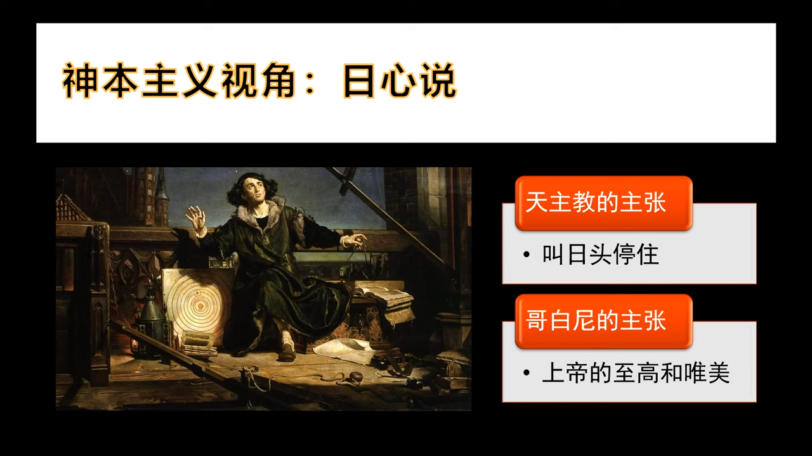

上千年以来，天主教根据这段经文，结合亚里士多德时代的托勒密体系，坚持地心说，因为神是“让日头停住”，不是让地球停住。但托勒密自己也发现在角速度上是不均匀的，只能添加一个常数来弥补不足，但实际上天体运行轨道是椭圆的，但历代信徒不信，因为觉得上帝不可能使用椭圆，椭圆不完美。后来一位天主教神父兼医生 —— 哥白尼，通过调整视角，变为日心说，运算大大简化。椭圆的问题是再之后开普勒确立了椭圆学说来解决的。哥白尼时代是没有天文望远镜的，天文望远镜是AD1608发明的，哥白尼出生于AD1473年，所以哥白尼的日心说完全是数学运算的结果，他觉得若有更简洁的方法来描述上帝的工作，就不要用复杂的方式，因为上帝的至高和唯美。

《天体运行论》出版发行了送到他家的那天，他去世了，他是否看到了自己的这本书，我们无从得知。这本书一开始并没有什么神学影响，大家都当成学术书籍来看，甚至当时的罗马教宗也拿来看得津津有味的。一直到宗教改革，到了伽利略时代，巴黎大学的一批教授把它上升到了神学问题，为了维护亚里士多德体系，把伽利略告到了教宗那里。这件事后来被反天主教的无神论者不断放大，成为控诉教宗的一大罪状，但我们知道事实并非如此。

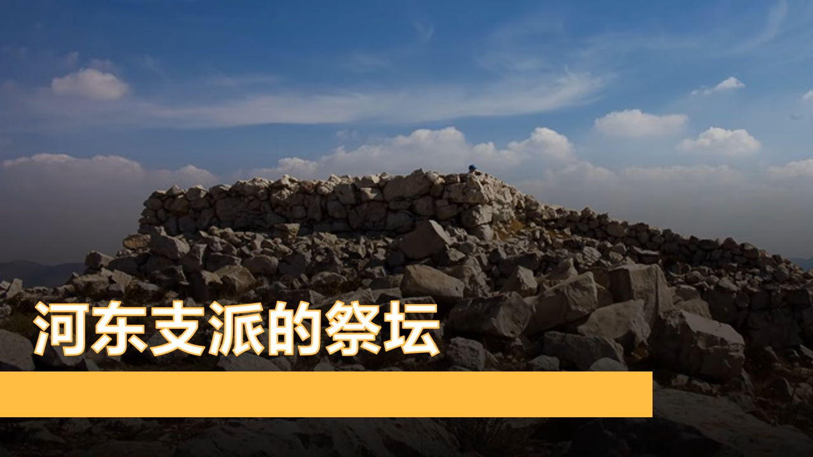

第三个错误，当约旦河东的两个半支派，在完成使命凯旋而归时犯的，他们打了七年的仗，终于被允许回到约旦河东岸的家园时，是很激动的。在跨国约旦河时，他们立了石坛，见证神的作为，让子孙后代纪念神的大能，觉得大家隔了一条大河，分开久了，子孙后代不知道前辈发生的事情，河西的兄弟不认他们怎么办呢。约旦河西岸的支派看了就很生气，这是明显违背了上帝的诫命，这一代对于诫命还保有警醒。河西的九个半支派就聚集了兵力，准备攻打两个半支派。误会解释清楚后，双方和好。

以色列民族并不比世界上任何一个其他民族更优秀，也贪钱，也愚蠢，也自以为是。明明就是普天下任何民族的样子，唯一的不同就是他们有上帝。

人类社会普遍存在的沟通困境，首先我们无法对别人进行动机揣测，人的表达方式多样，理解方式更多样，如何理解取决于对方的知识框架和经验背景。就算理解完全正确，反应方式也是完全不同的。动机揣测和理解困境，造成误会的循环。

就算是有信仰的共同体里面，也会有很多理解和沟通上的困境。所以新约中，告诉我们要“凭着爱心，说诚实话”，其他的结果就只能都交给神。

- 约书亚 -> 耶稣基督：是旧约的元帅，是为民征战的领袖；
- 过约旦河 -> 信徒与主同死：罗马书，以弗所书都有解释，摩西过红海象征着洗礼，信徒再一次过河，象征受圣灵的洗。摩西的洗是悔改的洗，跟随耶稣基督的洗是圣灵的洗；
- 以色列人征服迦南 -> 信徒战胜灵魂的敌人：我们一生的功课，得着应许地的过程。基督徒的一生不是躺赢的一生，而是征战的一生。

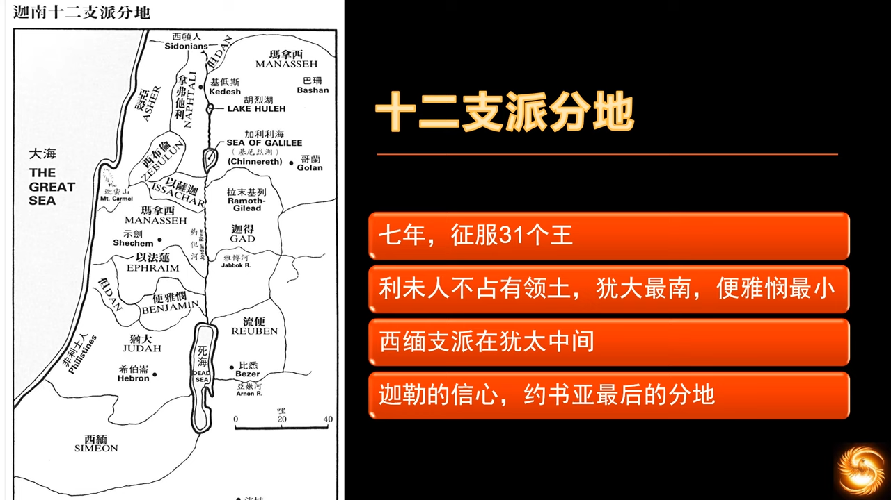

七年过去了，约书亚带领以色列人，南征北战，开疆拓土，一共消灭了31个王。便雅悯支派出过两个扫罗，一个是旧约的扫罗王，一个就是新约的扫罗（后耶稣改名为 —— 保罗），保罗写了三分之一的新约圣经。

至此，十二支派全部拥有了属于自己的土地，初步完成了几百年前神对亚伯拉罕的应许，但是还未完全得到神应许的所有疆土。

这一次的封地，是通过抽签来决定的。整本旧约，我们都能看到他们用抽签的方式来做重大的决定。抽签的方式，人就不能操纵结果，由上帝来决定结果。这种方式，是神启示摩西这么做的，目的就是消除人为的控制。所以他们用抽签方式来分土地，用抽签方式找到了亚干，也用抽签方式印证了扫罗王。

五旬节圣灵降临之后，上帝就不再用这个方式来参与决定了，上帝退群了，继续混在抽签群就没有意思了。圣经记载的最后一次抽签，是圣徒们抽签决定谁来替代犹大，在五旬节之前。五旬节之后就是圣灵亲自的带领，新约的圣徒都是切切地祷告，殷勤地做事，圣灵直接介入带领他们做事的方法和方向。

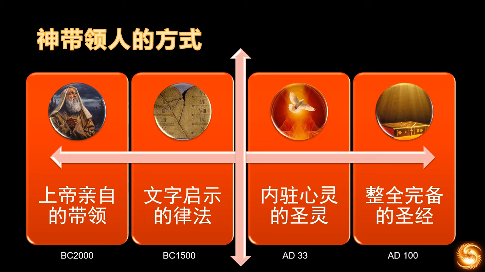

1. 先祖时代，亚伯拉罕以撒雅各，神亲自显现，是面对面说话的。到了摩西时代也是如此；
1. 约书亚时代，神也向他说话，进入应许地后，神有律法赐下，用遵守律法的方式来跟随神，但全然失败；
1. 新约时代，耶稣升天后赐下圣灵，就由内住在我们心里的圣灵来带领我们；
1. 但在人的主观思想里，很难分辨哪些灵是神来的，哪些不是。所以同时也需要以圣灵的作品 —— 圣经来辅助判断。启示录完成之后，启示录中说这本书不能再增删改，神整全的启示已完成。

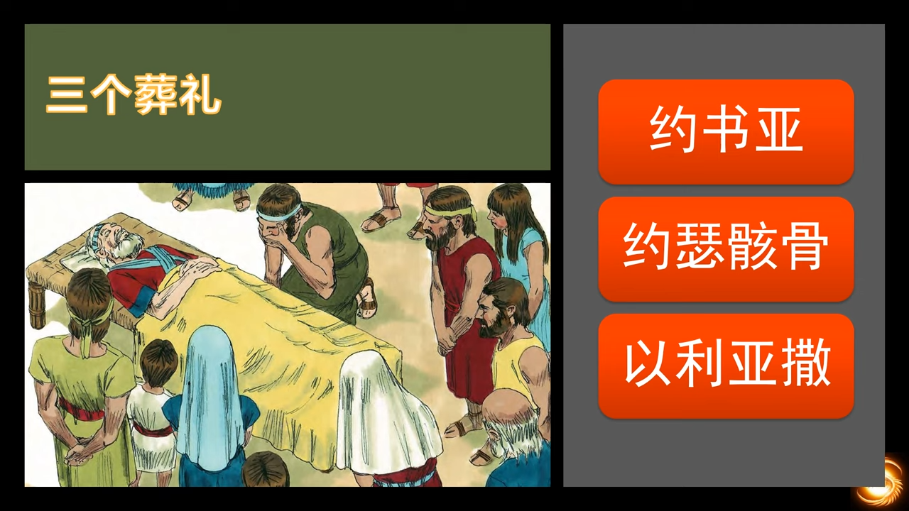

这一代人是整个以色列历史上最辉煌的一代人，一起亲身经历了以色列历史上最多的神迹。孩提时代出埃及，过红海，在西乃山下看见和上帝立约，吃玛纳，过约旦河，踏平耶利哥。也亲眼看到神对父辈的管教，对神有敬畏之心，因此也得到神最大的祝福，从奴隶到选民，身经百战，开拓出以色列国土的大部分。

特别是约书亚，前半生在埃及为奴，因为同胞拖累，而流浪荒漠四十年。后来又接过摩西的重任，带领以色列人进入迦南，征战七年，战功赫赫，却是最后一个分地的。是以色列当之无愧的领袖。圣经中记载的几位几乎无大缺点的人，约瑟算一位，约书亚算一位，还有但以理算一位。约书亚在世时，那一代的长老都还在，百姓都忠心侍奉上帝，但从下一代开始情况就恶化了，第二代基督徒就很难像信主的父母那样火热那样忠心地去侍奉上帝。这个问题在每一代的基督教会中都在上演，好在有神的怜悯和守护，不断地复兴教会，使我们的历史可以向前推进。

每一代人都必须自己重新认识神，虽然自己听过上帝在自己的父母或祖父母身上的作为，但是还是必须自己亲自经历神。

约书亚之后的这一代人，是被父母领着抱着进入迦南的，刚刚成年就随着父母住进了豪宅，享用迦南丰饶的物产，羡慕迦南当地人娴熟的冶炼技术，就故意违背摩西和约书亚的嘱咐，舍不得驱逐残余的迦南人。收编了做苦工做帮手，时间久了自然就有了通婚。以色列人就有部分慢慢地被迦南配偶的文化和宗教崇拜吸引，下跪在了迦南人的神像前。

在尼希米记中说过，他们进入应许地的豪宅后，根本没有遵守神的教导，没有过住棚节。一直到被掳回归后，才又开始守这个节，这一停，就是九百年。

> 由充军回来的全会众，都搭造了帐棚，住在帐棚内；从农的儿子若苏厄之日起，直到今日，以色列没有举行过如此的盛事，大家都非常欢乐。 (厄斯德拉下 8:17)

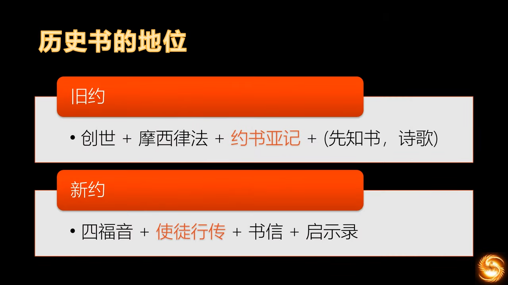

从以色列人在应许地分地的记载，我们就能知道约书亚记的圣经地位。如果没有这卷书，会对之后的记载完全抓瞎。这本书是后面书卷的“地图”，是摩西五经和之后书卷的“连接点”。这一点和使徒行传非常相似，若没有使徒行传，我们就根本不知道后面的书信在讲些什么。

旧约的结构：
1. 创世纪告诉我们世界如何开始
1. 摩西五经告诉我们神的启示和原则
1. 历史书告诉我们他们开始启程
1. 接下去的先知书告诉我们他们到底做得怎么样

新约的结构：
1. 四福音告诉我们神的救赎工作已经完成
1. 历史书、使徒行传告诉我们他们开始启程
1. 书信告诉我们他们做得怎么样
1. 启示录告诉我们世界的结局

结构惊人地相似。

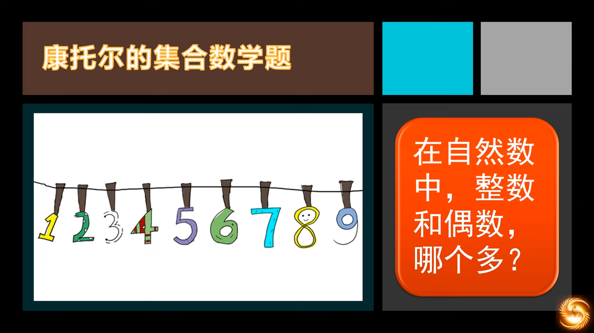

集合论中的基本问题，建立一一映射的对应关系。

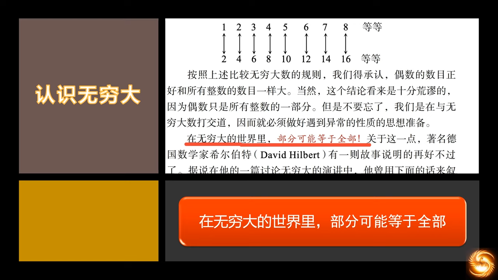

一个无穷的集合，和自己的一部分，是一样多的！“无限多的局部，就等于整体”。帮助我们理解今天的经文，为何亚干犯罪，全以色列人跟着倒霉；大卫王犯罪，老百姓要死七万人。

因为神是无限的，在神的视角中，从无限看有限，在无限的集合中，局部等于全部。

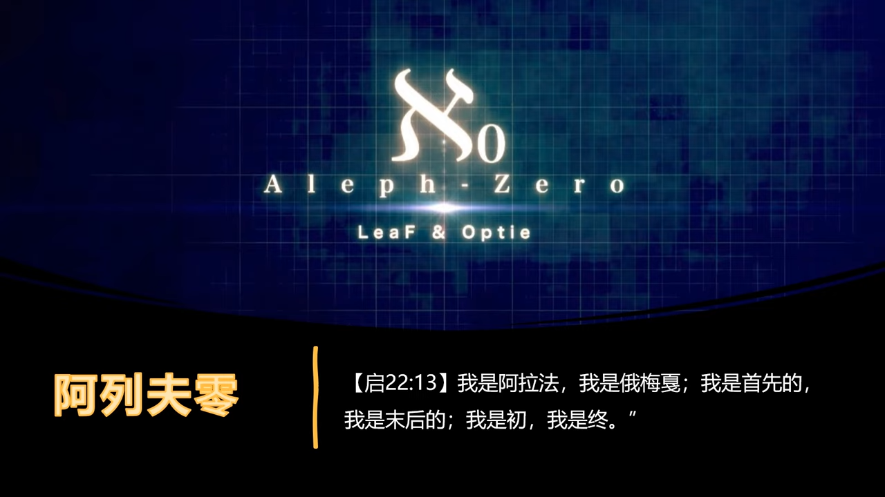

数学家用这个词来定义集合，背后有很深的神学背景。我们若是没有圣经背景，连数学都只能学个皮毛。一旦涉及“无穷无限”的概念，我们的直觉就会出问题。一般遇到的悖论，都是出现在集合论领域。

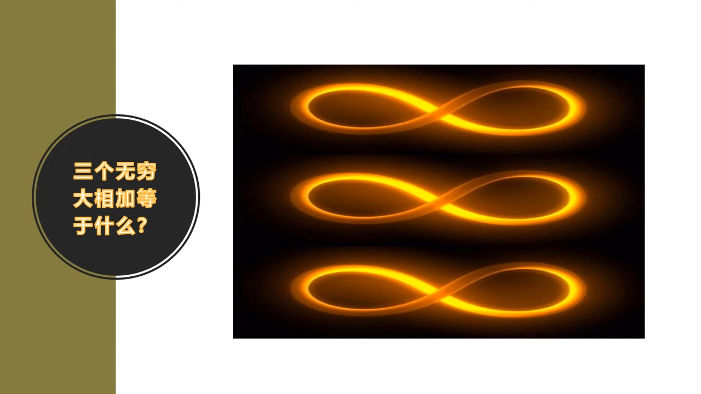

三位一体，三个无限的神，加起来是一位无限的神。可见古代的教父们，数学功底比现代人要好太多了。也能理解神为何拣选希腊和罗马成为祂最初的道场，因为那里有祂早早的预备。

我们要理解“无穷大”不足以描述神，因为祂超越物质超越时空，祂不在我们有限的空间内，“无穷大”是人间的概念。但是就连有限时空里的数学概念，都有我们无法理解的奥秘、我们无法了解的领域。我们对神的奥秘束手无策，只能在神的奥秘前，肃然起敬，承认自己的渺小和无知。

> 我们的知识是有限的，我们的无知是无限的。

承认这一点看似不难，实则很难，因为人是“越无知越自信”。难怪很多人说数学是极具神性的语言，是神建立秩序的基础语言。出数学家和法学家最多的群体是改革宗长老会，最硬核的加尔文主义者，也是出美国总统最多的宗派。

圣经的亮光照亮人类知识的全部领域，科学的每一步都是从圣经而来的。近两百年来的自由主义迷雾，迷惑了我们的眼睛，使我们看不到这一点。而我们明白这可怜的一点点科学，都是因为，神爱我们。

> 14所以你们应该敬畏上主，诚心敬意地事奉他，抛弃你们祖先在大河那边和埃及所事奉的神，惟独事奉上主。15若是你们不乐意事奉上主，那么今天就选择你们所愿事奉的，或是你们祖先在大河那边事奉的神，或是你们现住地的阿摩黎人的神；至于我和我的家族，我们一定要事奉上主。” (若苏厄书 24)