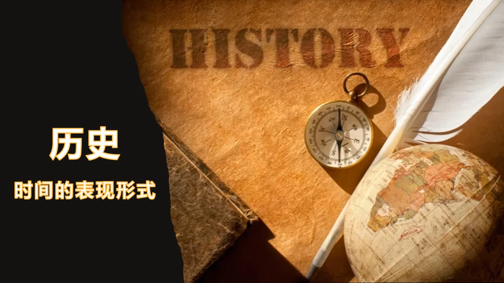
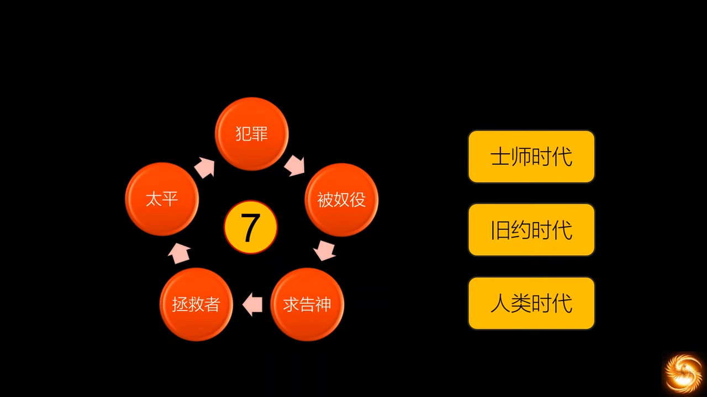
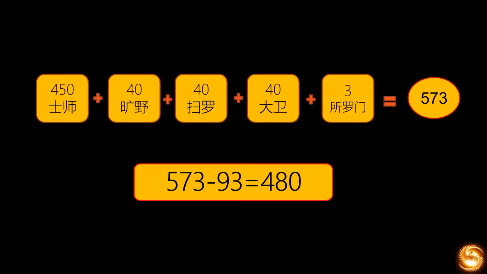

# （主日学） 圣经 旧约纵览
## （主日学） 10 士师记 路得记
https://www.youtube.com/watch?v=u9dYt8lqqoA&list=PLfChJ-aSv3VA9dN4YOF9JNxQRxmPJP2lL&index=10

在犹太人的《希伯来圣经》中，这两卷书本是一本。神在启示的初期将它们放在一起，想必其中有想要我们领受的深意。

总的来说，圣经可以说是历史书，历史记载占了很大的篇幅，世界其他宗教的经书不具备这个特征。圣经是历史书，描述的起始时间比其他任何历史书都要早，结束的时间又比其他的都要晚，其他历史书是片段，圣经历史书覆盖了全部的时间。而且圣经记载的历史是任何史学家都写不出的，因为没人在创世那一刻在场，没人能目睹宇宙的终结。

人的历史都是在时间中观察记录，所以和周期性的时间现象有高度一致性，即循环历史观，朝代更替。英国历史学家汤因比 `阿诺德·约瑟夫·汤因比，1889 - 1975` 在其《历史研究》一书中，一直试图寻找历史的模式，历史周期性变动的规律，比如经济萧条、经济增长，根据经济情况，他判断文明也有兴衰。往前已有二十一个文明曾经兴起过又衰亡，它们的兴衰模式都非常类似，罗马帝国也是一样。在历史学家眼中，历史就是在这样的起起落落之中，循环前进。这种历史观已比古希腊单纯的“循环历史观”更为先进了，因为这个是循环进步的，螺旋式的。事实真如此吗？

如果从人的角度出发观察历史，确实能得到循环的历史观点。以色列人在进入应许地之后的历史，的确是循环的，都不用仔细寻找，也会感知到这种近乎绝望的循环模式。整段经文似乎就是用同一个模板。

- 以色列人行耶和华眼中看为恶的事，一共出现了7次
- 耶和华怒气发作，将以色列交到外邦人手中。这么做是根据《利未记》和《申命记》中以色列和上帝立的约
- 以色列人呼求耶和华，耶和华兴起一个拯救者
- 获得胜利，国中太平xx年
- (下一个循环)

以色列的循环失败史，不仅仅限于《士师记》时期，事实上整个历史都是这样的情况，几乎涵盖了整本旧约。

这样的轮回在《士师记》中记录了7次。7是个神奇的数字，象征了完全，象征着神所启示的所有，意味着这样的轮回是没有止境的。在旧约时代能看到整个以色列人怎样在罪中挣扎、堕落、恢复、又堕落，每况愈下，最终走向整体被掳。在绝望中盼望弥赛亚。我们再看福音的历史，教会的历史，神的子民也是一摸一样，以色列人没有什么可嘲笑的。每到一定的时候，神的子民就是会转离神的话语，向世界妥协，和世俗勾兑，参与世界的恶行。然后神再兴起属灵的复兴，修复受伤的灵命，几代人之后，再开始新一轮的堕落。这就是我们在末世迫切地学习《士师记》的意义，我们需要警醒。

当时在应许地的以色列人为何会产生这样的状况呢？答案在第二章第一节。

> :latin_cross:  
> 1上主的使者从基耳加耳上到波津说：“我使你们由埃及上来，领你们进入了我向你们祖先所誓许的地方；我曾说过：我永不废弃我与你们所立的盟约，2你们也不可与这地方的居民结约，且要拆毁他们的祭坛。但你们没有听从我的声音；你们这是作的什么事？3为此我现在说：我必不把他们从你们面前赶走，他们为你们将是陷阱，他们的神要成为你们的罗网。” (民长纪 2)

这种被外族压制的状态，是神允许的，原因是以色列人没有遵守神的诫命。在《约书亚记》中约书亚被骗立约，但神还是帮助约书亚去履行盟友的约定，让日头停住一天。但人不可避免地容易陷入一种自欺的状态，认为“神不禁止即可为”，于是和留在应许地的迦南人立约，甚至立的是婚约，故意利用迦南人的劳动力来为自己所用，“被骗立约”和“故意违背神的旨意去立约”完全是两码事。神是鉴查一切的神，人的小心思是逃不过神的眼睛的。

- 和神立的是圣约，是第一优先级的，但是却被违约了，违约后就自然而然地需要承担违约责任；
- 和基便立的约是无知的时候立的，神也没有责怪；
- 但自己有意违背神的旨意所立的约，就必须要承担后果，因为这约违背了圣约，不可能所有约都是蒙神祝福的。

> :latin_cross:  
> 你们不要与不信的人共负一轭（è），因为正义与不法之间，那能有什么相通？或者，光明之于黑暗，那能有什么联系？ (格林多后书 6:14)

以色列人和迦南人立的甚至是婚约，和迦南人通婚了。一般情况下，基督徒和非基督徒通婚，大概率是基督徒变成“小信”的人，类似上方的人拉下方的人，总是更累，因为有重力做功，所以罪人的本性，就是往下的。和神立了约，就要承担违约责任，要面对在应许地无法被消灭的外邦人。如何和外邦人相处，就考验了接下去世世代代的以色列人。地图上黄色部分是已经得到的，粉色是已划分但尚未得到。

特别需要一提的是耶稣撒冷（粉色），经上记载是犹大支派曾拿下耶路撒冷，后交给便雅悯支派，便雅悯支派又弄丢了，后直到大卫王时代才攻陷占领，作为以色列的圣城，大卫定都耶路撒冷，这也是神的旨意。

若第一代人的错误，后人可以吸取教训，那尚有挽回的机会。以色列人和神立的约中，有“守约施慈愛”这个选项，不是说一次犯错，就世代受罚。神给每代人的机会都是一样的，是平等的。旷野一代人屡教不改，但并未影响下一代进入应许地，下一代好好听了耶和华的话，还是可以得着祝福的。但是圣经又记载说，

> :latin_cross:  
> 当那一代人都归于他们的祖先以后，在他们之后，兴起了另一代，他们不认识上主，也不知道上主为以色列所行的事迹。 (民长纪 2:10)

可见是教育出了问题。不仅违约，连申命记中的教育责任也没有履行。出埃及、过红海的这些神迹、在旷野的神迹、进迦南的神迹，统统都不知道了。一切问题的根源，都出在教育。

> [!TIP]  
> 一代人的教室哲学，就是下一代的政府哲学 —— 林肯

不认识真神，甚至还快乐地与迦南人通婚，开启了迦南地的多元文化生活。容忍异教崇拜，到跟随着去崇拜偶像。这之间，仅仅需要一纸婚约。生活在和平年代的人，是很容易被异教同化的。信仰最衰弱的时候，往往是没有逼迫的时候，是吃好喝好睡好玩好的日子，快乐得压根不需要神。所以神留下这几支迦南人，目的就是试验那不曾知道与迦南征战之事的以色列人，好叫后代又知道又学习未曾晓得的战事。

> [!TIP]  
> 如果不愿意从先辈的嘴里学到，就只能从生活中去体会到。

结果令神失望，以色列人住在外族当中，互相通婚，最过分的是，侍奉外邦人的恶神。罪行，从违反第十诫，升至违反了第一诫。一开始不灭除外邦人的原因是想把他们当成奴仆来使唤，“贪恋他人的奴婢”。结果当外邦人数量达到一定比例时，文化的反向吞噬出现了，成为普遍现象。

现在社会也同样需要警醒，生活中非常容易感受到这一点。带领一个人信福音是很难的，但孩子长大了离开教会，或是成年人因为小小的事离开教会离开神，就是很容易的。这就是内心的罪的缘故，走楼梯很累，坐滑梯很舒服，堕落的感觉，一定比走天路好太多了。

时间轴大致列出了士师记的主要内容，一共约450年。

> :latin_cross:  
> 约有四百五十年。此后，又给他们立了民长，直到撒慕尔先知时代。 (宗徒大事录 13:20)

时间轴上黑色的时期，就是以色列人被外族压制的时间，加起来一共约93年。但是列王纪说，

> :latin_cross:  
> 以色列子民出离埃及地后四百八十年，撒罗满作以色列王第四年"齐夫"月，【即二月】，开始建造上主的殿。 (列王纪上 6:1)

这两个数字对不上了？难道圣经出错了？圣经不可能出错。

士师时间450年，在旷野放飞自我40年，扫罗40年，大卫王40年，3年所罗门王。这样的话，出埃及已是573年，减去被外族压制的93年，正好480年。列王纪是先知耶利米写的，代表上帝发言，在上帝的眼中，被魔鬼压制的年月，是不算数的。如果活得和上帝无关，上帝就不care。

士师记主要结构，大致可以分为三个部分，第一部分介绍原因。表面上看，没有彻底赶走迦南人是政治原因，因为上一代不够努力。事实上是宗教原因，因为拜巴力，拜假神，失去了真神的祝福和保守。这一部分是神总结性地告诉我们士师记的时代背景。

第二部分是十二个士师，神兴起的士师遍及以色列十二支派，除了利未人。兴起的有战士、有私生子、有女性、有生下来就归神的拿細耳人，可见神不偏待人。为何没有利未人？

- 俄陀聂，犹大支派，迦勒的女婿和侄儿。迦勒是旷野一代仅存的可以进入应许地的元老之一，说明以色列人真的是从第二代就开始败坏了，速度惊人；
- 以笏，便雅悯支派；珊迦，流便支派，便雅悯支派是被六个哥哥的支派所包围的，周围没有敌人，所以他们和迦南人通婚联姻，完全不是因为军事或政治，纯粹是贪图迦南人的劳动力；流便就更好理解了，流便支派在约旦河东，河东支派和周边的敌人有更多的冲突，也会有更多的民间融合，因缺少约旦河作为天然的屏障；
- 底波拉，女性，说明这地方神已经挑不出男人了，也说明当时以色列这地方男丁的信仰状态衰弱；
- 基甸，玛拿西西部支派，以色列人已经是非常可怜的光景，被米甸人全面压制。一个细节，基甸当时躲在醡酒池打麦子，醡酒池是酿酒的地方，不够开阔，都要躲在这里打麦子，说明已经到了惊弓之鸟的地步了，也说明米甸人的攻击和扰乱很是厉害。基甸受到呼召后，做的第一件事就是摧毁巴力的坛，这当时是非常勇敢的。但他死后他的七十个儿子除了一个逃跑，其余都被小妾的儿子杀死了；
- 耶弗他，迦得支派，妓女的儿子，同父异母的兄弟都不认他，将他赶得远远的。但当仇敌来临，又想起了他，让耶弗他出来做领袖，帮助以色列人战胜仇敌。当时敌人是亚扪人，有领土之争；开战前向神许愿，若得胜归来，家中第一个出来迎接的，将作全燔祭，不料出来的是独生女；
- 参孙，但支派，拿細耳人，生下来就归耶和华，不能剃头，不能接触污秽的东西，包括尸体，有很多的禁忌。他非常勇敢，力大无穷，但他将拿細耳人的禁忌一件一件地都破坏了，活得非常潇洒和随意，屡次败在女色上。参孙虽然勇敢，但是做人完全按照自己的意思，不守神的诫命。虽然面对仇敌非常勇敢，但面对自己非常软弱。

每一个士师都有这样那样的缺点，神通过整本圣经告诉我们一个真理，“不要在地上寻找伟人，不要在地上寻找救世主”，救赎这件事情，只有神来解决。

