# （主日学） 圣经 旧约纵览
## （主日学） 10 士师记 路得记
https://www.youtube.com/watch?v=u9dYt8lqqoA&list=PLfChJ-aSv3VA9dN4YOF9JNxQRxmPJP2lL&index=10

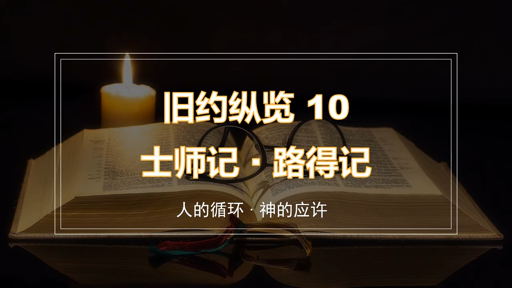

在犹太人的《希伯来圣经》中，这两卷书本是一本。神在启示的初期将它们放在一起，想必其中有想要我们领受的深意。

总的来说，圣经可以说是历史书，历史记载占了很大的篇幅，世界其他宗教的经书不具备这个特征。圣经是历史书，描述的起始时间比其他任何历史书都要早，结束的时间又比其他的都要晚，其他历史书是片段，圣经历史书覆盖了全部的时间。而且圣经记载的历史是任何史学家都写不出的，因为没人在创世那一刻在场，没人能目睹宇宙的终结。

人的历史都是在时间中观察记录，所以和周期性的时间现象有高度一致性，即循环历史观，朝代更替。英国历史学家汤因比 `阿诺德·约瑟夫·汤因比，1889 - 1975` 在其《历史研究》一书中，一直试图寻找历史的模式，历史周期性变动的规律，比如经济萧条、经济增长，根据经济情况，他判断文明也有兴衰。往前已有二十一个文明曾经兴起过又衰亡，它们的兴衰模式都非常类似，罗马帝国也是一样。在历史学家眼中，历史就是在这样的起起落落之中，循环前进。这种历史观已比古希腊单纯的“循环历史观”更为先进了，因为这个是循环进步的，螺旋式的。事实真如此吗？

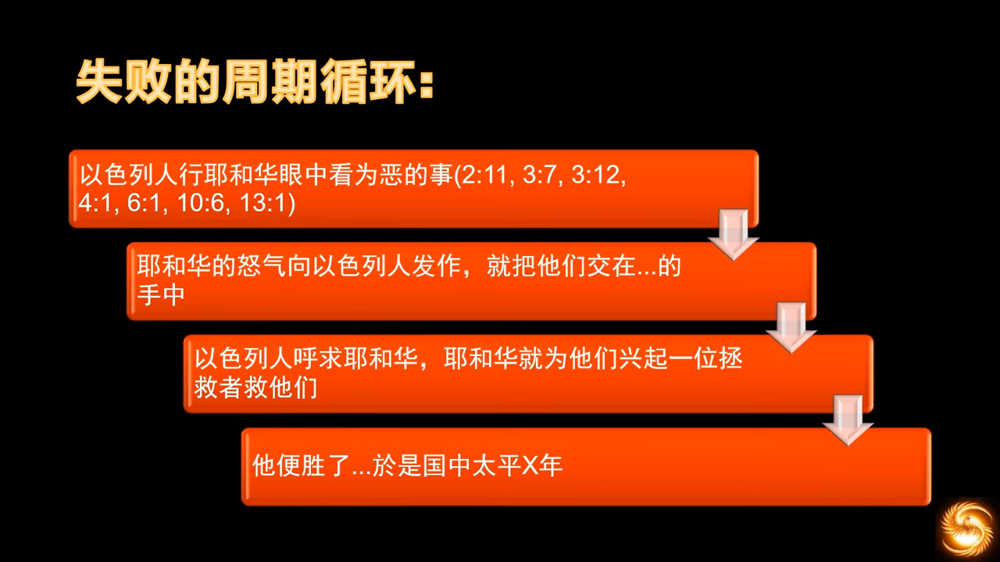

如果从人的角度出发观察历史，确实能得到循环的历史观点。以色列人在进入应许地之后的历史，的确是循环的，都不用仔细寻找，也会感知到这种近乎绝望的循环模式。整段经文似乎就是用同一个模板。

- 以色列人行耶和华眼中看为恶的事，一共出现了7次
- 耶和华怒气发作，将以色列交到外邦人手中。这么做是根据《利未记》和《申命记》中以色列和上帝立的约
- 以色列人呼求耶和华，耶和华兴起一个拯救者
- 获得胜利，国中太平xx年
- (下一个循环)

以色列的循环失败史，不仅仅限于《士师记》时期，事实上整个历史都是这样的情况，几乎涵盖了整本旧约。

这样的轮回在《士师记》中记录了7次。7是个神奇的数字，象征了完全，象征着神所启示的所有，意味着这样的轮回是没有止境的。在旧约时代能看到整个以色列人怎样在罪中挣扎、堕落、恢复、又堕落，每况愈下，最终走向整体被掳。在绝望中盼望弥赛亚。我们再看福音的历史，教会的历史，神的子民也是一摸一样，以色列人没有什么可嘲笑的。每到一定的时候，神的子民就是会转离神的话语，向世界妥协，和世俗勾兑，参与世界的恶行。然后神再兴起属灵的复兴，修复受伤的灵命，几代人之后，再开始新一轮的堕落。这就是我们在末世迫切地学习《士师记》的意义，我们需要警醒。

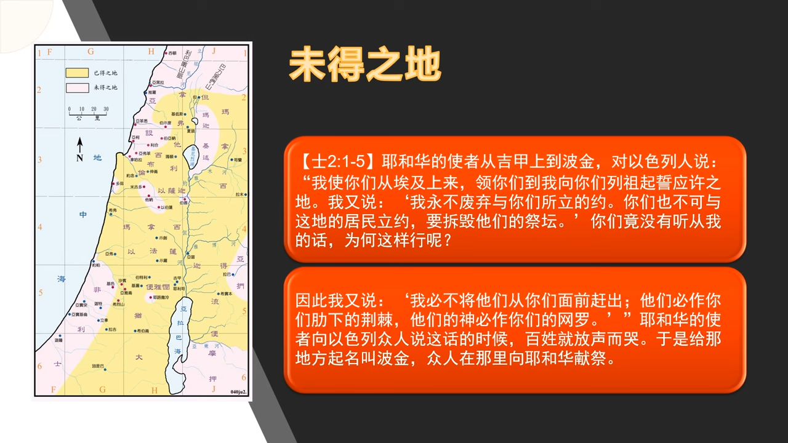

当时在应许地的以色列人为何会产生这样的状况呢？答案在第二章第一节。

> :latin_cross:  
> 1上主的使者从基耳加耳上到波津说：“我使你们由埃及上来，领你们进入了我向你们祖先所誓许的地方；我曾说过：我永不废弃我与你们所立的盟约，2你们也不可与这地方的居民结约，且要拆毁他们的祭坛。但你们没有听从我的声音；你们这是作的什么事？3为此我现在说：我必不把他们从你们面前赶走，他们为你们将是陷阱，他们的神要成为你们的罗网。” (民长纪 2)

这种被外族压制的状态，是神允许的，原因是以色列人没有遵守神的诫命。在《约书亚记》中约书亚被骗立约，但神还是帮助约书亚去履行盟友的约定，让日头停住一天。但人不可避免地容易陷入一种自欺的状态，认为“神不禁止即可为”，于是和留在应许地的迦南人立约，甚至立的是婚约，故意利用迦南人的劳动力来为自己所用，“被骗立约”和“故意违背神的旨意去立约”完全是两码事。神是鉴查一切的神，人的小心思是逃不过神的眼睛的。

- 和神立的是圣约，是第一优先级的，但是却被违约了，违约后就自然而然地需要承担违约责任；
- 和基便立的约是无知的时候立的，神也没有责怪；
- 但自己有意违背神的旨意所立的约，就必须要承担后果，因为这约违背了圣约，不可能所有约都是蒙神祝福的。

> :latin_cross:  
> 你们不要与不信的人共负一轭（è），因为正义与不法之间，那能有什么相通？或者，光明之于黑暗，那能有什么联系？ (格林多后书 6:14)

以色列人和迦南人立的甚至是婚约，和迦南人通婚了。一般情况下，基督徒和非基督徒通婚，大概率是基督徒变成“小信”的人，类似上方的人拉下方的人，总是更累，因为有重力做功，所以罪人的本性，就是往下的。和神立了约，就要承担违约责任，要面对在应许地无法被消灭的外邦人。如何和外邦人相处，就考验了接下去世世代代的以色列人。地图上黄色部分是已经得到的，粉色是已划分但尚未得到。

特别需要一提的是耶稣撒冷（粉色），经上记载是犹大支派曾拿下耶路撒冷，后交给便雅悯支派，便雅悯支派又弄丢了，后直到大卫王时代才攻陷占领，作为以色列的圣城，大卫定都耶路撒冷，这也是神的旨意。

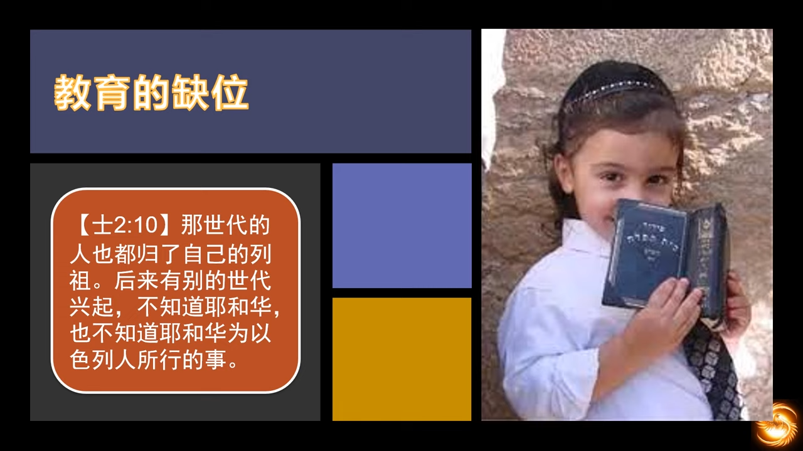

若第一代人的错误，后人可以吸取教训，那尚有挽回的机会。以色列人和神立的约中，有“守约施慈愛”这个选项，不是说一次犯错，就世代受罚。神给每代人的机会都是一样的，是平等的。旷野一代人屡教不改，但并未影响下一代进入应许地，下一代好好听了耶和华的话，还是可以得着祝福的。但是圣经又记载说，

> :latin_cross:  
> 当那一代人都归于他们的祖先以后，在他们之后，兴起了另一代，他们不认识上主，也不知道上主为以色列所行的事迹。 (民长纪 2:10)

可见是教育出了问题。不仅违约，连申命记中的教育责任也没有履行。出埃及、过红海的这些神迹、在旷野的神迹、进迦南的神迹，统统都不知道了。一切问题的根源，都出在教育。

> [!TIP]  
> 一代人的教室哲学，就是下一代的政府哲学 —— 林肯

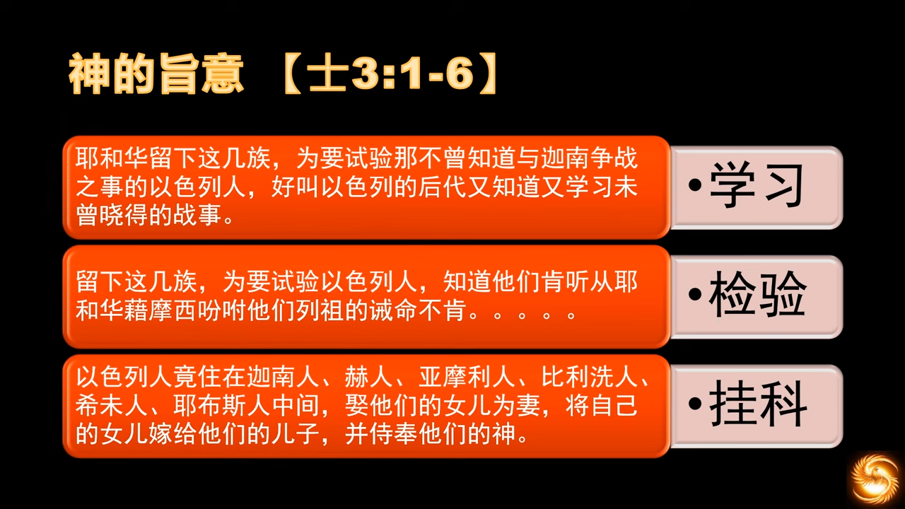

不认识真神，甚至还快乐地与迦南人通婚，开启了迦南地的多元文化生活。容忍异教崇拜，到跟随着去崇拜偶像。这之间，仅仅需要一纸婚约。生活在和平年代的人，是很容易被异教同化的。信仰最衰弱的时候，往往是没有逼迫的时候，是吃好喝好睡好玩好的日子，快乐得压根不需要神。所以神留下这几支迦南人，目的就是试验那不曾知道与迦南征战之事的以色列人，好叫后代又知道又学习未曾晓得的战事。

> [!TIP]  
> 如果不愿意从先辈的嘴里学到，就只能从生活中去体会到。

结果令神失望，以色列人住在外族当中，互相通婚，最过分的是，侍奉外邦人的恶神。罪行，从违反第十诫，升至违反了第一诫。一开始不灭除外邦人的原因是想把他们当成奴仆来使唤，“贪恋他人的奴婢”。结果当外邦人数量达到一定比例时，文化的反向吞噬出现了，成为普遍现象。

现在社会也同样需要警醒，生活中非常容易感受到这一点。带领一个人信福音是很难的，但孩子长大了离开教会，或是成年人因为小小的事离开教会离开神，就是很容易的。这就是内心的罪的缘故，走楼梯很累，坐滑梯很舒服，堕落的感觉，一定比走天路好太多了。

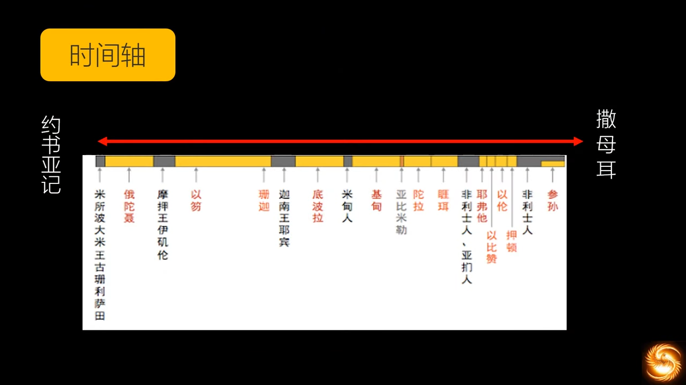

时间轴大致列出了士师记的主要内容，一共约450年。

> :latin_cross:  
> 约有四百五十年。此后，又给他们立了民长，直到撒慕尔先知时代。 (宗徒大事录 13:20)

时间轴上黑色的时期，就是以色列人被外族压制的时间，加起来一共约93年。但是列王纪说，

> :latin_cross:  
> 以色列子民出离埃及地后四百八十年，撒罗满作以色列王第四年"齐夫"月，【即二月】，开始建造上主的殿。 (列王纪上 6:1)

这两个数字对不上了？难道圣经出错了？圣经不可能出错。

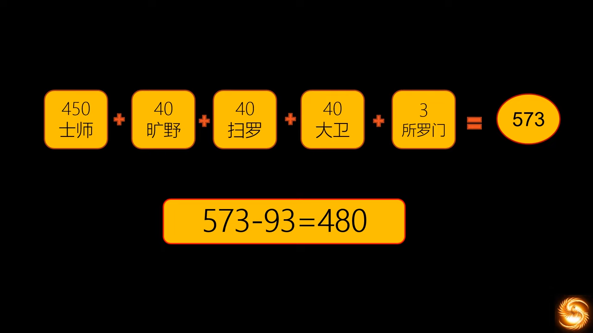

士师时间450年，在旷野放飞自我40年，扫罗40年，大卫王40年，3年所罗门王。这样的话，出埃及已是573年，减去被外族压制的93年，正好480年。列王纪是先知耶利米写的，代表上帝发言，在上帝的眼中，被魔鬼压制的年月，是不算数的。如果活得和上帝无关，上帝就不care。

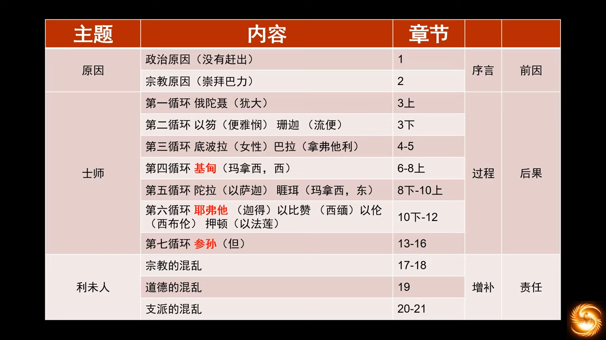

士师记主要结构，大致可以分为三个部分，第一部分介绍原因。表面上看，没有彻底赶走迦南人是政治原因，因为上一代不够努力。事实上是宗教原因，因为拜巴力，拜假神，失去了真神的祝福和保守。这一部分是神总结性地告诉我们士师记的时代背景。

第二部分是十二个士师，神兴起的士师遍及以色列十二支派，除了利未人。兴起的有战士、有私生子、有女性、有生下来就归神的拿細耳人，可见神不偏待人。为何没有利未人？

- 俄陀聂，犹大支派，迦勒的女婿和侄儿。迦勒是旷野一代仅存的可以进入应许地的元老之一，说明以色列人真的是从第二代就开始败坏了，速度惊人；
- 以笏，便雅悯支派；珊迦，流便支派，便雅悯支派是被六个哥哥的支派所包围的，周围没有敌人，所以他们和迦南人通婚联姻，完全不是因为军事或政治，纯粹是贪图迦南人的劳动力；流便就更好理解了，流便支派在约旦河东，河东支派和周边的敌人有更多的冲突，也会有更多的民间融合，因缺少约旦河作为天然的屏障；
- 底波拉，女性，说明这地方神已经挑不出男人了，也说明当时以色列这地方男丁的信仰状态衰弱；
- 基甸，玛拿西西部支派，以色列人已经是非常可怜的光景，被米甸人全面压制。一个细节，基甸当时躲在醡酒池打麦子，醡酒池是酿酒的地方，不够开阔，都要躲在这里打麦子，说明已经到了惊弓之鸟的地步了，也说明米甸人的攻击和扰乱很是厉害。基甸受到呼召后，做的第一件事就是摧毁巴力的坛，这当时是非常勇敢的。但他死后他的七十个儿子除了一个逃跑，其余都被小妾的儿子杀死了；
- 耶弗他，迦得支派，妓女的儿子，同父异母的兄弟都不认他，将他赶得远远的。但当仇敌来临，又想起了他，让耶弗他出来做领袖，帮助以色列人战胜仇敌。当时敌人是亚扪人，有领土之争；开战前向神许愿，若得胜归来，家中第一个出来迎接的，将作全燔祭，不料出来的是独生女；
- 参孙，但支派，拿細耳人，生下来就归耶和华，不能剃头，不能接触污秽的东西，包括尸体，有很多的禁忌。他非常勇敢，力大无穷，但他将拿細耳人的禁忌一件一件地都破坏了，活得非常潇洒和随意，屡次败在女色上。参孙虽然勇敢，但是做人完全按照自己的意思，不守神的诫命。虽然面对仇敌非常勇敢，但面对自己非常软弱。

每一个士师都有这样那样的缺点，神通过整本圣经告诉我们一个真理，“不要在地上寻找伟人，不要在地上寻找救世主”，救赎这件事情，只有神来解决。

十二士师涵盖十二支派，就是没有利未人，可能是因为祭司和利未人是首先败坏的。

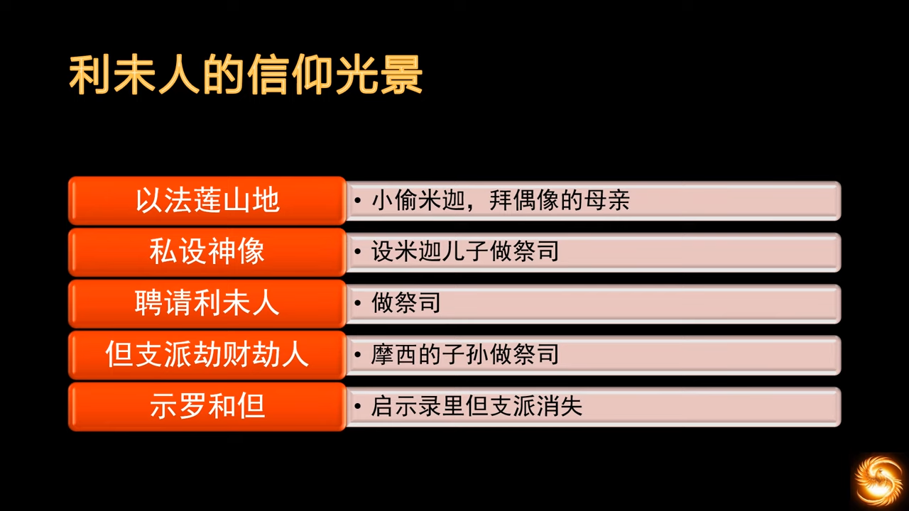

描写了一个拜偶像的利未人，利未人是在圣殿中侍奉祭司的，是亚伦后裔的帮手，祭司是亚伦的后裔才可以做。这位利未人先是失业了，会幕的光景惨淡，路过米迦时，被留下做了祭司。但支派路过米迦时，发现了这位利未人，就说服了利未人跟着走，毕竟做一支派的祭司比做家庭的祭司更体面，利未人不仅人跑了，还带走了人家花一千块做的神像。

当时的会幕是在示罗的，大家理应到示罗去拜神，因祭司疏于宣传律法，导致整个以色列人到处瞎拜神。私设祭坛、私设祭司、私设神像，使整个民族陷于罪中。

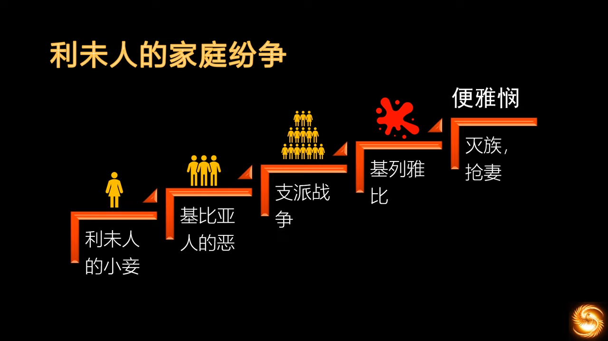

祭司疏于教导律法，民众就无从知道什么是法，信仰的混乱最直接的后果就是道德的混乱。圣经中描述了一次道德乱象，起因还是利未人，这利未人没有处理好家庭关系，接回小妾时路过基比亚，被基比亚人围攻，要行男男奸淫，最终带走了小妾，轮奸了她，致小妾死亡。利未人非常悲愤，将小妾尸体切成十二块，送到以色列十二支派手中。在巨大的民情愤慨下，各个支派团结了起来，要求便雅悯支派交出作恶的基比亚人，便雅悯支派坚决不交，一场内战爆发了。最后结果便雅悯支派只剩下六百个光棍在逃，其他的全被杀光，差点被灭族了。这时以色列人担忧缺少一个支派，急着为六百个光棍找对象，于是借机声讨基列雅比，杀得只剩下一些处女，嫁给便雅悯人。还缺的两百多，就让便雅悯人自己抢妻。整个剧情无比荒诞，这就是神的选民当时的状况。血的历史都是由人的罪写成的。

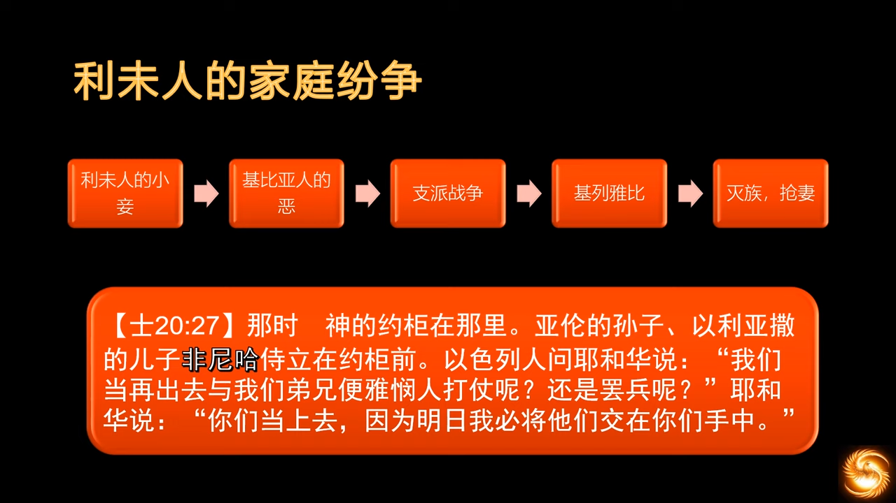

这场支派之间的混战应该发生在士师记的前期，祭司阶层先堕落，带动了以色列全民的堕落。因为当时是 **非尼哈** 侍立在约柜前，是进入迦南的第一代祭司。

这场混战很荒唐，但还有更荒唐的。骄傲的以法莲支派，等基甸打赢胜仗了之后，质问基甸为什么打仗不叫上他们一起参加，质问基甸时，基甸搪塞了过去。又质问耶弗他，耶弗他正面怼了回去，于是支派战争又爆发了，爆发得莫名其妙。一场混战之后，耶弗他的兵守住了渡口，以法莲人要过河回自己领地时，耶弗他通过让以法莲人读一个单词来辨别是否需要杀这个人，非常荒唐，这样就死了四万两千人。

以色列之所以出现这种周期性的崩溃，神的视角看就是“好了伤疤忘了疼”。但以色列人自己不是这么想的，他们和周边国家一比，觉得自己找到原因了，觉得之所以一直失败，是因为缺少强有力的领导人。百姓的视角只能看到眼睛能看到的层面，每次看到领袖一死，情况就恶化，别的国家都有朝代有君王有接班人有王室有家族，当时以色列没有王，士师记反复记载这句话，他们想要一个王。其实以色列有王，只是肉眼看不见，在天上。但这些第二代百姓想要一个看得见的王，士师记就结束在这里，上帝将要给他们王，路得记将告诉我们王从何来，所以两卷书其实是一卷。

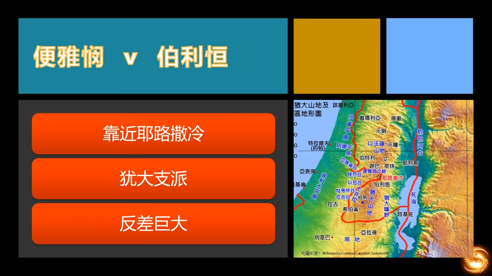

和士师记黑暗时代不一样的是，路得记是黑暗世界里吹过来的清风。在神的子民被外敌挟制的时候，在应许地依然有美好的事情在发生。路得，摩押女子，圣经中有两本以女性名字命名的，《路得记》和《以斯帖记》。路得记讲的是一位外邦人嫁给犹太人的故事，以斯帖记讲的是一个犹太女子在被掳期间嫁给外邦人的故事。路得记发生的地方，距离最混乱的便雅悯支派，其实非常近，稍微往南一点，在犹大境内一个叫伯利恒的地方，伯利恒离耶路撒冷也不远。

伯利恒和便雅悯是接壤的，一般来说，在风俗习惯、行事为人上，接壤的地块是很容易相互影响的，但从路得记上看，这个小城的人并未受影响。北边的示罗是位于以法莲山地的，示罗当时是宗教敬拜的中心，全以色列的人每年三次都要到示罗过节，因为会幕在示罗，所以能理解以法莲为何骄傲了，地段好！

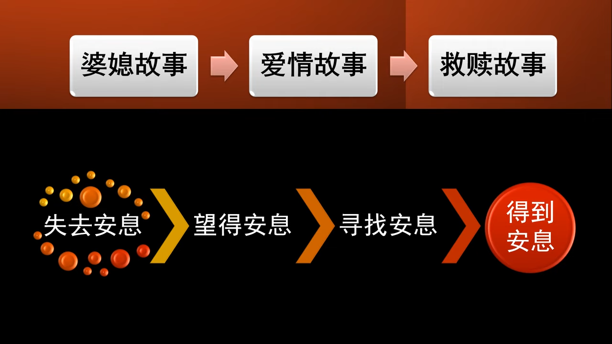

以色列人离弃神，神就按照利未记二十六章，按照立的约的条款去惩罚他们。离弃神的结局是“饥荒、战争”。当时在应许地发生了饥荒，导致了一个家庭的离开，就是路得的婆婆家。夫妻俩加上两个儿子，一家四口到摩押地逃荒。两个儿子先后在当地娶了妻，离开应许地之后的日子也不好过，最后就剩下婆婆和两个儿媳这三个寡妇。从婆媳故事，到爱情故事，最后到君王的谱系，讲了一个救赎故事，讲了以色列人怎样失去神的保守，又渴望得到神的庇护，用什么行动来寻找安息，最后在神的怜悯下，回归安息，是一个温暖的救赎的故事。

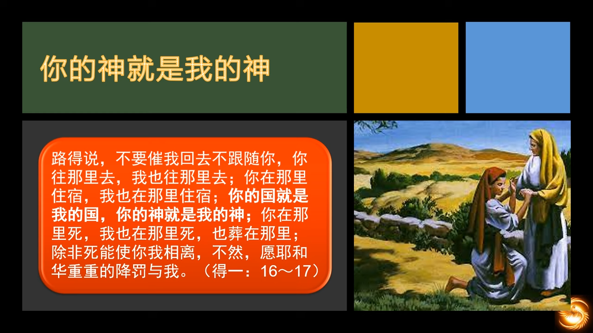

虽然应许地的普遍信仰光景不好，但神还是会善待祂忠实的选民。就在三个寡妇陷入绝望之中时，婆婆听说老家有大丰收，就决定回家。回家前，婆婆劝两个守寡的儿媳回父家再嫁。跟着婆婆，别人来提亲的可能性就小很多，毕竟，敬虔的以色列人一般不会娶外邦人。大儿媳面对了现实，回了父家。而路得选择跟随婆婆，回到应许地。不离不弃，生死相依，她的命运，就在她宣告以耶和华为神的这一刻，翻转了，只是当时她自己并不知道。

> :latin_cross:  
> 16卢德答说：“请你别逼我离开你，而不跟你去。你到哪里去，我也到哪里去；你住在哪里，我也住在哪里；你的民族，就是我的民族；你的天主，就是我的天主；17你死在哪里，我也死在哪里，埋在哪里；若不是死使我与你分离，愿上主罚我，重重罚我！” (卢德传 1)

回到应许地之后，路得为了养家，到别人的田里拾麦穗。以色列的律法规定，不可割尽田角，要留给穷人，既照顾穷人的需要，也照顾穷人的尊严。因为犹大支派还在执行这一项律法，路得靠着拾麦穗，还能获得基本的饱足。在神的带领下，她到了波阿斯的田里。她温柔谦卑，波阿斯的仆人对路得有好印象。当波阿斯来到田里，仆人就向波阿斯介绍了路得的为人，她也得到了波阿斯的善待。

就是因为她对婆婆的善行获得了好的名声，犹大支派并没有因为路得是摩押人歧视她，而是善待了她，按照她所行去对待她。婆婆想起按照以色列的律法，近亲是有“赎回死者财物”的权力的，于是婆婆就教路得应该怎么做，其实就是要波阿斯赎回产业。婆婆教路得的时候，路得虽然不明白律法层面的意义，但她没有多问，一直很信服，没有怀疑过婆婆的善意。她的信任得到了回报，因为波阿斯是明白律法的责任和权力的。

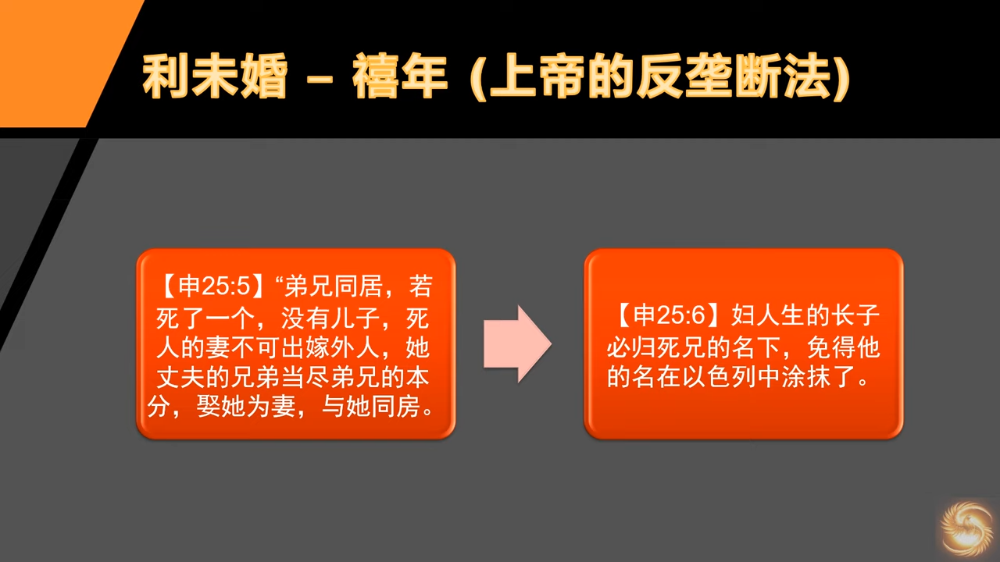

以色列的“利未婚”，是今天来看相当不好理解的。在《申命记》中规定，

> :latin_cross:  
> 如果兄弟住在一起，其中一个没有留下儿子就死了；死者的妻子不可出嫁外人，丈夫的兄弟应走近她，以她为妻，对她履行兄弟的义务。她所生的长子，应归亡兄名下，免得他的名由以色列中消灭。 (申命纪 25:5-6)

神规定了“禧年”，在禧年，所有土地都要归还给最初拥有的家族，为了防止因为贫富差异导致土地兼并，使以色列民族不会发生不断萎缩的现象。土地只能据存，不能永卖。买卖都是暂时的，到禧年时都要回归原来家族。若没有“禧年”，失地农民就会离开这片土地，久而久之，以色列民族就会不存在。

既然土地要归还给最初的家族，若那家族没有子孙，就会出问题，家族必须要有人存活，在禧年才能要回土地。寡妇若没有孩子据存这家的土地，死去的丈夫的兄弟就必须要娶这位寡妇，目的就是要保住家族的土地。路得没有孩子没有丈夫，丈夫最近的亲属就有义务要娶她，要为她死去的丈夫留后，到了禧年才可以接受原先拥有的土地。

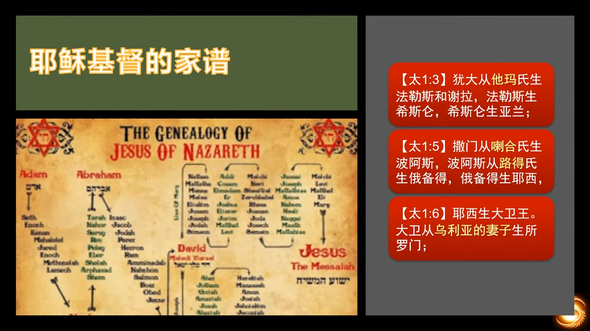

路得记表面上看是爱情故事，在乡间发生。但背后其实是上帝在主宰，上帝在为以色列预备一条君王的血脉。在遵守上帝律法的子民中，上帝选择了外邦人路得，让她成为君王血脉的一部分，成为耶稣基督家谱上的四位女人之一。基督家谱的四个女人都是充满争议的。

- 他玛，犹大儿媳，因犹大不想持守“利未婚”，被他玛设了圈套，生了儿子，从传统角度看，就是乱伦；
- 喇合，是妓女，因渴慕耶和华，就得了保守；
- 路得，外邦人，摩押人，按律法是不能进耶和华的会，但神充满怜悯；
- 乌利亚的妻子，和大卫犯奸淫。

这么有争议的四人，在神眼里都不算事。人总会觉得自己比别人更有道德更高尚，但在神的眼里，我们统统是罪人。

> [!TIP]  
> 我们都是垃圾，只是分类不同。

“垃圾分类，从我做起”，这句话写得还很属灵。

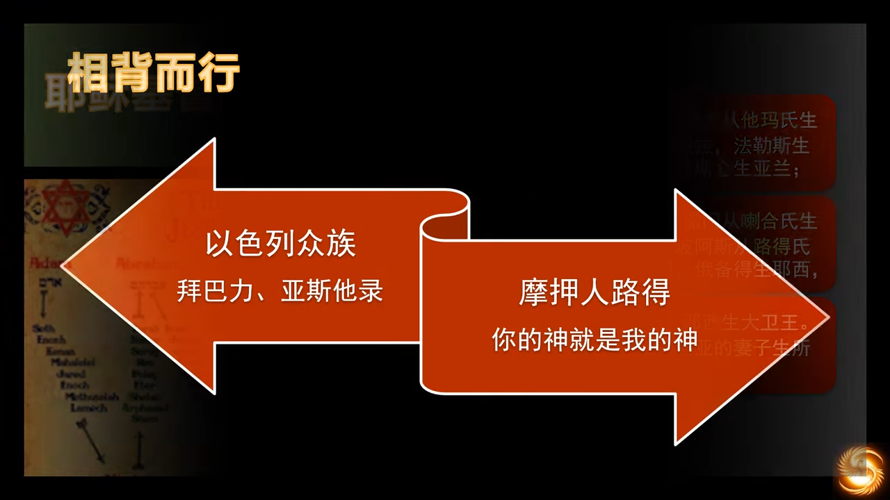

《士师记》和《路得记》放到一起比较，就很明显看到应许地里有两种人，大部分是败坏的，小部分在坚持。当以色列支派混战时，犹大的伯利恒还有敬虔的老百姓；当大家都在拜偶像拜巴力时，摩押人路得说“你的神就是我的神”，而不远处的便雅悯支派简直淫乱到了极点。就是在这样的信仰光景中，犹大支派中敬虔的信徒，还在坚持“利未婚”。从这两种截然不同方向的历史记载，我们看到上帝的手在动工，在以色列循环往复的堕落历史中，神的救恩历史，以向前突破的方式，以直线形式展开。

士师记，路得记，主题都是围绕“王”，士师记中，以色列人没有王，各人任意而行。在路得记最后，王已经在路上了。由此我们可知，这两卷书的作者是撒母耳，成书时间应该是扫罗王时期。因为写的是“耶西生大卫”，而不是“耶西生大卫王”。

> :latin_cross:  
> 撒耳孟生波阿次，波阿次生敖贝得，敖贝得生叶瑟，叶瑟生达味。 (卢德传 4:21-22)

撒母耳作为先知，从神那里领受的旨意就是神喜悦大卫，扫罗王出于便雅悯支派，大卫王出于犹大支派，是当时信仰光景最好的支派。从神学涵义来说，神要兴起一位合祂心意的君王，来带领以色列人，继续走信仰启示之旅。

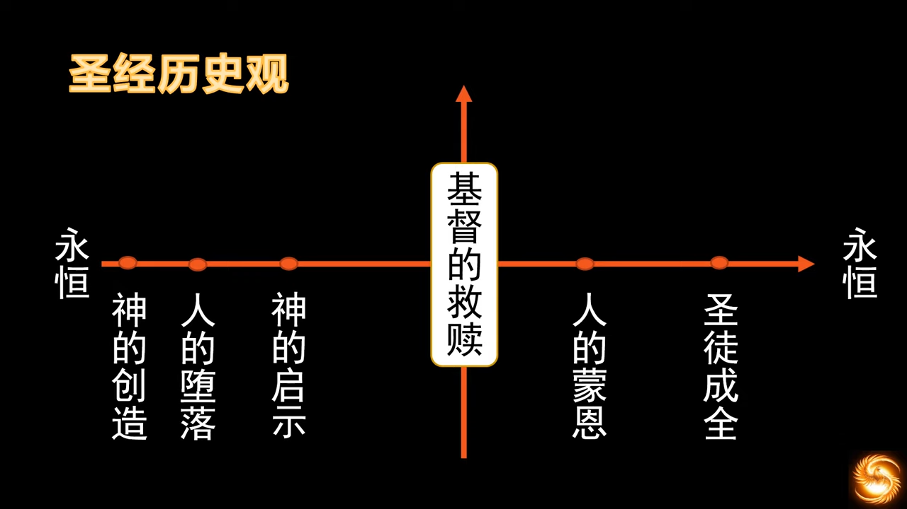

从人的角度来看，是会认为历史没有方向、没有目的，只有重演。但从上帝的角度来看，历史有其前进的方向，有目的的，从过去到现在，再到未来。这是圣经的历史观，是一条直线，是线性的。历史有目的、有起点、有过程。上帝根据祂所预定的结局，主宰历史的走向。所以，历史始终是上帝的故事，是His-story。

士师记中的七次循环，同样的场景，重演了七次，都是因为他们离开了上帝。其实我们个人的生命，也有这种现象。远离上帝的生命，就会变成一种循环，每天漫无目的，循环往复，没有目的。但一旦认识了上帝，跟着上帝走，人生就有了目的，变成直线，在世上的每一天都离主更近。救赎的目的，就是让我们脱离循环，搭上直线，重现找到方向。让人生往历史的终极目的地前进，进入永恒。

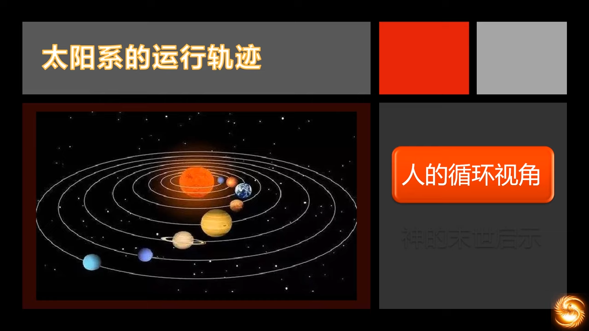

我们观察到的太阳系是循环的，八大行星围绕太阳，有轨道有规律，就像人类的循环历史观，士师记的循环历史。但是事实真如此吗？

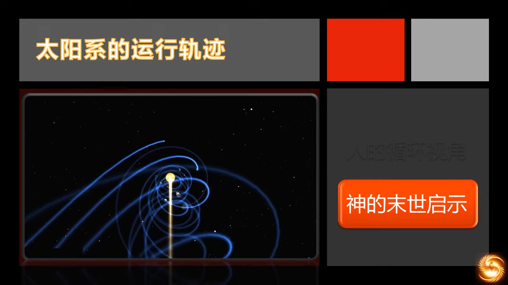  
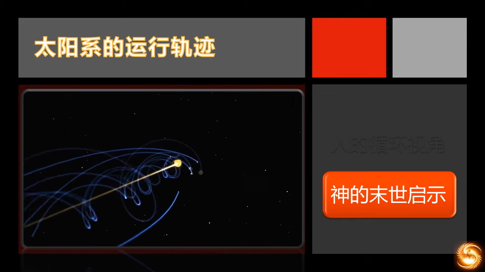  
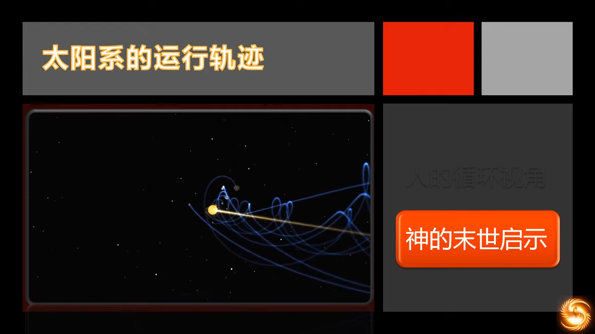

太阳系真实的运行方式，太阳系本身以70000km/h的速度在前进。虽然从人的角度看是循环视角，但从神的启示看，历史是向前推进的，是不断地走向末世的。真实的历史是，不管你认不认识神，你都在被神用不可抗拒的力量走向永恒。区别是，你是在永恒中被神审判，还是在永恒中与神同在。

之前提到过“自然对数”和“等角螺线”，这个视频中出现的螺旋，基本都是等角螺线，这是生命的螺线。生命不是简单的循环，生命中有神非常奇妙的旨意。

如果我们的生命每天都一样，今天和昨天没有区别，那我们要警醒了。圣经对我们新生命的要求是，一天新似一天。

> :latin_cross:  
> 为此，我们决不胆怯，纵使我们外在的人日渐损坏，但我们内在的人却日日更新。 (格林多后书 4:16)