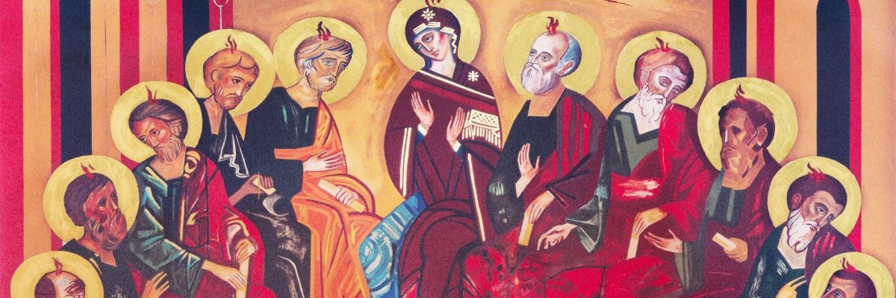

# What the Early Church Believed: The Meaning of "Catholic" | Catholic Answers Tract
https://www.catholic.com/tract/what-catholic-means

The Greek roots of the term “Catholic” mean “according to (_kata_-) the whole (_holos_),” or more colloquially, “universal.” At the beginning of the second century, we find in the letters of Ignatius the first surviving use of the term “Catholic” in reference to the Church. At that time, or shortly thereafter, it was used to refer to a single, visible communion, separate from others.

The term “Catholic” is in the Apostles’, Nicene, and Athanasian creeds, and many Protestants, claiming the term for themselves, give it a meaning that is unsupported historically, ignoring the term’s use at the time the creeds were written.

Early Church historian J. N. D. Kelly, a Protestant, writes: “As regards ‘Catholic,’ its original meaning was ‘universal’ or ‘general.’ . . . in the latter half of the second century at latest, we find it conveying the suggestion that the Catholic is the true Church as distinct from heretical congregations (cf., e.g., Muratorian Canon). . . . What these early Fathers were envisaging was almost always the empirical, visible society; they had little or no inkling of the distinction which was later to become important between a visible and an invisible Church” (_Early Christian Doctrines_, 190–1).

Thus people who recite the creeds mentally inserting another meaning for “Catholic” are reinterpreting them according to a modern preference, much as a liberal biblical scholar does with Scripture texts offensive to contemporary sensibilities.

Included in the quotes below are extracts from the first creeds to use the term “Catholic”; so that the term can be seen in its historical context, which is supplied by the other quotations. It is from this broader context that the meaning of the term in the creeds is established, not by one’s own notion of what the term _once_ meant or of what it _ought_ to mean.

Ignatius of Antioch
-------------------

“Let no one do anything of concern to the Church without the bishop. Let that be considered a valid Eucharist which is celebrated by the bishop or by one whom he ordains \[i.e., a presbyter\]. Wherever the bishop appears, let the people be there; just as wherever Jesus Christ is, there is the Catholic Church” (_Letter to the Smyrneans _8:2 \[A.D. 110\]).

The Martyrdom of Polycarp
-------------------------

“And of the elect, he was one indeed, the wonderful martyr Polycarp, who in our days was an apostolic and prophetic teacher, bishop of the Catholic Church in Smyrna. For every word which came forth from his mouth was fulfilled and will be fulfilled” (_Martyrdom of Polycarp_ 16:2 \[A.D. 155\]).

The Muratorian Canon
--------------------

“Besides these \[letters of Paul\] there is one to Philemon, and one to Titus, and two to Timothy, in affection and love, but nevertheless regarded as holy in the Catholic Church, in the ordering of churchly discipline. There is also one \[letter\] to the Laodiceans and another to the Alexandrians, forged under the name of Paul, in regard to the heresy of Marcion, and there are several others which cannot be received by the Church, for it is not suitable that gall be mixed with honey. The epistle of Jude, indeed, and the two ascribed to John are received by the Catholic Church (Muratorian fragment \[A.D. 177\]).

Tertullian
----------

“Where was \[the heretic\] Marcion, that shipmaster of Pontus, the zealous student of Stoicism? Where was Valentinus, the disciple of Platonism? For it is evident that those men lived not so long ago—in the reign of Antonius for the most part—and that they at first were believers in the doctrine of the Catholic Church, in the church of Rome under the episcopate of the blessed Eleutherius, until on account of their ever restless curiosity, with which they even infected the brethren, they were more than once expelled” (_Demurrer Against the Heretics_ 30 \[A.D. 200\]).

Cyprian of Carthage
-------------------

“You ought to know, then, that the bishop is in the Church and the Church in the bishops; and if someone is not with the bishop, he is not in the Church. They vainly flatter themselves who creep up, not having peace with the priest of God, believing that they are secretly in communion with certain individuals. For the Church, which is one and catholic, is not split or divided, but is indeed united and joined by the cement of priests who adhere to one another” (_Letters_ 66\[67\]:8 \[A.D. 253\]).

Council of Nicaea I
-------------------

“But those who say: ‘There was \[a time\] when he \[the Son\] was not,’ and ‘before he was born, he was not,’ and ‘because he was made from non-existing matter, he is either of another substance or essence,’ and those who call ‘God the Son of God changeable and mutable,’ these the Catholic Church anathematizes” (_Appendix to the Creed of Nicaea_ \[A.D. 325\]).

“Concerning those who call themselves Cathari \[Novatians\], that is, ‘the Clean,’ if at any time they come to the Catholic Church, it has been decided by the holy and great council that, provided they receive the imposition of hands, they remain among the clergy. However, because they are accepting and following the doctrines of the catholic and apostolic Church, it is fitting that they acknowledge this in writing before all; that is, both that they communicate with the twice married and with those who have lapsed during a persecution” (Canon 8).

Cyril of Jerusalem
------------------

“\[The Church\] is called catholic, then, because it extends over the whole world, from end to end of the earth, and because it teaches universally and infallibly each and every doctrine which must come to the knowledge of men, concerning things visible and invisible, heavenly and earthly, and because it brings every race of men into subjection to godliness, governors and governed, learned and unlearned, and because it universally treats and heals every class of sins, those committed with the soul and those with the body, and it possesses within itself every conceivable form of virtue, in deeds and in words and in the spiritual gifts of every description” (_Catechetical Lectures_ 18:23 \[A.D. 350\]).

“And if you ever are visiting in cities, do not inquire simply where the house of the Lord is—for the others, sects of the impious, attempt to call their dens ‘houses of the Lord’—nor ask merely where the Church is, but where is the Catholic Church. For this is the name peculiar to this holy Church, the mother of us all, which is the spouse of our Lord Jesus Christ, the only-begotten Son of God” (ibid., 18:26).

The Apostles’ Creed
-------------------

“I believe in the Holy Spirit, the holy catholic Church, the communion of saints, the forgiveness of sins, the resurrection of the body, and the life everlasting. Amen” (_Apostles’ Creed_ \[A.D. 360 version, the first to include the term “Catholic”\]).

Council of Constantinople I
---------------------------

“I believe in the Holy Spirit, the Lord, the giver of life, who proceeds from the Father, who together with the Father and the Son is worshiped and glorified, who spoke through the prophets; in one, holy, catholic, and apostolic Church” (_Nicene Creed_ \[A.D. 381\]).

“Those who embrace orthodoxy and join the number of those who are being saved from the heretics, we receive in the following regular and customary manner: Arians, Macedonians, Sabbatians, Novatians, those who call themselves Cathars and Aristeri, Quartodecimians or Tetradites, Apollinarians— these we receive when they hand in statements and anathematize every heresy which is not of the same mind as the holy, catholic, and apostolic Church of God” (Canon 7).

Augustine
---------

“We must hold to the Christian religion and to communication in her Church, which is catholic and which is called catholic not only by her own members but even by all her enemies. For when heretics or the adherents of schisms talk about her, not among themselves but with strangers, willy-nilly they call her nothing else but Catholic. For they will not be understood unless they distinguish her by this name which the whole world employs in her regard” (_The True Religion_ 7:12 \[A.D. 390\]).

“We believe in the holy Church, that is, the Catholic Church; for heretics and schismatics call their own congregations churches. But heretics violate the faith itself by a false opinion about God; schismatics, however, withdraw from fraternal love by hostile separations, although they believe the same things we do. Consequently, neither heretics nor schismatics belong to the Catholic Church; not heretics, because the Church loves God, and not schismatics, because the Church loves neighbor” (_Faith and Creed_ 10:21 \[A.D. 393\]).

“If you should find someone who does not yet believe in the gospel, what would you \[Mani\] answer him when he says, ‘I do not believe’? Indeed, I would not believe in the gospel myself if the authority of the Catholic Church did not move me to do so” (ibid., 5:6).

“\[T\]here are many other things which most properly can keep me in her \[the Catholic Church’s\] bosom. The unanimity of peoples and nations keeps me here. Her authority, inaugurated in miracles, nourished by hope, augmented by love, and confirmed by her age, keeps me here. The succession of priests, from the very see of the apostle Peter, to whom the Lord, after his resurrection, gave the charge of feeding his sheep \[John 21:15–17\], up to the present episcopate, keeps me here. And last, the very name Catholic, which, not without reason, belongs to this Church alone, in the face of so many heretics, so much so that, although all heretics want to be called ‘Catholic,’ when a stranger inquires where the Catholic Church meets, none of the heretics would dare to point out his own basilica or house” (_Against the Letter of Mani Called “The Foundation” _4:5 \[A.D. 397\]).

Vincent of Lerins
-----------------

“I have often then inquired earnestly and attentively of very many men eminent for sanctity and learning, how and by what sure and so to speak universal rule I may be able to distinguish the truth of Catholic faith from the falsehood of heretical depravity; and I have always, and in almost every instance, received an answer to this effect: that whether I or anyone else should wish to detect the frauds and avoid the snares of heretics as they arise, and to continue sound and complete in the Catholic faith, we must, the Lord helping, fortify our own belief in two ways: first, by the authority of the divine law \[Scripture\], and then by the tradition of the Catholic Church. But here some one perhaps will ask, ‘Since the canon of Scripture is complete, and sufficient of itself for everything, and more than sufficient, what need is there to join with it the authority of the Church’s interpretation?’ For this reason: Because, owing to the depth of holy Scripture, all do not accept it in one and the same sense, but one understands its words in one way, another in another, so that it seems to be capable of as many interpretations as there are men. . . . Therefore, it is very necessary, on account of so great intricacies of such various errors, that the rule for the right understanding of the prophets and apostles should be framed in accordance with the standard of ecclesiastical and catholic interpretation” (_The Notebooks _2:1–2 \[A.D. 434\]).

Council of Chalcedon
--------------------

“Since in certain provinces readers and cantors have been allowed to marry, this sacred synod decrees that none of them is permitted to marry a wife of heterodox views. If those thus married have already had children, and if they have already had the children baptized among heretics, they are to bring them into the communion of the Catholic Church” (Canon 14 \[A.D. 451\]).

* * *

NIHIL OBSTAT: I have concluded that the materials  
presented in this work are free of doctrinal or moral errors.  
Bernadeane Carr, STL, Censor Librorum, August 10, 2004

IMPRIMATUR: In accord with 1983 CIC 827  
permission to publish this work is hereby granted.  
+Robert H. Brom, Bishop of San Diego, August 10, 2004