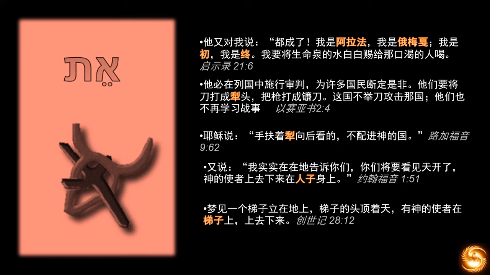
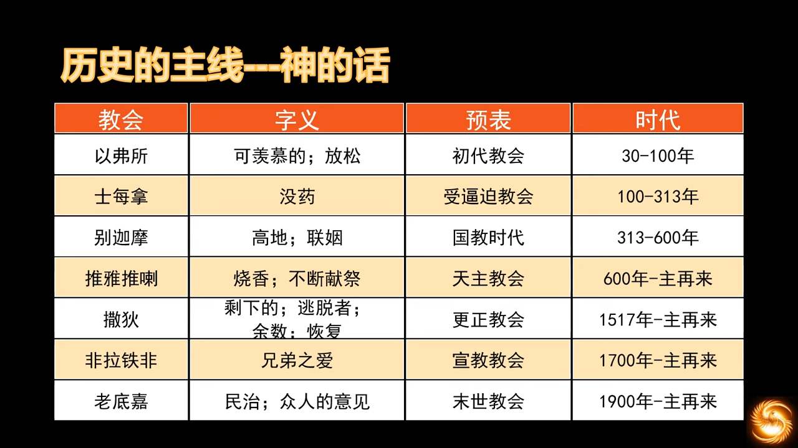

# 教会历史和欧洲历史

## 00 两千年教会历史 序
https://youtu.be/vrqrL0WceU8?list=PLfChJ-aSv3VD-f-sQH1p9vEPjwx8zYH6e&t=1072

> 左边的希伯来字就是“犁头”的意思

## 01 教会历史 基督教文明的底色
https://youtu.be/Z8YA7ejHJ_4?list=PLfChJ-aSv3VD-f-sQH1p9vEPjwx8zYH6e&t=866

罗马军事、法律很牛，大陆法系。希腊的哲学，罗马的法律，深度影响西方文明。  
人口增长是神的祝福。  
河流流域的农业文明，灌溉文明容易出现集权，河流泛滥出现水利问题，需要大量人力劳动。两河文明是大一统的开端。希腊是城邦文明，因为山地众多，很难统一。神通过希腊暗示了“小而美”的设计。

犹太人不能放贷给自己族人，只能放给外邦人

> PhD是“哲学博士”的意思，哲学包含了所有的知识，亚里士多德是行走的百科全书。

布鲁诺是异端，不支持三位一体，哥白尼是大主教，死后才发表日心说，其实未受到迫害。

https://zh.wikipedia.org/zh-sg/%E7%84%A6%E7%88%BE%E9%81%94%E8%AB%BE%C2%B7%E5%B8%83%E9%AD%AF%E8%AB%BE

https://zh.wikipedia.org/wiki/%E5%B0%BC%E5%8F%A4%E6%8B%89%C2%B7%E5%93%A5%E7%99%BD%E5%B0%BC

> 罗马站在希腊的肩膀上，继承了所有希腊知识，并进一步推进。

> 大陆法系的法律基本沿自罗马。西罗马灭亡后，由拜占庭继承了下来。法律和信仰是“基督教”化之后的罗马帝国传承给之后的蛮族最大的祝福。

罗马是之后蛮族的文明天花板，一直持续到文艺复兴，地理大发现，宗教改革。出现了大英帝国的殖民梦，西班牙无敌舰队的淘金梦，以及后来的美国梦。此时“罗马梦”方才宗教性地终结，之后高举希腊理性主义的旗帜，罗马梦以另一种形式出现。世界一直是两股势力的博弈，“凯撒和上帝”，世俗王权和神权。

上帝抹去了沙画上的线条和图案，只留下了散落的沙子，沙砾若干年后将重新聚集起来成为美丽的风景。

