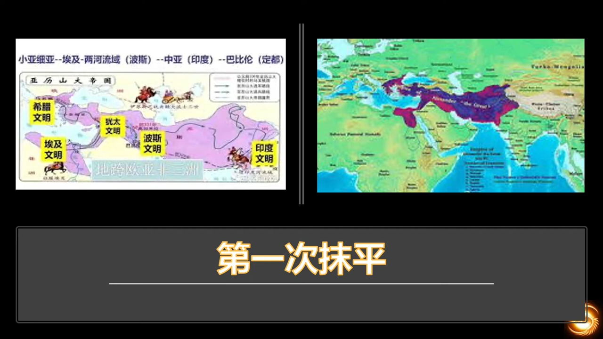
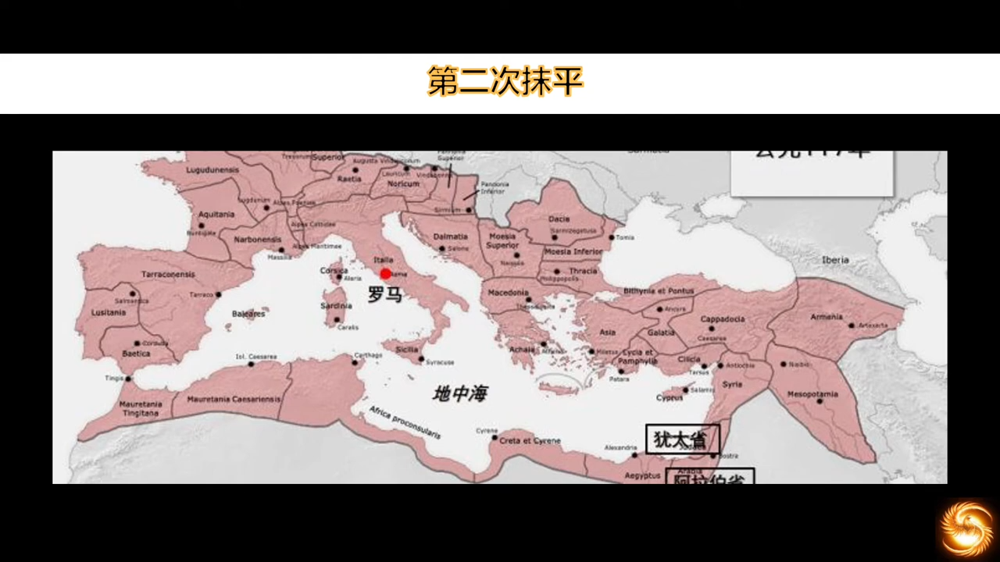
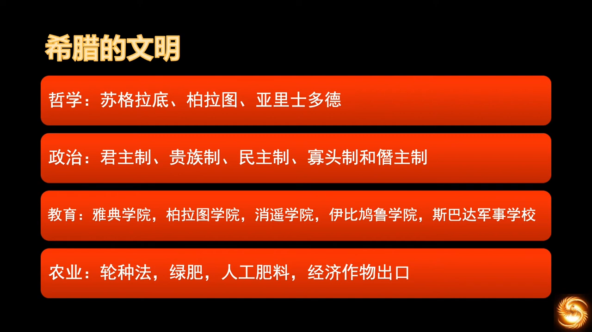
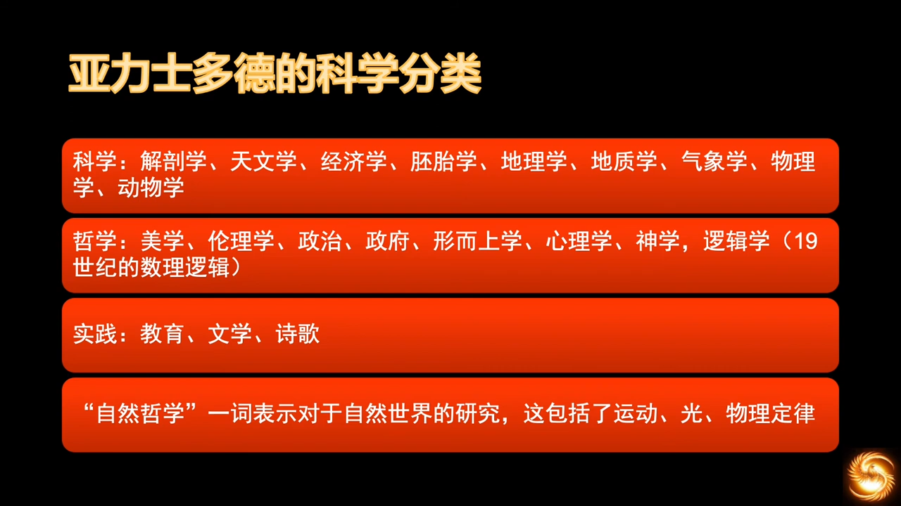
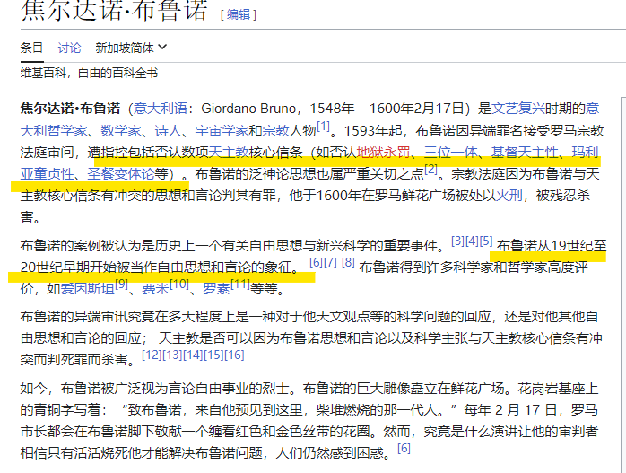
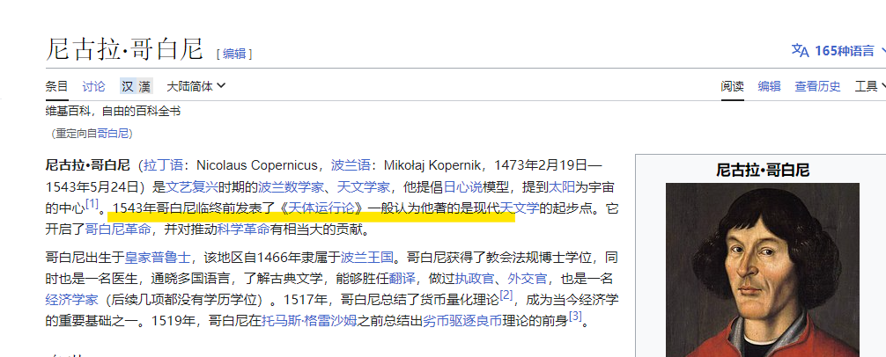
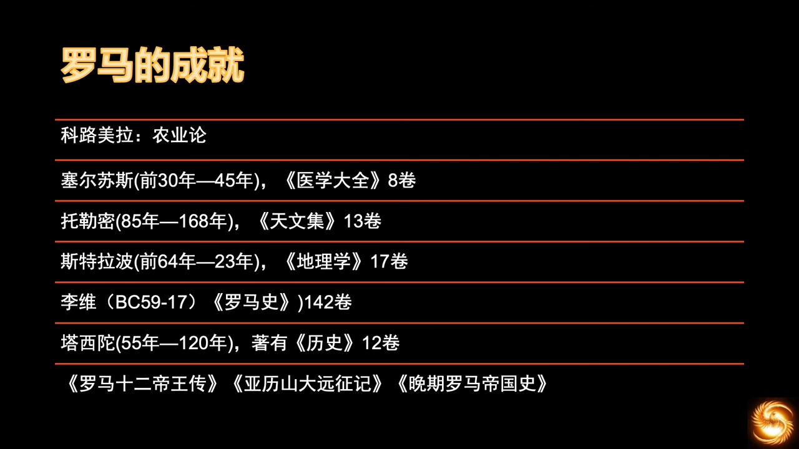
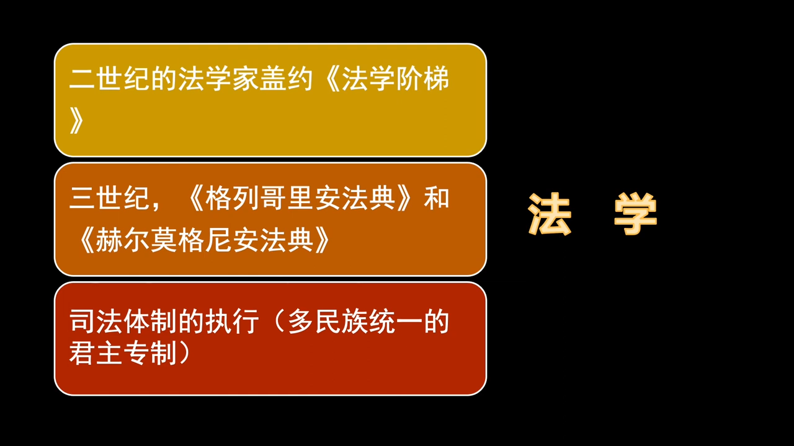
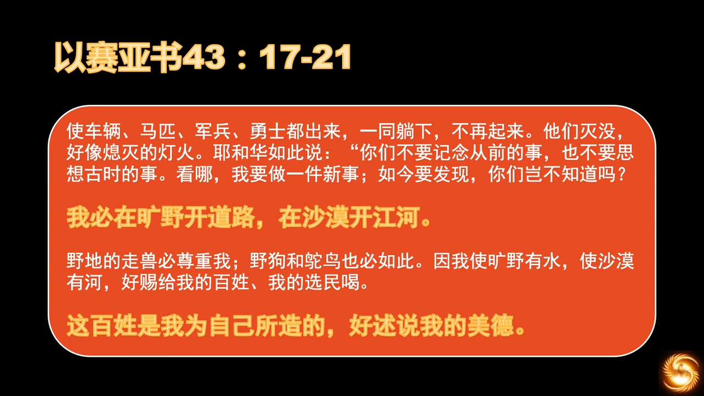

# 教会历史和欧洲历史
## 01 教会历史 基督教文明的底色
https://youtu.be/Z8YA7ejHJ_4?list=PLfChJ-aSv3VD-f-sQH1p9vEPjwx8zYH6e&t=866

借助教会历史作为主轴，联系世界文明形成的历史，就可以更加明确地知道我们的神在开始书写祂的篇章的时候，做了哪些动作。文明的底色，即神要在这块土地上，书写祂的文明。之前是人类自己的文明，自基督教开始，神的文明出现了。看看神在基督来临之前，做了哪些预备，预备怎样的文明底色，在这块历史的调色板中，我们的神用怎样的作为，来彰显祂的大能。

《罗马假日》，当记者问公主：“哪一个诚实最令您印象深刻？”，当时公主说：“罗马！毫无疑问是罗马！”。这不只是对爱情的回应，而是整个欧洲的历史，就是“罗马梦”的历史。

老教授邻居送了三本书，《人类简史》三部曲。他试图用书来告诉我，西方文明和基督教并无关系，而只是古希腊和古罗马的璀璨文明，造就了西方的今天。他认为宗教只会带来黑暗和杀戮，只有希腊和罗马，才会带来和平、希望、智慧。想证明我们是非洲大草原某一支智人的后代，想劝我回头是岸。这是目前西方人的信仰状态，用圣经的话就是，“他们以福音为耻”。

> :latin_cross:  
> 谁若以我和我的话为耻，将来人子在自己的光荣，和父及众圣天使的光荣中降来时，也要以这人为耻。 (路加福音 9:26)

> :latin_cross:  
> 我决不以福音为耻，因为福音正是天主的德能，为使一切有信仰的人获得救恩，先使犹太人，后使希腊人。 (罗马书 1:16)

特别是在学术界、科学界，比例比较高。“不信神”，是人的默认初始状态。而罗马又实在太强大了，强大到任何史学家都无法忽略它。但我们作为基督徒，圣灵带领我们看待历史，不能只看表面上的演变，而要看事物本身的联系。圣经告诉了我们看待事物的方法论。

> :latin_cross:  
> 而且我们也知道：天主使一切协助那些爱他的人，就是那些按他的旨意蒙召的人，获得益处，因为他所预选的人，也预定他们与自己的儿子的肖像相同，好使他在众多弟兄中作长子。 (罗马书 8:28-29)

没有一个文明的兴起是没有原因的，也没有一个文明的灭亡是没有目的的。因为一切世俗权力，都来自于神。

从二世纪初开始讲，一世纪的历史在圣经中有大致记载，留到研读新约时再讲，作为新约的背景材料。从AD100~300，是基督教悲剧的历史。

罗马，欧洲中世纪的世界，一个无法超越的天花板，就是罗马。罗马的皇冠，在法兰克王国中轮流戴，一会是西法兰克国王，一会是东面神圣罗马的皇帝。再之后是神圣罗马帝国，也戴上了罗马的皇冠，虽然伏尔泰说它“既不神圣，也不罗马，更不是帝国”。但不可否认，当时的皇帝都有一个罗马皇帝梦，甚至俄罗斯的皇帝也自称“沙皇”，即“凯撒”的俄语发音，每一个帝国都自视为罗马帝国的继承人。文艺复兴，复兴的就是罗马。天主教基督徒，想要复兴的是罗马帝国后期，基督教作为国教的荣耀。世俗王权想要复兴的是罗马帝国权力的荣耀。

世界对文艺复兴有不同的看法：
- 世俗世界认为这是人的胜利，文艺复兴使人从黑暗的宗教传统转换到了人文主义，出现了人文关怀；
- 宗教世界认为这是宗教深刻影响人类艺术生活，将艺术的荣耀归给上帝的一个运动。

各自表述，但都觉得文艺复兴是好的。所以文艺复兴在保守主义和自由主义中都有很高的地位的原因。两股持不同世界观的人，力量在交织，构成了今天世界的风景，构成了这个世界的双重真相。毫无疑问这是天父的世界，但圣经又说：

> :latin_cross:  
> 我们知道我们属于天主，而全世界却屈服于恶者。 (若望一书 5:19)

在任何的历史阶段，在任何的历史事件中，都是这两股力量的交织，形成历史前进的动力。这一切的矛盾和冲突，神是怎样来预备历史的。来看一下文明世界为何会有罗马梦，看一下希腊化的小亚细亚和埃及的情况，看一下神为什么将希腊和罗马强强联合，看一下罗马城邦独特的国家制度，神拣选罗马作为人间律法的执行者。

类似于画沙画，在画新画之前，需要将原来的沙子都抹掉。基督来之前，神就将画板抹了两次，希腊一次，罗马一次。这两次的抹平，神都是有目的的，通过强强联合，能看到希腊和罗马是各有使命的。在合适的时候，这两个国家会分开，一个为神破碎，一个为神坚守。如果没有这两种强势的文明同时存在，分开之后就很难各自独立生存，势必就会被其他文明同化。但他们的使命不是被同化，而是去同化别人。这是基督教文明非常与众不同的，犹太人是拒绝被同化，也不同化别人。犹太人唯一存在的目的，就是为主做见证，只要犹太人活着，就是活见证，见证耶和华的民族。

本节课主要讲两大内容，一是亚历山大的征服，二是罗马的治理。亚历山大的征服从政策和结局来看。罗马的治理看它如何继承了希腊文明，以及法律使命。主要描述一下希腊罗马的文明高度。

到今日其实已经很难想象，希腊这个在亚平宁半岛的城邦国家，能够征服当时已知的所有文明。一路向东，征服了犹太文明，征服了波斯文明，征服了埃及文明，终结了古埃及的法老世界，完成了圣经的预言，罗马时代，埃及地区是罗马大帝国的粮仓，因为有尼罗河的灌溉平原，另一个粮仓就是小亚细亚。同时也征服了印度文明。按照当时亚里士多德的植物学理论（亚历山大是亚里士多德的学生），认为同一种生物是生活在同一片环境中。看到了莲花和鳄鱼，以为自己已经绕了地球一圈，打回了地中海，结果只是到了印度。

在早期的征服中，亚历山大对小亚细亚的希腊城邦宣扬了一条新政，即只要是被他征服的城邦或国家，在税收和政治上都享有自治权，尽管自治权非常有限。这规定是怎么来的呢？公元前四世纪晚期到公元前三世纪，亚历山大征服波斯以后，面对希腊的管理者，被征服的那些城邦要想办法寻找生存之道，从吕底亚到叙利亚的数百个西亚城邦，找到了一个方法，即把希腊的神祗和英雄作为自己的祖先。编造了很多神话故事，和希腊神话挂上钩，目的就是为了向希腊人表明两边的神明是亲戚。“抱大腿”是犯罪之后的人类一大理直气壮的“美德”。亚历山大和希腊军团被这些城邦部落想和马其顿认亲戚的行为深深地打动了，于是就给了这些愿意希腊化的城邦一定程度的自治权，一些税收和政治上的特殊待遇，就造就了小亚细亚、阿拉伯世界、甚至到印度边界，都有了文明的共识：只要是希腊的，就是好的。“谁富，就傍谁的大腿”，这在古代也是不例外的，而且因为生产力的落后，这种行为也就更加明显，更加理直气壮。

不要小看这条规定，这条对以后的伊斯兰崛起有很重要的参照意义。他们也是这么对待被征服的民众的。伊斯兰后来征服了大片的波斯地区，也是用税征政策来笼络人心。对文明的仰望，是伊斯兰势力崛起的动力。但其自身的宗教，无法和希腊文明相容，才导致了后期文明的衰落。在现代文明的形成过程中，伊斯兰是一股很重要的力量，是“职业二传手”。伊斯兰文明的兴起，在中世纪晚期对现代文明非常重要。我们对伊斯兰文明有很深的误会，可能是缘于主流媒体的宣传。伊斯兰最后一位哲学家是在十二世纪，从那之后就再没出过大的哲人，因为他们的历史使命完成了，之后神对他们的计划我们就不得而知了，但我们可以为他们祷告，因为“神愿万人得救，不愿一人沉沦”，当然也包括穆斯林们。

> :latin_cross:  
> 主决不迟延他的应许，有如某些人所想像的；其实是他对你们含忍，不愿任何人丧亡，只愿众人回心转意。 (伯多禄后书 3:9)

亚历山大虽然武功盖世，但也没有逃脱神为他设定的命运，英年早逝。有说是酗酒而亡的、有说是被下属暗杀的、也有说他死在了巴比伦。只能说神的时间一到，他就落幕离场了。因为年轻，他未留下子嗣，只有一同父异母的痴呆的弟弟。一番折腾，最后被四名将领瓜分了他的权力范围。当时亚历山大的疆域非常广大，打下来之后就需要希腊官员过去治理。这四人就是当时的总督，也包括下属的很多官员。慢慢就形成了事实上的独立自治，成为了四股势力。之后形成了对伊斯兰社会的影响，以及对北非社会的影响。没有这个铺垫，就没有后来北非和小亚细亚的繁荣，也就不会有基督教文献借着伊斯兰势力被保存下来的这个过程。圣经中提到过这四位王。

> :latin_cross:  
> 后来，这只公山羊长的极其强大；正当它极强大的时候，它那只高大的角被折断了，代替这角而生出来的是四只卓绝的角，向着天下四方；其中之一又生出一小角来，长得极其高大，向南、向东，亦向着光华之地。 (达尼尔 8:8-9)

> 注：是说亚历山大正在极盛之时，年仅三十三岁即遽然逝世；他的帝国由他的四个大将，在各不相让的长久战争之后，划分为四个帝国：玛其顿，特辣克、叙利亚和埃及；此后作者仅注意叙利亚，并与叙利亚发生关系的埃及。

南方是托勒密王朝，北方是塞琉古王朝。当时退回希腊本土的王，也是非常厉害的角色。希腊的城邦国家是很强的，虽然后来败给了罗马，但是希腊的血液至今还流淌在罗马的皇冠里，每个强人都想将它加冕在自己头上。

希腊最辉煌的是哲学，古希腊最伟大的三大哲学家 —— 苏格拉底、柏拉图、亚里士多德，亚里士多德是亚历山大的亲授的老师。被希腊文化影响到的地区，都有哲学思考的萌芽。影响力随着与希腊距离的增加而递减，传到阿拉伯世界就发生了变种，然后借着阿拉伯世界又传到了印度，再次发生了变异。所以说阿拉伯世界是“二传手”。到了远东，又被统治阶级修改了界面，最后成为了一种思想。

这是第一次抹平，第二次是罗马的抹平，就更加的彻底。当时的罗马，其文明是远远不如希腊的，但是它却将希腊征服了，并且统治了当时已知世界的大部分地区，将地中海变成了它的内湖。罗马对希腊文明没有摧毁，而是完整地保存了下来，在希腊语的基础上，结合自己的方言，完善了拉丁语系。也继承了希腊的神话传统，将希腊神话全盘照抄，为了大国荣誉，给这些神都改了名。创世纪中亚当给动物起名字，象征着人对动物的管理权；而罗马人给神改名，也不知道这些神乐不乐意。

希腊最好的部分是它的体制，当时在希腊半岛上，已有了现代政体的一切雏形。有僭主制，民主制，共和制。罗马继承之后，在这个基础上，成立了一个共和国的政府。共和制是多民族统一的庞大国家，需要有一支行之有效的军事力量，和一个无差别执行的法律力量。所以罗马这两点是很牛的，军事上毫无疑问，能打败希腊。还有就是法律的执行，法律是罗马精神的精髓，现在的大陆法系，就是来源于罗马法系，来自于查士丁尼的法典，又称《民法大典》或者《国法大典》。

希腊的哲学，和罗马的法律，这两者会深度影响之后的西方文明，这个过程就是这系列课程要学习的主要内容。这两个国家当时的文明程度，让我们更深刻地了解，上帝在启示救恩的计划。

罗马军事、法律很牛，大陆法系。希腊的哲学，罗马的法律，深度影响西方文明。  
人口增长是神的祝福。  
河流流域的农业文明，灌溉文明容易出现集权，河流泛滥出现水利问题，需要大量人力劳动。两河文明是大一统的开端。希腊是城邦文明，因为山地众多，很难统一。神通过希腊暗示了“小而美”的设计。

犹太人不能放贷给自己族人，只能放给外邦人

> [!TIP]  
> PhD是“哲学博士”的意思，哲学包含了所有的知识，亚里士多德是行走的百科全书。

布鲁诺是异端，不支持三位一体，哥白尼是大主教，死后才发表日心说，其实未受到迫害。

https://zh.wikipedia.org/zh-sg/%E7%84%A6%E7%88%BE%E9%81%94%E8%AB%BE%C2%B7%E5%B8%83%E9%AD%AF%E8%AB%BE

https://zh.wikipedia.org/wiki/%E5%B0%BC%E5%8F%A4%E6%8B%89%C2%B7%E5%93%A5%E7%99%BD%E5%B0%BC

罗马站在希腊的肩膀上，继承了所有希腊知识，并进一步推进。

大陆法系的法律基本沿自罗马。西罗马灭亡后，由拜占庭继承了下来。法律和信仰是“基督教”化之后的罗马帝国传承给之后的蛮族最大的祝福。

罗马是之后蛮族的文明天花板，一直持续到文艺复兴，地理大发现，宗教改革。出现了大英帝国的殖民梦，西班牙无敌舰队的淘金梦，以及后来的美国梦。此时“罗马梦”方才宗教性地终结，之后高举希腊理性主义的旗帜，罗马梦以另一种形式出现。世界一直是两股势力的博弈，“凯撒和上帝”，世俗王权和神权。

上帝抹去了沙画上的线条和图案，只留下了散落的沙子，沙砾若干年后将重新聚集起来成为美丽的风景。

