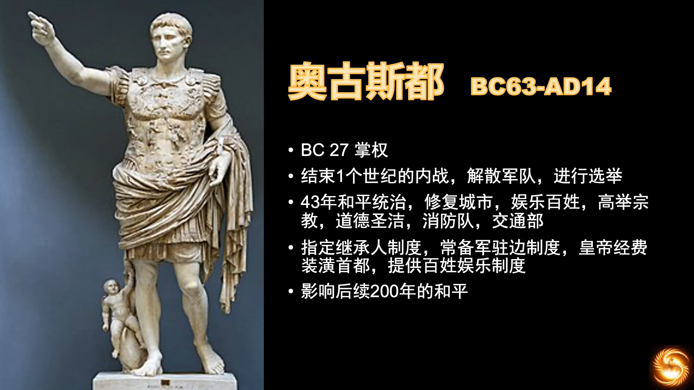
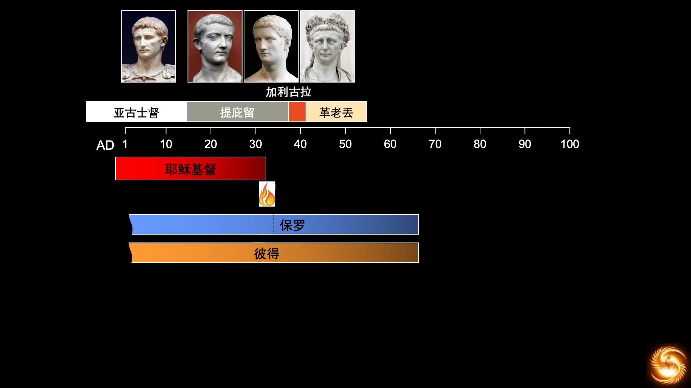
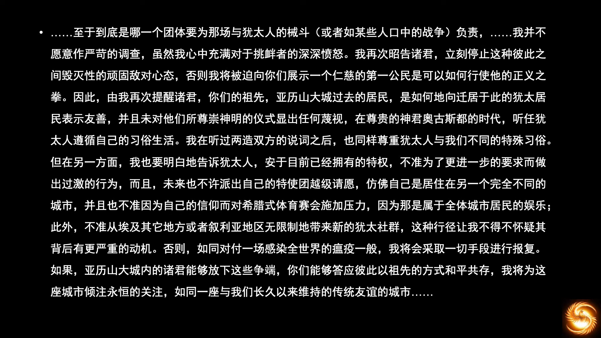
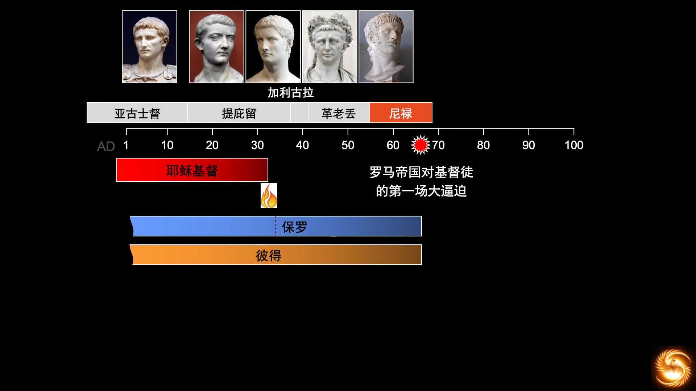
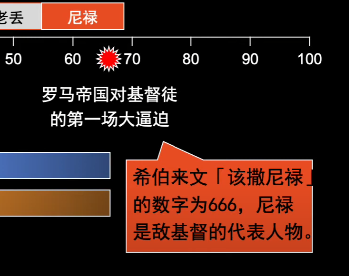
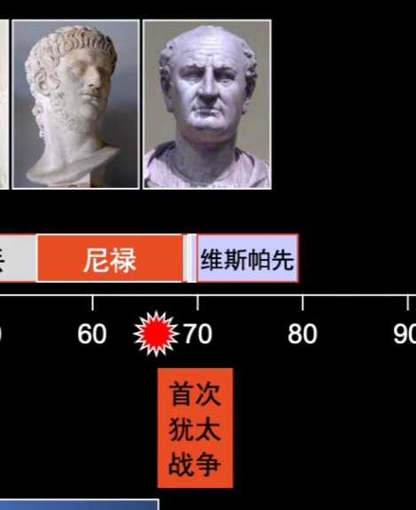
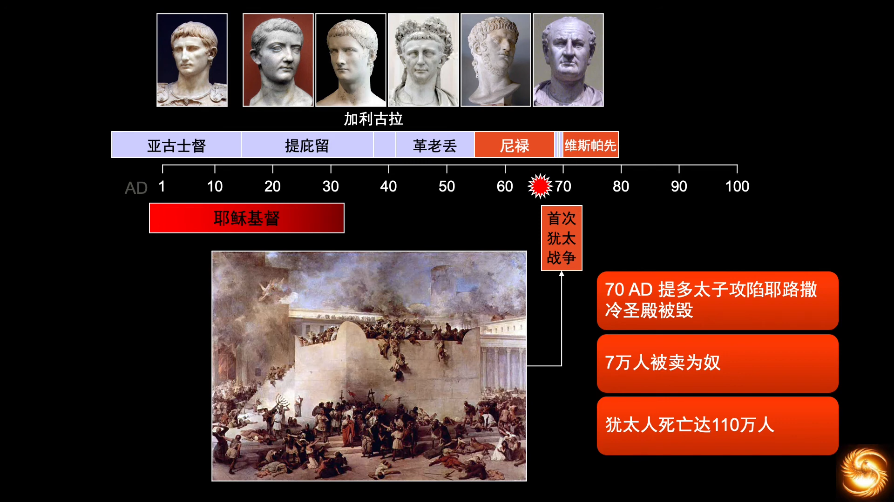
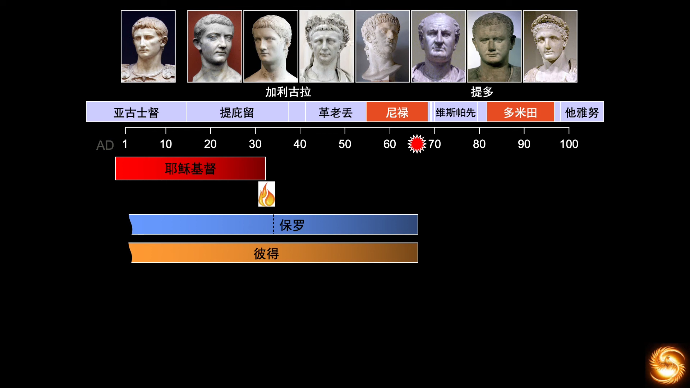
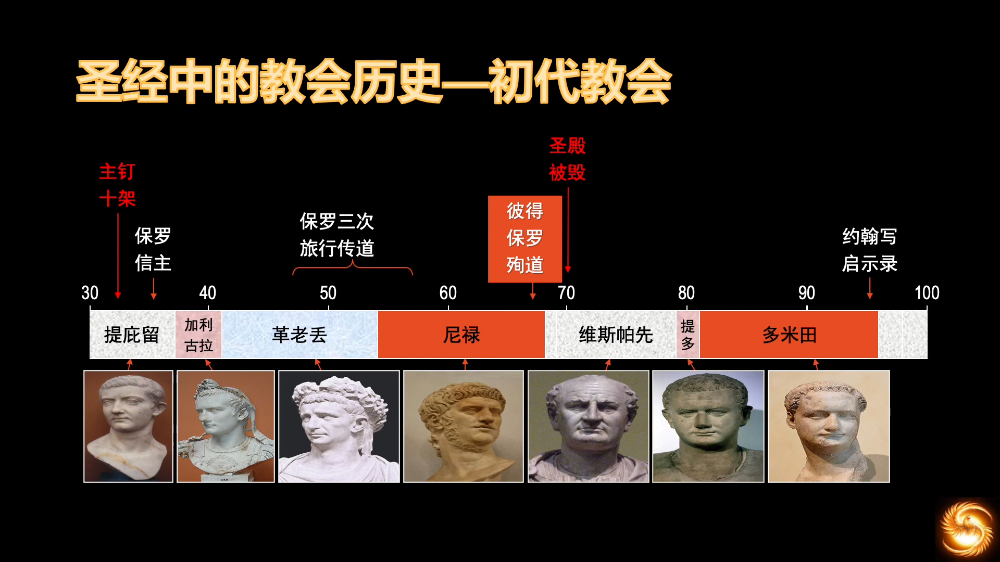
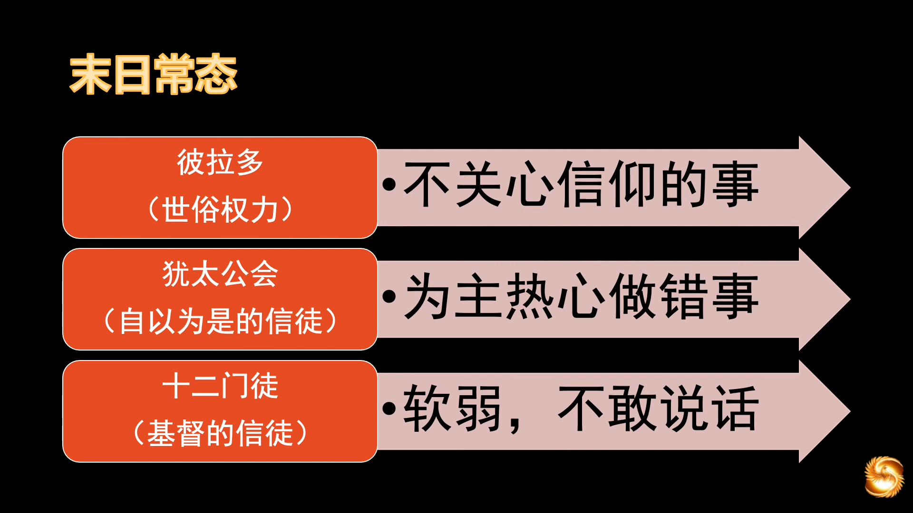

# 教会历史和欧洲历史

## 02 教会历史 初代教会（AD1 --100年）
https://www.youtube.com/watch?v=4YMPcuNr7Lk&list=PLfChJ-aSv3VD-f-sQH1p9vEPjwx8zYH6e&index=3

  

***奥古斯都*** (Augustus)在各种制度上进行更新，帝国明君典范。

***提庇留*** (Tiberius)有名，因为耶稣死在他的任期内。他节俭，不喜娱乐，虽为罗马攒了巨额的财富，但不讨百姓喜欢，又不打仗，没有凯旋，老百姓觉得不热闹。总体是不错的皇帝，19世纪史学家为其翻案。所以老百姓是无知的，只看重眼前的快乐。无知无识，和300年前杀苏格拉底的人没有任何区别。

***加利古拉*** (Caligula)非常取悦百姓，给了百姓所有他们想要的。一年之内花光了前任攒下的所有积蓄，然后开始横征暴敛，百姓苦不堪言。被禁卫军所刺杀。其叔父***革老丢*** (Claudius)很意外地承继大统。他当时钻研了语言，启用了新的拉丁字母，对罗马语言发展有重大意义。从他给亚历山大城的公开信可以一窥他的性格。

罗马史上最坏的君王 —— ***尼禄*** (Nero)

史学家普遍认为其是一个疯子，即反社会人格。
他早期执政
- 降低辩护费用的上限
- 降低了税赋
- 公开了税收的记录
- 降低粮食价格
- 文艺才能，剧作家，演唱者，会演奏竖琴，经常举办运动赛会，罗马帝国出现了文艺复兴

  

是第一个法律层面给基督徒定罪的。《启示录》中魔鬼代号也是666，所以尼禄是“敌基督”的代表人物。

“圣殿特别税”，率领军队到耶路撒冷，引起犹太人的全面叛乱。

耶路撒冷城从此残破荒凉。但犹太人是打不死的小强，受上帝特别眷顾。

  

罗马皇帝都是一个一个鲜活的人，看待历史人物，不能标签化。

学习历史时候，要注意观察，神呈现这段历史的用意是什么。看圣经要对照自己，学习不是为了指责别人，是为了警醒自己，不要成为三次不认主的伯多禄。