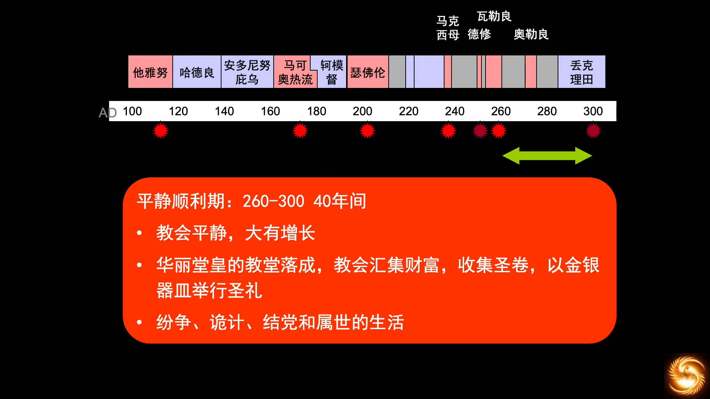
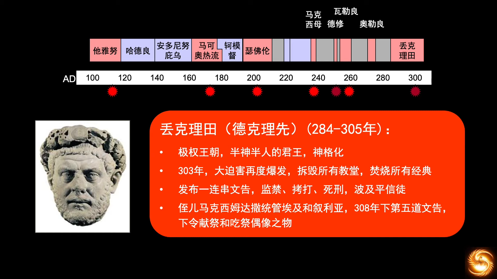

# 教会历史和欧洲历史

## 03 教会历史 早期罗马逼迫教会的时代
https://www.youtube.com/watch?v=UDmQUSw6nbQ&list=PLfChJ-aSv3VD-f-sQH1p9vEPjwx8zYH6e&index=4

公元2世纪，持续的逼迫基督教的皇帝，从世俗视角和基督徒视角。

从尼禄皇帝开始，持续300年左右的迫害，这幅画是《基督殉道者临终的祈祷》，受害者为加害者祷告。

  
提多把圣城给扒了，然后受报应了。庞贝城被第四次的火山碎屑击中的。

受患难十日：史学家总结大规模迫害基督徒约十次。

五贤帝之一，“逼迫基督教的皇帝”，在位时版图扩张很快，“图拉真柱”，元老院给了“最优秀的第一公民”称号。为了消弭非法组织，在公元112年，“一切宗教都要在帝国注册，没有注册过的不得进行宗教活动”，由此基督教成为非法宗教。只要当事人当场否认是基督徒，即可当庭释放。

元老院也给了“最佳第一公民”的称号，第二次犹太战争。新建了“哈德良长城”，划定了北边的国境线。提倡“人文主义，希腊文化”。他走遍了罗马帝国的每个行省，在雅典境内建了很多神庙。驱逐了犹太人，等于替基督教赶走了一个潜在敌人。

“五贤帝时期”也被称为“安东尼王朝”。安东尼是五贤帝中在位时间最长的。马克奥热流，斯多亚主义，禁欲主义，强调理性和逻辑，写《沉思录》哲学书籍。发布诏书，被告发的基督徒的产业归于告发者。

马克是聪明人，且有贤明的口碑。但是在信仰这件事上，凭智商无法识别真理。他的名字永远和瘟疫捆绑在了一起，瘟疫持续16年。

基督教因为不认其他的神，不愿意拜众神，在当时反而被称为“无神论者”，“众神之敌”。以处决主教而著名。掠夺一切异教的庙宇。只要和罗马的多神教不符合，一律掠夺。

并未有多少文化，但想要恢复辉煌的皇帝。要求所有公民对审查官进行证明自己信奉罗马国教多神教。战死于与哥特人的战争。

（直到公元313，君士坦丁，颁布《米兰赦令》，为基督教平反。）

257年，态度突然发生改变。基督徒为了信仰，不愿从事公职，被皇帝认为是在逃避兵役。发生瘟疫，罗马战斗力下降，所以要征兵，基督教因为宗教信仰拒绝参军杀人，于是民间倾向于将天灾人祸归根为基督徒的错。AD257开始，可以直接不审而逮捕。若不声明放弃信仰，政府就可以流放甚至处死。

  

在受迫害的年月中，灵性增长；现在富足了，岁月静好了，灵性倒退了。人，只要日子好过个几百年，就一定会再幺蛾子。在受逼迫的时间里，只能私下信教，无法公开讨论和辩论。一旦平静了，各个流派都可以公开传道了，也就涌现了异端。平静时期，总是异端频发的，种子是在黑暗时期埋下的，在和平时期表现出来。和平时期，更正信仰，也是神的一种护理。

罗马帝国，每一百年会有一个改变，一世纪是混乱期，二世纪五贤帝，三世纪政治危机，帝国的极权性质决定的。