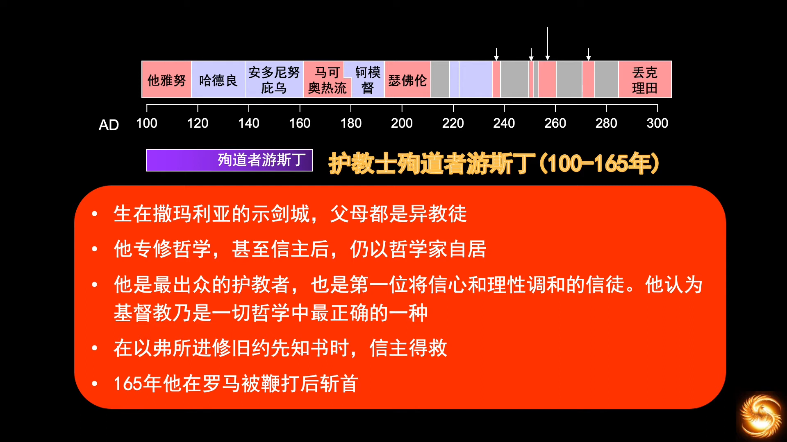

# 教会历史和欧洲历史

## 04 教会历史 基督教早期的圣徒们，次经的作者，以及早期异端的产生
https://www.youtube.com/watch?v=3H3sGZ0lkrY&list=PLfChJ-aSv3VD-f-sQH1p9vEPjwx8zYH6e&index=5

人类文明是流动的，人类历史要尽量还原当时状态，理解当时为何会产生，为何消亡。教会历史不能脱离世界历史，圣经已经给了我们方法论。 

> 耶稣写给使徒约翰的话

受患难十日，罗马历史上大规模地受迫害约十次。

“反抗神”和个人品行其实并无关系，“好人”，“坏人”，都可能是神的敌人。“善恶”的颠覆性的认知。  
犹太人钉死基督，是因为耶稣自称“神的儿子”是对犹太人的神的冒犯和僭越。那人岂不是很绝望，如何救赎？打破怪圈的关键是——“看见”。罗马的《米兰赦令》，就是因为君士坦丁大帝“看见”了，“看见”了十字架。  
“本体论”，人是不可能看见神的，只有“神”让你看见你才可能看见，人，有自己一套自洽的逻辑，靠自己根本不可能走得出来。所以人的得救，完全是神的作为。

  
  
> 一共约十次迫害，都是有贤良口碑的君王。

五贤帝，罗马相对稳定的时期，将近两个世纪的稳定。罗马是*指定继承制*，不是*嫡长子继承制*。图拉真远征埃及，哈德良远征大不列颠（哈德良长城），安东尼征服了小亚细亚，马克写了《沉思录》。之后开启了混乱的三世纪。

  

“罪人”的教会，所以一定会将原来的“带罪”的想法带入教会，所以需要“归正”。次经主要在天主教典籍中。

在信中窃窃地表达希望为主殉道，“希望碎骨断肢，都来吧”。

> 详细记录殉道过程

“愿主的旨意成就”。

在抓捕军兵到来之后，坡旅甲提名为所有关心他的人祷告，为教会祷告，为来抓捕他的人祷告。希律请他在车上同坐，劝他说一句“凯撒是主”。到了刑场，天上传来声音说：“坡旅甲，要坚强，要做大丈夫”，在场很多人听到。希律要坡旅甲辱骂基督，坡旅甲说道，“这86年来，我一直侍奉主耶稣，祂从未亏待我，我如何能辱骂我的王”，总督让坡旅甲向凯撒宣誓，遭到拒绝，坡旅甲坦然受死。

  

> 最出色的护教者

罗马征服和众神崇拜者，为了逼迫的合理化，需要丑化基督教，编造荒谬的故事来控诉基督徒们。于是护教士出现了，护教士基本不是神学家，大多是思想家。护教士是面向**教外**的人做辩护，而不是面对教会内部归正信仰，“对内”的是神学家，“对外”的是护教士。

