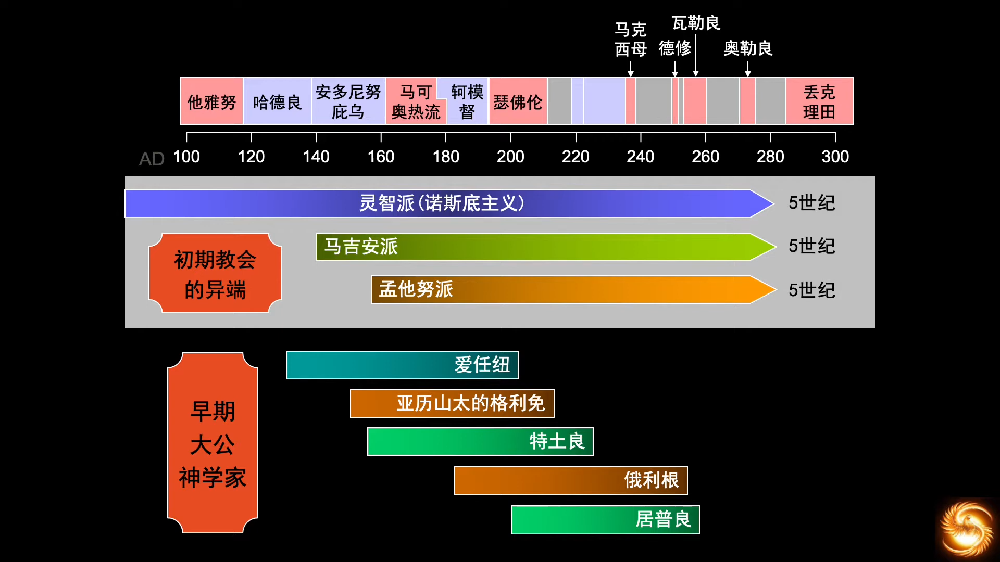
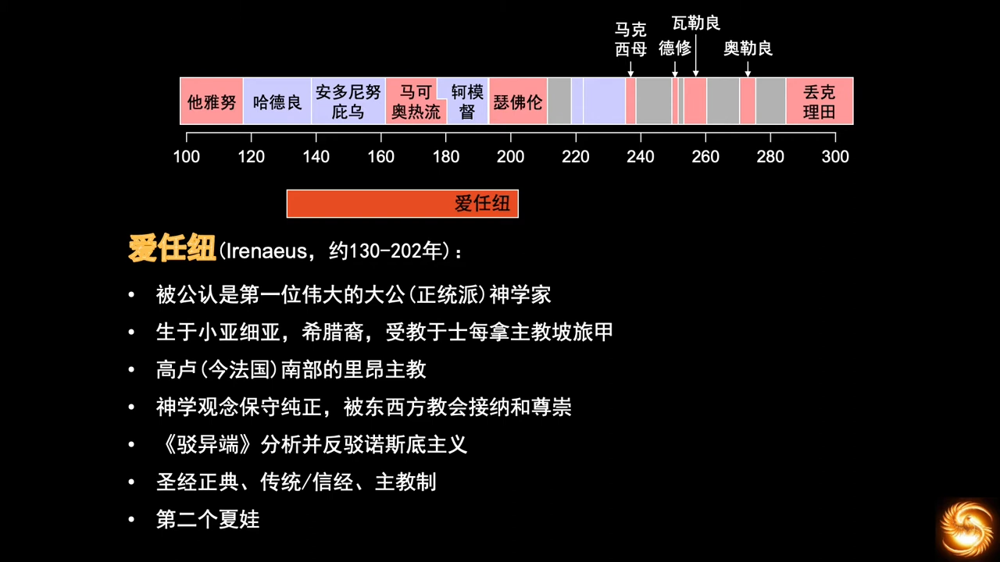
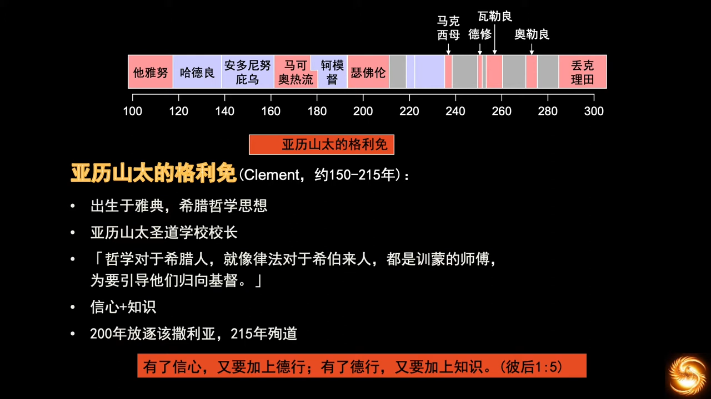
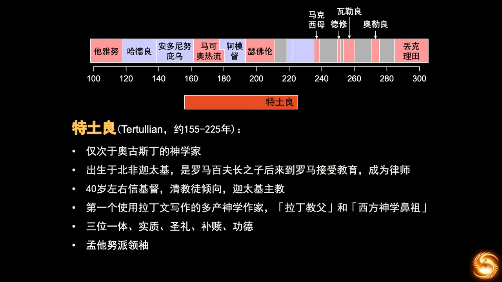
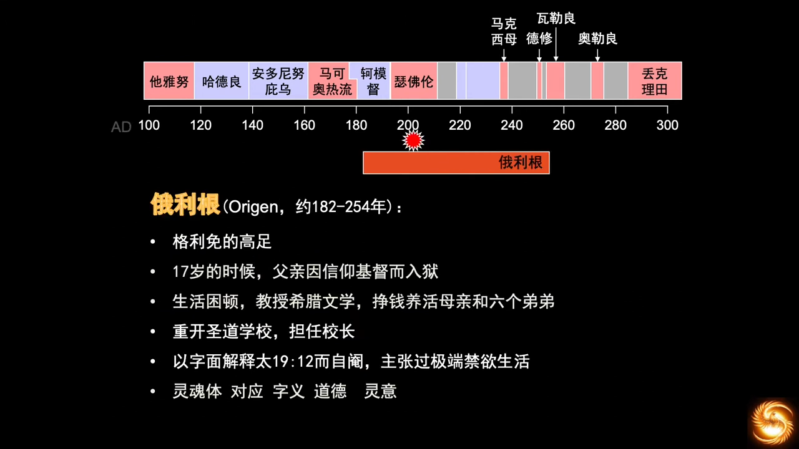

# 教会历史和欧洲历史

## 05 教会历史 基督教早期的教父们
https://www.youtube.com/watch?v=PFDKECJ9xiw&list=PLfChJ-aSv3VD-f-sQH1p9vEPjwx8zYH6e&index=6

  

不要相信“设计”的制度，不是“人间常态”，往往将人带入灾难，保守主义相信自然演变，对社会损害更小。“第二个夏娃”开启了崇拜玛丽亚的先河。  
- AD 50，凡领受洗礼和圣灵，认耶稣为主的，即属于教会
- AD 180，凡属于教会，必须承认信经为信仰准绳，承认新约正典，承认主教权威 (为了应对层出的异端，为了统一教义)

> 出现了高举玛丽亚的端倪

  

引入了很多词语，为“三位一体”的教义奠定了根基。第一次出现将哲学和神学分开的理论。自他后约1400年的思想家哲学家康德，在纯粹理性批判中，将神学、哲学、科学进行区分。神学为“本体论”，哲学是“认识论”，科学是“方法论”

> 雅典和耶路撒冷何干，学院和教会何干，异教徒和基督徒何干。

