# 教会历史和欧洲历史

## 05 教会历史 基督教早期的教父们
https://www.youtube.com/watch?v=PFDKECJ9xiw&list=PLfChJ-aSv3VD-f-sQH1p9vEPjwx8zYH6e&index=6

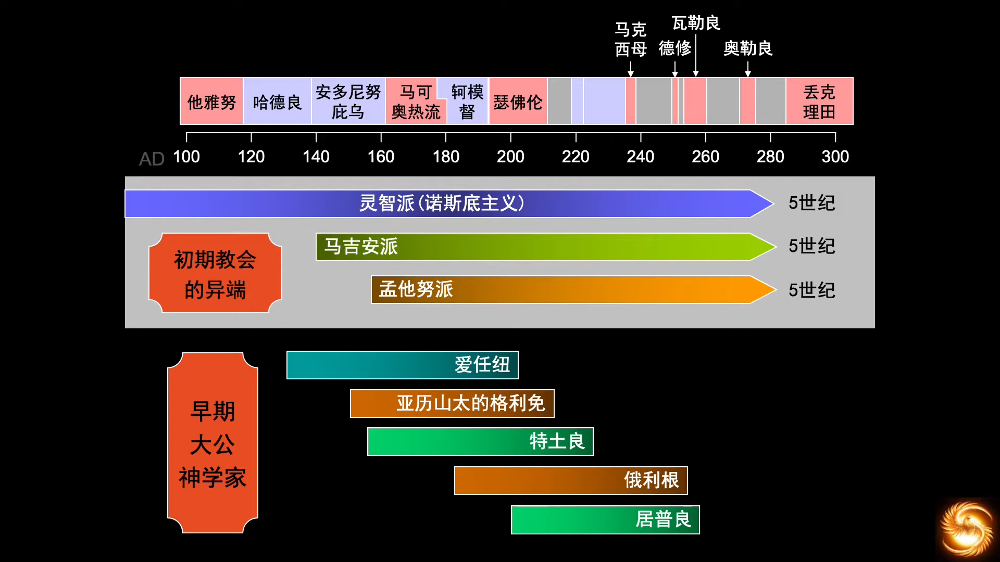  
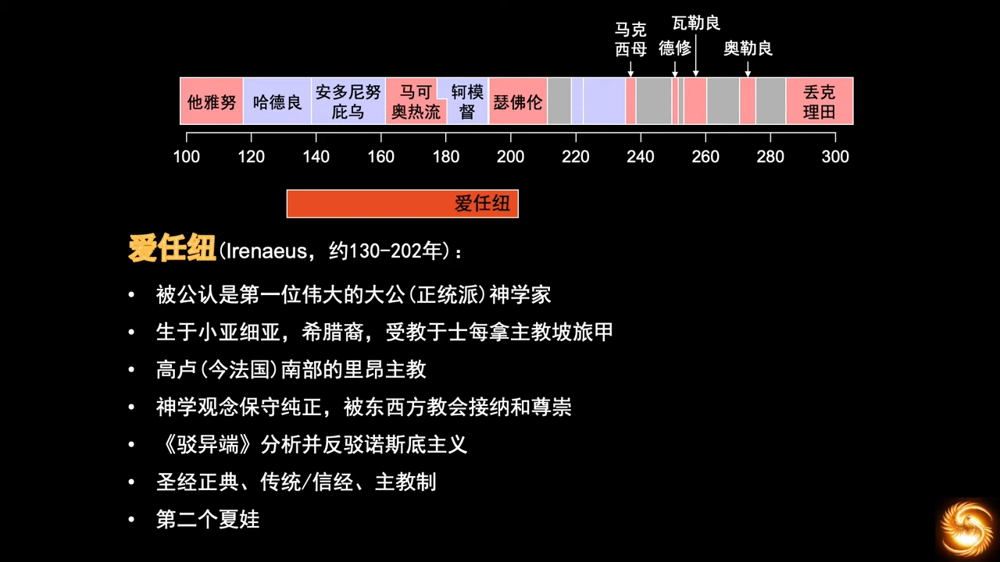

不要相信“设计”的制度，不是“人间常态”，往往将人带入灾难，保守主义相信自然演变，对社会损害更小。“第二个夏娃”开启了崇拜玛丽亚的先河。  
- AD 50，凡领受洗礼和圣灵，认耶稣为主的，即属于教会
- AD 180，凡属于教会，必须承认信经为信仰准绳，承认新约正典，承认主教权威 (为了应对层出的异端，为了统一教义)

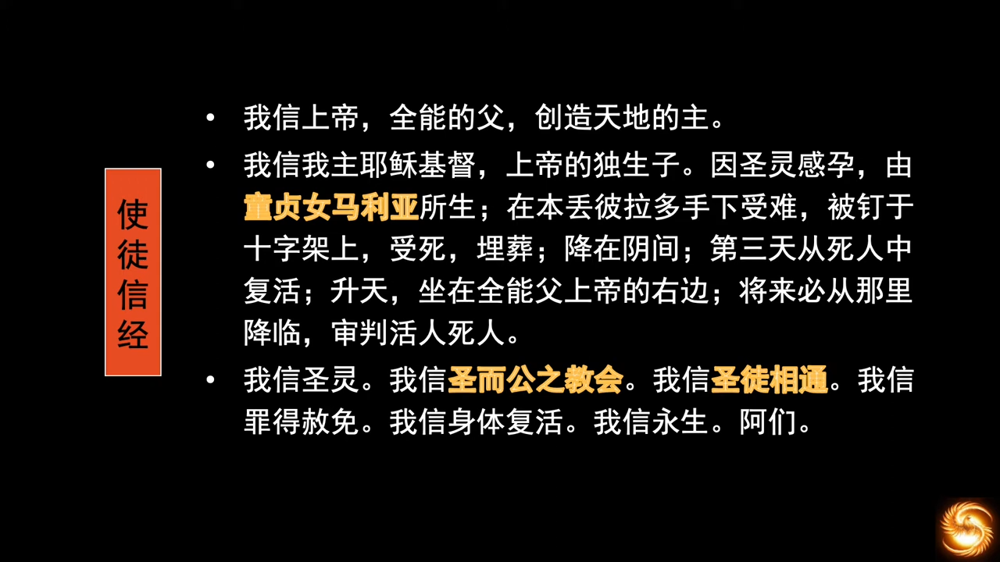
> 出现了高举玛丽亚的端倪

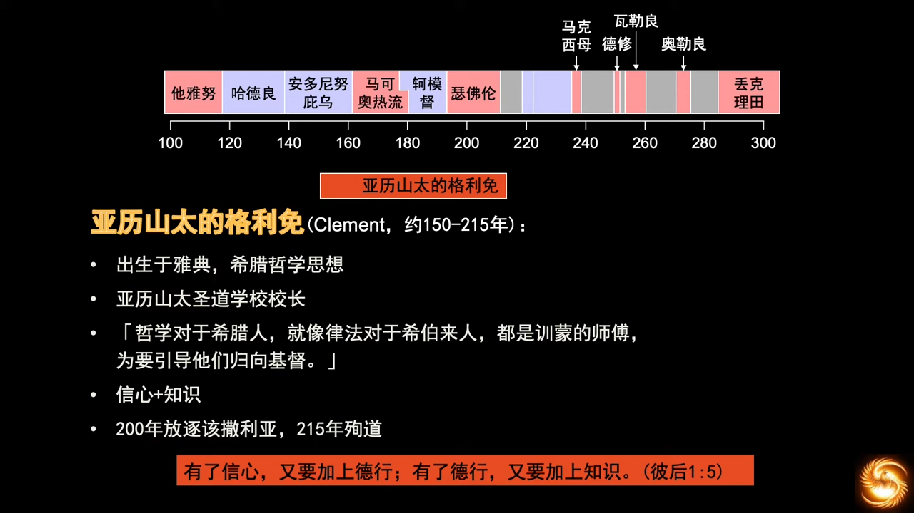  
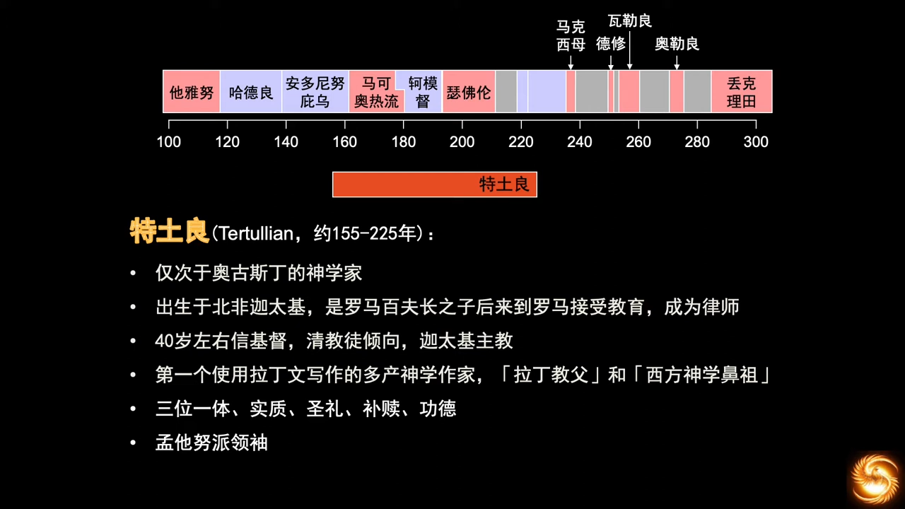

引入了很多词语，为“三位一体”的教义奠定了根基。第一次出现将哲学和神学分开的理论。自他后约1400年的思想家哲学家康德，在纯粹理性批判中，将神学、哲学、科学进行区分，神学为“本体论”，哲学是“认识论”，科学是“方法论”。苦修主义。

> 雅典和耶路撒冷何干，学院和教会何干，异教徒和基督徒何干。

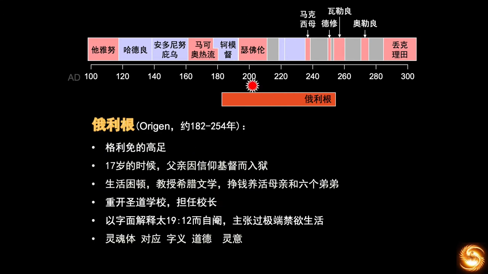

写信给父亲，要父亲坚定，站定立场，不要放弃信仰，父亲殉道，家产充公，家道中落。很多圣道学院的学生都殉道，他依然坚守。

> "For there are eunuchs who were born that way, and there are eunuchs who have been made eunuchs by others—and there are those who choose to live like eunuchs for the sake of the kingdom of heaven. The one who can accept this should accept it." (Matthew 19:12)

不应嘲笑这种行为，著作高达两千部，经文的注释最为详巨。“灵意”层面的解读圣经，其解读也被批评为“不受控制的奇想”。认为圣经和哲学不矛盾，希腊哲学讲解基督教教义是可以的。其思想影响了东方后代的神学。  
但其“末后的时候，魔鬼和邪灵都将得救”的理论就过于离谱了，公元六世纪，被判为异端。“品德又优美，心智高洁”是毫无疑问的。

以上为亚历山太学派 *Alexandrian school*，与之对立的是公元三世纪出现的安提阿学派 *Antiochene School*，强调历史，着重研读经文原文。任何的学派，一出现，就会被魔鬼利用，加以极端化，这是魔鬼的作为。历史中，为了归正这种现象， 就会出现反对派。

神学，就是在这种情况下，在神的护佑下，一点一滴发展到了今天。但直到今天，我们仍对神太一无所知了。

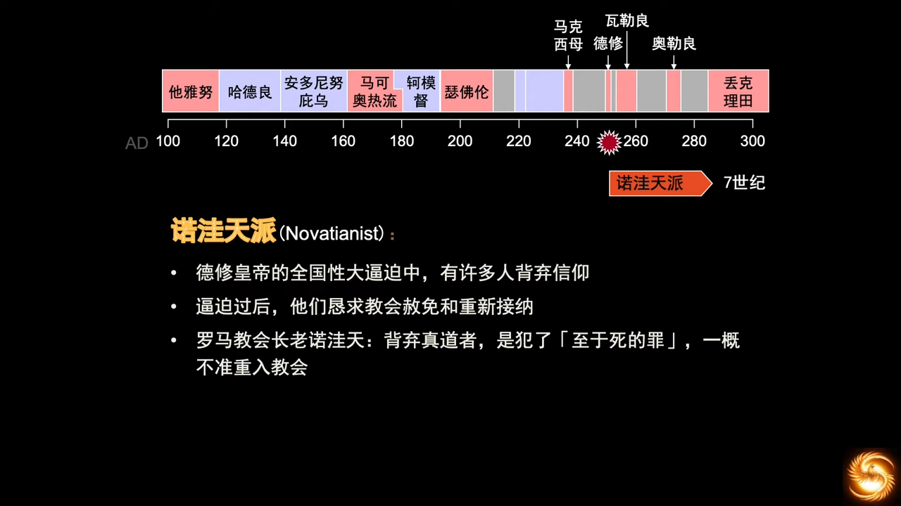

离弃信仰，背弃基督，是“必死的罪”。对教会的宽容大为不满，脱离了大公教会，自成一派。

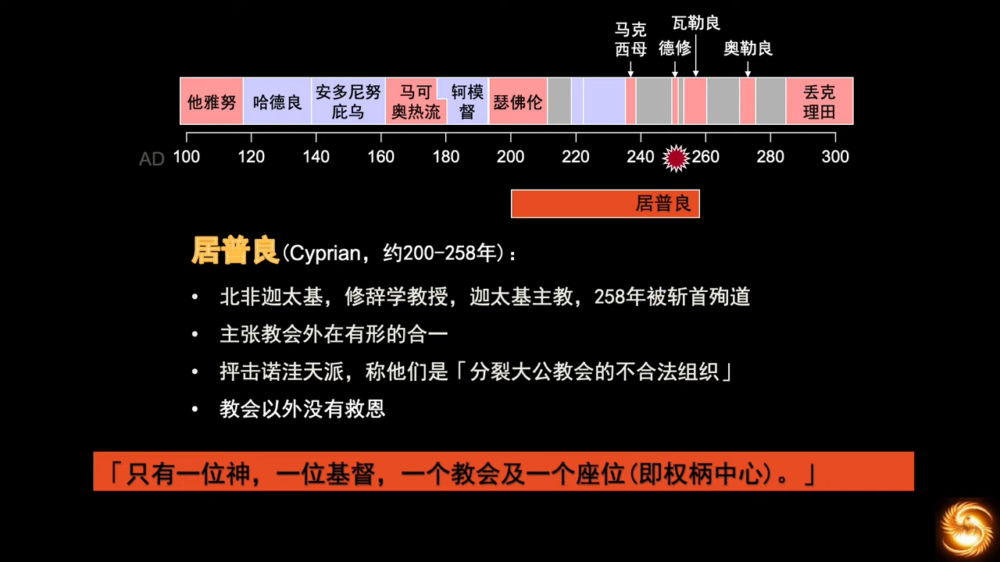

针对诺洼天派，神又兴起了一位制衡的仆人。修辞学，又被称为“雄辩学”。“一切在大公教会外的人都不能得救”，这句话被罗马天主教会高高地举起，开除教籍（绝罚）成为最重的惩罚。为了抵御异端。“做麦子不做莠子（稗子），做大户人家的金器银器”，分开麦子和莠子是基督的工作。

不应用现代自由主义的眼光来审视公元三世纪的教父们，没人能突破自身的局限性，也不可能突破自己身处的时代。

> 魔鬼只讲一半的真理

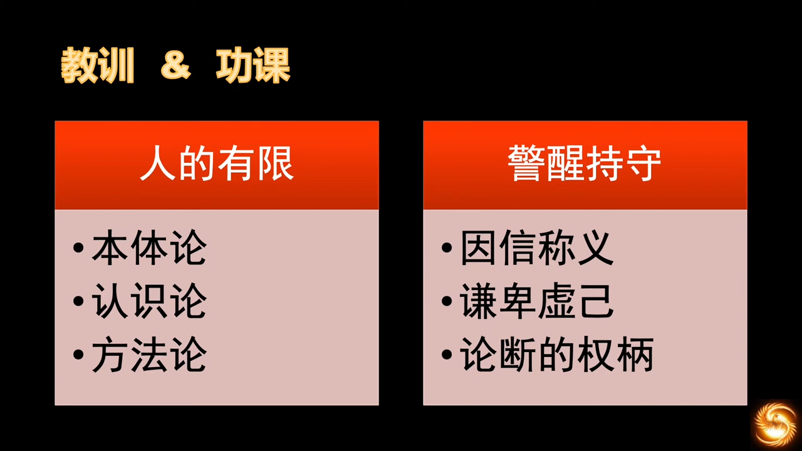

人的罪，阻止人的“主里合一”，康德的“三分法”。

- 本体论：坚持“因信称义”，不要加添新的主义和思想，坚守圣经
- 认识论：坚信人的“有限”和“无知”，要谦卑，遵循基督的教导，多倾听，警醒祷告。 ***快快地听，慢慢地说*** ，不要论断别人，那是神的权柄
- 方法论：靠圣灵带领，在主里合一

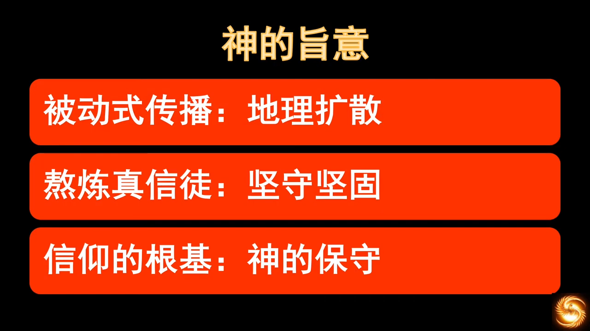

地理扩散，信徒因为遭受迫害四散而逃。使徒后期已出现异端。

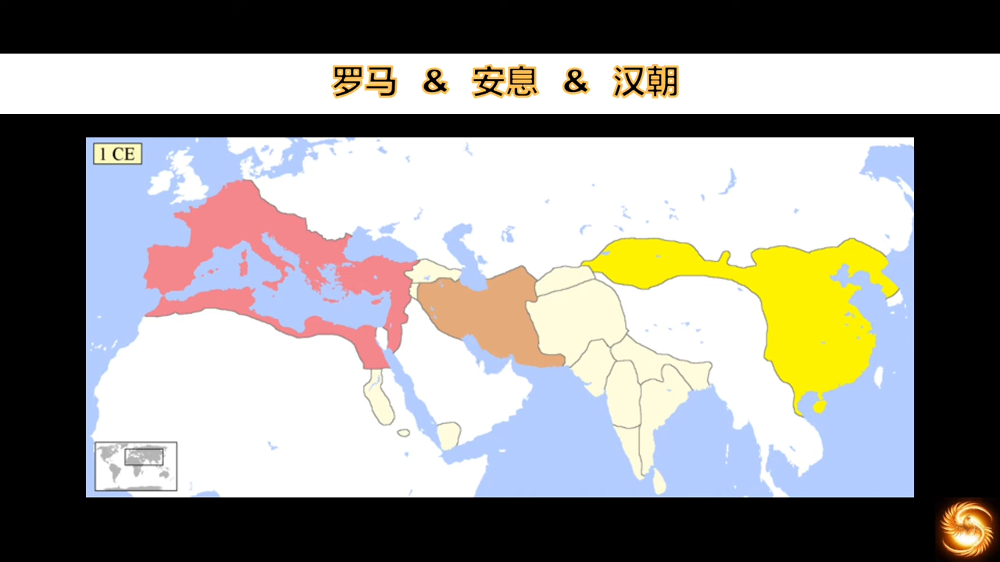

同期三大帝国的对比，领悟神的旨意。两个超过300万平方公里的帝国。时间BC 200 ~ AD 300，500年跨度。

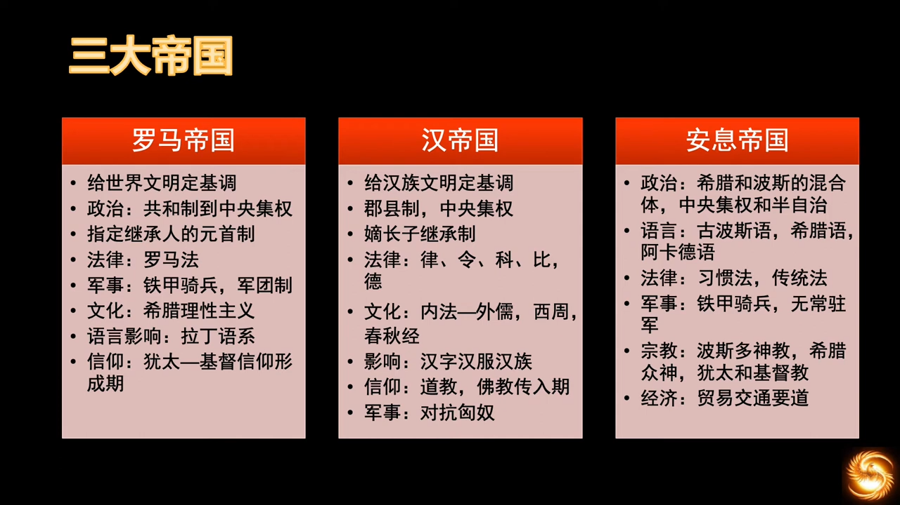

西方文明就是追随罗马的历史，汉朝奠定了远东的文明底色，周期性崩溃是常态。
- 都是中央集权 (不是极权)；
- 罗马从共和制到中央集权，帝国制，元首制；
- 汉朝在同时期，削弱诸侯的权力，建立郡县制。20世纪初，才有“中国”的概念。

没有神权的国家，君王和诸侯处于跷跷板两端，跷跷板总是倒得很彻底，很难长期稳定，总是一方彻底完全地战胜另一方，过一段时间，农民起义，另一方再战胜回来，周而复始。  
而有神权的国家会相对的稳定，因为 ***三点决定一个平面*** 。

继承制度：
- 罗马：指定继承，在贵族和皇族中选拔人才。避免出现“掷色子”，帝国存续期大大改进，“王侯将相宁有种乎”只会让文盲和武夫上台执政；
- 汉朝：为了皇位不外流，嫡长子继承，制约了帝国发展。圣经说：“人心比万物都要诡诈”。只给头衔不给实权，是巨大的诱惑和挑战，人很难抵挡。

法律：
- 罗马的成文法构建在希腊的理性主义上，是有逻辑的。虽然在执行上也会有多民族的差异性；
- 虽然是成文法，但汉朝法律没有逻辑，大多是皇帝的个人看法。在法律方面没有任何值得夸耀的。

军事：
- 没有正面对抗过
- 罗马高于汉朝，曾有说法说汉朝高于罗马，用“匈奴”做参考，汉朝曾战胜匈奴，匈奴曾战胜蛮族，蛮族往西征战时又战胜过罗马，故推导出“汉朝军事水平高于罗马”；
    - 历史上并未有抗击匈奴的确凿记载；
    - 有记载的卫青和霍去病参与的两场战争的规模都比较小，而罗马面对的是五十万蛮族铁骑；
    - 更为合理的猜测是，抗击匈奴的主力是“长城”，将匈奴拒于关外，长城对骑兵有效；
    - 罗马战胜了马其顿帝国，希腊帝国。

文化：
- 罗马：公元前完成了希腊化，公元后三百年完成了基督教化。给后世所有的西方文明刷上了文化底色，希腊理性主义和基督教文明；
- 汉朝：巨大的分野
    - 不再高举法家，法家开始儒化。法家内核化，儒家政治化，法家是统治核心，儒家构建社会结构，虚高人心道德。“君为臣纲”，“夫为妻纲”等都是社会结构上的设计；
    - 佛教传入中国，汉皇帝对佛教也进行儒化，使佛教为统治者服务，思想和信仰对权力的屈服，反观基督教受迫害的三百年，最后是权力对信仰的屈服；
    - 儒家文化有生命力，不是因为其自身有生命力，而是因为使用它的历代王朝，是因为这土地上有生生不息的王；

> 清华大学历史系教授秦晖则认为：“从西周转向秦朝，是中国另一次巨大的变局。在这次变局中，法家战胜儒家建立了秦制，之后，这种儒表法里的格局延续了两千多年”“新文化运动值得反思的一点正在于搞错了斗争的主要敌人，不应是“儒表”，而是“法里”。”，他还认为“当时没有重点批判法家是重大失误”。  

> 南开大学历史系教授刘泽华认为，法家思想中充斥着钳制言论自由、愚民弱民、极力维护君主独裁、重农抑商、限制人口流动、对外侵略等一系列与法西斯主义相通的因子。

安息帝国：
- 学习了希腊的理性哲学思想，又有原始的习惯法示例，民族观念很难统一，也造成了现在伊斯兰国家的复杂性，都被希腊征服过，有希腊的理性哲学思想，产生了哲学思考，有理性启蒙，传播到了印度，到了远东，在传播过程中产生衰减，到达远东时已经走样，所以称其为“二传手”；
- 军事上，铁甲骑兵，没有常驻军，但开打了之后随叫随到，还生擒过罗马皇帝；
- 在文化和宗教上也是混合体大杂烩，拜火教;
- 政治体制上，也是混合的，总督制，部落制都有，皇权方面仍然是中央集权。两河流域都是大一统，涉及水利，就需要人力的大量集中，就必定发展成大一统（埃及，尼罗河）；
- 经济上安息帝国最强。汉朝农耕经济，百姓很穷。罗马帝国共和制，经济增长只能靠对外扩张，占领资源。安息帝国地处亚欧交通要道，丝绸之路，西欧，地中海沿岸依赖印度香料，阿拉伯商人很有名，进口丝绸香料给贵族，从皇室到部落城邦，都很富有。

三大帝国，国力总体差异不大。政治上罗马最强，有理性主义，法律制度，文艺建筑，都是无可争议的强。汉朝要直到近一千五百年之后，《几何原本》由传教士翻译后引进，没有几何知识，建筑不可能超越罗马。安息帝国大体处于两者之间。

横向对比，才可以看出*有神的世界，无神的世界，有假神的世界*，这三者的区别。学习历史，就是为了要“认识神”。