# 教会历史和欧洲历史

## 06 教会历史 君士坦丁大帝归信基督教
https://www.youtube.com/watch?v=N7_RKn0U9gs&list=PLfChJ-aSv3VD-f-sQH1p9vEPjwx8zYH6e&index=7

君士坦丁大帝，从世俗君王上看，是一位非常好的皇帝，但从神的历史来看，总有其双面性。罗马历史上第一位基督徒皇帝的作为。

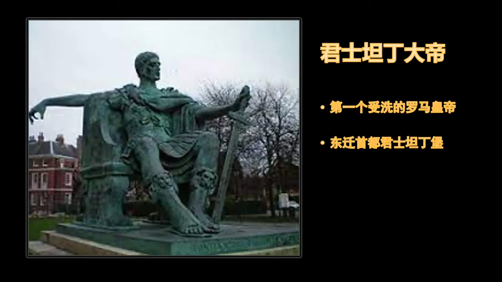  
> 君士坦丁的两件大事

评价世俗皇帝，要看其在基督教历史中发挥的作用，这才是一个人存在的意义。不然只能窥见历史的碎片。我们能感受到，社会的文明，神是一个不可或缺的角色，无论如何否定祂，如何躲避祂，神始终主宰着历史。另外，神学为历史提供着精神张力，任何没有神介入的民族，所谓的“发展”都是“在时间中打转”的历史。

AD 285，德克里先，将罗马帝国分成了东西两块，因为帝国太大了，还有多民族特点，长臂管辖颇为麻烦。

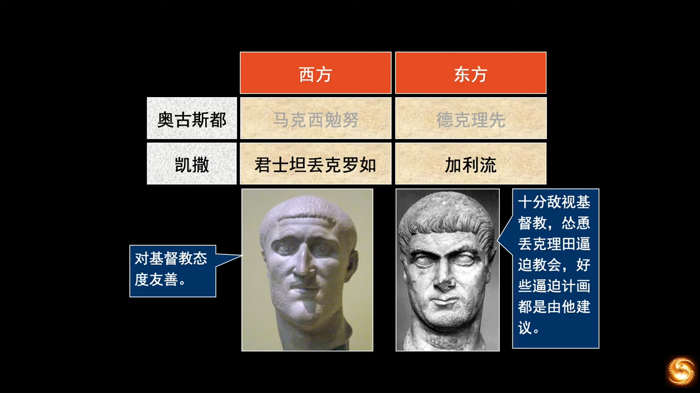  
> “奥古斯都”，即“大帝”；“凯撒”，即“副皇帝”。君士坦丢克罗如，即君士坦丁大帝的父亲

AD 305，德克里先退位，凯撒升为奥古斯都。

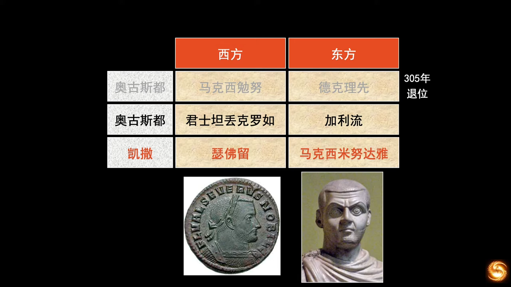  
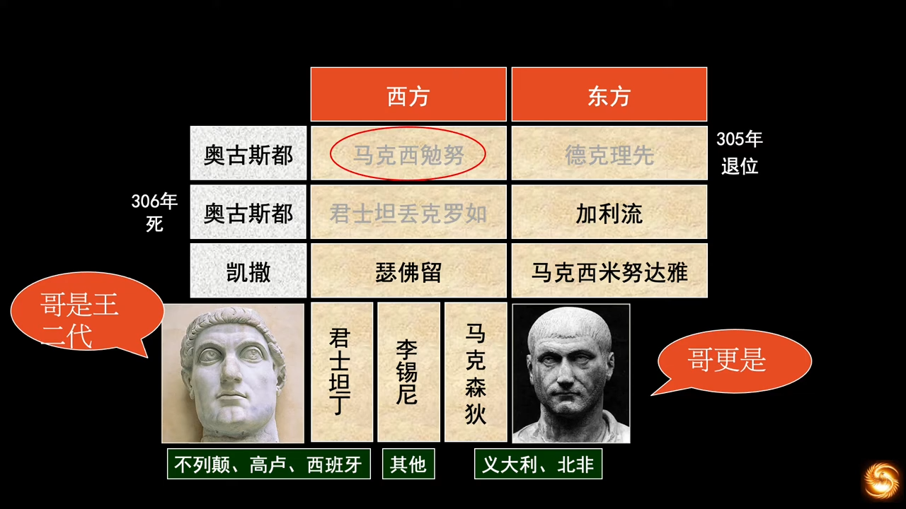  
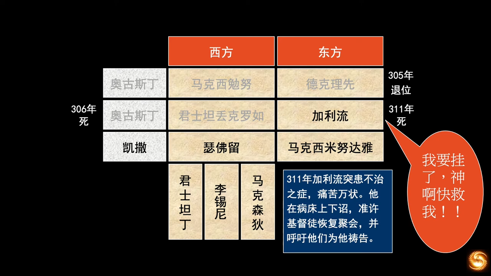  

加利流，放开了所有宗教限制，让所有宗教的信徒都为他祷告。诏书下了没多久他就死了。

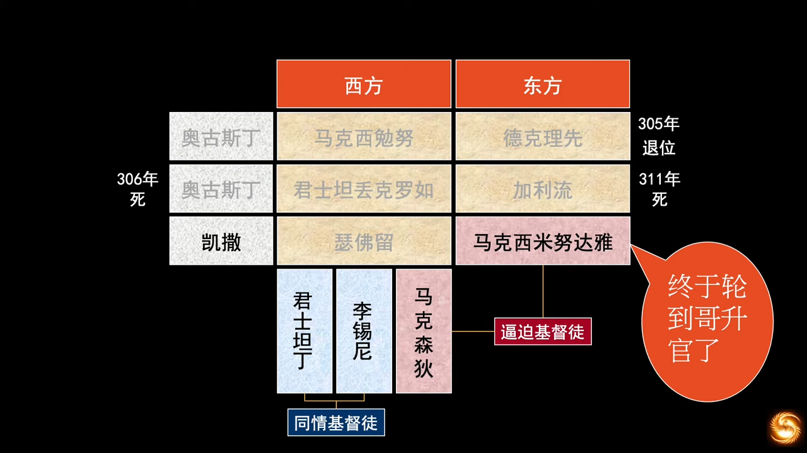

> 要维持帝国原来的辉煌，就寄希望于维持帝国原来的信仰

马克森狄和君士坦丁，这两个做了凯撒的人正面杠上了。这一仗改变了西方世界今后的格局。

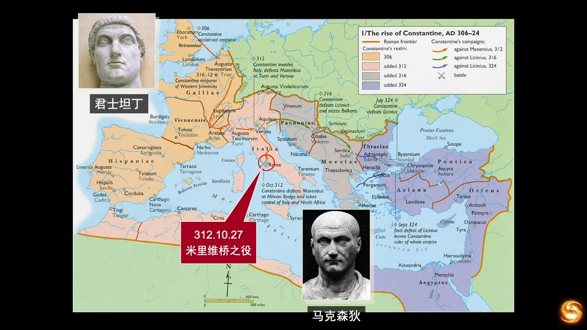

马克森狄本地作战，以逸待劳，君士坦丁长途跋涉，又有辎重。在士兵人数上也很悬殊，马克森狄是君士坦丁的三倍，这本是一场“没法打”的仗。但，***人的尽头，才是神的开端。***

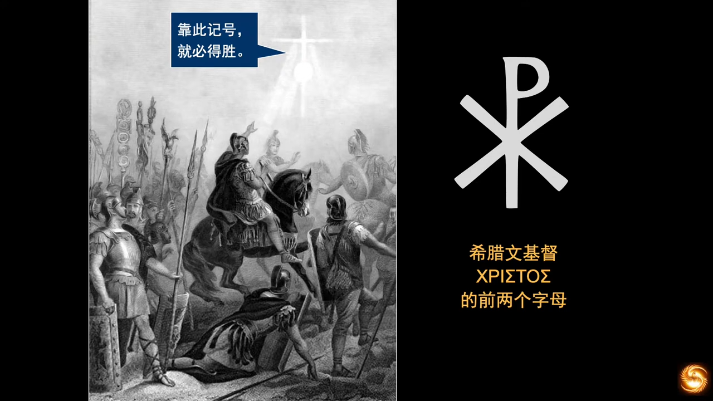

打仗前，君士坦丁在天空中看见十字架和一句“靠此记号，就必得胜”，当晚梦到一人（可能是主耶稣）告诉他将看到的记号放在衣服上、旗帜上、盾牌上，就能得胜。君士坦丁无一不照办，果然大胜。他看到的记号即“XP”。

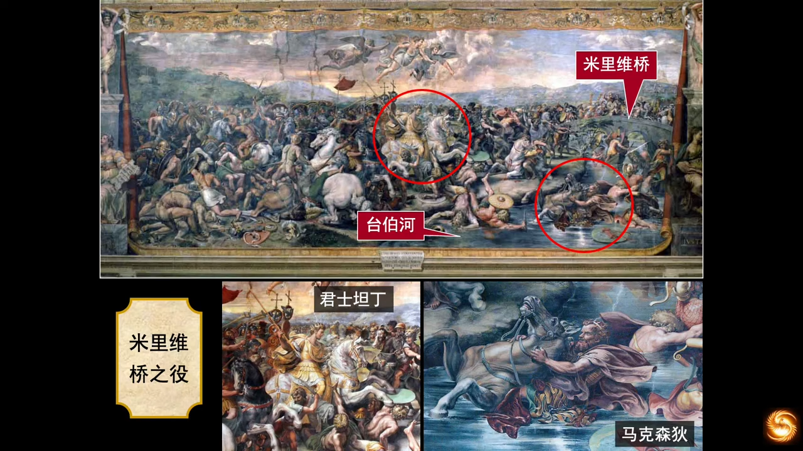

AD 313，签署了《米兰赦令》，给予基督教（以及其他所有宗教）在罗马境内的合法地位。承认所有人的宗教信仰自由、良心的绝对自由。

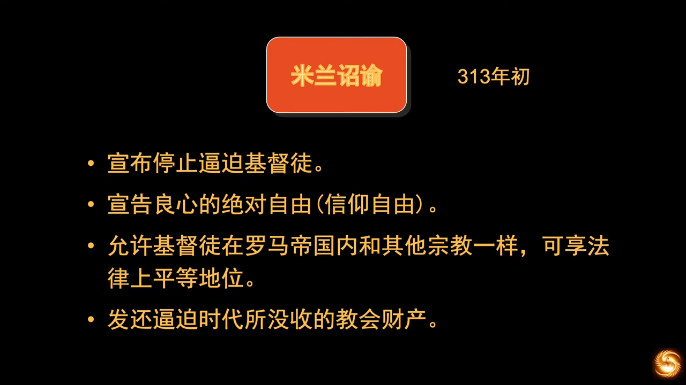

君士坦丁扶持了基督宗教，但同时并未苛待其他的多神宗教，展现了他的宽容和智慧。

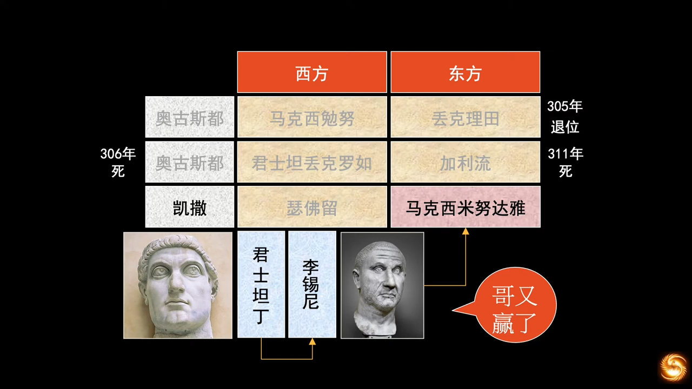

君士坦丁统一了罗马。

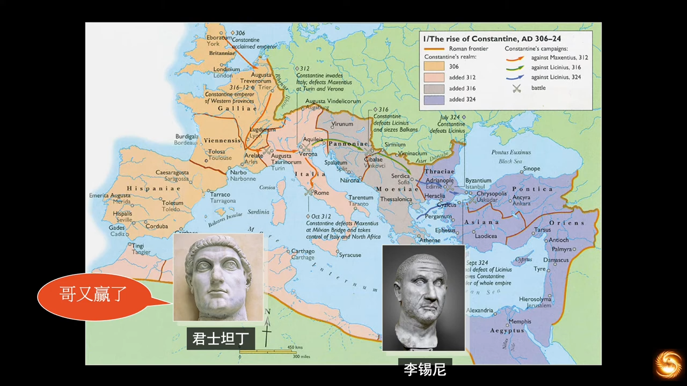

从这一系列事件能看出，人对于权力的欲望，是人自己控制不住的。“大一统”的根本问题 —— 人是有限的，王的能力更是有限的，再天降伟人，再能挑200斤，始终是有限的。当统治范围超出管辖能力时，帝国的分分合合，都是人靠着自己的想法，试图解决问题的尝试，这是可悲的。罗马尝试了，但没成功。

君士坦丁时代，罗马成为了军事官僚国家。蛮族士兵(哥特人)取代了专横跋扈的禁卫军。雇佣军打仗斗志不可同日而语，为之后帝国灭亡买下种子。平民为逃避兵役，会采取极端甚至自残的手段。臃肿的官僚体系日益肿大，大一统为了维持一定会走上这条路。在任期内也颁布过保护平民的法律，但帝国末期，普遍地目无法纪，有法也不能实施，对奴隶的惩罚反而变本加厉。君士坦丁法律已恢复“主人可以杀死奴隶”的权力。农民束缚在土地上，手工业者被束缚在城市中，元老被束缚在元老院中，阶级固化越来越甚。君士坦丁沿袭了德克里先引入的“东方专制君主的礼节制”，钟意走“神秘主义”，“君王神格化”。目的是用公开的强制手段，克服罗马的经济危机。帝国的末期一定会碰到发展瓶颈，凯撒靠的是武力扩张。

当时整个社会处于农耕文明，没有新的经济增长点，人没有办法，上帝有办法，上帝准备“强拆”了。帝国还能喘息一百年，神准备改造教会，训练门徒，预备将要来临的惊天剧变。

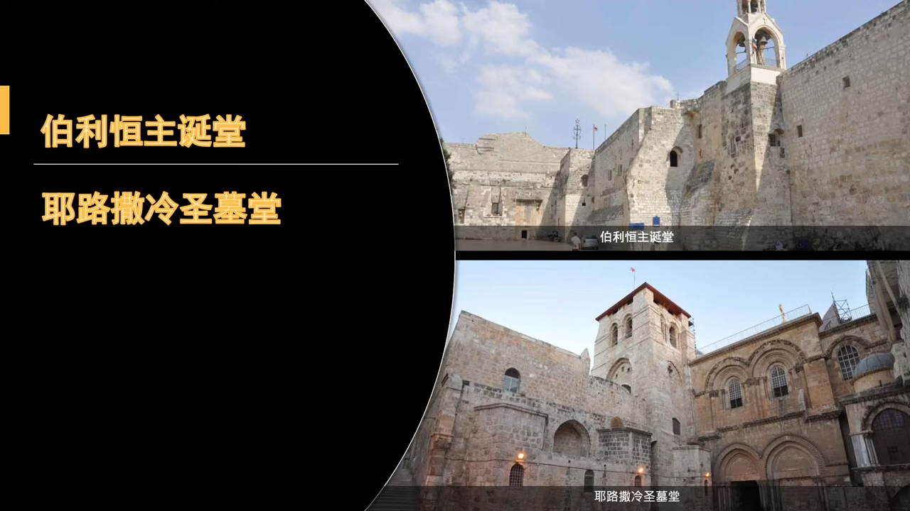

一般公认君士坦丁大帝从AD 313年起成为慕道友，帝国最高掌权者成为了资深慕道友，整整慕道了一生，临死才受洗。这位慕道友，热心协助基督教的发展，一些世界有名的教堂，都是在他在位的时期建造的。伯利恒主诞堂(AD 333)，耶路撒冷圣墓堂(AD 335)。

大帝和母亲都是基督教粉丝，帝国百姓和权贵加入教会成为时尚，也成为在帝国谋取职位的渠道，教会也就慢慢世俗化。

教会应该像船一样，行在水上，而不是沉浸在水中。浮在水上，才有救赎人的能力。教徒需要自己改变，而不是不停选择教会。

> Sally Shi:  
> 这句话是俄罗斯作家索尔仁尼琴说的。潘露总结了他说过的最有名的五句话：【#索尔仁尼琴讲过的最著名五句话】1. 一句真话比整个世界的分量还重。2.对一个国家而言，有了一位异议作家就相当于有了另一个政府。3.在我们国家里，谎言不是道德问题，而是这个国家的支柱产业。4. **世人不信神，人间即地狱。** 5.除了上帝之外，世上没有东西是不朽的，包括俄罗斯。

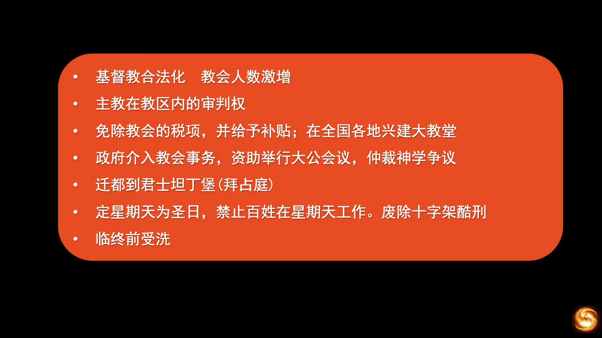

神学上对于君士坦丁本人是否真实地重生是有争议的，不肯受洗是因为他太相信洗礼能洗净人的罪了，所以想把罪多攒一点，一起洗干净。君士坦丁作为第一位基督徒皇帝，在史册中占有一席之位。迁都，有人评论他为帝国分裂埋下了种子。即使就算是埋下了种子，客观上也保留了种子。

君士坦丁大帝允许同时期多神宗教的共存，保证不破坏神庙，只是禁止崇拜神化的皇帝。但他本人死后，仍被罗马元老院奉为神。

关于宗教自由，君士坦丁大帝是这么说的：

> “就让那些受蒙蔽的人们享受和平吧，就让每个人保有内心想要的东西吧，就让谁也别折磨谁吧。”

这个方针有效地阻止了当时一些过于狂热的基督徒去破坏传统庆典，我们从之后的宗教改革能看到，人是没有办法约束自己内心的恶的，尤其是群体性的恶。德国的宗教改革一开始都觉得挺好的，因信称义，脱离了教皇的管辖，释放了人灵魂的自由。但直接的后果也造成了被宗教释放的人性走向了另一个极端，大肆残杀贵族、攻击教会、攻击主教甚至教皇(闵采尔农民起义，德意志农民战争)。使马丁路德开始反思宗教改革的意义，所以路德宗的改革没有加尔文宗那样彻底。任何改变都应是循序渐进的，因人是有限有罪的，这不是因为软弱，而是出于怜悯，任何改革都不要抛下神爱的子民，要给他们时间。这角度来说，君士坦丁有政治家的智慧，给予主教在教区内的审判权，免除教会的赋税，但若被主教视为异端的，就不能领受政府补贴，也不能享受税收补贴。一方面压制了异端，使教众可以归正信仰；另一方面也为未来的大公教会犯下错误埋下了种子。

君士坦丁在各地兴建大教堂，为罗马的艺术留下了不少瑰宝，多年的地下教会有了属灵的家。当时君士坦丁不仅支持大公会议，还参与仲裁神学争议，这就不太妥当了，属世政权染指属灵世界，不符合耶稣说的，“凯撒的归凯撒，上帝的归上帝”。

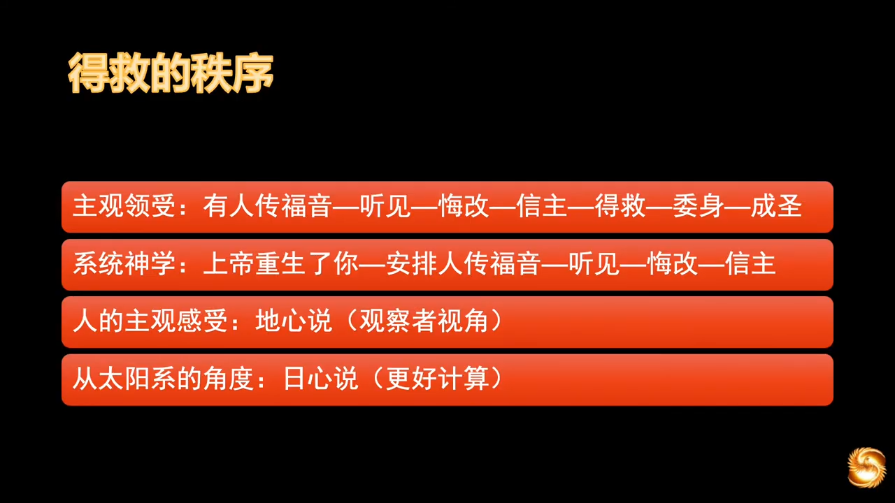

从人的角度来看，救恩的次序是围着人转的；而神本主义来看，就并非如此。基督徒抗争了三百多年，神让君士坦丁看见了十字架。所以关于信仰无需争论，人只需凭着自己“看见”的去“领受”即可。我们研习圣经，都只是为了救恩，而非其他。关于“加尔文主义”和“亚米念主义”的争论，其实两者并无冲突。

- 亚米念主义：描述信徒在得救重生后的主观感受
- 加尔文主义：描述上帝无所不在的主权

教皇和科学家其实当时并未被“日心说”激怒，夸大冲突是魔鬼的作为。哥白尼本身是一名主教，而且死后才发布了“日心说”的论文。而布鲁诺，得罪了他认识的所有政治界宗教界科学界学术界人士，“手拿菜刀劈电线，一路火花带闪电”，作为道明会的修士，脱离了天主教，脱离了新教，脱离了加尔文宗。判其火刑的是世俗法庭，当时的宗教裁判所是没有判人死刑的权柄的。

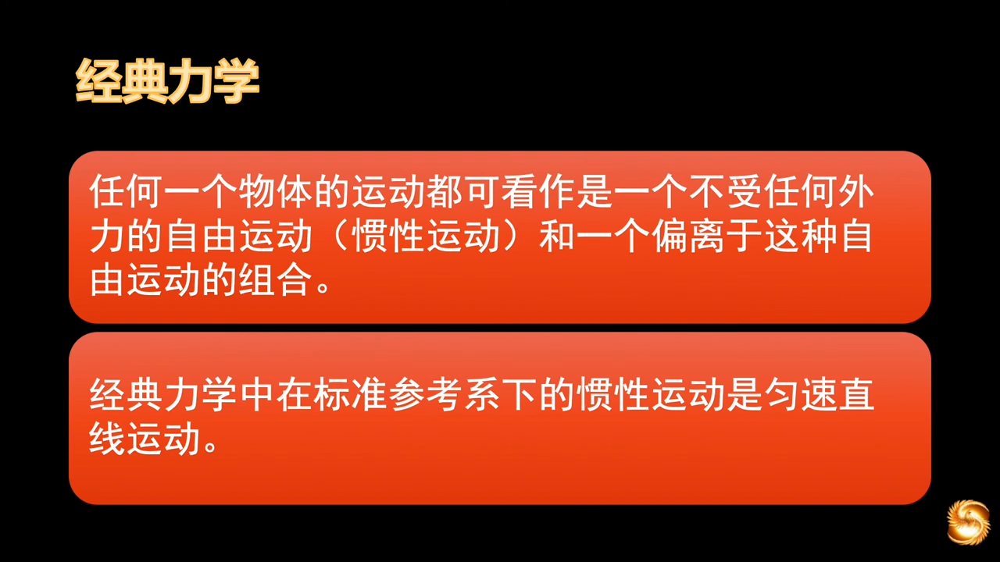

对加尔文神学的理解，在对这个世界的认识中，感知神的存在，来理解神的奥秘。人的原初状态，就是直线匀速运动，从生到死，出生是偶然，死亡是必然。没有外力影响，观念次序不会改变。观念次序形而上的改变，才能给予人超出命运的改变。重大事件在个体身上发生，绝对不是偶然的。

前路漫漫，而神的祝福始终在其中。