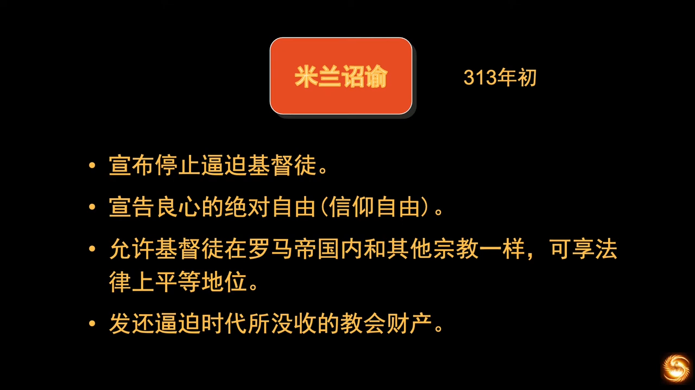

# 教会历史和欧洲历史

## 06 教会历史 君士坦丁大帝归信基督教
https://www.youtube.com/watch?v=N7_RKn0U9gs&list=PLfChJ-aSv3VD-f-sQH1p9vEPjwx8zYH6e&index=7

君士坦丁大帝，从世俗君王上看，是一位非常好的皇帝，但从神的历史来看，总有其双面性。罗马历史上第一位基督徒皇帝的作为。

  
> 君士坦丁的两件大事

评价世俗皇帝，要看其在基督教历史中发挥的作用，这才是一个人存在的意义。不然只能窥见历史的碎片。我们能感受到，社会的文明，神是一个不可或缺的角色，无论如何否定祂，如何躲避祂，神始终主宰着历史。另外，神学为历史提供着精神张力，任何没有神介入的民族，所谓的“发展”都是“在时间中打转”的历史。

AD 285，德克里先，将罗马帝国分成了东西两块，因为帝国太大了，还有多民族特点，长臂管辖颇为麻烦。

  
> “奥古斯都”，即“大帝”；“凯撒”，即“副皇帝”。君士坦丢克罗如，即君士坦丁大帝的父亲

AD 305，德克里先退位，凯撒升为奥古斯都。

  
  
  

加利流，放开了所有宗教限制，让所有宗教的信徒都为他祷告。诏书下了没多久他就死了。

> 要维持帝国原来的辉煌，就寄希望于维持帝国原来的信仰

马克森狄和君士坦丁，这两个做了凯撒的人正面杠上了。这一仗改变了西方世界今后的格局。

马克森狄本地作战，以逸待劳，君士坦丁长途跋涉，又有辎重。在士兵人数上也很悬殊，马克森狄是君士坦丁的三倍，这本是一场“没法打”的仗。但，***人的尽头，才是神的开端。***

打仗前，君士坦丁在天空中看见十字架和一句“靠此记号，就必得胜”，当晚梦到一人（可能是主耶稣）告诉他将看到的记号放在衣服上、旗帜上、盾牌上，就能得胜。君士坦丁无一不照办，果然大胜。他看到的记号即“XP”。

AD 313，签署了《米兰赦令》，给予基督教（以及其他所有宗教）在罗马境内的合法地位。承认所有人的宗教信仰自由、良心的绝对自由。

君士坦丁扶持了基督宗教，但同时并未苛待其他的多神宗教，展现了他的宽容和智慧。

君士坦丁统一了罗马。

从这一系列事件能看出，人对于权力的欲望，是人自己控制不住的。“大一统”的根本问题 —— 人是有限的，王的能力更是有限的，再天降伟人，再能挑200斤，始终是有限的。帝国的分分合合，都是人靠着自己的想法，试图解决问题的尝试，这是可悲的。

