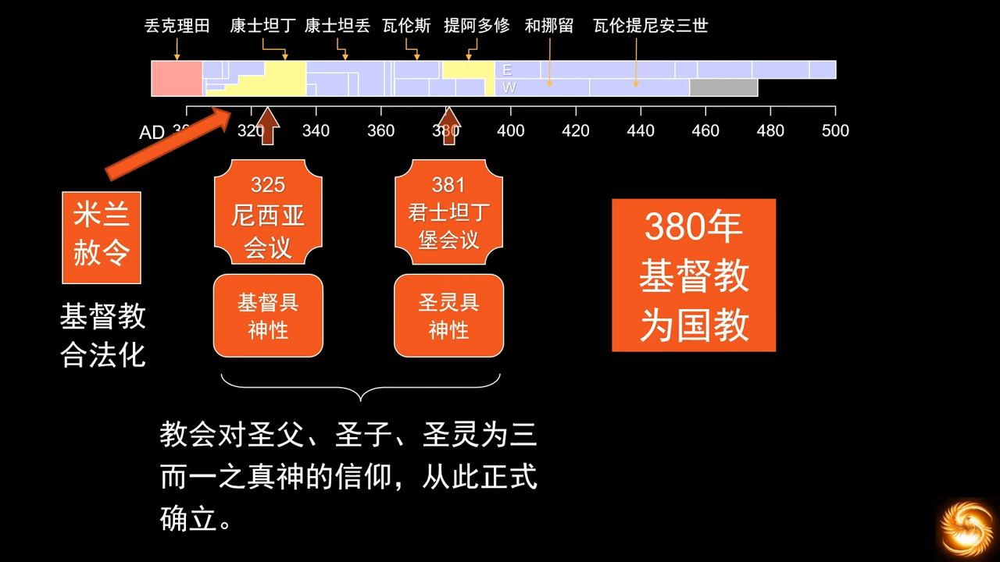

# 教会历史和欧洲历史
## 07 教会历史 君士坦丁大帝时代
https://www.youtube.com/watch?v=jD9WMUIpH7g&list=PLfChJ-aSv3VD-f-sQH1p9vEPjwx8zYH6e&index=8

基督教和罗马征服的蜜月期，国教时代。

  

基督对别迦摩教会的态度。我们应该要

1. 寻找神的心意；
1. 万事相互效力，让爱神的人得益处。

德克理先，罗马沿袭了古希腊亚历山大的总督制，即波斯大帝居鲁士的行省制，亚历山大是向波斯学习的。但德克理先碰到了问题，当时的波斯帝国远没有这么大，也没有隔着地中海，古罗马帝国从不列颠到北非，总督的地方权力很大，征兵权，税收权。两河平原，尼罗河三角洲，灌溉平原，产出稳定，帝国的粮仓。德克理先将总督的权力收回，国家分为了东西两部，设立四个皇帝，正皇帝称为“奥古斯都”，副皇帝称为“凯撒”，为罗马的分裂埋下了伏笔。

数据显示，君士坦丁执政期间，罗马总人口在1500万左右，基督徒在600多万，近一半。在黑海海峡的咽喉口兴建君士坦丁堡时，主要的考量是经济，因为粮仓在东方，当时东方比西方更富，古希腊要不是因为人口增长快，粮食不够吃，也不会东征波斯，南征埃及，古代帝国的扩张，都是为了解决粮食问题。所以君士坦丁要靠着粮仓建一个政治中心、经济中心、管理中心，能够快速响应各地的军事和政治变化。

当时的东方比西方富裕，君士坦丁的迁都一不留神促成了千年古都拜占庭的诞生，历史上被称作“第二罗马”。神让帝国的形态维持两千年，并且放在东方，和西罗马灭亡后的帝国西部做一个政治上经济上的对比，让我们分析思考为什么能扛这么久。

当时教会的表现。多纳徒主教主张，凡是曾“以经换命”的都主教所按立的地方性主教是无效的。教会的分裂让世俗权力有了理由来介入，会议否决了多纳徒派的主张，没有获得政府的补贴，甚至礼拜堂也被关闭了，主教也被放逐，北非教会动乱不宁。双方依然冲突不断，波及到世俗的政府机构，当政府机构和军事机构的平信徒也参与宗教纷争的时候，就会诉诸武力，最后，君士坦丁下令，禁止用武力解决纠纷。这是世俗政府尝试用武力解决教会纠纷的第一次尝试，虽然被君士坦丁制止了，但这是一个非常危险的信号。在这场逼迫中，为主站立住的神职人员，真心地认为自己是真正的教会，客观上他们的确是战胜了死亡的恐惧，战胜了人性的软弱，有道德上的优势。双方的分歧并非是信仰上的差异，只是派别之争。AD 335，多纳徒派的主教达到了270人，各种争论，口诛笔伐持续了近一个世纪。直到AD 411，双方在迦太基举行了一场正式的辩论，这次辩论中，多纳徒派遭到了重创，从此系统性地开始遭到排挤和逼迫。

多纳徒派的主张并不符合圣经，圣经的例子，彼得三次不认主，耶稣复活后三次问彼得，“你爱我吗？”，我们为何不怜悯软弱的人呢。属灵的磨难是每一位信徒都可能经历的。

Firstborn，主要强调基督作为长子的代赎功能，旧约启示了“长子归神”的代赎献祭制度。强调了耶稣的代赎资格，而不是指出耶稣是“受造物”。**基督是神，所以有赦免我们的能力；基督是人，所以有代赎我们的资格。**

君士坦丁大帝为了帝国的合一，召集各地主教，召开尼西亚大会，一共来了318位主教。318这个数字让我们想到了亚伯拉罕为了救罗得，参与的四王五王战争，圣经的第一场大战。

> 亚巴郎一听说他的亲人被人掳去，遂率领家中的步兵三百一十八人，直追至丹；(创 14:14)

AD 325，全国性的大公会议，拒绝了亚流的主张，制定了《尼西亚信经》，确定了耶稣是“受生”而不是“受造”的。

> 尼西亚公会议（325 AD）版:  
> 我们信仰一位神，全能的父，一切有形和无形之物的创造者。以及一位主耶稣基督，神的儿子，由父所独生，即，出自父的本质，出自神的神，出自光的光，出自真神的真神，受生而非受造，与父同一本质，天上和地上的万物由他被创造；为我们众人和我们的救赎降临，并进入肉身，并成为人，受难，并在第三日站了起来，升天，将来临，审判活人和死人。以及圣灵。

亚流派在被排挤时，无意之中做了一件好事，他们向东迁移，向蛮族传福音，蛮族开始有了信仰，开始在野蛮的人性上套上了“守约，施慈爱”的紧箍咒，“守约”成为了蛮族文明渐进的根基。

亚流派一位主教，艾培拉，给蛮族人传教，一部分是已经在罗马帝国生活的蛮族人，还有尚未入侵罗马的蛮族人，都不同程度地接受了亚流派的信仰，人的内心有向神的先天需要，有敬拜的需要。蛮族虽然没文化，但接受信仰要比精英阶层爽快。

但，异端因主流社会的教育比较清晰而被边缘化，只能向文化沙漠、信仰沙漠的蛮族传福音，这也是为什么缺失信仰的远东地区容易被“东方闪电”这类异端所迷惑。就是因为社会上正教不昌盛，缺少教会传统，也缺少教义的传承。

面临出现偏差的信仰状况，神就会兴起祂的仆人来归正信仰。亚他那修一生都在和亚流派征战，在人人都在争朝廷宠幸的时候，他坚持自己的理念，从未向政府屈服。《尼西亚信经》最后得胜，亚他那修居功至伟。他也是第一位列出《新约》正典书目的人。

教会对救恩论、神论、基督论、圣灵论的确立，有一个漫长的过程，圣灵的神性的确立，就比基督要晚很多。