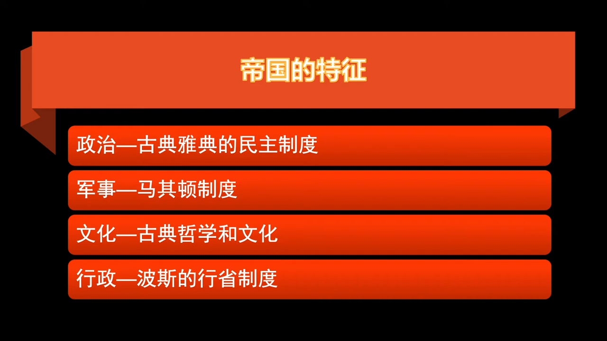
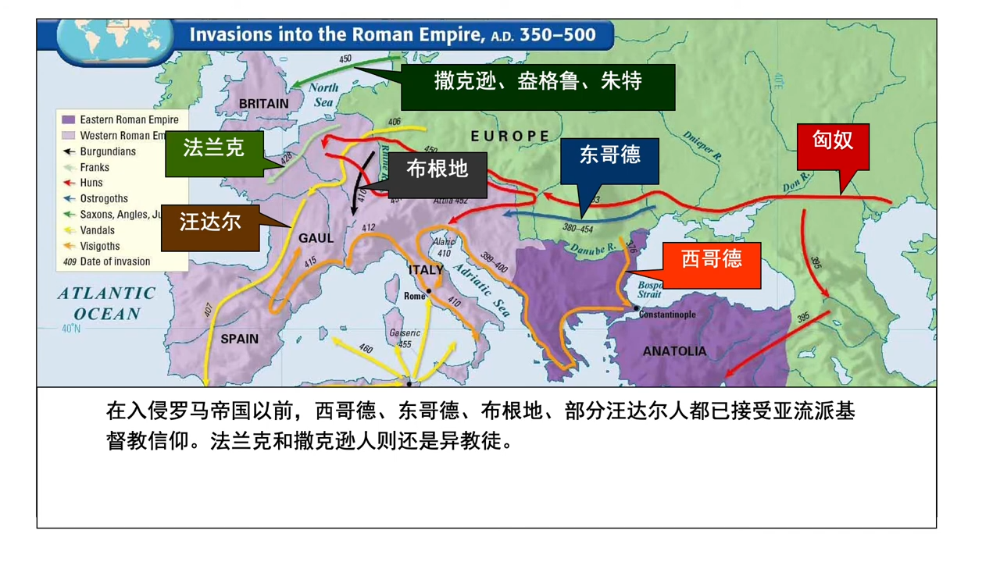
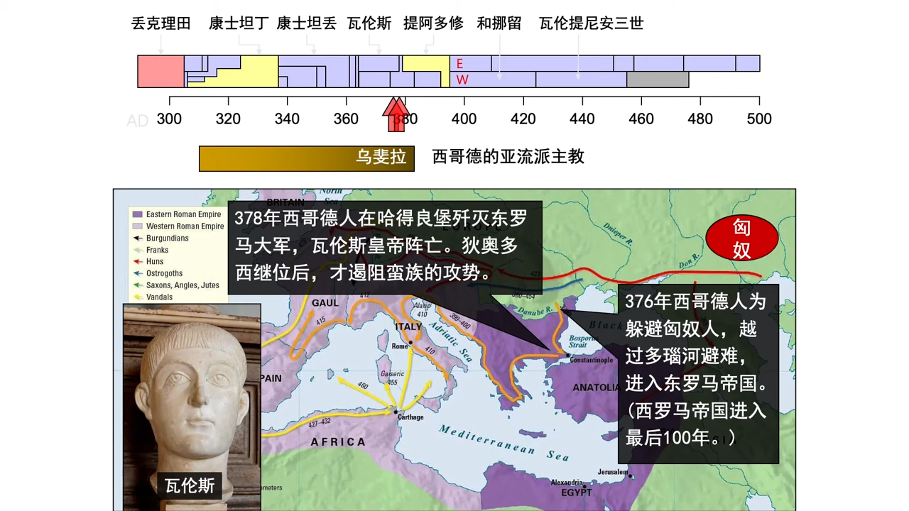
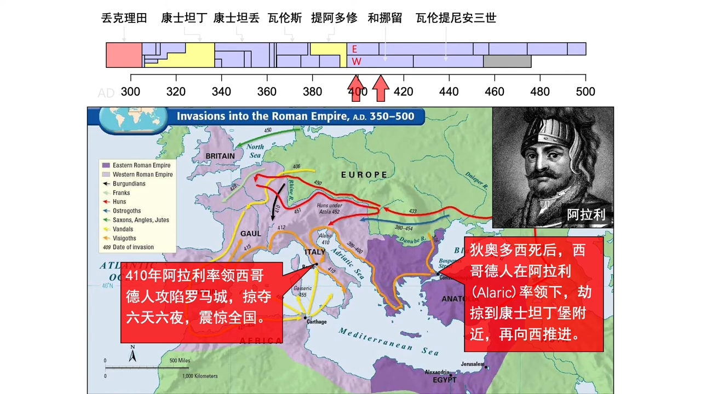
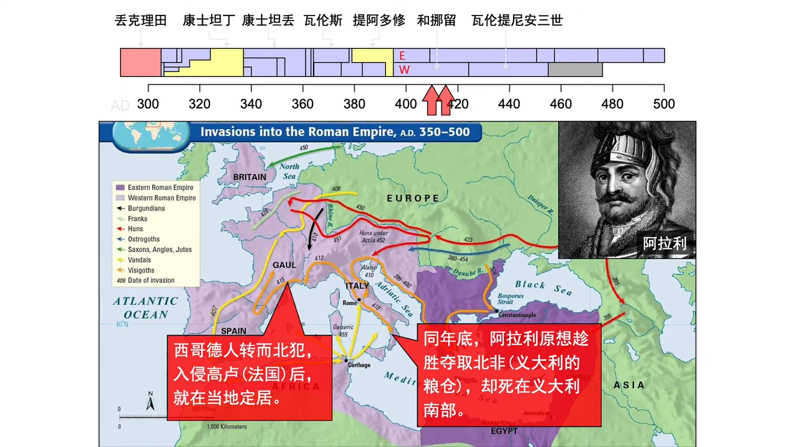
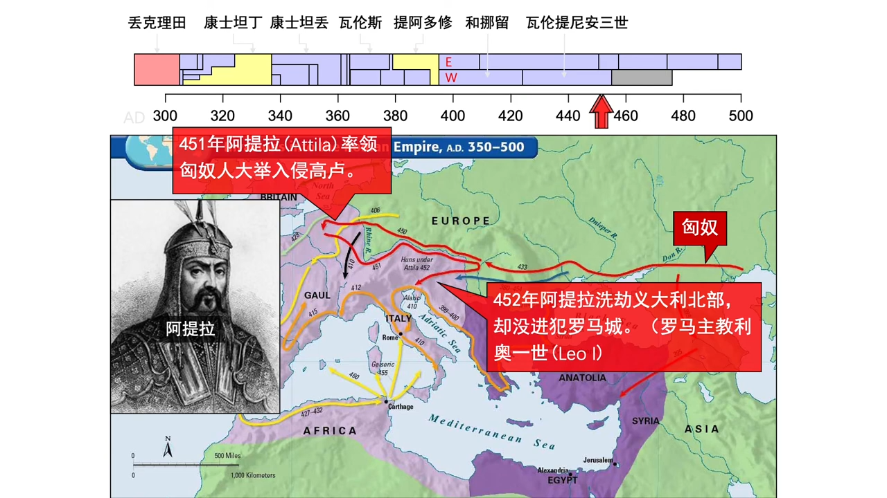
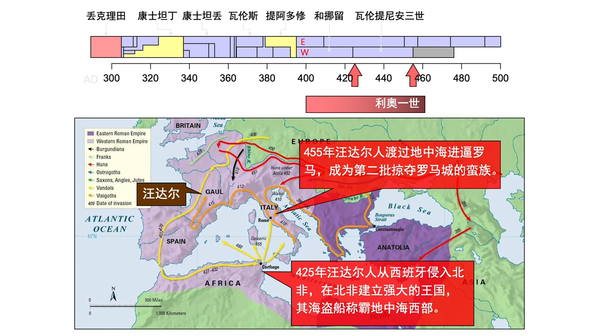
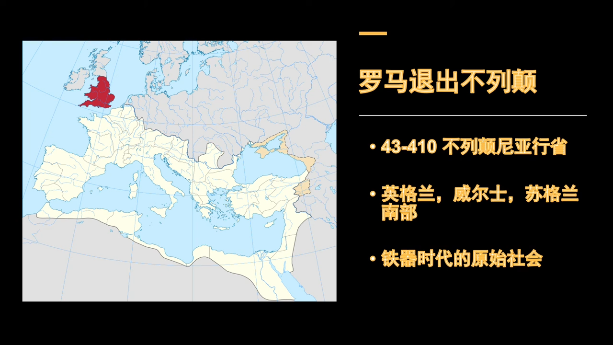
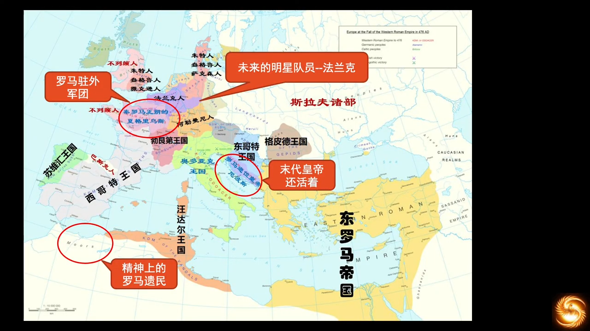
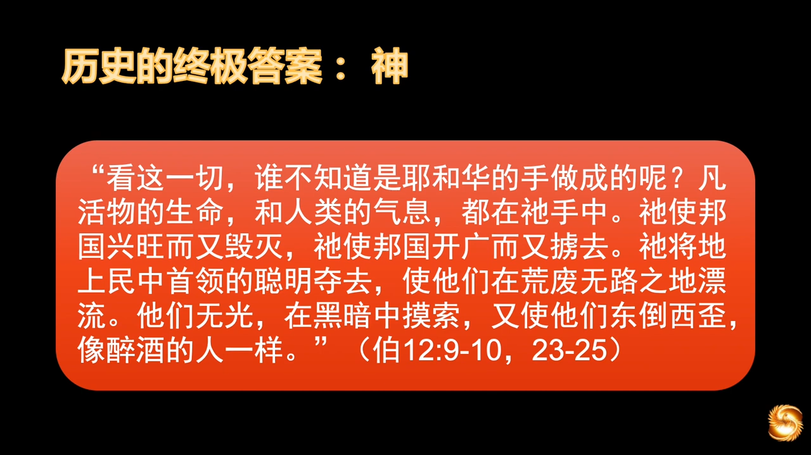

# 教会历史和欧洲历史
## 08 教会历史 西罗马帝国漫长的衰亡史
https://www.youtube.com/watch?v=ZL_-A_pZMdQ&list=PLfChJ-aSv3VD-f-sQH1p9vEPjwx8zYH6e&index=9

罗马帝国的衰亡过程很漫长，长达一个世纪。

君士坦丁没有定国教，是因为即使他本人皈依了基督教，帝国仍有许多管理层，依着信仰惯性，信仰多神教。急转弯会导致翻车，所以君士坦丁采取的是宗教宽容的政策。而狄奥多西一世当时有两支部队为了恢复异教而叛乱，在冷河战役中被狄奥多西一世打败，为了避免内耗，他就宣布基督教为国教，在AD 380左右，但狄奥多西一世直到AD 393才禁止其他的宗教。

狄奥多西一世认为当时的古奥运会，有违基督教的教义，视为异教徒的活动，在那一年废止了古奥运会。这一停就停了一千多年，直到1892年，在顾拜旦的号召下才恢复。

    恢复罗马是每一个欧洲人的梦想。

东西皇帝互相承认和册封，是一种惯例。当蛮族入侵之后，蛮族宣布自治，将西罗马皇帝的皇冠和权杖，派人送到了东罗马，象征罗马还在。所以东罗马从未承认罗马灭亡了，罗马就是罗马，只是疆域变小了。东西罗马还是一个国，是一个国的两个部分。蛮族入侵之后，没有能力管理西罗马，但西罗马半死不活，这个状态导致了漫长而又充满历史争议的衰亡过程。

爱德华·吉本 - 《罗马帝国衰亡史》（The History of the Decline and Fall of the Roman Empire），可以作为参考，但还是有挺多历史细节的缺失。蛮族摧毁了整个罗马城，烧毁了书籍。 该书试图在历史中寻找原因，但“帝国不是文明的产物，帝国是文明衰亡的产物，帝国的产生恰恰是因为原来的文明难以维系了”。任何帝国的形态能够存在几百上千年，就是神迹了。远东没有一个朝代能够超过三百年，而西罗马能维持五六百年，分治之后的东罗马维持了两千年，其中必有一元素是我们东方缺失而导致如此的，就是“神治”系统，从未出现过“神权”对于“君权”的制衡。君士坦丁是帝国最后的辉煌，他在西罗马灭亡前，给帝国干了两件好事，也是给世界干了两件好事。

1. 将帝国的信仰带进了基督教系统
1. 迁都君士坦丁堡

为何这么说？因为西罗马灭亡后，神借着这两件事情：

1. 神将基督的大礼包借着西罗马的灭亡，赐给了蛮族，构建了今后二十世纪文明发展的重要社会力量，可以说是“两千年磨一剑”
1. 东罗马的存在，牢牢地扼住了黑海海峡的咽喉口，亚洲进入欧洲的门户，保证了西欧在相当长的时间内的和平，完成了文明的积累，包括对人性的改造、社会结构的演变、国家的形成，都有重要深远的意义

帝国的性质，决定了帝国不可能存续很久，东方帝国没有超过三百年。汉朝当中有王莽，被分为了东汉和西汉，都没有超过三百年。而罗马是个异类，它的存在时间，远远超过我们对大一统中央集权的理解，是哪些力量支撑了西罗马超过五百年的历史。

- 军事制度：学习希腊的军事策略（亚历山大未尝一败），吸取了马其顿的兵团制度
- 政治：古典雅典民主制度，而非古希腊的那个处决苏格拉底的“直接民主”
    - 罗马取了中间值，没有皇帝，只有元老院，元老院有任期，行政官、执政官由元老院选举产生。所谓的皇帝即“终生执政官”，虽然可以指定继承人，仍需要元老院通过，皇帝的权力是有限的
    - 在罗马的后期，禁卫军也是可以推举执政官的，好于雅典的“公民大会”，是精英民主，是“代议制”的雏形，而雅典是全民民主，用元老院来避免过度的独裁，又兼顾了“效率”和“正义”。那个年代，全民教育普及率低，雅典的全民民主层次较低，会出现多数人暴政（tyranny of the majority），全民民主道路是一种初级的尝试
- 文化：吸取了希腊的古典文化，照搬了希腊的一切哲学思想（甚至多神崇拜）
- 行政：罗马原是一个被希腊殖民的小城邦，从一城扩张到一帝国，吸收了波斯的行省制度（亚历山大的行省制度也是源于波斯）。
    - 行省制度在圣经中就已出现，居鲁士大帝就建立的行省制度，征服了很大一片疆土，当时的应许地就是包括波斯在内的127个行省之一（见《艾斯德尔传（艾）》）
    - 多民族国家扩大之后是无法控制的，一定会产生“强权上位”。大一统的国家看起来强大，其实是文明崩溃，因大一统并不是正常的形态，是文明最后的挣扎

从屋大维称帝到西罗马的灭亡，差不多是五百年时间；算上东罗马，有一千五百年；再算上凯撒之前的时间，有将近两千年。十六世纪的史学家用“拜占庭”来描述东罗马帝国，但“拜占庭”只是文化，真正的名称是“东罗马帝国”，有些史学家也会称之为“第二罗马”。直到AD1453，被土耳其奥斯曼帝国的默罕默德二世灭亡。

- 长线战争：冷兵器时代，条件不允许，没有现代的交通工具。从西欧征兵到波斯打仗，路上都要走一年
- AD34?年君士坦丁去世，君士坦丁二世分到了西班牙，君士坦丁提乌斯二世分到埃及，剩下的版图归了老三，到拜占庭灭亡之时，已是君士坦丁十一世
- 帝国的制度也和皇帝的个人素质高度相关，这也是帝国的命运。虽然元老院和“指定继承人制度”一定程度可以规避这个问题，但因人的局限性，总是无法彻底解决这个问题

1. 军事制度首先崩溃，罗马贵族已无人打仗，分治传统引起的内耗，已经将战士都打光了，只能雇用蛮族人，雇用西哥特人，以蛮制蛮。但架不住蛮族枪口一转，保安反了业主，后期一蛮族将领甚至做了罗马皇帝
1. 政治方面，元老制度慢慢失去了对皇帝的制约，因为后期的集权需要强有力的帝王
1. 哲学思想在集权下消失，因为思想的繁荣需要有权力的空间
1. 蛮族入侵占据各个定居点之后，行省制度也再无法管辖了，形同虚设了。当时蛮族中的哥特人，游牧民族，文化程度低，相对于罗马，他们还处于青铜时代。他们崇拜罗马的文明，一旦进入了罗马帝国，用骑兵很早就进入了罗马广袤的土地，建立了自己的生活区。他们并无夺权想法，因为他们并无管理社会的能力。所以诉求就是居住，也不交税，就是住着，就像盲流。罗马后期，类似的定居点比比皆是

到AD410，罗马城首次被蛮族攻破，西哥特人在今天的西班牙建立了西哥特王朝，东哥特被匈奴打压，南下进去罗马。匈奴当时五十万骑兵，罗马打不过哥特人，于是就和哥特人结盟，一起对付匈奴，打完了哥特人就住下了，入境的东哥特人在现今意大利境内成立了自己的居住区。随着入侵的蛮族越来越多，后来的罗马弱族没有能力去控制局面，罗马还做了蠢事，激怒了匈奴。（当时有一皇帝的妹妹和部队首领通奸，皇帝得知之后一气之下将妹妹送到了修道院，这个妹妹给匈奴首领写信，要求和匈奴联盟杀哥哥）。

当时西哥特国王和罗马皇帝凑了25万人，但是对抗的匈奴是50万骑兵，双方交战一天就死了16万人，西哥特的老国王也战死沙场，罗马也元气大伤，失去了能力管理各诸侯，这是发生在AD449年的一场大战，带来了罗马的新的危机。当时的东西哥特人在一定程度上帮助了罗马的苟延残喘，但对于帝国命运无补。

AD455~476，11年中换了8个皇帝，帝国难以维系。最惨烈的一场战争 —— 汪达尔攻陷迦太基（汪达尔是蛮族中最为野蛮的，甚至没有文字，后来被东罗马皇帝查士丁尼灭了），汪达尔攻进罗马屠城时，杀得罗马只剩七千人。

当时的一些蛮族已经是亚流派的基督徒（耶稣受造论），但除了法兰克和撒克逊，后来法兰克成了蛮族中第一个归向正统基督教的蛮族，在该民族上，站起来两个社会有机体，法兰西和德意志，后来演变为法国、德国，和意大利。

西哥特的亚流派主教乌斐拉是基督徒后裔，但被掳在蛮族那里长大，后又被西哥特人派到君士坦丁堡去做人质，期间学习了拉丁文和希腊语，并归信了基督教，后被按立为亚流派的主教，在西哥特人中传讲福音。晚年回到罗马，继续派遣传教士向西哥特人传道，影响很大，塑造了一大部分西哥特人的信德。为之后西哥特人和罗马人的合作，奠定了信仰上的基础。他还做了一件伟大的事情，将圣经翻译为哥特文，之前哥特是没有文字的，这就成为了哥特人的第一本日耳曼书籍。翻译时故意略过了《列王纪》和《撒慕尔纪》，因为这两部都是征战史，他觉得日耳曼民族已经太喜欢打仗了，已经足够野蛮了，这两卷会助长好战作风，就自作主张地拿掉了。

历史上，一个民族的第一本普通民众能够阅读学习的书籍，往往都是《圣经》。这是一个很有趣的现象，并且圣经会极大地影响该民族的语言风格。在这之前，文字是晦涩难懂的，书面和口语完全是两回事，中文、古英语、古拉丁语皆是如此。中文和合本也开启了现代白话文的先河，这是由圣经的性质决定的。圣经从其诞生的第一天起，福音广传就是它的使命，所以圣经起的是启蒙作用。

虽然亚流派被视作异端，但其中我们也能窥视神的美意。如果不是被主流教会排斥，他们就不会向东蔓延，进入蛮族的世界。至于“异端”是否会得救，神是有神的怜悯在其中的。教义根基若不打好，我们在上面很难建造，所以神并不祝福这些教派的成长，但信徒是否得救，神自有祂的怜悯和审判的标准。这样的教派，神依然是可以用的。

AD376，西哥特人获得了当时皇帝瓦伦斯的批准，越过多瑙河，进入东罗马避难。但好景不长，罗马贵族对待这些蛮族的态度，就像对待奴隶一样。蛮族自由惯了，没有受过这样的气，于是发生叛乱。AD378，西哥特人在哈德良堡战胜了东罗马，这是一个标志性事件，从此帝国进入了四处灭火的战乱时期，这个时期延续了整一个世纪。

自从西哥特人进入罗马避难，越来越多的蛮族为了躲避匈奴而南下，他们进入罗马的方式多种多样，有强攻进入的，有获准避难进入的，有和平经商进入的。到了后来内外呼应，战线铺了两千多英里，罗马疲于奔命无法应对。

阿拉利原本只是想占领更多的耕地用来定居，还想在罗马政府里当一名高级官员，谋一职位，管理西哥特人之类的。但被东罗马皇帝拒绝了，他一气之下，进攻了东罗马的都城君士坦丁堡。绕着君士坦丁堡两年无法攻破，于是转攻罗马，AD410阿拉利第三次远征来到罗马，攻陷了罗马城，整整掠夺杀戮了六天六夜。震惊了全国，罗马城八百年来首次被外族占领。但据说他们当时没敢动一座教堂，教堂都保存完好。在入侵之前，西哥特人已经接受了亚流派的基督教信仰。当时的主教耶柔米，正在写《以西结书》的注释，听到消息后非常震惊，写道“当时掠夺人的，现在被掠夺”。

AD410年底，阿拉利想要攻打北非（当时的小亚细亚和北非是帝国的粮仓），结果死在了路上，死在了意大利的南部。罗马主教利奥一世把阿拉利的死当成活教材，吓退后来的入侵者，吓退了匈奴人和汪达尔人。西哥特人在意大利纵横肆虐了十几年，同时有一批西哥特人在AD412继续北上，定居高卢，就是现在的法国。定居后和罗马相对和平，甚至和罗马结盟抗击匈奴。

接下去就是匈奴入侵，当时定居在高卢的西哥特人和罗马联手，对抗匈奴，史称“沙隆战役”，非常惨烈，匈奴50万大军，西哥特和罗马联军25万人，共75万人，一场战争死了16万人，在冷兵器时代是创纪录的。阿提拉被称作“上帝之鞭”。在主教利奥一世的劝说下，阿提拉军队没有进城。在之后一年的一次婚礼上暴毙。

当时政府彻底瘫痪之后，教会开始发挥政治影响力。教会具有社会组织能力，而这是蛮族不具备的。已经征服北非的汪达尔人又打到了罗马，汪达尔是一个血腥野蛮的民族，从现在的波兰地区一路向南，穿过高卢，到今天的西班牙，伊比利亚半岛，穿过直布罗陀海峡进入北非，一路打到迦太基，征服了迦太基，再穿过地中海，进攻罗马，成为第二个掠夺罗马的蛮族。他们无比残暴，将当时的罗马城屠得只剩下七千人（待查证）。这个民族后来被东罗马皇帝查士丁尼全部歼灭，在人类历史上永远消失了。还有一个消失的民族是占领罗马的伦巴底人，被抹去蛮族特征后，人都归化进了德意志。

四处受敌的罗马帝国，这些侵略战争几乎是同时发生，令罗马人措手不及，也导致了这段历史的混乱，大部分是教会记录下来的。当时社会行政几乎已瘫痪。罗马要同时防御长达两千英里的北部疆域，在各部落的入侵地要设立据点，而且还要应对内部骚乱，这个庞大而艰巨的任务是任何一罗马皇帝都无法承担的，这不是皇帝个人能力的问题，这是帝国必然的命运。

不列颠尼亚行省，在被罗马占领之前处于铁器时代，相对落后，后从欧洲引进了农业，手工业。罗马帝国对不列颠占领的最后时期，为了应对蛮族对欧洲大陆的入侵，部队不够用了，所以罗马将军部队撤出了不列颠，留在当地的罗马不列颠的贵族的日子就日益恶化了。北面丹麦又有蛮族入侵，从英格兰的东海岸进来骚扰，而且盎格鲁撒克逊蛮族也经常来捣乱。为了收编，罗马不列颠的领导人以割让领土作为回报，收编了盎格鲁撒克逊当雇佣军，走了西哥特同样的路线。因军费未能兑现，AD424，盎格鲁撒克逊倒戈叛变，和西哥特一样，保安炒了业主。当时的不列颠转而求助西罗马将军，但帝国让其自我保护，帝国已无力相助。不列颠和盎格鲁撒克逊持续抗争了很多年，到了六世纪，不列颠遭遇严重失败，丧失了大量土地，盎格鲁撒克逊成为岛的主宰，不列颠一觉回到解放前，没有文字，没有管理能力，罗马的离开使他们彻底回到铁器时代。从此，英伦诸岛的文明，从欧洲历史上黯淡了。

我们不知道那段时间发生了什么，考古学的证据很少，传说中的亚瑟王也只是传说。但时间从AD410加上1500年，也就是1910年，这时，英国是世界的霸主，引领了工业革命、社会革命、政治革命。这个小岛出了非常多的影响世界的科学家、神学家、哲学家、文学家、艺术家，基本所有基督教的宗派，在这里都有踪迹。这一千五百年里这里发生了什么，这就是我们这个系列需要探讨的。

和世俗政权不同，罗马主教利奥一世，反其道而行，非常有远见，当时派遣了帕提克向罗马帝国最边缘地区 —— 爱尔兰宣教，爱尔兰是不列颠的外挂，又因爱尔兰独特的地理位置，没有受到蛮族征战的影响，所以宣教的种子在爱尔兰长势良好，在合适的时机，走上了历史舞台，成为一支非常重要的社会改造力量。从历史中看到神对未来奇妙的安排。

AD476，是很多史学家认为的西罗马灭亡，但AD476年以后，西罗马真的不存在了吗？当时至少还有三个政治实体仍坚持西罗马帝国的正统。

- 倒数第二位的西罗马皇帝，尼波斯，他当时还在，获得了东罗马帝国的承认，政治实体仍存续
- 北非的摩尔人，原来是当地土族，被罗马军团征服后，长达几百年的罗马化，此时仍坚守罗马文化，自认为文化上的罗马人，仍向东罗马效忠，直到六世纪末，被周围部落并吞（不是被伊斯兰教，因伊斯兰是七世纪才兴起的）
- 高卢，一直是帝国鞭长莫及的地方，当时驻守的将军仍自认为罗马正统的部队，高举罗马大旗。哪怕西罗马已支离破碎之时，他们仍在高卢坚持自己是罗马人的王（来自周围日耳曼人的称呼），最终被灭于一支西迁的日耳曼蛮族之手，即法兰克人

史学家对西罗马灭亡日期一般认定为AD476年9月4日。历史遗留问题：

1. 罗马到底有没有灭亡
1. 谁是罗马的继承人

答案有两个：

1. 东罗马认为罗马没有灭亡，而且西罗马之后的统治者仍然向东罗马效忠
1. 蛮族后代和神圣罗马帝国则认为自己才是罗马的继承人，为了往前追溯自己民族的辉煌历史。这顶罗马的帽子，法兰克国王戴过，查理大帝戴过，奥托一世（神圣罗马皇帝）戴过，拿破仑也戴过，沙皇也想戴一戴。这帽子是祝福还是咒诅呢？我们往下慢慢看

> 一切人间之城都要消亡，惟上帝之城永存 —— 圣奥古斯丁《上帝之城》

AD476，在破碎的罗马尸体上，出现了三个社会有机体：

- 东部拜占庭帝国
- 西部的很多蛮族王国
- 还有就是掌管欧洲千年之久的基督教会

现在社会的转型有三大支柱，在欧洲历史上，也即现在社会形成的三大原因：

- 文艺复兴
- 地理大发现
- 宗教改革

这三大事件都和基督教文明有着重大的关系。

看历史要避免“代入感”，即“用今天的概念、今天的认知、今天的逻辑去分析当时的环境和情况”，这不是诚实的历史观。要将历史放回当时的环境去分析，才不会过高估计自己，更不会刻薄对待古人，还历史一个客观。