# 教会历史和欧洲历史
## 09 教会历史 西罗马末期的教父们
https://www.youtube.com/watch?v=zbO29O9ySn4&list=PLfChJ-aSv3VD-f-sQH1p9vEPjwx8zYH6e&index=10

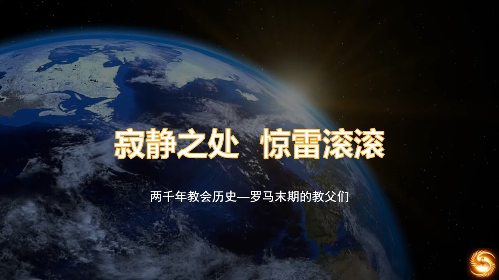

基督教历史上涌现的伟大灵魂人物，他们是上帝在这个动荡世界里放下的锚，他们锚定信仰，坚定教会。因为接下来蛮荒的欧洲世界，是基督教需要面对的漫长挑战。

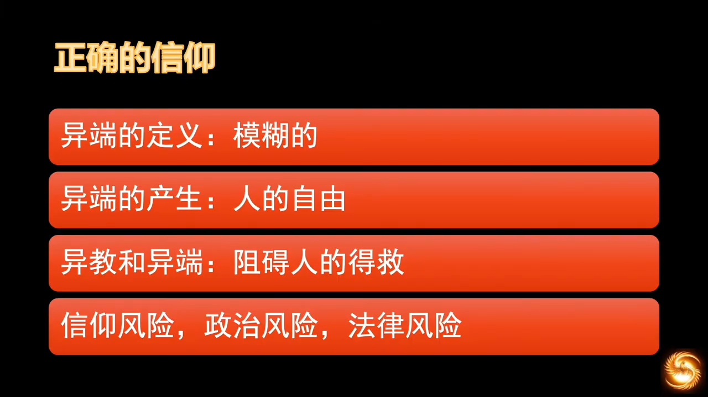

他们在这个时期的主要任务之一，就是要面对各种各样的异端。之前介绍过异端产生的背景环境，关于异端的定义，在今天是很清晰，但是在当时基督教社会里是非常模糊的，设置都没有相应的词汇去定义。都是在漫长的信仰磨合过程中，一点一滴辩论和总结出来的。虽然在外邦人眼中，这种信仰之争非常可笑，但这之中一定有神的美意。从圣经中就能看出，异端和人类的历史一样漫长，在伊甸园里，夏娃对蛇说“天主说果子不能摸”，但天主其实并未说过。

> 2女人对蛇说："乐园中树上的果子，我们都可吃；3只有乐园中央那棵树上的果子，天主说过，你们不可以吃，也不可**摸**，免得死亡。" (创世纪 3)

这句话扩大了神的禁令，缩小了神赐给人的自由，即缩小了神的恩典，这完全是自己加给自己的约束。这不是出于人的好意，而是出于人的有限。因为神给了人自由意志，所以，人的自由其实是有限的。

还有一个例子，就是彼得多管闲事，彼得问基督小约翰今后的命运会怎样。

> 20伯多禄转过身来，看见耶稣所爱的那个门徒跟着，即在晚餐时靠耶稣胸膛前问：“主！是谁出卖你？”的那个门徒。21伯多禄一看见他，就对耶稣说：“主，他怎样？”22耶稣向他说：“我如果要他存留直到我来，与你何干？你只管跟随我。”23于是在兄弟们中间传出这话说：“那门徒不死。”其实耶稣并没有说：他不死，而只说：“我如果要他存留直到我来，与你何干？” (若望福音 21)

人的理解力的偏差，以为有长生不老，就产生了异端。所以人对神的话语，有自由解读的权力，这是神赐给我们的恩典。但如何驾驭这个自由，是需要操练的，遵从祂的旨意，合理使用我们的自由。在异教徒的世界里，是没有纷争的。大家都信仰得很融洽，你信你的我信我的，这是一个很奇怪的现象，现在依然是这样的光景。佛教和其他宗教合作，伊斯兰教也不针对佛教，他们真的就针对基督教信仰和犹太教信仰，基督教的世界是完全不一样的光景。君士坦丁大帝当时皈依基督教的时候，他可能做梦都想不到，基督教世界怎么能有这么多的宗教纷争。关于教义之争，多到了让他惊讶的地步。他不得不亲自出面，来召集会议讨论教义。

我们从圣经中学到，基督教从诞生的第一天起，就不断面对异端的问题。约翰的一些书卷，他的目的就是归正初代教会早期异端的萌芽。在罗马时期，这种教义之争上升到国家层面，基督徒将教义的正确看得无比重要，将教义斗争的胜利也看得无比重要，这也是很多异教徒无法理解的。关键是在这些宗派之争，将对方归为异端，这类的斗争，远远多过于基督教和异教之间的斗争。君士坦丁试图用统一的信仰教义来团结国家，这对帝国是非常重要的，这关系到帝国的福祉。但他未成功，还是有很多各种各样不同意见的持有者被判为异端，而且还引起宗派之间的斗争。

被判为异端，已经不是信仰层面的危险，还要承担政治风险和法律风险。因为这时已有
世俗权力介入了信仰之争，当时若被判为异端，要剥夺财产，要被流放。就算是这样，基督教的异端还是层出不穷。在西罗马后期，异端遍地开花，防不胜防，越来越普遍也越来越多样化。在AD300到AD500之间的宗教争端，简直可以和一千年后的宗教改革相媲美，非常激烈。异端其实从未被消除过，不断变换形式来困扰教会。这也能解释异教和正确信仰间的区别。

> [!CAUTION]  
>正确的信仰就是要面对魔鬼不停的攻击。

但是神的保守也是切切实实的，不管异端怎样利用信徒的信心盲点来分裂教会，神始终在保守纯正的信仰上，能够施展祂的大能，使我们的信仰能够得到传承，而异教就不会面临这样的问题，从这里可以看到一点端倪。

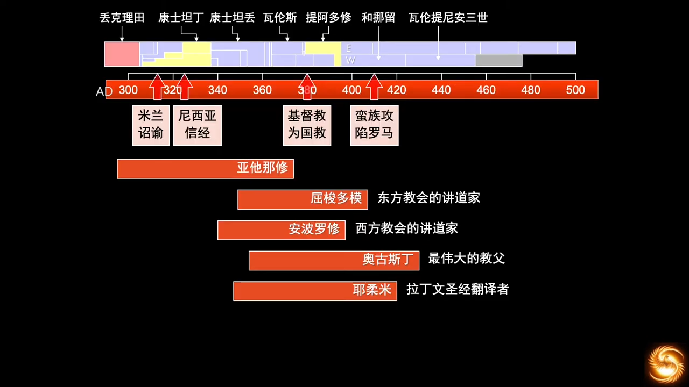

在罗马帝国后期，面对各种战争压力下，罗马帝国江河日下，经过百年的外族削弱和内部消耗，当蛮族终于攻陷罗马以后，全民的精神生活就陷入了一片困顿当中。大家都需要面对一个问题，我们的社会为什么会这样？我们的帝国为什么会这样？我们的神理应是无所不能的，那为何我们信了基督教以后，国家内忧外患不断，还老打败仗，连国土都丧失了。读过旧约就知道，以色列人经常问这个问题，打仗一输就问上帝。

这就是人的问题，人的逻辑以胜败论英雄，然后把这个逻辑用到了属灵界，用这个方式来定义神。为了修正人的思想，在这段时间，神就兴起了几位祂的仆人，为群众解答信仰疑问。

最有名的当属奥古斯丁，他解答了罗马为何会被攻陷的这个问题。他说

> [!IMPORTANT]  
> 任何人间的城都有灭亡的这一天，只有上帝之城永存。

这说的是800年都未被攻克的罗马城，所以这句话的震撼可想而知。

罗马天主教认为有八位教会博士，东罗马教会认可七位。

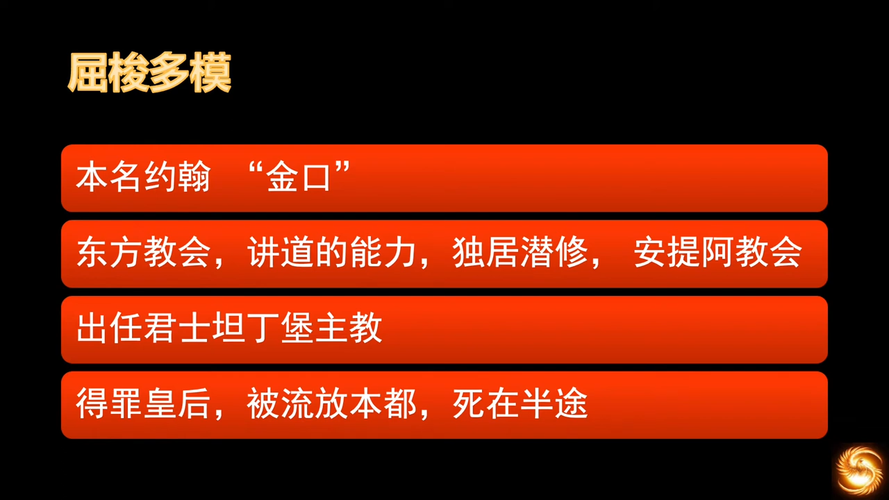

教父约翰·屈梭多模(John Chrysostom, AD347-407，`金口圣若望 Sanctus Ioannes Chrysostom`)，Chrysostom意为“金口”，指他的讲道大有能力，希腊教父，被认为是希腊东正教之父，君士坦丁堡主教。

当时有人将皇后像放在主教座位旁边，并举行献祭仪式。他得知后就斥责了这个行为，不能崇拜人，有人就编织罪名，挑拨了皇后对他的恨意。一开始屈梭多模被流放在附近，他还老是写信来责备教会弟兄，在信仰上要归正他们，提了很多建议，很不讨人喜欢。于是被流放到更远的本都，之后被要求在烈日暴晒下，没有遮蔽地赤脚走在沙漠里，因而致死。

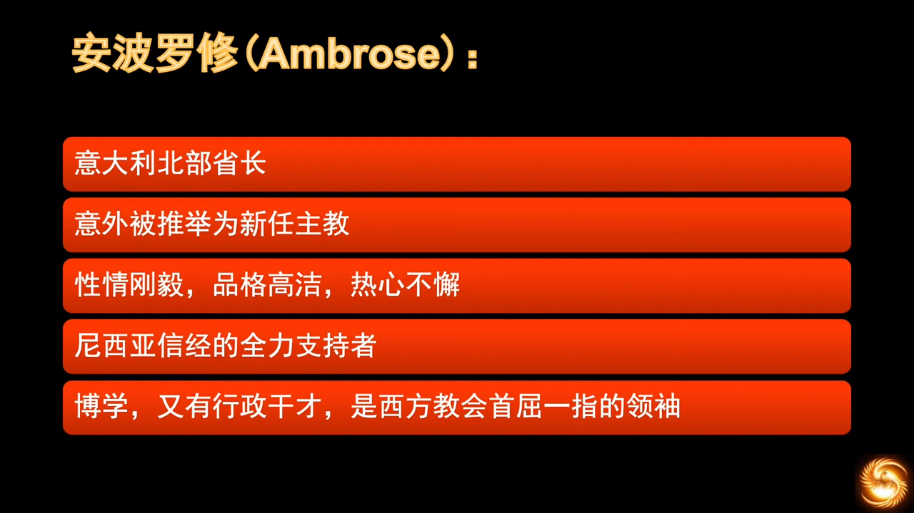

教义有争论，安波罗修被派去维持秩序。在维持秩序过程中，意外地被推举为新的主教。

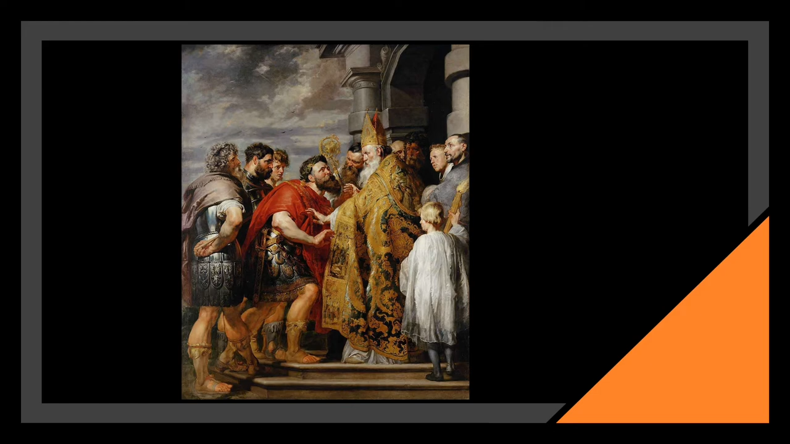

他曾要求皇帝认错道歉不然就拒绝皇帝领圣体。有人问皇帝和教会有什么相干。安波罗修回答，

> [!IMPORTANT]  
> 皇帝在教会之中，不在教会之上。

他是第一次厘清了神权和皇权之间的权柄，这幅画就是描写了这个场景。皇帝在主教面前谦卑下来，这也算先例。从这里看出教会对皇帝的制约，这在后来中世纪成为主要的力量。皇权受到制约，就能约束人间多少罪恶。安波罗修对“罪和恩典”也有很深的感悟，他说：

> [!TIP]  
> “我不要因为我的公义夸口，却要因为我蒙了救赎夸口；我不要因为我脱离了罪而夸口，却要因为我的罪得到了赦免而夸口”。

安波罗修是奥古斯丁的偶像，当时奥古斯丁还没有归信基督以前，就经常来听安波罗修讲道，这都记录在《忏悔录》中。崇拜到什么地步？奥古斯丁每天听讲道时，非常痴迷地学习其高超的修辞学技巧，学习他的手势、语气、语调，无不一一模仿。

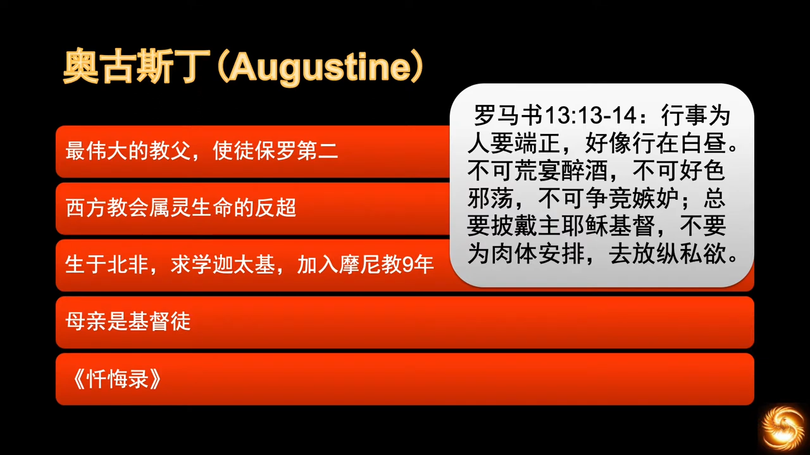

奥古斯丁，`圣奥思定`，最伟大的主教，使徒保罗第二。西方教会之后的属灵生活之所以远远超过东方教会，他是居功至伟的。

奥古斯丁在迦太基与一女子同居了14年，并生有一子。他一方面并不结婚，追求情欲；另一方面也追求真理，在追求真理过程中又误入歧途，加入摩尼教九年。他的母亲叫Monica，是一名虔诚的基督徒，经常为儿子祷告，泪流满面，近乎绝望。一次祷告时，念及儿子的顽劣，哭得很伤心。神父问怎么回事，Monica说了儿子的情况，她问，“我的儿子还有救吗”，神父安慰道，“你的儿子能不能得救我不知道，我只知道如果有一位母亲能够如此为儿子流泪祷告，她的儿子必不至于灭亡”。

奥古斯丁慢慢对摩尼教失去了兴趣，到米兰担任修辞学教授。在此期间，听到了安波罗修的讲道，起初只是欣赏安波罗修的口才和手势，并不关心内容。自己仍是过着随心所欲的生活，有一天朋友告诉他，在埃及有几千人过着圣洁的生活，而他们大部分是没有受过教育的。这话带给他很大的震动，感到了惭愧，“道德和学识并无太大关系”。

一日他在花园徘徊思索这个问题时，听到一小孩声音说，“拿起来读，拿起来读”，他四下观望，并无一人。疑惑中，看到前方石头桌上摆放着一本圣经，拿起随手翻开一页，就看到罗马书十三章的这段话：

> :latin_cross:  
> 13行动要端庄，好像在白天一样，不可狂宴豪饮，不可淫乱放荡，不可争斗嫉妒；14但该穿上主耶稣基督；不应只挂念肉性的事，以满足私欲。 (罗马书 13)

神通过这段经文，直接向他说了话。奥古斯丁立即醍醐灌顶般重生，那一年他32岁。这段话我们听来平平无奇，但是这话若是从神而来，那力量就很大，足以直击奥古斯丁心灵深处。

    人的内心只有被神的光照亮，我们才会发现这些话是对我们说的；人非光照，不能见自己的罪恶。

奥古斯丁的伟大，是在于他神秘的敬虔生活。《忏悔录》是他信主前和信主时的故事，是世界上第一部属灵传记，追溯他寻找意义和快乐的经过。他的经历带来一个结论，即“人在神以外，找不到任何的安慰”。

> [!IMPORTANT]  
> 你为自己造了我们，我们的心没有安逸，直到它安息在祢的里面。

这种把宗教看作是和永生神亲切来往的观念，在当时是不容易被理解的，但后来在教会中产生了长久的影响力。奥古斯丁信主以后，返回了北非，后来成为了希波城的主教。在这期间，他用许多的精力应对了来自四面八方的挑战，他也因为应了这些挑战，慢慢建立了自己的神学观。古人有称他的神学观是实用主义者，但恰恰是这实用主义，把信仰没有上升到虚无的道德主义的层面，而是面对四周的一切对于信仰的攻击，所以他将基督教的教义牢牢把守，将可能产生的信仰歧义一个一个地拆解掉，为后世基督教正统教育的发展做出了非常杰出的贡献。有一位西方的思想家说过，“当奥古斯丁不能睡觉的那个晚上，欧洲文化的方向就已经确定了”。

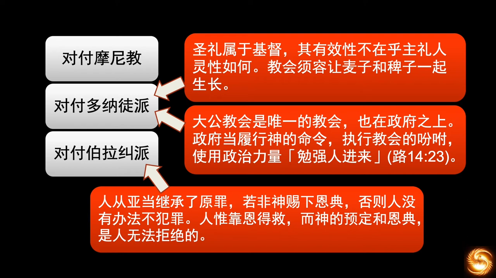

- 摩尼教：奥古斯丁用他九年的摩尼教的经历，彻底地驳斥了摩尼教信仰的虚妄的方面，这个系统的论述在《上帝之城》中有详细的思辨过程。当时摩尼教在那一带其实是很盛行的
- 多纳徒派：奥古斯丁坚持“让人得救的是基督，圣礼的能力也是来自于基督，而不是施圣礼的人”，所以人的状况不会影响神拯救人的能力。多纳徒派不肯承认当时的主教，认为主教的身份是被一位在大迫害时期背叛信仰的宗主教所按立的，所以他们不承认这名主教的身份，另外建立了一套圣秩体系，奥古斯丁用两个圣经原则对他们的不承认进行批判
    - 分开麦子和稗子不是人的责任，也不是人应有的权柄
    - 路加福音，“勉强路人参加婚宴”，所以教会有权柄将信徒规勒进教会，甚至用强迫的方式。这个论点被后来的罗马天主教会逼迫异议者提供了理论基础。人的困境就在于此，原本明明是面对极端状态下产生的应对的方法，但是却被后人滥用，成为新的错误。这不是奥古斯丁的错，这也不是天主教的错，这是全人类的错，人是有罪有限的，人办的事情很少有不被魔鬼利用的

    > :latin_cross:  
    > 22仆人说：主，已经照你的吩咐办了，可是还有空位子。23主人对仆人说：你出去，到大道上以及篱笆边，勉强人进来，好坐满我的屋子。24我告诉你们：先前被请的那些人，没有一个能尝我这宴席的。” (路加福音 14)

- 伯拉纠派(Pelagianism，又作白拉奇主义)：伯拉纠派认为新生的婴儿和亚当犯罪前的光景是一样的，是无罪的，人后来犯罪是因为学习了亚当的坏榜样，“人之初，性本善”的西方版本。奥古斯丁认为人从亚当继承了原罪，除非是神赐下的恩典，人没有办法不犯罪，人只有靠恩典才能得救，而神的预定和恩典是人无法拒绝的。这个理论深度影响了后来的马丁路德、加尔文的神学观，对后世的影响是巨大的。

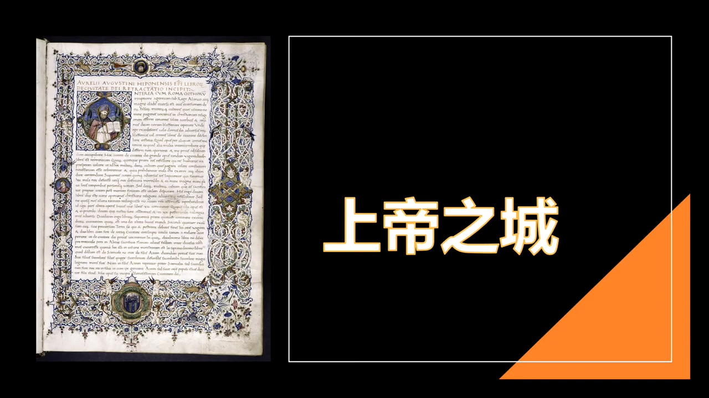

当基督教在罗马帝国国教化之后，罗马被哥特人攻陷，让罗马人不能理解。人很容易以为自己已经获得了上帝的加持，就和义和团一样，觉得自己应该刀枪不入。这种思想和犹太人很像，当犹太人圣城被毁，圣殿被烧，选民被掳的时候，他们也问了同样问题，当时人们把罗马帝国的衰退归咎于基督徒离弃传统的多神宗教。其实在任何时候都有这样的指责，古罗马的历代君王中也有持同样观念的，所以才会逼迫基督徒。

奥古斯丁觉得有必要进行系统地进行回应，于是在AD413，写了这本《上帝之城》。哪怕在今天，阅读这本书的时候，也会忘记他是古人，是AD413的作品。就算放在今天这个世代，也没有几人能写出。《上帝之城》解答了罗马民众的疑问，指出大地之城（从该隐而来的，指巴比伦、罗马为代表的）和天上之城（从亚伯开始，指地上有形的教会），讲解了这两个城的发展和结局。指出罗马的衰退是因为人类道德的衰退，基督教不但不是罗马衰退的原因，反而有助于道德的提升。但是基督徒所归属的不是罗马帝国或任何一个大地上的城市而是上帝之城，两者最根本的差别是前者人民的共通点在于对自己的爱，而后者是在于上帝的爱和由此产生的对彼此的爱。奥古斯丁通过对两个城的起源到结局进行对比，然后对人类群体生活进行了深入的讨论，建构了基督教的历史观。这本书最重要的是将人的目光扩大到了天国，地上一切的城都是巴比伦城，人要警醒，以免失去天国的盼望。

奥古斯丁对于建立基督教纯正的教义，有着不可磨灭的贡献。

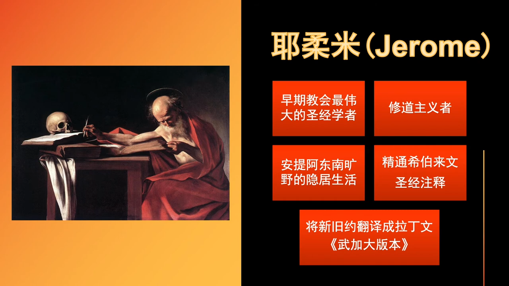

耶柔米，伟大的圣经学者。AD374他意外生病了，发了高烧，恍惚中被带到了基督台前受审判，主耶稣问：“你是谁”，耶柔米说：“我是基督徒”，基督就非常严厉地说：“你是西塞罗的门徒，你的财宝在哪里，你的心就在哪里”，下令鞭打他。耶柔米醒来后，身上犹有余痛，深信这是主的管教，从此之后不再读异教的书，开始隐居，研读圣经，成为西方教会唯一一位懂希伯来文的人。最大的贡献是将新旧约翻译成拉丁文，旧约甚至是直接从希伯来文翻译的，就是非常有名的《武加大版本》。对罗马天主教有着极大影响，因为新约是用希腊文写的，旧约是希伯来文写的，然后在亚历山大城被翻译成希腊文（七十士译本），但是罗马帝国的官方语言 —— 拉丁文的版本，是耶柔米翻译的。

耶柔米很早就显露出对藏书的热情，并且建立了古典晚期最卓著的私人图书馆。他从学生时代起就喜欢收集文学经典，其中包括了很多异教的文学经典。后来慢慢地他将自己的藏书转变为包含大量基督教圣经和神学作品的相关收藏。早期他是在罗马受的教育，教育程度很高，之后在莱茵河这一带谋求官职，做过主教的秘书。后来来到安提阿地区，生了这场有名的病，彻底修正了他的神学观念。

AD386之后，他就定居在耶稣的出生地 —— 伯利恒，过着隐居的生活。早期的拉丁教会将他尊为四位西方教会圣师之一。

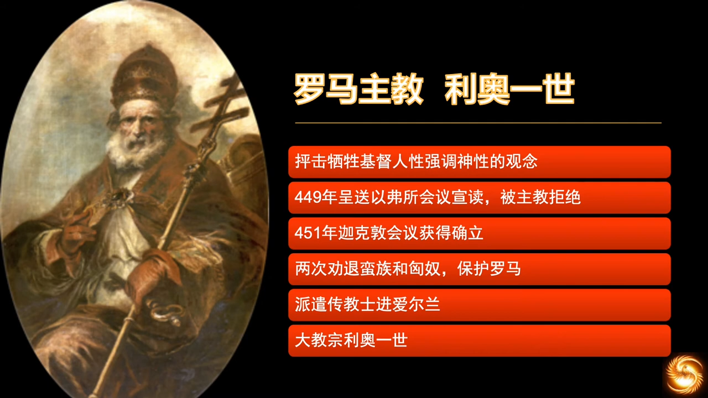

利奥一世(又称大利奥，Pope Leo I，`教宗圣良一世`)，出生在意大利的托斯卡纳，他担任罗马主教时，当时的整个罗马帝国有四位宗主教，四个大区的宗主教是平级的，并无高低。罗马、君士坦丁堡、亚历山大、安条克四大教区，后来再加上了耶路撒冷，这几大教区的宗主教是平级的。但在利奥一世的任内，他将罗马教会提升到西方教会最高的地位，并从罗马皇帝手中取得了罗马主教的合法地位。他是非常杰出的行政家和讲员，在讲道和神学辩论中颇显其能。早期的教父在雄辩学上都很厉害，有学问，还能将学问用于推广神学理念。所以早期的教父的沟通技巧和神学造诣都是登峰造极的。

利奥一世强烈反对基督的“一性说”，即“基督的人性被神性吸收了，只有一性”，为反驳这一学说，特地写了一份针对基督位格的教义声明，又称大卷，主张基督有完整的神性和人性，竭力抨击牺牲基督人性强调基督神性的观念。

本定于AD449年呈送至以弗所会议宣读，但是被当时的狄奥斯库若主教所拒绝，而没有宣读。教宗良一世称这个会议为强盗会议。直到两年后（AD451）召开的迦克敦会议上，教宗良一世才有机会再度宣读“大卷”的内容，成为订立迦克敦信经的主要文件。草拟基督位格的迦克敦释义的一个主要文件，教宗良一世依照主流信仰说明“基督具有完整的人性，也具有完整的神性，但非分裂的位格。”

AD452，他曾经说服匈奴人首领阿提拉从罗马撤退，当时匈奴大兵压境。利奥一世孤身一人和阿提拉谈判，劝退了匈奴，使罗马城免遭了涂炭。AD455，汪达尔人掳掠罗马城时，他又去和汪达尔人首领谈判，使罗马城的伤害减到最小。他特别有远见，在罗马衰败之际，从不列颠撤回了行政管辖权，向不列颠，向爱尔兰进行传教，派了传教士进入爱尔兰。爱尔兰是一个很关键的福音站，后来成为蛮族时期向欧洲大陆传福音的重要力量。当时的东罗马皇帝也叫利奥一世，为了以示区别，这位主教被称为大教宗利奥一世。

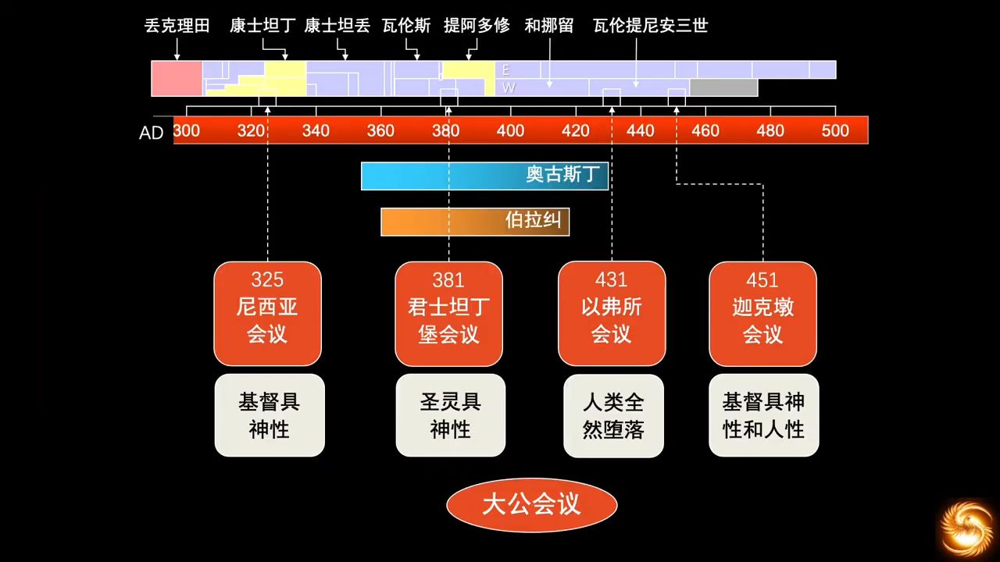

早期教会历史上最重要的四次大公会议。当时的辩论都是用柏拉图主义的哲学方式来阐述这些概念的，这些内容需要很多篇幅才可能用英语讲清楚。我们只需要知道，这些争论的影响非常巨大。在教外人看来这些争论是荒谬的甚至疯狂的，对上帝的准确定义，基本在AD300~500这段时间达成了共识，这是非常的内容，越来越重要。辩论发生在东边（君士坦丁堡，以弗所），所以辩论对东罗马影响更大。

这个地方是希腊理性的发源地，当地知识界早就习惯了类似的哲学辩论。但是随着蛮族的征服行为，关于基督论的问题也被慢慢带到了西罗马。西罗马的辩论也一点不比东罗马轻松，亚流派和天主教会之间的斗阵比在东罗马更激烈。辩论从东罗马开始，在西罗马扩大。

西罗马的争议还不主要是“基督论”的问题，虽然“基督论”在西罗马也是问题，但最大的问题是奥古斯丁说的“预定论”和“神圣恩典”。能看出东西罗马的不同，东罗马的希腊文化底色浓厚，所以讨论的是神学的问题，是基督论的问题，希腊是神学和哲学最早冲撞的地方。所以关于基督是神性还是人性是他们最感兴趣的问题。然而西罗马的罗马风，讲究“设计”，于是讨论的是预定论和神圣恩典，关注人是否得救，如何得救，是实在的问题。西罗马大城市的宫里经常接受强势的思想者的布道，所以那些普通的宫女在神学问题上的修养，也是不可低估的。

但是帝国很大，不仅仅大城市，还有偏远地区。当时距离“皇帝是神”的世代还不是很遥远，所以仍有着这个思想的余烬。神人之间的分界，在五世纪时，远没有像现在这样清晰。所以“基督是人还是神”在当时称为争论的焦点，是可以理解的。

这一场争论，波及了整个帝国的各个层面，不仅仅是精英阶层，也包括宗教界、平民、政府官员等，大家都各有主张，各自组团结社，相互对抗。信徒们对地方的宗教领袖都非常忠诚，产生了城市和城市的对抗，甚至小规模的战争。这个就给了“教会组织社会”一次实践的机会，在后来蛮族征服以后的无政府状态，教会组织社会的功能，就需要承担很强的社会稳定性功能。

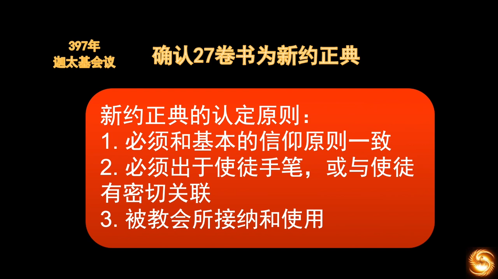

AD397，迦太基会议。
- 马可福音：马克是彼得的小跟班
- 路加福音：路加跟随了使徒保罗
- 一世纪末之前被教会接纳和使用的，一世纪末之前是使徒约翰的同时代。

- 全新的、前所未有的、之前的罗马社会或各种其他社会形态都不曾具备的社会有机体 —— 教会制度，给人类历史带来了翻天覆地的变化，导致了人类社会和大洪水之前不同的一个终极走向
- 用300年建立了正确的信仰教义，教义不正确，就会偏离。“失之毫厘差之千里”，从新约圣经中可以看到，人类因为自身的局限性，无法持守信仰正确的
- 就如神没有抹去亚当的自由意志，就是因为每个人在信仰上的自由，构建了丰富多彩的世界格局和世界状态，最终使成为选民的群体所处的历史有了背景板。