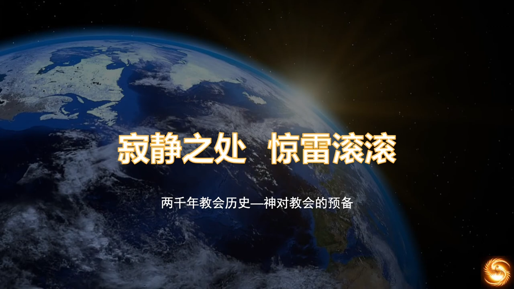
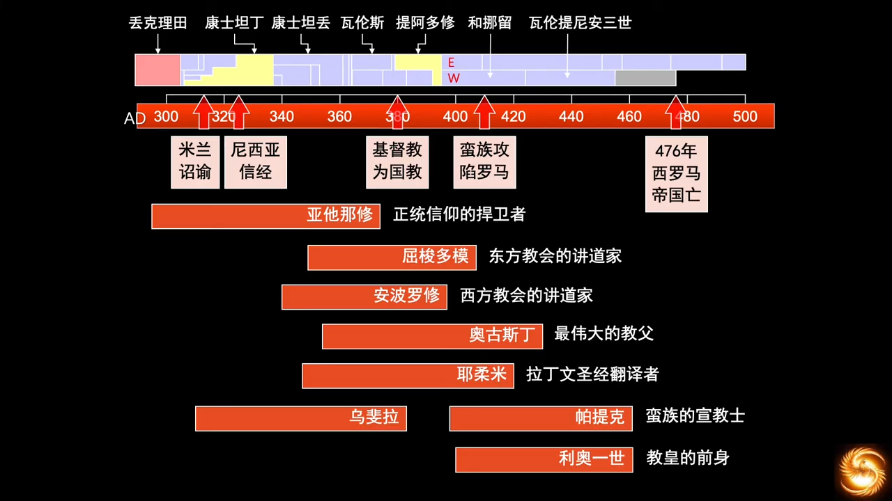
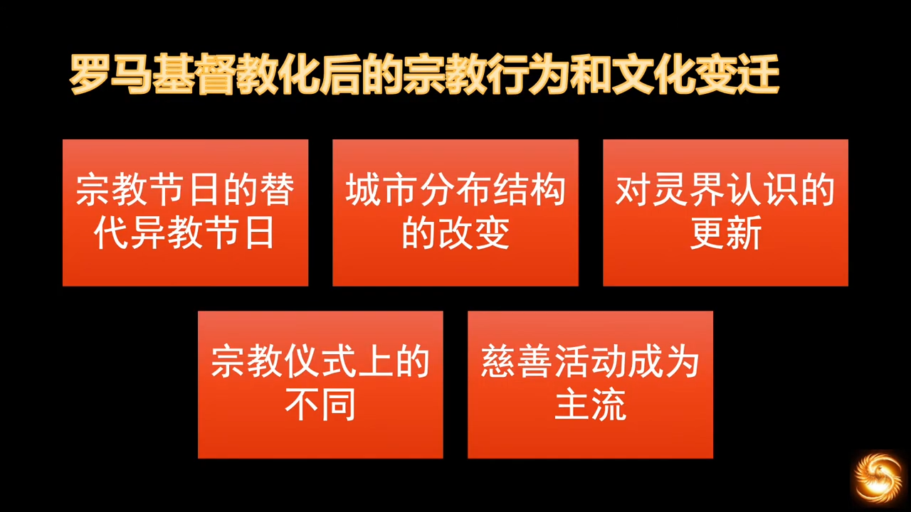
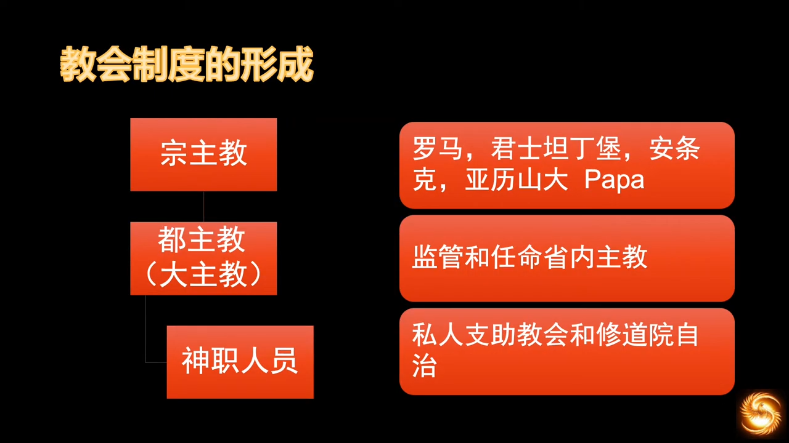
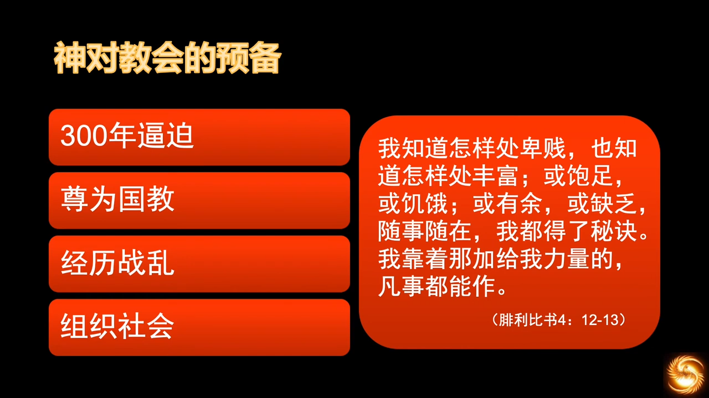
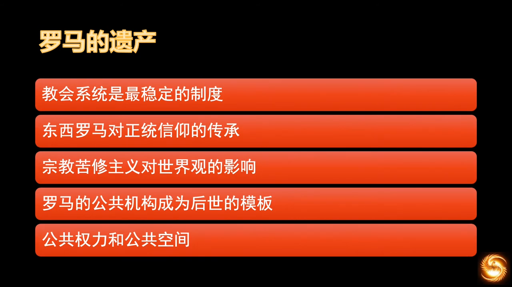
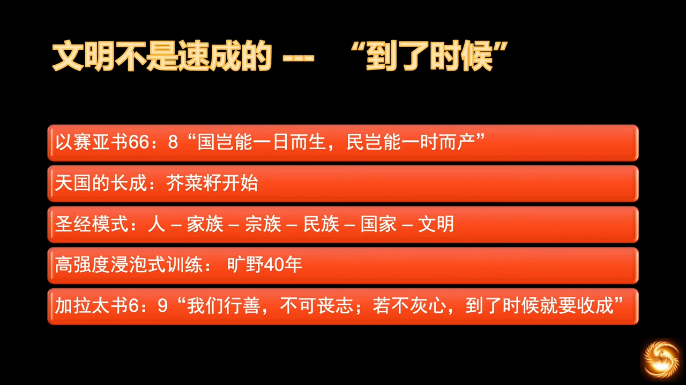
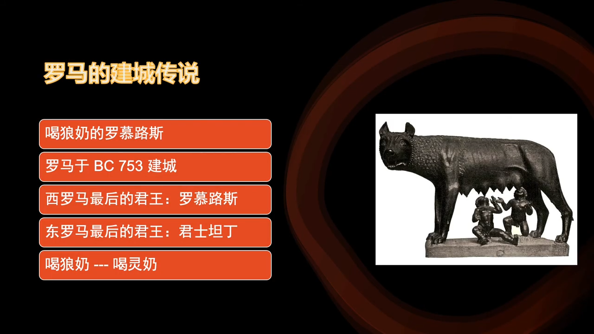

# 教会历史和欧洲历史
## 10 教会历史 西罗马末期神的预备
https://www.youtube.com/watch?v=-zCbZ8GPyzo&list=PLfChJ-aSv3VD-f-sQH1p9vEPjwx8zYH6e&index=11

上一期大致介绍了在罗马衰亡时期，涌现出来的非常伟大的灵魂人物。这些人物非常重要，对基督教产生了重大的影响，哪怕是千年之后，我们仍受惠其中。

现在来介绍这些伟大的灵魂人物，在神的带领之下，对罗马社会、社会结构、政权和民众，带来怎么样的影响和改变。这是非常重要的一个环节，没有整个改变的话，后来的蛮族世界他们是无法应对的，包括教会，都需要在这个过程受到历练和成长。

利奥一世罗马主教地位的提升，也为后来的教皇制度铺平了道路。教皇制度是绝对有存在的必要的，接下去会看到教权和君权之间的张力，是中世纪主要的旋律，若没有教权、教皇制度，君权的欲望是没有办法得到制约的，君主专制就会早很多年。欧洲大陆的君主专制发生得特别晚，这和有一个强有力的教皇制度，是分不开的。

### 宗教节日
罗马当时有很多大型宗教节日，因为它原来是多神崇拜的国家。所以这些宗教节日有很深的异教色彩。但老百姓又是喜爱过节的，当时的节日还有大型娱乐活动。作为基督徒的主教们肯定是反对这种异教性质的艳乐，吃喝玩乐都不是奉主的名，但是反对的话就又剥夺了人寻欢作乐的权利，人又会远离，主教的教化的影响力变得有限。于是主教们想出了一个好主意，用基督教的节日填充了原来的异教节日，将圣经中记载的重大节日事件，用节日的方式替代了平时庆祝的异教节日，比如圣诞节原本好像是庆祝太阳神之类的，变为庆祝基督诞生，另外有复活节啊大灾节啊五旬节啊，都是从十二月到五月，另外的空白，就用纪念圣徒的方式填充进去，当时的圣徒对人的激励力量是非常强大的，这也是为什么天主教有这么多圣徒节日的由来。当基督教的宗教年历终于替代了世俗年历的时候，当时主教觉得这样可以在和异教力量的属灵战争中赢得一席之地了。

所以现在很单纯地批评天主教过这么多节日之类的，是没有必要的，任何事物的产生都有其背景。但是人是有限的，人改变了观念之后，行为可能并未有变化，罗马民众之前在异教色彩下吃吃喝喝，成为了基督徒以后，成了奉基督的名在节日里吃吃喝喝，这的确需要有相当长的时间来改变人的行为习惯。两拨人都有自己的观念原点，一拨人认为宗教节日如果不去教堂赞美上帝是不对的，不这样过节还不如不过；另一拨人认为宗教节日在家艳乐吃喝，也一样是纪念和庆祝上帝。人的观念若不彻底改变，人的心灵不会改变，行为也不会改变。从心灵改变到社会风气的形成，这中间有很长的路。

### 城市分布
另一方面，基督教对罗马的改变是诚实分布结构的变化。原来的异教神庙大多在城市的中心，比如城市的广场、居住区。基督教极少直接将神庙改为教堂，基督教不这么干，穆斯林是这么干的。他们会避开异教氛围很强的市民中心，转而在偏远地方建教堂。更有一些敬虔的基督徒，就干脆围着教堂建自己的房屋，于是渐渐地，在城市的外围兴建了很多的居住区。

在异教氛围下，死亡是不幸的、是阴暗的。所以在当时的罗马，死人是不能埋葬在城市围墙内的，只能远远地葬在城市外面。但是教会和基督徒对于死亡的观念是不一样的，特别是对于殉道的圣徒，基督徒坚信殉道者们拥有复活的力量，所以圣徒都是被安葬在教堂内的，有些教堂干脆是直接盖在圣墓上的，有些圣徒是安葬在教堂的后院，或者在教堂的地下室。当时的基督徒希望离圣徒越近越好，于是教堂后院埋了越来越多的圣徒，所以直到今天的西方，也是这样的布局，前面是教堂，后院都是墓地。这样的话，我们看到死亡不再是咒诅，而是应许、是祝福。在教堂这里，逝者、活人、等待复活的人，成为了一个群体。所以对死亡的恐惧，逐渐在基督教传统里，被淡化，甚至被消失。基督教通过这样一个漫长的过程，修正了人的观念，改变了城市布局。从那以后，城市的中心反而被放弃了，成为了“脏乱差”的代名词，直到今日，我们提到“downtown”也是这个感觉。对应的，“uptown”是郊区，静谧的、敬虔的生活，就成为上层社会的象征。

### 属灵层面
在属灵层面的征战，当时的基督教也取得了巨大的胜利。当时异教氛围之下，“灵”这个字（希腊语），是褒贬不分的。在希腊多神的语境下，灵没有好坏，只是一个用词。希腊的诸神本就很有人性，会嫉妒、会纷争，在希腊人的观念中，人如何，他们的神就如何，会竞争、斗殴、打架、嫉妒、抢女人、乱伦，一应俱全。所以当时的人对于“灵界”的认知是很肤浅的，只是觉得是一个和人类差不多的平行世界。但是基督徒的属灵观完全不同，对于“地狱”的认知，对当时的异教观形成了巨大的冲击，更新了人们对属灵世界的看法。基督徒在当时的普遍观点就是，“灵”是有善恶二分的，好的灵是天使，坏的灵是魔鬼，而恶的灵对我们的影响更大，会更多地介入到我们生活当中。所以我们不仅仅要在现世对抗这些魔鬼，就是在死后也要避免下地狱。

当时敬虔的圣徒，普遍都有赶鬼的能力，现在已不多见，但在当时的初代使徒时期，这样的神迹有很多。所以我们看到在信仰的初期，神是会特别保守信徒传福音的脚步。渐渐地，罗马的观念中，“灵”这个词，成为“魔鬼”的代名词，魔鬼deamond (希腊语 διαμάντι diamánti)。罗马时期的基督教，还未开始重视圣灵相关的一些仪式，当时异教的重大仪式，多和献祭有关。而基督徒看重的是信仰状况，人的属灵需求，那个时期的基督教刻意要将自己和异教分开，异教崇拜的大型群众活动，是他们所反对的，但是当信徒逐渐增多、信徒成分逐渐复杂，基督教就不可避免地走上了他们曾经反对过的道路，因为基督教也开始需要用集体、大型的仪式来谋求社会上和道德上的团结，来改变人的思想，这就是所谓的“仪式感”。在之后的历史中，能看到天主教搞的很多仪式，确实是非常庄重肃穆，让人心生敬畏，但之后也因此在新教运动中被批评。这就是人的困境，是人靠自身无法突破的，人左也不行，右也不行，总要成为自己曾经反对的人。这就是世界的双重真相，这是属魔鬼的世界，任何向神的善举，都会被魔鬼利用，来歪曲和极端化。但也是天父的世界，所以不管圣徒犯如何的错误，神都能将之化为祝福。天主教虽然在很多方面为人所诟病，但恰恰是这些错误，催生了之后的宗教改革，释放了人心的信仰自由。

但是改变人的观念，比改变宗教仪式要难很多，基督教从诞生的那天起，就倡导平等的理念，早期的主教也有类似的尝试，比如，尼撒城主教，圣格里高利就曾对奴隶制提出批评，教会也不断在教导中灌输平等的理念。所以当时的圣徒即使在活着的时候不敢尝试去做一些反常理的改革措施，但是通过在死前立遗嘱，说死后要释放所有的奴隶，这也是他们对控制社会体制所能做的最大的作为，要考虑到当时他们触及的利益阶层实在是太多庞大了。直到千年之后，释放奴隶才真正成为可能，美国还为此打了一仗。奴隶制不是神的心意，而是人的罪，是人的私欲导致的不正常的社会结构。明明有《费肋孟书》（腓利门书）讲到了如何对待奴隶，但是人却反而从这卷书读出“神是支持奴隶制”，这是荒谬的。

### 慈善活动
早期基督教因为遭受逼迫，所以在教会中形成了“大家奉献的款项用来资助在困难中的信徒”，就达成了这个共识。这种情况在之后基督教合法后，慢慢演变成在社会中的救助，再演变成在异教徒中救助，救助的方式成为了传福音的管道，至此慈善活动慢慢成为主流。在这之前的异教崇拜的罗马，是没有针对个人的慈善事业的，众人的捐款主要用来建公共建筑，筹办大型的公共活动，救助平民个体往往只是政府的事情。罗马当时的民众，对政府的要求是“面包和马戏”。于是罗马必须不断向外扩张，来满足民众的这两大要求。

但当慈善活动和每位信徒都相关的时候，当这个观念建立了，给罗马民众提供面包的政府机构就崩溃了。当罗马崩溃后，这块土地上站起来的强大的社会有机体 - 教会，她承担了救助民众，组织社会的功能，这中间的关联颇为神奇。

这个时间段中，教会的制度也慢慢形成、自我完善。根据教会的地理位置分布，整个帝国分了四位宗主教，罗马、君士坦丁、安条克和亚历山大，在AD451，耶路撒冷又设立了一宗主教。几位宗主教不分高低，分管辖区内主教的任命。当时这几位宗主教都被称为Papa，这个词直到八世纪后，才变为特指罗马教宗。都主教（大主教）是监督和任命世俗省份内的主教，负责管理当地的公共教会。私人资助的教会和修道院除外，他们有自治的传统，但这自治的传统，在之后的一千年中带来了很多纷争和敌对。

到四世纪五世纪，教会已经发展成一个复杂的系统，神职人员超过了十万人，已和罗马的政府人员人数持平，甚至在一些小地方还超过了。教会也变得特别有钱，因为信众多，奉献多，有钱就能获得世俗社会的敬重。很多世俗权力机构，甚至政府，就来和教会合作，教会管理阶层的世俗化非常快，甚至很多教会在选择主教人选时，将世俗条件纳入了选拔的考量，比如，有没有个人魅力，和政府关系如何，是否善于理财，是否善于管理。教会不是国家机构的一部分，但却拥有了巨大的心灵权力和财富，以及覆盖帝国各个阶层的制度化体系。这成为了帝国政府不可忽视的一股力量，以至于后来帝国的征服者 - 蛮族，也不得不依靠这股力量。

蛮族只能靠教会来重新组织社会。关键是，当时的教会在社会组织中，代表的是平民的力量。当时的平民本没有发声的渠道。在教会和政府抗衡的过程中，最初的目的是社会稳定，道德彰显，所以教会大部分诉求代表了平民利益，用基督教的教义原则去制约帝王权力，这力量在散沙型社会中是不可能存在的。

而且教会的巨额财富，和世俗的财富也不同。教会财富的稳定性，比世俗财富强很多，不会受战争影响。主教是不允许出售教会资产，教会的土地就会越来越大。当时的主教座堂，会成为当地最大的庇护主。这很重要，财产的稳定性，对社会结构的稳定力量，作用很大。这种结构，在当时的社会环境下尤其重要，是因为接下来社会面临一场大崩溃，教会的稳定性是重新构建社会的中坚力量，甚至是最主要的力量，因为教会的体系是独立于帝国的行政体系之外的，费用也不靠财政而靠自筹。所以这种独立性，使其在公元五世纪的罗马大分裂中，不至于解体。

还有一更重要的作用，就是成为接下来上千年的历史中，变化最小的社会结构。中世纪的欧洲版图经常变化，社会结构也多变，从封建，到君主，贵族和君王之间的斗争是激烈的，但有一个稳定的教会结构的存在，对当时的君权贵族权力，都是一个非常有力的制约。

接下来看教会这些年经历的事情，首先是300年的逼迫，锻造了信徒的品格、坚定了信仰的教义、扩大了福音的版图，从地理上、人心上、组织上、结构上，全新全面地锻造了一个社会有机体 - 教会。在被尊为国教是，历练了教会的组织者和政府打交道的能力和智慧。在经历战争动乱时期，也历练了教父们不把属世的恩仇当作自己福音的捆绑，这是很重要的，因为战争总有敌对双方，而福音是面向普世。所以尽管政府满是仇敌，但教会是超越政治的。

哪怕在被蛮族征服的土地上，教会依然帮助蛮族和罗马的亡国之民，艰难地从废墟中站立起来，重新构建社会，这是教会超越民族主义的使命。如果没有这种超越性，就会在人间的敌对状态下不断斗争。这种超越性，在之前的社会形态中是不存在的，家国情仇无比正常。所以人间是没有超越民族的大爱的，只有在基督里才有。正是这种超越性，产生了人类最高的文明。虽然这还是有限的文明，但是欧洲和与其相关的美洲文明形态，还是目前来说人类最高的。

在战乱中，教会也锻炼了组织社会的能力。如果教士们整天在太平盛世中抄抄圣经，不参与组织社会，那也是无法面对后面的惊天巨浪的。在这场动荡中，教会各方面的能力都得到了成长。

> :latin_cross:  
> 12我也知道受穷，也知道享受；在各样事上和各种境遇中，或饱饫（yù）、或饥饿、或富裕、或贫乏，我都得了秘诀。13我赖加强我力量的那位，能应付一切。 (斐理伯书 4)

这都是神的预备，可能要在之后的很多年，这些能力才会显现，但神的预备是很早的，是早于我们的想象的。后来在被蛮族征服的期间，基督教起到了临时政府的作用。虽然在那样情况下，也没有出现过大规模饥荒，瘟疫是有的，这是医疗条件局限。在AD500-1500，即中世纪，神又花了整整一千年，在欧洲建立了基督教的社会框架。只有在这样的社会框架下，才可能产生现代社会转型的三大动力：科学革命、地理大发现、宗教改革。

这在东方社会是不存在的，东方除了君主专制之外，就没有出现过其他的社会形态，于是有人说，这是“一种社会形态，一直走到变态”。比如天朝、日本。在人性占上风的社会中，君主专制就成为常态。这和人性有关，反而和制度无关。在一个没有神的社会中，人性的复杂性和意外性，导致了社会必然是逆淘汰，这是常识。所以，制度只是产物，是果，而不是因。这也是为什么福音事业比革命重要得多，否则就像推翻一个正方体，推翻一个恶政权，翻上来的只会是更恶的政权。

欧洲的君主专制形成得特别晚，和它的基督教社会框架是分不开的，教权对君权的制约是一主要原因，但是恰恰是从欧洲的君权开始占上风之后，教权软弱了，法国大革命开始了。所以君主专制，不要看它暂时有多辉煌，君主归根到底就是不断给自己挖坑的过程，挖了足够深，最后就把自己给埋了。

神的预备，不仅仅是教会的预备，神对整个人类社会都是有预备的。从西罗马崩溃前的这一百年里，可以看到神各种各样的预备。

版图的预备，神没有让国家脆断，而是经过漫长的百年，烽烟四起，战战停停。在蛮族入侵以后，定居了下来，定居点和罗马人冲突，冲突过程中又了解，这个了解，在之后的社会重建中，又发挥了作用；

对于中世纪的主角 - 蛮族，神对他们的心灵也做了预备。当时亚流派被主流教派排挤后，不得不向东宣教，进入了蛮族的领地。当时在教区，亚流派的影响本已在西罗马灭亡前被消除了，但在蛮族的世界中，是罗马教权鞭长莫及的地方，所以蛮族成为了信仰亚流派的基督徒。有了信仰，对于契约，就有了共识。没有信仰的民族，是没有契约精神的，因为没有制约心灵的力量。在帝国衰亡的过程中，帝国的坚定是反向增长的，这不得不说也是神迹。虽然是外忧内患，外面在打仗、蛮族在入侵、教会内部为教义吵个不停、皇帝整天要面对平民的抱怨，但是他们对神的信心与日俱增，这就是神迹。罗马民众的信仰是很坚定，从他们信仰异教开始就是这个状态。他们信仰异教神明可以信仰到逼迫基督教整整三百年的地步，当神归正了他们的信仰对象后，他们的信心也蒙了神的保守。

民众当时认为罗马帝国是战无不胜，对帝国有信心，帝国的基督化又进一步强化了观念。正是在这一观念下，他们在组织社会、启蒙人心这事情上，稳步向前推进，根本无关社会环境如何，这是教会的使命。人在舒适中堕落，压力是神历练人心的法宝。罗马从接受了基督开始，帝国遭受的压力就没中断过。蛮族和基督的福音，几乎是同时开始在帝国产生影响力，这一过程中，帝国实力被消耗，教会在成长。面对各种各样社会问题，教会以惊人的速度在成熟。当时，虽然在信仰上还是显得幼稚，距离相信“皇帝是神”的时代还不远，仍有很多人相信罗马的多神教。即使是这样素质的信徒，神仍能将之打造为一支可以改造社会的力量。

这种压力一直伴随着后来欧洲的主角 - 蛮族的成长，这些蛮族刚刚文明化，就有新的蛮族又入侵了，蛮族层出不穷。蛮族是从东欧草原上来的，东欧草原是蛮族的孵化器、温床。游牧民族，部落庞大了，就会面临生存的问题，只能向西入侵，东边走不通嘛，东边有长城。对于骑兵来说，长城难度更大。后来有维京人、马扎尔人、条顿人、斯拉夫人，都是和蛮族有关的，这是经济结构和地理位置决定的。一直到斯拉夫皈化基督教以后，这个问题才能彻底解决。

若不是这些不断入侵的蛮族，就不可能锻造之后的欧洲社会和君王。因为蛮族对之后君王形成了不断的敲打，就有点类似圣经中的亚述帝国和巴比伦帝国，“上帝之鞭”，来修理上帝的选民。

纵观这段历史，我们发现没有一个角色是可以缺席的，没有一股力量是可以忽视的，这一切都在神的手中。当我们展开宏大的历史篇章时，才能看到神早早的计划和满满的恩典。只有将时间拉到足够长，才能窥探神奇妙的安排和神奇的旨意。

在进入中世纪前，看一下古罗马的重要的遗产，留给后世的有政治、文化、还是经济特征，每一项都留了下来。罗马在政治、经济、文化、特别是宗教上，真的是一定程度上造福了后来的社会。

- 教会制度是之后中世纪内最稳定的制度，除了在地中海东南部和南部，在七世纪时，受到穆斯林的侵占，而有些许被削弱。在其他区域中，教会的系统变化很小；
- 东西罗马都传承了正统信仰；
- 苦修主义深度影响了后来的世俗世界，对世俗世界和信徒形成了纠偏的力量，成功塑造了世界观。教会系统因扩张产生的腐败，可以经由苦修主义对教会内部产生一定的修正。对世俗世界则影响更大，让世俗世界看到了不一样的信仰观；
- 公共机构，后世模板
    - 后来被东罗马和阿拉伯的哈里发据存。特别是哈里发，原本没有政治结构的，他完整地据存了罗马的公共机构。这政治模板是依赖罗马的土地税制度，哪怕是穆斯林世界和拜占庭世界，之后都沿用了这套土地税制度；
    - 这机构在西罗马的版图上，例如日耳曼民族，在使用这套政治机构时，就大大地精简化，因为罗马的公共机构很复杂，而蛮族还未有文明甚至文字，还是在教会的帮助下进行的社会构造，但是基本框架还是从罗马的政治机构里吸取的，所以基本上还是能体现罗马帝国治理的基本要素；
- 公共权力，公共空间，这些在后西罗马时代都被保存了下来，并且影响了后续的蛮族王国。这些影响一直持续到加洛林王朝灭亡后，大约十世纪后才消失。

公共权力的消失，对君王来说是一个巨大的变化。施行这些精简版的罗马政治经济体系，即罗马日耳曼王国。后续会讲到，在高卢的法兰克，在西班牙的西哥特王国，在意大利的伦巴底王。在AD550到AD800间，它们是相对最强大的政治实体。这些罗马遗产通过不同的形式保存了下来。接下来会进入分开表述的环节，因为接下来虽然继承了同一个罗马遗产，但不同的蛮族特征、文化、地理状况、社会关系，导致了每一个民族都有不同的发展路径，所以要分开表述和横向比较相结合，用教会历史来串起完整的信息，看神对每一个民族不同的塑造过程，然后看到神始终是这个世界真正的主宰。

神怎么这么磨叽？花了一百年才干了这么点事？我们花二十年就要跑步进入共产主义的。我们缺少耐心，不仅仅是我们缺少耐心，而是人都缺少耐心，所以“多快好省”的谎言才能掳掠这么多无知的人，造成人道灾难。不仅仅是我们，犹太人也一样没有耐心。而神的智慧恰恰是我们人无法想象的。圣经中最重要的智慧就是等待神的时间。

“到了时候”，这就是神的应许。不到时候，就没有收成，但等待中，要坚持行善，不可丧志，不可灰心。这是神明确的旨意。

> :latin_cross:  
> 谁曾听过这样的事？谁曾见过这样的事？一个国家岂能在一天之内产生吗？一个民族岂能在一时之间诞生吗？但熙雍刚一觉痛就产生了她的儿子！ (依撒意亚 66:8)

> :latin_cross:  
> 为此，我们行善不要厌倦；如果不松懈，到了适当的时节，必可收获。 (迦拉达书 6:9)

神可以速成，例如造亚当就直接造成年人，那为何用以色列人漫长的旧约历史来锻造这民族，来启示基督？在圣经中，神打造天国的模式很清晰：
1. 拣选亚伯拉罕
1. 在其后裔中，拣选雅各这一支，成为家族
1. 扩大到十二支派，成为民族
1. 成为国家
1. 带来基督文明

上帝锻造的手段也很厉害，“休克疗法”，在旷野中，高强度浸泡式训练，整整四十年，封闭式营会训练，不可退出。

接下去的欧洲历史，法国历史，英国历史，这些国家形成一个民族，最少也要花四百年，其实不算慢。毕竟有些民族，四千年了还未成型，也说不清这个民族是还没出生还是已经死了。今天这个时代，太快了，太急了，太过于等不得成长，只能揠苗助长，“根本停不下来”。慢慢地，随着画卷的展开，细心查看神的作为，精雕细琢两千年，神将文明带到了今天，我们每个人都身在其中，受惠其中。现今的左派极力的抗拒神，但是历史终归是神的历史，是大写的基督。他们终会明白，“到了时候，他们一切都会明白”。

超越性的福音来到人间，一定会对人类的文明产生改造和提升。人类文明对福音有不同程度的抵挡，这是人的属地性质决定的。但是神的启示走的是“破碎 - 重建”的路线，这是人类文明所不愿意的，人类自己是建巴别塔的文明，是喜欢团结的文明。

破碎的西罗马，在蛮族身上开始重建；未破碎的东罗马，在人的文明中接受神的改造。两种不同的改造方向，向我们启示了两种不同的结局。
- 东罗马，教权在君权之下，神权在世俗王权之下，东正教是世俗权力干预教会权力，在这样的信仰状态下，能看到东欧民族的命运，拜占庭和俄罗斯，即使有短暂的辉煌，但一定会走弯路，付出惨重的代价。当充满诱惑的各种主义出现时，比如共产主义社会主义，当这种学说一旦产生，老百姓就容易被带偏，因为人的欲望是根深蒂固的，是从“罪”而来的。共产主义是犹太人马克思臆想出来的，犹太人没有上当，蛮族后裔没有上当，但又有圣经基础又未完全破碎人类观念的人，就上当了，可见人靠自己的破碎，是无法破碎完全的。
- 西罗马是另一条路，蛮族的历史包袱较小，即使当时连文字都没有，从构建社会开始就接受了罗马教皇对其的改造。即使这样轻装上阵，神仍用了两千年来锻造，最终将他们推向了现代文明。而两千年的文明，如果不继续走在神的话语中，那这些文明成果，两百年就能耗尽。

当今的世界主要分三大部分，信仰基督的，信仰假神的，信仰自己的。
- 信仰假神，就是那些信仰态度很虔诚，但是信仰对象不对劲，比如伊斯兰比如摩门教，信仰对象不是圣三一真神。
- 信仰自己就很好理解了，无神论者、科学主义者、甚至佛教。中国的佛教本质是和菩萨做交易，还是信仰自己；印度的佛教是相信自己能够靠修行给自己带来成圣的结果，本质上也是靠自己相信自己。

西罗马的破碎，东罗马的存续，都是有其意义的。罗马的出现绝不是偶然，因为历史是祂的故事，是基督的故事。