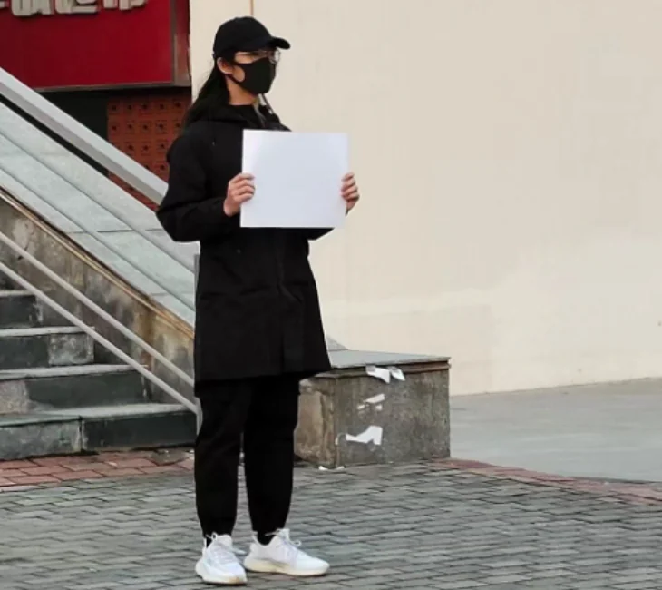

# 如果你不愿走在前面

> 在乌鲁木齐火灾发生后，中国各地都爆发了民众抗议行动。一些学生和市民手举白纸进行抗议。
南京传媒学院的学生为声援抗议制作了一首名为《如果你不愿走在前面》的歌曲。这首歌的作曲被署名为“另一张白纸”，演唱者则是“每一张白纸”。

**歌词如下：**  
如果你不愿走在前面，  
请你跟着队伍  

如果不愿跟着队伍，  
请你在路边围观  

如果不愿在路边围观，  
请你在网上呐喊  

如果不愿在网上呐喊，  
请默默闭上你的眼坐下来，  
享受我们为你争取来的权利  

但不要视而不见，  
更不要冷嘲热讽  

因为争取来的阳光，  
既属于我  
也属于你  

