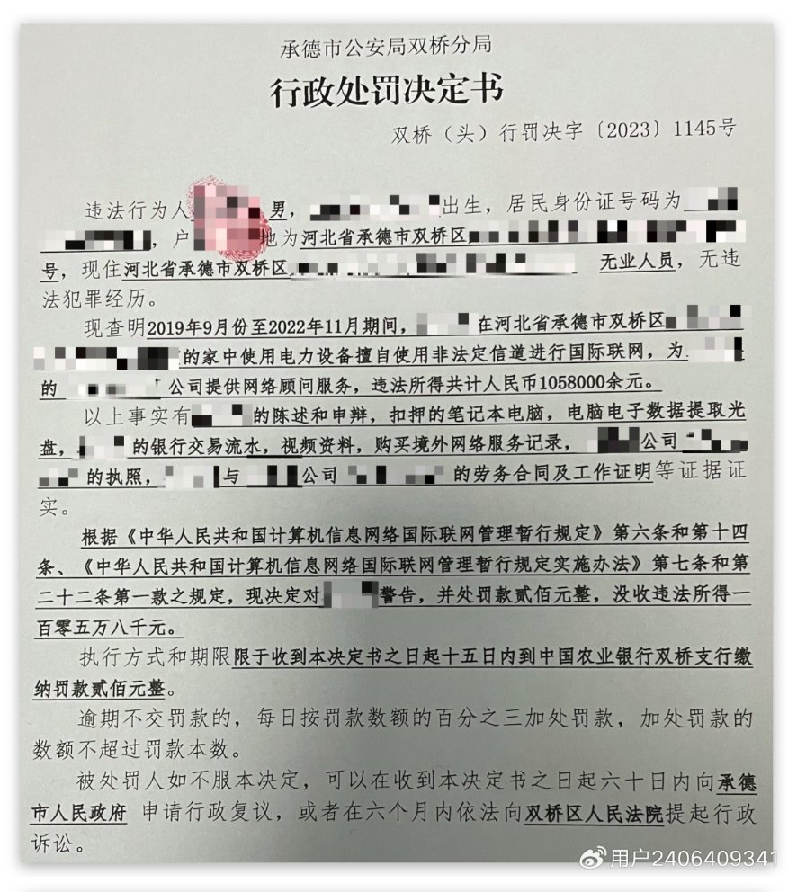
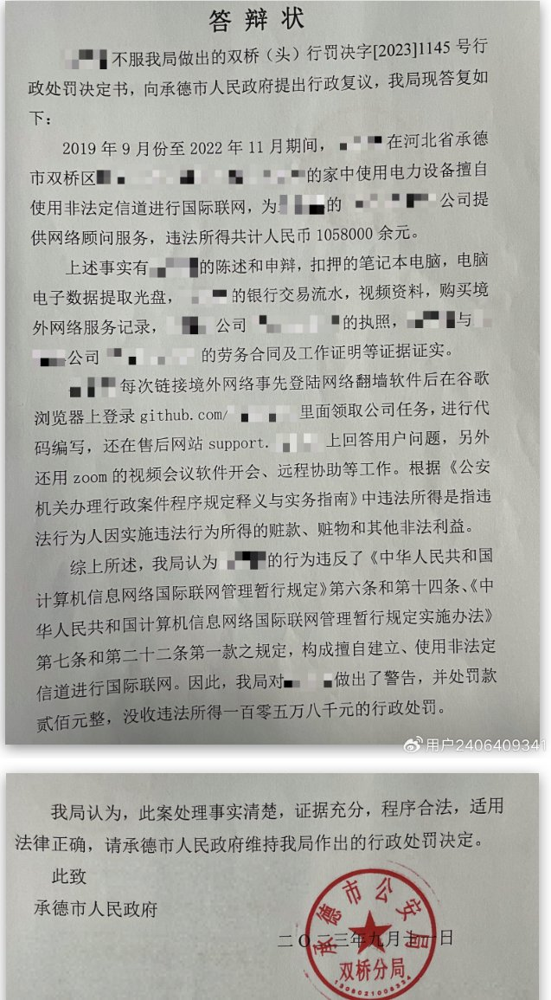
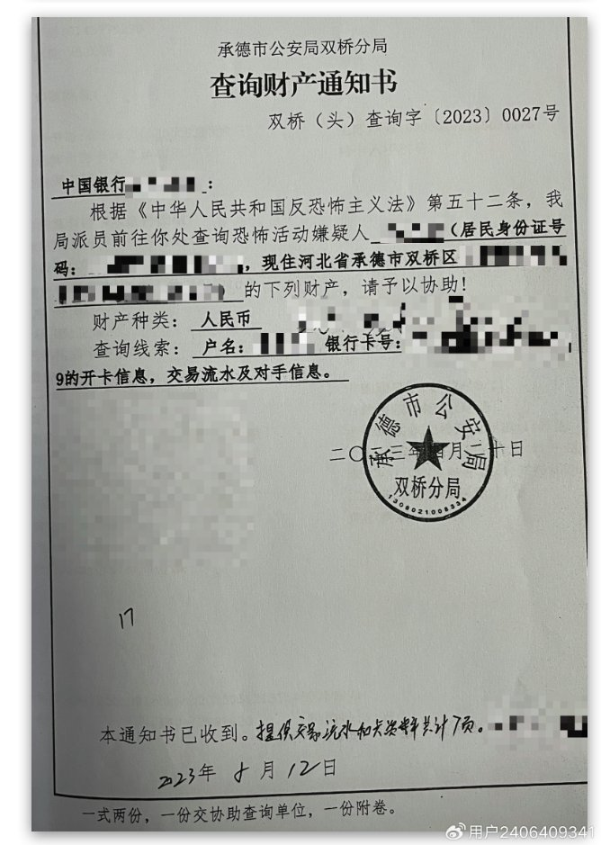
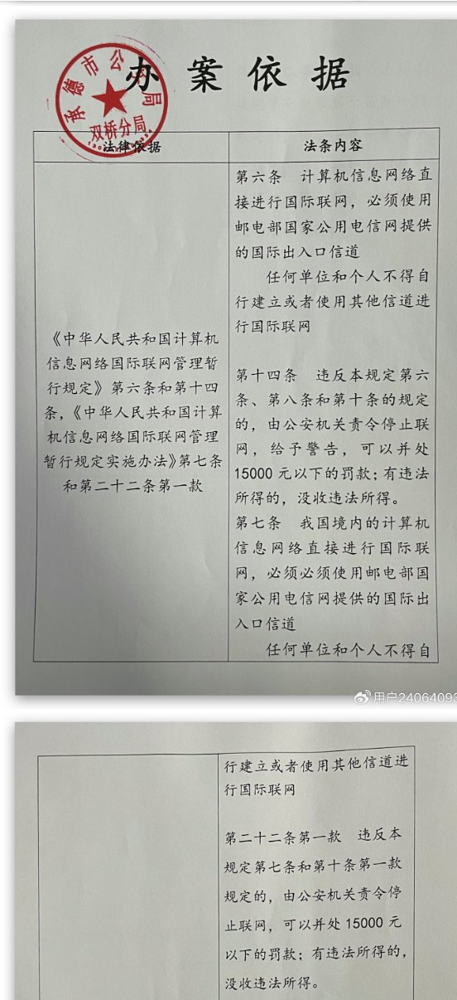
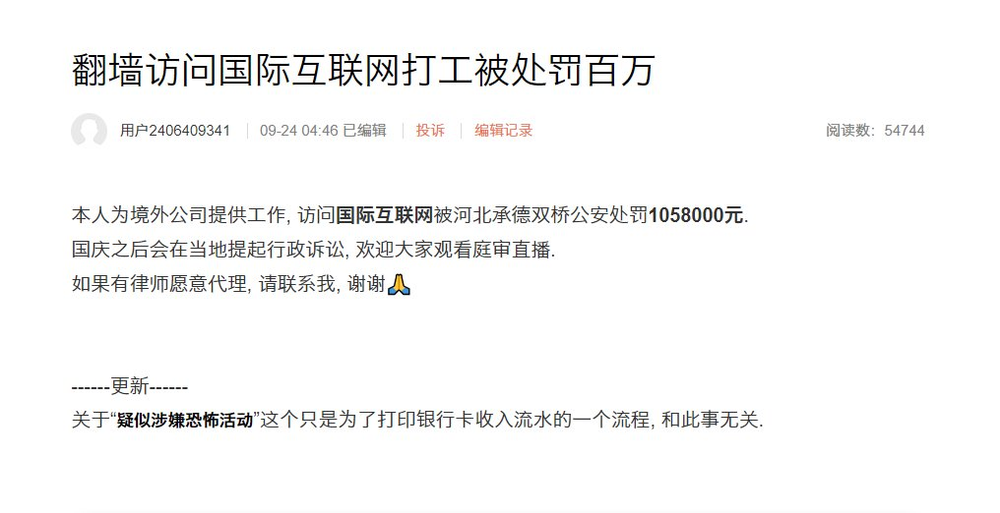
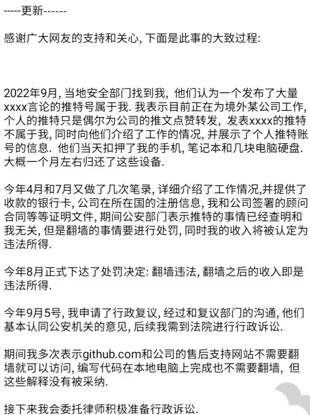

https://twitter.com/whyyoutouzhele/status/1705896374963769685

李老师不是你老师  
@whyyoutouzhele  

9月24日，一名微博网友称，自己因为翻墙使用github工作被承德公安局双桥分局处罚没收上百万元。  
根据答辩状，该男子2019年-2022年涉嫌在github上领取公司任务进行代码编写，在support上回答用户问题，还是用Zoom进行远程办公。
上述事实符合相关处罚规定，故罚款200元，没收违法所得1058000元。

  
  
  

关于“疑似涉嫌恐怖活动”这个只是为了打印银行卡收入流水的一个流程, 和此事无关.

https://twitter.com/xiaojingcanxue/status/1706153005287100436

小径残雪  
@xiaojingcanxue  

这次在承德被罚的程序员描述被罚过程。本推阅读后总结：1.原本是公安犯错，误以为他是某个推号的所有人。找补时发现搞这人有利可图。2.教训是别在事件之外说太多信息，在境外工作和拿工资都是程序员自己傻乎乎说的。3.看得出来受害人原本挺信任公安的，真是啥都讲。建议多看本推了解中国。

